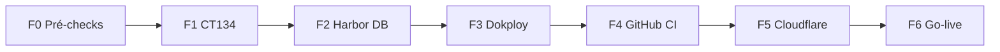

# Plano de implementação — CT134 agl-hostman (produção)

> **Versão:** 1.0 · **Data:** 2026-06-12  
> **Owner:** Infra AGL / agl-hostman  
> **URL produção:** `https://ah.aglz.io` · **Branch:** `main` · **Runtime:** CT134 AGLSRV1

---

## Documentos relacionados

| Documento | Conteúdo |
|-----------|----------|
| [`CT134-PRODUCTION-PIPELINE.md`](CT134-PRODUCTION-PIPELINE.md) | Arquitectura CI/CD, Harbor, Dokploy |
| [`docs/CT134-AGL-HOSTMAN-PRODUCTION.md`](../../docs/CT134-AGL-HOSTMAN-PRODUCTION.md) | Runbook resumido |
| [`docs/runbooks/CT134-CLOUDFLARE-CUTOVER.md`](../../docs/runbooks/CT134-CLOUDFLARE-CUTOVER.md) | Cutover `ah.aglz.io` + `ah-dev` |
| [`scripts/dokploy/setup-ct134-production.md`](../../scripts/dokploy/setup-ct134-production.md) | Checklist Dokploy/Harbor |
| [`ai-docs/tasks/CT134-PRODUCTION-TASKS.md`](../tasks/CT134-PRODUCTION-TASKS.md) | Backlog SCRUM por fase |
| [`.github/workflows/deploy-ct134-production.yml`](../../.github/workflows/deploy-ct134-production.yml) | Workflow GHA |

---

## 1. Objetivo

Colocar o **agl-hostman** em produção no **CT134** (AGLSRV1), com deploy automático a partir de **PR/merge em `main`**, imagens no **Harbor CT182**, orquestração **Dokploy CT180**, e URL pública **`https://ah.aglz.io`**.

Ambientes futuros (fora do scope deste plano, mas já nomeados no código):

| Ambiente | Domínio | Branch típica |
|----------|---------|---------------|
| Produção | `ah.aglz.io` | `main` |
| Dev | `ah-dev.aglz.io` | `develop` |
| QA | `ah-qa.aglz.io` | `develop` / release |
| UAT | `ah-uat.aglz.io` | `release` |

---

## 2. Estado actual (baseline)

| Item | Situação |
|------|----------|
| `ah.aglz.io` | Aponta para **dev** (nginx host / mount NFS CT179 ou equivalente) |
| CT179 agldv03 | Dev com código em NFS |
| CT180 | Dokploy operacional (`dok.aglz.io`) |
| CT182 | Harbor operacional |
| CT117 | Cloudflared túnel `archon` — ingress remoto Zero Trust |
| VMID 134 | Livre (ipmitool5 → **534**) |
| Repo | Scripts, compose, workflow `deploy-ct134-production.yml` **já no working tree** (commit pendente) |

---

## 3. Premissas

1. Acesso SSH ao AGLSRV1 (`100.107.113.33` Tailscale ou `192.168.0.245` LAN).
2. Credenciais Harbor robot + admin Dokploy disponíveis.
3. PostgreSQL prod (CT149) e Redis (CT137) acessíveis a partir da LAN `192.168.0.0/24`.
4. Cloudflare Zero Trust — permissão para editar public hostnames do túnel `archon` (CT117).
5. Janela de cutover DNS acordada (minutos de indisponibilidade aceitável).

---

## 4. Riscos e mitigação

| Risco | Impacto | Mitigação |
|-------|---------|-----------|
| Cutover `ah.aglz.io` antes de CT134 healthy | Dev e prod offline | Validar CT134 por IP/Tailscale **antes** de mudar tunnel |
| Imagem Laravel errada (Node legacy) | App quebrada | Usar sempre `src/Dockerfile` target `production` |
| Dokploy + Harbor tag `:5000` | Deploy tag errada | Tags explícitas `prod-{sha}` no workflow |
| DB prod vazia / migrations | 500 em prod | `migrate --force` no bootstrap + smoke |
| Dois pushes de imagem (ci.yml + deploy) | Confusão de tags | Fase 6: alinhar `ci.yml` para não duplicar push prod |

---

## 5. Fases de implementação



---

### Fase 0 — Pré-checks (≈ 30 min)

**Objectivo:** Confirmar que nada bloqueia a criação do CT134.

| # | Tarefa | Verificação |
|---|--------|-------------|
| 0.1 | `pct list \| grep 134` no AGLSRV1 — VMID livre | Sem CT 134 |
| 0.2 | Template Debian 12 disponível em `local:vztmpl/...` | `pveam list` |
| 0.3 | IP `192.168.0.134` livre (ping/arp) | Sem conflito |
| 0.4 | CT149 Postgres + CT137 Redis reachable de um CT teste | `nc -zv` |
| 0.5 | Revisar commit pendente (scripts + workflow) e merge para `main` ou branch de infra | PR aprovado |

**Rollback:** N/A.

---

### Fase 1 — Provisionamento CT134 (≈ 1 h)

**Objectivo:** LXC com Docker pronto em `/opt/agl-hostman-prod`.

| # | Tarefa | Comando / artefacto |
|---|--------|---------------------|
| 1.1 | Copiar `pct-create-agl-hostman-prod.env.example` → `.env` | `scripts/proxmox/` |
| 1.2 | Executar `pct-create-agl-hostman-prod.sh` no AGLSRV1 | CT134 running |
| 1.3 | `pct passwd 134` + chave SSH deploy | Login OK |
| 1.4 | `bootstrap-ct134-agl-hostman-prod.sh` com `COMPOSE_SOURCE` + Harbor login | `docker ps` |
| 1.5 | Editar `/opt/agl-hostman-prod/.env` (DB, Redis, `APP_URL=https://ah.aglz.io`) | Secrets fora do Git |
| 1.6 | `tailscale up` no CT134 (opcional, para Dokploy SSH via tailnet) | `tailscale status` |

**Verificação:**

```bash
ssh root@192.168.0.134 'docker compose -f /opt/agl-hostman-prod/docker-compose.yml ps'
curl -sf http://192.168.0.134/health/   # após primeira imagem
```

**Rollback:** `pct stop 134` / `pct destroy 134` (só se ainda sem dados prod).

---

### Fase 2 — Harbor + dados prod (≈ 1–2 h)

**Objectivo:** Registry e base de dados prontos para a app.

| # | Tarefa | Detalhe |
|---|--------|---------|
| 2.1 | Criar projecto Harbor `agl-hostman-prod` | Private |
| 2.2 | Robot `github-actions-prod` — push/pull | → GitHub Secrets |
| 2.3 | Política retention (~20 tags `prod-*`, `pr-*`) | Harbor UI |
| 2.4 | Criar DB `agl_hostman_prod` + user no CT149 | SQL ou admin tool |
| 2.5 | Validar Redis CT137 (password, ACL se aplicável) | `redis-cli ping` |
| 2.6 | Build manual smoke: push `prod-smoke` de uma máquina CI ou agldv03 | Imagem visível no Harbor |

**Verificação:** Pull manual no CT134:

```bash
docker pull harbor.aglz.io:5000/agl-hostman-prod/hostman:prod-smoke
```

**Rollback:** Apagar tags smoke; DB drop só se vazia de teste.

---

### Fase 3 — Dokploy (≈ 1–2 h)

**Objectivo:** CT134 registado; app prod deployável.

| # | Tarefa | Referência |
|---|--------|------------|
| 3.1 | Dokploy → Servers → Add **CT134** | SSH test OK |
| 3.2 | App `agl-hostman-prod` — Docker image Harbor | `setup-ct134-production.md` |
| 3.3 | Env vars espelhando `.env` CT134 (ou compose path) | `APP_URL`, DB, Redis |
| 3.4 | Deploy manual tag `prod-smoke` ou `prod-latest` | Containers healthy |
| 3.5 | Copiar **webhook URL** → `DOKPLOY_PROD_WEBHOOK_URL` | GitHub secret |
| 3.6 | (Opcional) GitHub App Dokploy + preview PR | `DOKPLOY_PREVIEW_WEBHOOK_URL` |

**Verificação:**

```bash
curl -sf http://192.168.0.134/health/
docker logs agl-hostman-prod-app --tail 50
php artisan migrate:status  # dentro do container
```

**Rollback:** Redeploy tag anterior no Dokploy.

---

### Fase 4 — GitHub Actions (≈ 45 min)

**Objectivo:** Pipeline automático PR → Harbor → Dokploy.

| # | Tarefa | Detalhe |
|---|--------|---------|
| 4.1 | Secrets: `HARBOR_*`, `DOKPLOY_PROD_WEBHOOK_URL`, `CT134_HEALTH_URL` | Repo settings |
| 4.2 | Environment `production-ct134` (reviewers opcional) | Settings → Environments |
| 4.3 | Branch protection `main`: required checks CI + Deploy CT134 | GitHub |
| 4.4 | PR de teste → workflow `pull_request` → tag `pr-N-sha` no Harbor | Actions green |
| 4.5 | Merge → tag `prod-*` + webhook + health (ainda **sem** cutover público) | Health via IP CT134 |

**Verificação:** Actions summary + Harbor tags + Dokploy deployment log.

**Rollback:** Desactivar workflow; deploy manual no Dokploy.

---

### Fase 5 — Cloudflare cutover (≈ 1 h)

**Objectivo:** `ah.aglz.io` → CT134; dev migra para `ah-dev.aglz.io`.

**Runbook completo:** [`docs/runbooks/CT134-CLOUDFLARE-CUTOVER.md`](../../docs/runbooks/CT134-CLOUDFLARE-CUTOVER.md)

| # | Tarefa | Resumo |
|---|--------|--------|
| 5.1 | Documentar origin **actual** de `ah.aglz.io` (dev) | IP/porta CT179/nginx |
| 5.2 | Criar hostname `ah-dev.aglz.io` → origin dev | Zero Trust CT117 |
| 5.3 | Validar `https://ah-dev.aglz.io` | Dev intacto |
| 5.4 | Alterar `ah.aglz.io` → `http://192.168.0.134:80` (ou porta app) | Zero Trust |
| 5.5 | Smoke público `curl https://ah.aglz.io/health/` | HTTP 200 |
| 5.6 | Actualizar `CT134_HEALTH_URL` no GitHub | Pipeline health externo |

**Rollback:** Repor `ah.aglz.io` para origin dev; CT134 continua acessível por IP.

---

### Fase 6 — Go-live e estabilização (≈ 2 h + 48 h monitor)

**Objectivo:** Produção estável; equipa confiante no pipeline.

| # | Tarefa | Critério |
|---|--------|----------|
| 6.1 | `npm run test:e2e:ah` (smoke prod) | Pass |
| 6.2 | Horizon + scheduler a correr | `horizon:status` |
| 6.3 | Mission Control / dashboards críticos | Manual checklist |
| 6.4 | Comunicar cutover à equipa | Slack/email |
| 6.5 | Monitorizar logs 48 h | Sem erros CRITICAL |
| 6.6 | (Backlog) Desactivar push duplicado em `ci.yml` para prod | Issue follow-up |
| 6.7 | Actualizar llm-wiki com decisão domínios + CT134 | Regra second-brain |

---

## 6. Cronograma sugerido

| Dia | Fases | Notas |
|-----|-------|-------|
| D0 | F0 + F1 | CT134 up |
| D1 | F2 + F3 | Harbor + Dokploy manual |
| D2 | F4 | PR teste pipeline (sem cutover) |
| D3 | F5 + F6 | Janela cutover (horário baixo tráfego) |

Total estimado: **3 dias úteis** (pode comprimir F0–F4 num dia se recursos dedicados).

---

## 7. Critérios de aceitação (Definition of Done)

- [ ] CT134 running com Docker; compose healthy (app, horizon, scheduler).
- [ ] Imagem `agl-hostman-prod/hostman:prod-latest` no Harbor; Trivy sem CRITICAL.
- [ ] Merge em `main` dispara deploy automático via Dokploy.
- [ ] `https://ah.aglz.io/health/` retorna 200 em < 6 min após merge.
- [ ] `https://ah-dev.aglz.io` serve ambiente dev (pós-migração).
- [ ] Rollback documentado e testado (redeploy tag anterior).
- [ ] Secrets não commitados; `.env` prod só no CT134/Dokploy.
- [ ] Runbooks e plano commitados no repo.

---

## 8. Comandos rápidos (referência)

```bash
# AGLSRV1
ssh root@100.107.113.33 'pct list | grep -E "134|117|180|182"'

# CT134
ssh root@192.168.0.134 'cd /opt/agl-hostman-prod && docker compose ps && docker compose logs app --tail 20'

# Harbor (exemplo)
curl -u user:pass https://harbor.aglz.io/api/v2.0/projects/agl-hostman-prod/repositories

# Health
curl -fsS https://ah.aglz.io/health/
curl -fsS https://ah-dev.aglz.io/health/

# Cloudflare tunnel archon
ssh root@192.168.0.245 'pct exec 117 -- cloudflared tunnel info archon'
```

---

## 9. Pós go-live (backlog)

1. **ah-qa.aglz.io** + pipeline branch `develop` (Harbor project `agl-hostman-qa`).
2. **ah-uat.aglz.io** + releases.
3. PR previews `pr-{n}.ah.aglz.io` via Dokploy.
4. Integrar CT134 no Mission Control AGLSRV1 ([`MISSION-CONTROL-ROADMAP.md`](MISSION-CONTROL-ROADMAP.md)).
5. Alertas Prometheus/Grafana para `/health/` e Horizon.

---

## 10. Histórico

| Data | Versão | Notas |
|------|--------|-------|
| 2026-06-12 | 1.0 | Plano inicial; domínio prod `ah.aglz.io` |
