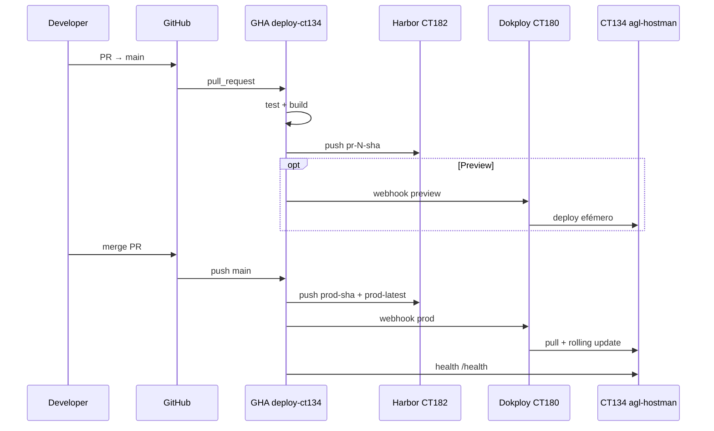

# CT134 — Pipeline produção agl-hostman

> **Implementação:** [`CT134-IMPLEMENTATION-PLAN.md`](CT134-IMPLEMENTATION-PLAN.md) · **Tarefas:** [`../tasks/CT134-PRODUCTION-TASKS.md`](../tasks/CT134-PRODUCTION-TASKS.md) · **Cutover:** [`../../docs/runbooks/CT134-CLOUDFLARE-CUTOVER.md`](../../docs/runbooks/CT134-CLOUDFLARE-CUTOVER.md)  
> **Data:** 2026-06-12  
> **Ambiente:** produção · branch **`main`** · CT134 AGLSRV1  
> **Control plane:** Dokploy CT180 · **Registry:** Harbor CT182

---

## 1. Decisões de arquitectura

### Separação dev / prod

| | Dev (CT179) | Prod (CT134) |
|---|-------------|--------------|
| Código | NFS `agl-hostman` montado | **Imagem Docker** (Harbor) |
| Branch | `develop` / feature | **`main` only** |
| Deploy | manual / Dokploy QA | **automático pós-merge** |

### Porquê CT134 + Dokploy remoto (e não só compose manual)

- **Dokploy CT180** já é o painel AGL ([`docs/DOKPLOY.md`](../DOKPLOY.md)).
- **Harbor CT182** centraliza imagens assinadas/scan Trivy.
- **CT134** é nó de runtime dedicado (Mission Control prod) — isolado do dev CT179.
- Padrão indústria: *build in CI → push registry → pull on deploy* ([GitOps folder envs](../research/03-gitops-branching-strategy.md) — **não** branch-per-env no Git).

### Fluxo recomendado (PR como gatilho)



**Referências externas:**

- [Dokploy GitHub Integration](https://dokploy-dokploy.mintlify.app/integrations/git-providers/github) — PR previews, Auto Deploy, webhook `https://dok.aglz.io/api/deploy/github`
- [Dokploy Deploy API](https://dokploy-dokploy.mintlify.app/api-reference/applications/deploy)
- Harbor webhook → Dokploy ([`docs/DOKPLOY.md`](../DOKPLOY.md#cicd-webhook-setup))
- Tag parsing Harbor com porta: usar **tag explícita** `prod-{sha}` ([Dokploy #4082](https://github.com/Dokploy/dokploy/issues/4082))

---

## 2. Infra AGLSRV1 (existente)

| CT | Função | Papel no pipeline |
|----|--------|-------------------|
| **180** | Dokploy | UI, webhooks, deploy para CT134 |
| **182** | Harbor | `agl-hostman-prod/hostman:*` |
| **134** | agl-hostman prod | Docker runtime |
| **149** | PostgreSQL | DB prod |
| **137** | Redis | cache/queue/sessions |
| **117** | Cloudflared | **`ah.aglz.io`** (DNS produção) |

### Domínios agl-hostman (convenção)

| Ambiente | Domínio | Runtime / branch | Estado |
|----------|---------|------------------|--------|
| **Produção** | **`https://ah.aglz.io`** | CT134 · `main` | Repoint de dev → prod |
| Dev | `https://ah-dev.aglz.io` | CT179 (NFS) · `develop` | A criar |
| QA | `https://ah-qa.aglz.io` | TBD | A criar |
| UAT | `https://ah-uat.aglz.io` | TBD | A criar |
| PR preview | `pr-{n}.ah.aglz.io` | Dokploy preview | Opcional |

> **Cutover:** `ah.aglz.io` apontava para dev; passa a CT134 após deploy prod. Actualizar tunnel Cloudflare CT117 antes do primeiro merge em `main`.

**VMID 134:** ipmitool5 foi renumerado para **534** ([`PROXMOX-VMID-RENUMBER-2026-06.md`](../PROXMOX-VMID-RENUMBER-2026-06.md)) — validar `pct list | grep 134` antes de criar.

---

## 3. Implementação no repo (entregue)

| Artefacto | Descrição |
|-----------|-----------|
| `scripts/proxmox/pct-create-agl-hostman-prod.sh` | Cria LXC CT134 |
| `scripts/proxmox/bootstrap-ct134-agl-hostman-prod.sh` | Docker + compose |
| `docker/dokploy/docker-compose.ct134.production.yml` | Stack app/horizon/scheduler |
| `.github/workflows/deploy-ct134-production.yml` | CI/CD PR + main |
| `docs/CT134-AGL-HOSTMAN-PRODUCTION.md` | Runbook curto |
| `scripts/dokploy/setup-ct134-production.md` | Config Dokploy/Harbor |

---

## 4. GitHub — secrets e environments

### Environment `production-ct134`

- Required reviewers (2) para deploy job (opcional, alinhado a `deploy-production.yml`).
- Secrets: `DOKPLOY_PROD_WEBHOOK_URL`, `CT134_HEALTH_URL`.

### Branch protection `main`

- PR obrigatório + status checks: `CI - Continuous Integration`, `Deploy CT134 Production (Harbor → Dokploy)`.
- Sem push directo (excepto hotfix process).

### Relação com workflows existentes

| Workflow | Ajuste sugerido |
|----------|-----------------|
| `ci.yml` | Manter; evitar push duplicado — `build-production` só em `main` (futuro) |
| `docker-build.yml` | Legacy Node image — deprecar ou limitar a API Node |
| `deploy-production.yml` | Blue-green simulado — substituir por CT134 real quando validado |

---

## 5. Harbor — projecto `agl-hostman-prod`

1. Criar projecto **agl-hostman-prod** (robot account `github-actions`).
2. Retention: manter últimas **20** tags `prod-*` + `pr-*`.
3. Webhook **PUSH_ARTIFACT** → Dokploy app prod (alternativa ao webhook GHA).
4. Trivy: bloquear **CRITICAL** em tags `prod-*` (já no workflow).

Tags:

```
harbor.aglz.io:5000/agl-hostman-prod/hostman:prod-abc1234
harbor.aglz.io:5000/agl-hostman-prod/hostman:prod-latest
harbor.aglz.io:5000/agl-hostman-prod/hostman:pr-42-abc1234
```

---

## 6. Dokploy — apps

### App `agl-hostman-prod` (CT134)

- **Source:** Docker Image
- **Image:** `harbor.aglz.io:5000/agl-hostman-prod/hostman:prod-latest`
- **Server:** CT134 (SSH + Docker)
- **Auto Deploy:** webhook GitHub **ou** Harbor push
- **Domain:** `ah.aglz.io` (Cloudflare CT117)

### App `agl-hostman-preview` (opcional)

- Mesma imagem com tag `pr-*`
- Subdomínio `pr-{n}.ah.aglz.io` ou path prefix
- **Require collaborator** (Dokploy security)

---

## 7. Checklist de validação

- [ ] `pct list` — VMID 134 livre
- [ ] CT134 Docker + `docker compose ps` healthy
- [ ] Harbor push manual smoke
- [ ] Dokploy deploy manual uma vez
- [ ] PR de teste → imagem `pr-*` no Harbor
- [ ] Merge → `prod-*` deploy + `/health` 200
- [ ] Horizon + scheduler a processar jobs
- [ ] Mission Control UI acessível via `ah.aglz.io`

---

## 8. Próximos passos

Seguir o **plano de implementação** fase a fase:

→ [`ai-docs/planning/CT134-IMPLEMENTATION-PLAN.md`](CT134-IMPLEMENTATION-PLAN.md)  
→ Tarefas SCRUM: [`ai-docs/tasks/CT134-PRODUCTION-TASKS.md`](../tasks/CT134-PRODUCTION-TASKS.md)  
→ Cutover Cloudflare: [`docs/runbooks/CT134-CLOUDFLARE-CUTOVER.md`](../../docs/runbooks/CT134-CLOUDFLARE-CUTOVER.md)

Resumo:

1. Fase 0–1: Provisionamento CT134 no AGLSRV1.
2. Fase 2–3: Harbor + Dokploy ([`setup-ct134-production.md`](../scripts/dokploy/setup-ct134-production.md)).
3. Fase 4: Secrets GitHub + PR teste pipeline.
4. Fase 5: Cutover `ah.aglz.io` → CT134; criar `ah-dev.aglz.io`.
5. Fase 6: Go-live + Mission Control CT134.
