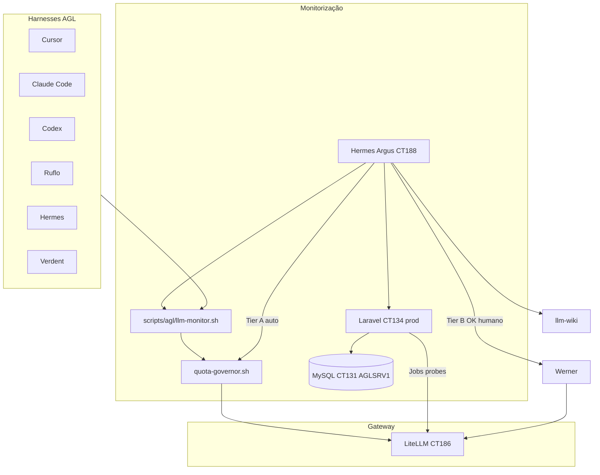

# Plano — Monitor de Providers LLM AGL

> **Estado:** Fase 0–1 em curso · **Detentor operacional:** agente Hermes **Argus** (CT188)  
> **Skill cross-harness:** `.claude/skills/agl-llm-monitor/SKILL.md`  
> **Wiki:** `[[Monitor de Providers LLM AGL]]` (llm-wiki)

## Objetivo

Monitorizar providers/models em todos os harnesses AGL (Cursor, Claude Code ±OpenClaw, Codex, Ruflo, Hermes, Verdent) e hosts AGLDV\*, com:

- séries de usage/limites (5h, semanal, mensal, rate-limit, **context_window**);
- probes simples e complexas (budget ~5–10% tokens);
- notificações Telegram (Argus → operador; reporta ao Jarvis);
- gate humano para mudanças estruturais no LiteLLM (Tier B via Werner);
- failover free-tier automático quando seguro (Tier A), **sem** degradar tarefas que exigem contexto maior que o free permite.

## Arquitetura (alto nível)

## Decisões registadas

| Tema                                | Decisão                                                                 |
| ----------------------------------- | ----------------------------------------------------------------------- |
| Fonte de verdade (séries temporais) | **MySQL CT131** (`192.168.0.131:3306`, AGLSRV1); app **CT134** produção |
| Probes                              | Laravel Jobs/Horizon no **CT134**; CLI fino nos harnesses               |
| Skill                               | Contrato + `llm-monitor.sh` (não reimplementar lógica por harness)      |
| Agente dono                         | **Argus** — 7º Hermes, grupo FinOps                                     |
| Auto-ajuste LiteLLM                 | **2 tiers:** A automático (free failover) · B OK Telegram → Werner      |
| Free-tier                           | Também limitado (uso + contexto menor) — `min_context_guard`            |

## Fases

### Fase 0 — Research & segundo cérebro ⏳

- [ ] Consolidar planos/limites: Anthropic, OpenAI/Codex, Z.AI, OpenRouter, Groq, Cursor, Verdent, Ollama local.
- [ ] Página wiki `[[Monitor de Providers LLM AGL]]` + links a planos existentes (`[[GLM Coding Plan]]`, `[[Claude Pro Plan]]`, etc.).
- [ ] Documentar limitações duras: Anthropic Max só OAuth via `claude-code` CLI; Cursor/Verdent pools proprietários.

**Verificação:** `wiki/index.md` atualizado; `log.md` com entrada maintenance.

### Fase 1 — Argus + skill + CLI fino ✅ (repo)

- [x] Perfil `docker/hermes/profiles/argus/` (SOUL, config, skill).
- [x] Compose `hermes-argus`; bootstrap + crons digest.
- [x] Skill `agl-llm-monitor`; `HermesAgentCatalog` (FinOps).
- [x] `scripts/agl/llm-monitor.sh` (status/check/probe/why-blocked).
- [x] Testes Node `tests/unit/llm-monitor.test.js`.
- [x] Deploy CT188 contentor `agl-hermes-argus` (⏳ Telegram: falta `TELEGRAM_TOKEN_ARGUS` no tokens env).

**Verificação:** `bash scripts/agl/llm-monitor.sh status`; `npm test -- llm-monitor`.

### Fase 2 — Laravel store + API ⏳ (repo)

**Runtime:** CT134 `agl-hostman` produção (`192.168.0.134`, `https://ah.aglz.io`) — ver [`docs/CT134-AGL-HOSTMAN-PRODUCTION.md`](../../docs/CT134-AGL-HOSTMAN-PRODUCTION.md).

**Base de dados:** MySQL dedicado **CT131** no AGLSRV1 — `192.168.0.131:3306` (LAN); túnel Cloudflare `mysql-master.aglz.io` só para admin. **Não** MySQL local no CT134 — `DB_HOST=192.168.0.131` no `.env` produção (credenciais em cofre / Dokploy secrets).

- [x] Migrations em `src/database/migrations/`: `llm_provider_snapshots`, `llm_probe_runs`, `llm_limit_events`, `llm_config_change_proposals`.
- [x] `LiteLLMClient` + `LlmMonitorService` (ingest governor JSON, `/global/spend`).
- [x] API `/api/llm-monitor/status`, `/api/llm-monitor/providers/{id}` (+ ingest/probe via `api.key` para Argus).
- [x] Jobs Horizon: `RunLlmProbeJob`, `IngestGovernorStateJob`, schedule no `Kernel`.
- [x] Deploy CT134: `php artisan migrate` + Horizon queue `llm-monitor` (2026-06-27 via `deploy-llm-monitor-ct134.sh`).
- [ ] Database MySQL CT131 — **produção actual usa PostgreSQL CT149**; tabelas LLM monitor criadas em `agl_hostman_prod` (CT149).

**Verificação:** `php artisan test --filter=LlmMonitor` no CT134; CT134 → CT131:3306 OK; probe grava linha em DB.

### Fase 3 — Dashboard Mission Control ⏳

- [ ] Página Inertia `MissionControl/LlmMonitor` (limites por janela, incidentes, propostas Tier B pendentes).
- [ ] Integrar com `HarnessSnapshotService` / substituir leitura só de ficheiro quando API live.
- [ ] Botões: aprovar/rejeitar proposta Tier B (dispara delegação Werner via Argus).

**Verificação:** UI mostra T3–T5 + free-tier com `warn`/`blocked`; E2E smoke manual.

### Fase 4 — Probes complexas + matriz harness ⏳

- [ ] Workflows: multi-model, multi-call, multi-tool, ±thinking (callbacks `agl_glm_flash_params`).
- [ ] Budget cap 5–10% — contador diário em DB.
- [ ] Cobertura Cursor (pool Pro, sem API quota) e Verdent (parcial).
- [ ] Sync skill para Cursor/Codex/Ruflo (`scripts/agl/sync-harness-skills.sh` incluir `agl-llm-monitor`).

**Verificação:** matriz de probes documentada na wiki; relatório semanal Argus cron.

### Fase 5 — Auto-ajuste com guardrails ⏳

- [ ] Tier A: integrar `quota-governor --apply-hermes` com notificação Argus (sem OK).
- [ ] Tier B: fluxo proposta → Telegram → OK → `delegate_task` Werner → `sync-config-all-hosts.sh` + smoke.
- [ ] Rollback automático se smoke falhar após deploy config.

**Verificação:** simulação dry-run Tier B; rollback testado em staging CT186.

## Modelo de dados (Fase 2 — rascunho)

| Tabela                        | Campos principais                                                                      |
| ----------------------------- | -------------------------------------------------------------------------------------- |
| `llm_provider_snapshots`      | `provider`, `model_alias`, `status`, `windows_json`, `context_tokens`, `captured_at`   |
| `llm_probe_runs`              | `probe_type`, `harness`, `model`, `latency_ms`, `result`, `tokens_in/out`, `meta_json` |
| `llm_limit_events`            | `provider`, `window`, `severity`, `message`, `resolved_at`                             |
| `llm_config_change_proposals` | `diff`, `reason`, `tier`, `status` (pending/approved/rejected/applied), `approved_by`  |

## Referências no repo

| Artefacto        | Path                                                  |
| ---------------- | ----------------------------------------------------- |
| Argus SOUL       | `docker/hermes/profiles/argus/SOUL.md`                |
| Skill            | `.claude/skills/agl-llm-monitor/SKILL.md`             |
| CLI              | `scripts/agl/llm-monitor.sh`                          |
| Governor         | `scripts/litellm/quota-governor.sh`                   |
| Audit            | `scripts/litellm/audit-providers-hermes.sh`           |
| Hermes docs      | `docs/HERMES-AGENCY-AGENTS.md`                        |
| Harness snapshot | `src/app/Services/Harness/HarnessSnapshotService.php` |

## Definition of Done (global)

- [ ] Argus em produção CT188 com Telegram directo ao operador.
- [ ] CLI funcional em todos os harnesses via skill sync.
- [ ] Laravel CT dedicado com Jobs + dashboard básico.
- [ ] Wiki curada; limitações free-tier e OAuth Anthropic documentadas.
- [ ] Tier B nunca aplica sem OK; Tier A notifica sempre.
