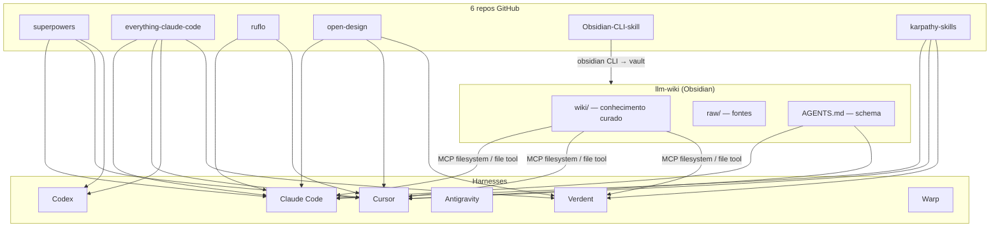

# Plano: 6 repos GitHub × multi-agente AGL

> **Origem:** vídeo [6 Claude Code GitHub Repos That Change Everything](https://www.youtube.com/watch?v=L2JKgj7WzU4) (Nuno Tavares)  
> **Second brain:** [`/mnt/overpower/apps/dev/agl/llm-wiki`](https://github.com/AGLz/llm-wiki) (vault Obsidian)  
> **Orquestração infra:** `agl-hostman`  
> **Data:** 2026-05-25  
> **Estado baseline (agldv03):** superpowers + ruflo parcial; resto em falta

---

## 1. Objetivo

Instalar e propagar de forma **controlada** os 6 repositórios do vídeo em:

| Harness | Path skills/rules típico | Papel AGL |
|---------|--------------------------|-----------|
| **Claude Code** | `~/.claude/skills/`, plugins | Dev principal, hooks, Hermes |
| **Cursor** | `~/.cursor/skills/`, `.cursor/rules/` | IDE diária, agl-hostman + llm-wiki |
| **Codex** | `~/.codex/skills/` | Workers headless (`dual-mode`) |
| **Antigravity** | `~/.cursor/skills/` (via script AGL) | Skills marketplace alternativo |
| **Verdent** | `~/.verdent/skills/` | IDE multi-modelo (CT/dev) |
| **Warp** | workflows / env (sem skills nativas) | Terminal ops AGL |

**Princípio:** o **llm-wiki** é a fonte de verdade curada; os 6 repos são **capacidades operacionais** nos harnesses. Documentação de decisões e runbooks vive em `llm-wiki/wiki/`, não duplicada em markdown solto.

---

## 2. Os 6 repositórios

| # | Repo | Função | Prioridade vídeo |
|---|------|--------|-------------------|
| 1 | [obra/superpowers](https://github.com/obra/superpowers) | Metodologia: brainstorm → spec → TDD → sub-agentes | **P0 — primeiro** |
| 2 | [affaan-m/everything-claude-code](https://github.com/affaan-m/everything-claude-code) (ECC) | Bundle cross-harness: skills, hooks, agents, memória | P0 — starter kit |
| 3 | [ruvnet/ruflo](https://github.com/ruvnet/ruflo) | Swarms, memória federada, orquestração | P1 — avançado |
| 4 | [nexu-io/open-design](https://github.com/nexu-io/open-design) | Design system / UI (alt. Claude Design) | P1 — se frontend |
| 5 | [pablo-mano/Obsidian-CLI-skill](https://github.com/pablo-mano/Obsidian-CLI-skill) | Ponte Obsidian CLI ↔ agentes | **P0 para llm-wiki** |
| 6 | [multica-ai/andrej-karpathy-skills](https://github.com/multica-ai/andrej-karpathy-skills) | 4 princípios para CLAUDE.md / rules | P0 — leve |

**Nota ECC:** o upstream evoluiu para marca **ECC** (`ecc-universal` npm, docs cross-harness). O URL do vídeo continua válido; validar README upstream antes de instalar.

**Nota Karpathy:** no AGL já temos texto equivalente via [forrestchang/andrej-karpathy-skills](https://github.com/forrestchang/andrej-karpathy-skills) em `CLAUDE.md` + `.cursor/rules/karpathy-skills.mdc`. Decidir **um fork canónico** (recomendado: `multica-ai` do vídeo, ou manter forrestchang se conteúdo idêntico).

---

## 3. Estado actual (baseline agldv03)

| Repo | Claude Code | Cursor | Codex | Antigravity | Warp | Verdent |
|------|:-----------:|:------:|:-----:|:-----------:|:----:|:-------:|
| superpowers | ✅ plugin 4.2.0 + skills | ⚠️ via `~/.claude/skills` | ❌ | ❌ | ❌ | ❌ |
| everything-claude-code | ❌ | ❌ | ❌ | ❌ | ❌ | ❌ |
| ruflo | ✅ `.claude-flow/` + npx | ✅ project | ❌ | ❌ | ❌ | ❌ |
| open-design | ❌ | ❌ | ❌ | ❌ | ❌ | ❌ |
| Obsidian-CLI-skill | ❌ | ⚠️ skill genérica `.agents/skills/obsidian` | ❌ | ❌ | ❌ | ❌ |
| karpathy-skills | ⚠️ CLAUDE.md | ⚠️ `karpathy-skills.mdc` | ❌ | ❌ | ❌ | ❌ |

**llm-wiki:** vault em `/mnt/overpower/apps/dev/agl/llm-wiki`; MCP filesystem em `.mcp.json`; **sem** Obsidian-CLI-skill; só página wiki **Ruflo**. Ver [`docs/LLM-WIKI-AGENCY-INTEGRATION.md`](../../docs/LLM-WIKI-AGENCY-INTEGRATION.md).

**Gaps críticos:** `~/.codex/skills/` e `~/.cursor/skills/` **inexistentes/vazios**; ECC e open-design por instalar; Obsidian-CLI-skill não ligado ao vault llm-wiki.

---

## 4. Arquitectura alvo



**Separação de concerns**

| Camada | O quê | Onde |
|--------|-------|------|
| Conhecimento | Runbooks, entidades, decisões | `llm-wiki/wiki/` |
| Memória episódica | Preferências, conclusões de chat | Honcho CT192 |
| Tarefas | Backlog, estados | Linear |
| Metodologia / UX agente | superpowers, ECC, karpathy | skills + rules por harness |
| Orquestração pesada | ruflo swarms | agl-hostman + máquina dedicada |
| Design UI | open-design | projetos com frontend |
| Ops terminal | SSH, smoke, pct | Warp workflows (sem skills) |

---

## 5. Fases de implementação

### Fase 0 — Preparação (½ dia)

**Objectivo:** inventário, script único, critérios de verificação.

| ID | Tarefa | Verificação |
|----|--------|-------------|
| 0.1 | Criar `scripts/skills/sync-six-repos.sh` (wrapper por repo × harness) | `--dry-run` lista acções |
| 0.2 | Criar `scripts/skills/verify-six-repos.sh` | Exit 0 se checks passam |
| 0.3 | Documentar paths canónicos numa tabela (este doc §7) | Review equipa |
| 0.4 | Instalar pré-requisitos: `obsidian-cli` ou Obsidian 1.12+ CLI no host dev | `obsidian version` |
| 0.5 | Decidir fork Karpathy (`multica-ai` vs `forrestchang`) | Uma fonte no git |

**Entregável llm-wiki:** entrada em `wiki/log.md` + página `[[Plano Six Repos Multi-Agente]]`.

---

### Fase 1 — Fundação cross-harness (1–2 dias)

**Ordem do vídeo:** superpowers → ECC → karpathy (open-design e Obsidian em paralelo se recursos).

#### 1.1 superpowers (completar gaps)

| Harness | Acção |
|---------|--------|
| Claude Code | ✅ Manter plugin; auditar skills duplicadas em `~/.claude/skills/` vs plugin cache |
| Cursor | Copiar/symlink skills essenciais para `~/.cursor/skills/` **ou** documentar dependência de `~/.claude/skills` (ver `.cursor/rules/skills-agents-config.md`) |
| Codex | Seguir [obra/superpowers/.codex/INSTALL.md](https://github.com/obra/superpowers/blob/main/.codex/INSTALL.md) → `~/.codex/skills/` |
| Verdent | Copiar subset (brainstorming, using-superpowers, verification-before-completion) → `~/.verdent/skills/` |
| Antigravity | N/A (repo diferente: sickn33); opcional: skills sobrepostas manualmente |
| Warp | N/A |

#### 1.2 everything-claude-code (ECC)

| Harness | Acção |
|---------|--------|
| Claude Code | `/plugin install everything-claude-code` ou `npx ecc-universal init` (confirmar método actual no README) |
| Cursor | Instalação cross-harness do README ECC (`docs/architecture/cross-harness.md`) |
| Codex | Pacote ECC para Codex (secção Codex no README) |
| Verdent | Avaliar overlap; instalar só módulos úteis (hooks memória, token opt) — **evitar** duplicar superpowers |
| Antigravity | Skip ou cherry-pick 5–10 skills via `install-antigravity-skills.sh` |

**Regra:** após instalar ECC, correr dedup: `python3 scripts/skills_dedup_report.py` (criar se não existir).

#### 1.3 karpathy-skills (alinhar)

| Harness | Acção |
|---------|--------|
| Todos | Uma fonte: plugin `multica-ai` **ou** manter texto em `CLAUDE.md` + `.cursor/rules/karpathy-skills.mdc` |
| llm-wiki | Página wiki `[[Karpathy Skills — diretrizes de código]]` com os 4 princípios |
| agl-hostman | Garantir `CLAUDE.md` e `karpathy-skills.mdc` sincronizados |

---

### Fase 2 — llm-wiki + Obsidian (1 dia) ★

**Vault path:** `/mnt/overpower/apps/dev/agl/llm-wiki`  
**CT188 mount:** `/opt/agl-llm-wiki` → `/opt/llm-wiki`

#### 2.1 Obsidian-CLI-skill

| Harness | Acção |
|---------|--------|
| Claude Code | `/plugin marketplace add pablo-mano/Obsidian-CLI-skill` + `/plugin install obsidian-cli` **ou** entry em `llm-wiki/.claude/settings.json` |
| Cursor | `cp -r …/skills/obsidian-cli ~/.cursor/skills/obsidian-cli` |
| Codex | Copiar skill para `~/.codex/skills/obsidian-cli` |
| Verdent | `~/.verdent/skills/obsidian-cli/` |
| llm-wiki (project) | `.claude/skills/obsidian-cli/` **ou** substituir skill genérica `.agents/skills/obsidian` |

**Config vault (obrigatório):**

```bash
# Definir vault default (nome = pasta llm-wiki ou symlink)
obsidian vaults   # listar
obsidian set-default "llm-wiki"   # ajustar ao nome real na UI Obsidian
```

**Smoke test Obsidian:**

```bash
obsidian daily:append content="- [ ] smoke six-repos plan"
obsidian search query="Ruflo" format=json | head
obsidian orphans
```

#### 2.2 Integração llm-wiki ↔ agentes

| Tarefa | Detalhe |
|--------|---------|
| Recriar `llm-wiki.skill` | Empacotar AGENTS.md + pointer para vault; sync Verdent/Cursor |
| MCP | Manter `.mcp.json` filesystem; opcional: alinhar Hermes CT188 (já documentado) |
| Remover skill genérica | Deprecar `.agents/skills/obsidian` em agl-hostman após Obsidian-CLI-skill activo |
| Wiki ingest | 6 páginas (uma por repo) + actualizar `wiki/index.md` |

**Páginas wiki a criar:**

1. `[[Superpowers — metodologia agente]]`
2. `[[Everything Claude Code ECC]]`
3. `[[Ruflo Claude Flow]]` *(já existe — actualizar)*
4. `[[Open Design]]`
5. `[[Obsidian CLI Skill]]`
6. `[[Karpathy Skills]]`

---

### Fase 3 — ruflo (consolidar) (½ dia)

| Tarefa | Verificação |
|--------|-------------|
| `npm i -g ruflo@latest @claude-flow/cli@latest` no agldv03 | `ruflo doctor` |
| Aplicar patches AGL (`apply-ruv-swarm-mcp-fix.py`, `apply-claude-flow-headless-dsp.py`) | Workers headless OK |
| Documentar em llm-wiki runbook “quando usar ruflo vs superpowers” | Página wiki |
| Codex: expor skills swarm mínimas se necessário | Opcional P2 |

**Critério:** ruflo só para projetos multi-agente / swarm; superpowers para fluxo diário single-dev.

---

### Fase 4 — open-design (1 dia, se frontend)

| Harness | Acção |
|---------|--------|
| Global dev | `git clone https://github.com/nexu-io/open-design.git ~/dev/open-design` |
| Skills | Instalar skills do repo em `~/.claude/skills/`, `~/.cursor/skills/`, project `.claude/skills/` |
| llm-wiki | Página `[[Open Design]]` + link para projetos Laravel/Inertia |
| agl-hostman | Usar em páginas Inertia React quando relevante |

**Smoke:** pedir ao agente “criar landing page estilo Linear” num branch de teste.

---

### Fase 5 — Propagação multi-host (1–2 dias)

| Host | Prioridade | Notas |
|------|------------|-------|
| agldv03 (CT179) | P0 | Dev NFS; executar Fases 1–4 |
| aglwk45 (VM104) | P1 | Windows: Obsidian CLI + Cursor; script `.ps1` espelho |
| CT188 Hermes | P1 | llm-wiki ro mount; Jarvis query wiki; **sem** instalar superpowers no contentor |
| Verdent workstations | P2 | Sync `~/.verdent/skills/` |
| Warp | P3 | Workflows only |

**Script alvo:** `scripts/skills/propagate-six-repos.sh --host agldv03|aglwk45|ct188`

---

### Fase 6 — Verificação e documentação (½ dia)

Checklist por harness (automatizar em `verify-six-repos.sh`):

```bash
# Exemplo de checks
test -d ~/.claude/plugins/cache/superpowers-marketplace
test -f ~/.cursor/skills/obsidian-cli/SKILL.md || test -f ~/.claude/skills/obsidian-cli/SKILL.md
test -d /mnt/overpower/apps/dev/agl/agl-hostman/.claude-flow
test -f /mnt/overpower/apps/dev/agl/llm-wiki/wiki/index.md
# ECC: ficheiro sentinel definido após install (ex. ~/.claude/ecc-installed)
```

**Actualizar:**

- `agl-hostman/docs/LLM-WIKI-AGENCY-INTEGRATION.md` — secção “Six repos”
- `llm-wiki/wiki/log.md` — conclusão da fase
- `agl-hostman/AGENTS.md` — pointer para este plano

---

## 6. Matriz de instalação (comandos de referência)

### Claude Code

```bash
# 1 superpowers (já feito)
claude plugin marketplace add obra/superpowers-marketplace
claude plugin install superpowers

# 2 ECC
# Ver README upstream — tipicamente:
# /plugin install everything-claude-code

# 5 Obsidian (no repo llm-wiki)
cd /mnt/overpower/apps/dev/agl/llm-wiki
claude plugin marketplace add https://github.com/pablo-mano/Obsidian-CLI-skill
claude plugin install obsidian-cli

# 6 karpathy
# /plugin install conforme marketplace multica-ai
```

### Cursor

```bash
mkdir -p ~/.cursor/skills
# Obsidian-CLI-skill
git clone --depth 1 https://github.com/pablo-mano/Obsidian-CLI-skill /tmp/obsidian-cli-skill
cp -r /tmp/obsidian-cli-skill/skills/obsidian-cli ~/.cursor/skills/
# open-design, ECC: seguir docs upstream para Cursor
```

### Codex

```bash
mkdir -p ~/.codex/skills
# superpowers: ver .codex/INSTALL.md
# Sync genérico AGL:
# .agents/skills/agent-skills-audit/scripts/sync-to-agents.sh --agents codex,claude,cursor
```

### Verdent

```bash
mkdir -p ~/.verdent/skills
# Copiar obsidian-cli, karpathy, subset superpowers
```

### Warp (terminal only)

Criar `~/.warp/workflows/agl-llm-wiki.yaml`:

- Abrir vault: `cd /mnt/overpower/apps/dev/agl/llm-wiki`
- Smoke wiki: `head -20 wiki/index.md`
- Sync CT188: `ssh root@ct188 'test -r /opt/llm-wiki/wiki/index.md'`

---

## 7. Paths canónicos AGL

| Artefacto | Path |
|-----------|------|
| Vault Obsidian | `/mnt/overpower/apps/dev/agl/llm-wiki` |
| Wiki curada | `llm-wiki/wiki/` |
| Schema agente wiki | `llm-wiki/AGENTS.md` |
| agl-hostman | `/mnt/overpower/apps/dev/agl/agl-hostman` |
| Ruflo config | `agl-hostman/.claude-flow/` |
| Cursor rules projeto | `agl-hostman/.cursor/rules/` |
| Cursor rules llm-wiki | `llm-wiki/.cursor/rules/` |
| Claude skills global | `~/.claude/skills/` |
| Claude skills projeto hostman | `agl-hostman/.claude/skills/` |
| Cursor skills global | `~/.cursor/skills/` |
| Codex skills | `~/.codex/skills/` |
| Verdent skills | `~/.verdent/skills/` |
| llm-wiki CT188 | `/opt/agl-llm-wiki` → `/opt/llm-wiki` |

---

## 8. Riscos e mitigação

| Risco | Mitigação |
|-------|-----------|
| **Duplicação** superpowers + ECC + karpathy + antigravity | Dedup script; instalar ECC em modo selective; documentar “skill owner” |
| **Token bloat** (ECC + everything) | Hooks ECC memória sim; desactivar skills redundantes |
| **Obsidian headless** (agldv03 Linux) | Obsidian desktop + xvfb **ou** obsidian-cli com app running; CT188 só **lê** wiki |
| **Conflito** skill obsidian genérica vs pablo-mano | Remover genérica após migração |
| **ruflo 429 / root DSP** | Scripts AGL já documentados em `AGENTS.md` |
| **Verdent / Codex sem dirs** | Fase 0 cria dirs; sync script |

---

## 9. Critérios de aceitação (Definition of Done)

- [ ] **6/6 repos** documentados em `llm-wiki/wiki/` com entrada no `index.md`
- [ ] **Claude Code:** superpowers + ECC + obsidian-cli + karpathy activos
- [ ] **Cursor:** `~/.cursor/skills/` com obsidian-cli (+ open-design se Fase 4)
- [ ] **Codex:** `~/.codex/skills/` existe com superpowers + obsidian-cli mínimo
- [ ] **Verdent:** obsidian-cli + karpathy em `~/.verdent/skills/`
- [ ] **llm-wiki:** smoke Obsidian CLI (search + daily append) no vault
- [ ] **agl-hostman:** `verify-six-repos.sh` exit 0
- [ ] **Hermes CT188:** mount wiki OK; agentes citam páginas dos 6 repos
- [ ] **Warp:** workflow documentado (opcional)
- [ ] **Antigravity:** decisão explícita (skip ou sickn33 separado) registada em wiki

---

## 10. Próxima acção imediata (sprint 0)

1. Implementar `scripts/skills/sync-six-repos.sh` + `verify-six-repos.sh`
2. Executar **Fase 2.1** (Obsidian-CLI-skill) — maior valor para llm-wiki
3. Executar **Fase 1.2** (ECC) em Claude Code + Cursor
4. Ingest wiki das 6 páginas
5. Re-correr matriz §3 e fechar gaps Codex/Verdent

---

## Referências

- Vídeo: https://www.youtube.com/watch?v=L2JKgj7WzU4
- llm-wiki: https://github.com/AGLz/llm-wiki
- Integração agency: [`docs/LLM-WIKI-AGENCY-INTEGRATION.md`](../../docs/LLM-WIKI-AGENCY-INTEGRATION.md)
- Skills Cursor AGL: [`.cursor/rules/skills-agents-config.md`](../../.cursor/rules/skills-agents-config.md)
- Superpowers install: [`docs/SUPERPOWERS-INSTALLATION.md`](../../docs/SUPERPOWERS-INSTALLATION.md)
- Antigravity (repo **diferente**): [`ai-docs/ANTIGRAVITY_SKILLS_INTEGRATION.md`](../ANTIGRAVITY_SKILLS_INTEGRATION.md)
