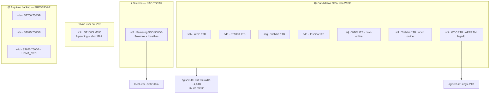

# AGLSRV3 — Mapa de discos

> **Host**: `aglsrv3` · Tailscale `100.123.5.81` · LAN `192.168.15.247/24` (AGLFG)  
> **Última auditoria**: 2026-06-03 (read-only; **nenhum wipe executado**)  
> **Pools ZFS**: nenhum (`zpool list` vazio) · `zfsutils-linux` instalado

Runbook relacionado: [`AGLSRV3-PIHOLE-CLONE.md`](AGLSRV3-PIHOLE-CLONE.md) · [`HOSTS.md`](HOSTS.md#-aglsrv3-proxmox-ve-host)

---

## Visão geral



---

## Inventário físico (2026-06-03 — 12 discos online)

| Dev | Tamanho | Modelo | Serial | SMART | Papel |
|-----|---------|--------|--------|-------|-------|
| **sdf** | 465.8G | Samsung SSD 850 EVO 500GB | S2RANX0H564404D | PASSED | **Sistema Proxmox** |
| **sda** | 698.6G | ST750LM022 | S2X2J90C525025 | PASSED | Arquivo backup |
| **sdb** | 931.5G | WDC WD10SPZX-75Z10T1 | WX91A48LL4CN | PASSED | **ZFS 1TB** · badblocks a correr |
| **sdc** | 698.6G | ST9750420AS | 6WS2Q9CJ | PASSED | Arquivo backup |
| **sdd** | 698.6G | ST9750420AS | 6WS2Q6QR | PASSED* | Arquivo backup |
| **sde** | 931.5G | ST1000LM024 | S33JJ5CG901030 | PASSED | **ZFS 1TB** · badblocks a correr |
| **sdg** | 931.5G | TOSHIBA MQ01ABD100 | X6KLT31BT | PASSED | **ZFS 1TB** · badblocks a correr |
| **sdh** | 931.5G | TOSHIBA MQ01ABD100 | X6KLT319T | PASSED | **ZFS 1TB** · badblocks a correr |
| **sdi** | 1.8T | WDC WD20SPZX-75UA7T0 | WXB1E39AE1J3 | PASSED | **ZFS 2TB** · badblocks a correr |
| **sdj** | 931.5G | WDC WD10SPZX-35Z10T0 | WX22AB0CV28E | PASSED | **ZFS 1TB** · novo online |
| **sdk** | 931.5G | ST1000LM035-1RK172 | ZDE1G6CZ | PASSED** | **⛔ Quarentena — não ZFS** |
| **sdl** | 931.5G | TOSHIBA MQ01ABD100 | X6KLT31FT | PASSED | **ZFS 1TB** · badblocks a correr |

\* **sdd**: UDMA_CRC = **4931** (cabo/porta SATA). Preservar dados; trocar cabo antes de I/O pesado.  
\** **sdk**: SMART health PASSED mas **short test FAILED** (LBA 6525920), **8 pending**, **8 offline uncorrectable**, 207 entradas no error log. **Excluir do pool** até recuperação ou substituição.

---

## Partições e uso de dados

### sdf — sistema (intocável)

| Partição | Uso | Montagem / papel |
|----------|-----|------------------|
| sdf1 | LVM PV | `pve` VG |
| sdf2 | vfat | `/boot/efi` |
| (LVM) | ext4 + thin | `pve-root` (~96G), **local-lvm** (~330G thin, ~35% usado) |

**Proxmox storage**: `local` (dir ~30% usado), `local-lvm` (thin).

### Candidatos wipe (1 TB + 2 TB)

| Dev | Partição | FS / label | Uso (df) | Conteúdo conhecido |
|-----|----------|------------|----------|-------------------|
| **sdb** | sdb3 | NTFS | **128M / 930G (1%)** | Instalação Windows vazia / já clonada para SSD 500G |
| **sde** | sde3 | NTFS «Windows» | **137G / 918G (15%)** | Windows legado (clonado) |
| **sdg** | sdg3 | NTFS «OS» | **172G / 471G (37%)** | zeladoria, Pegasus (~9G histórico) |
| **sdg** | sdg4 | NTFS «BACKUP» | **114M / 448G (1%)** | Partição backup quase vazia |
| **sdh** | sdh3 | NTFS «OS» | **125G / 918G (14%)** | tesouraria (~17G histórico) |
| **sdi** | sdi2 | APFS | ~1.8T (sem mount Linux) | Time Machine (**migrado**) |
| **sdj** | sdj3 | NTFS | **89G / 916G (10%)** | Windows (clonável) |
| **sdk** | sdk3 | NTFS | **75G / 906G (9%)** | Windows — **não wipe** até resolver sectores |
| **sdl** | sdl3 | NTFS | **78G / 919G (9%)** | Windows (clonável) |

### Arquivo — preservar (750 GB)

| Dev | Partição | FS / label | Uso (df) | Conteúdo |
|-----|----------|------------|----------|----------|
| **sda** | sda2 | NTFS «OS» | **29G / 698G (5%)** | Windows legado |
| **sdc** | sdc5 | NTFS «Sistema» | **635G / 691G (92%)** | Dell — Users ElaineAparecida, kakos |
| **sdd** | sdd1–2 | vfat/NTFS | USB boot/install | Legado instalador |
| **sdd** | sdd3 | NTFS «AGLDATA08» | **641G / 667G (97%)** | `BB` ~573G, `apps` ~67G |

---

## SMART — atributos críticos (2026-06-03)

| Dev | Realloc | Pending | Offline uncorr. | UDMA_CRC | SMART short | Error log |
|-----|---------|---------|-----------------|----------|-------------|-----------|
| sda | 0 | 0 | 0 | 0 | — | vazio |
| sdb | 0 | 0 | 0 | 0 | — | vazio |
| sdc | 0 | 0 | 0 | 0 | — | vazio |
| sdd | 0 | 0 | 0 | **4931** | — | vazio |
| sde | 0 | 0 | 0 | 0 | OK (2026-05) | vazio |
| sdg | 0 | 0 | — | 0 | OK (2026-05) | vazio |
| sdh | 0 | 0 | — | 0 | OK (2026-05) | vazio |
| sdi | 0 | 0 | 0 | 0 | — | vazio |
| sdj | 0 | 0 | 0 | 0 | — | vazio |
| sdk | 0 | **8** | **8** | 0 | **FAIL** LBA 6525920 | 207 UNC |
| sdl | 0 | 0 | — | 0 | **OK** | 340 hist. (short OK) |

**sdk:** considerar `smartctl -t long`, clonagem de dados úteis e **substituição** — não incluir em raidz1.

---

## Testes de superfície e I/O (read-only)

Ferramentas instaladas no host: `smartmontools`, `testdisk`, `badblocks`, `zfsutils-linux`.

### Amostra de leitura (`dd` 512MB, read-only — 2026-06-03)

| Dev | MB/s | Nota |
|-----|------|------|
| sdb | 103 | OK |
| sde | 126 | OK (antes 24 MB/s — variável) |
| sdg | ~109 | OK (2026-05) |
| sdh | ~118 | OK (2026-05) |
| sdi | ~52 | OK para 2TB |
| sdj | 39.5 | Mais lento; monitorizar badblocks |
| sdk | 139 | I/O OK apesar de sectores pendentes |
| sdl | 116 | OK |

### badblocks `-sv` (read-only)

**2026-06-03:** reiniciados em background (logs anteriores perdidos após reboot). **7 discos:** sdb, sde, sdg, sdh, sdi, sdj, sdl. **sdk excluído** (sectores danificados).

Estimativa: ~2–4 h/disco @ ~100 MB/s com 7 scans paralelos (carga alta no host).

```bash
# Progresso
ssh root@100.123.5.81 'for d in sdb sde sdg sdh sdi sdj sdl; do printf "%s: " $d; grep -o "[0-9.]*% done.*errors)" /tmp/badblocks-$d.log 2>/dev/null | tail -1; done'
ps aux | grep "[b]adblocks -sv"
```

---

## `/dev/disk/by-id` (wipe / zpool — usar sempre by-id)

| Dev | by-id |
|-----|-------|
| sdb | `ata-WDC_WD10SPZX-75Z10T1_WX91A48LL4CN` |
| sde | `ata-ST1000LM024_HN-M101MBB_S33JJ5CG901030` |
| sdg | `ata-TOSHIBA_MQ01ABD100_X6KLT31BT` |
| sdh | `ata-TOSHIBA_MQ01ABD100_X6KLT319T` |
| sdj | `ata-WDC_WD10SPZX-35Z10T0_WX22AB0CV28E` |
| sdl | `ata-TOSHIBA_MQ01ABD100_X6KLT31FT` |
| sdi | `ata-WDC_WD20SPZX-75UA7T0_WXB1E39AE1J3` |
| sdk | `ata-ST1000LM035-1RK172_ZDE1G6CZ` (**quarentena — não wipe**) |
| sdf | `ata-Samsung_SSD_850_EVO_500GB_S2RANX0H564404D` (**não wipe**) |

---

## Consumidores de `local-lvm` (sdf)

| VMID | Nome | Disco aprox. | Estado (2026-06-03) |
|------|------|--------------|---------------------|
| 101 | AGLHQ10 | + NVMe passthrough | running |
| 102 | AGLHQ11 | 240G | stopped |
| 103 | opnsense | 40G (~99% cheio) | stopped |
| 105 | AGLMAC07 | 256G | stopped |
| 108 | truenas | 32G | stopped |
| 117 | pihole3 | 12G | running |
| 106 | cloudflared3 | 4G | running |
| 104 | cloudflared | 2G | running (HA tunnel) |

Backups vzdump em `/var/lib/vz/dump/` (~11G): incl. pihole 2026-05-28, AGLMAC07 2023 — **não apagar sem OK**.

---

## Decisões e plano ZFS

### Política acordada

1. **ZFS só em 1 TB + 2 TB** — conteúdo já clonado para SSDs 500G ou migrado (Time Machine).
2. **750 GB (sda, sdc, sdd)** — permanecem como **backup offline**, fora do pool.
3. **sdf** — sistema; intocável.
4. **Wipe** — apenas com **autorização explícita por serial/by-id**.

### Pools planeados (pós-wipe + badblocks OK)

| Pool | Discos | Layout | Capacidade útil ~ |
|------|--------|--------|-------------------|
| `aglsrv3-tb` | sdb, sde, sdg, sdh | **raidz1** (4×1TB) — **ONLINE** 2026-06-03 | ~**2,7 TB** |
| `aglsrv3-tb` | + sdj, sdl (futuro) | `zpool attach` após re-teste | até ~4,6 TB |
| `aglsrv3-tb` | (alternativa histórica) | **3× mirror** | ~2,8 TB |
| `aglsrv3-2t` | sdi | single | ~1,8 TB |

**Excluídos:** sdk (sectores danificados), sda/sdc/sdd (arquivo), sdf (sistema).

### Lista WIPE proposta (ordem sugerida)

| # | Dev | Serial | Nota |
|---|-----|--------|------|
| 1 | sdb | WX91A48LL4CN | ~1% usado |
| 2 | sdh | X6KLT319T | SMART OK |
| 3 | sdg | X6KLT31BT | SMART OK |
| 4 | sdl | X6KLT31FT | Novo online; short OK |
| 5 | sdj | WX22AB0CV28E | Novo online; I/O ~40 MB/s |
| 6 | sdi | WXB1E39AE1J3 | TM migrado |
| 7 | sde | S33JJ5CG901030 | 15% usado |
| — | sdk | ZDE1G6CZ | **Não wipe** — quarentena |

### Comandos (referência — **não executar sem OK**)

```bash
# Wipe exemplo (substituir by-id)
wipefs -a /dev/disk/by-id/ata-WDC_WD10SPZX-75Z10T1_WX91A48LL4CN
sgdisk --zap-all /dev/disk/by-id/ata-WDC_WD10SPZX-75Z10T1_WX91A48LL4CN

# Pool aglsrv3-tb (executado 2026-06-03 — 4×1TB raidz1)
zpool create -f -o ashift=12 \
  -O compression=lz4 \
  -O atime=off \
  aglsrv3-tb raidz1 \
  /dev/disk/by-id/ata-WDC_WD10SPZX-75Z10T1_WX91A48LL4CN \
  /dev/disk/by-id/ata-ST1000LM024_HN-M101MBB_S33JJ5CG901030 \
  /dev/disk/by-id/ata-TOSHIBA_MQ01ABD100_X6KLT31BT \
  /dev/disk/by-id/ata-TOSHIBA_MQ01ABD100_X6KLT319T

pvesm add zfspool aglsrv3-tb -pool aglsrv3-tb

# Expandir depois (sdj/sdl, após badblocks OK):
# zpool attach aglsrv3-tb /dev/disk/by-id/ata-...
```

---

## Pendências operacionais

- [x] `badblocks -sv`: sdb, sde, sdg, sdh, sdi — **0 bad blocks** (2026-06-03).
- [x] Wipe autorizado: sdb, sde, sdg, sdh (seriais acima).
- [x] Pool **`aglsrv3-tb`** raidz1 4×1TB criado + `pvesm add zfspool` (2026-06-03).
- [ ] sdj, sdl: offline no badblocks — `zpool attach` após cabo + re-teste.
- [ ] SMART **long** nos candidatos wipe (recomendado).
- [ ] **sdk:** decidir substituição ou recuperação (8 pending, short FAIL).
- [ ] Trocar cabo SATA do **sdd** (UDMA_CRC 4931).
- [ ] Autorização explícita de wipe por serial.
- [ ] Tailscale CT117 — ver [`AGLSRV3-PIHOLE-CLONE.md`](AGLSRV3-PIHOLE-CLONE.md).
- [ ] VM103 opnsense — disco ~99% cheio.

---

## Histórico de auditoria

| Data | Acção |
|------|--------|
| 2026-05-28 | Inventário inicial, instalação `testdisk`, scans read-only NTFS |
| 2026-05-30 | SMART, df, dd I/O, badblocks (5 discos; logs perdidos no reboot) |
| 2026-06-03 | sdj/sdk/sdl online; sdk **excluído** ZFS; badblocks reiniciado (7 discos); mapa actualizado |
| 2026-06-03 | badblocks OK (5 discos); wipe sdb/sde/sdg/sdh; **pool aglsrv3-tb** raidz1 4×1TB ONLINE |
