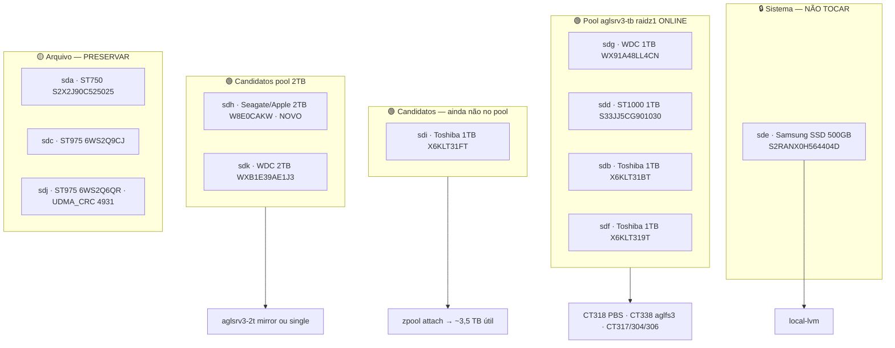

# AGLSRV3 — Mapa de discos

> **Host**: `aglsrv3` · Tailscale `100.123.5.81` · LAN `192.168.15.247/24` (AGLFG)  
> **Última auditoria**: 2026-06-09 (pós-manutenção física + ops disco)  
> **Pool ZFS**: `aglsrv3-tb` raidz1 4×1TB + **sdi** 1TB (vdev single) **ONLINE** (~4,45 TB livre)  
> **Removidos para teste externo**: `ZDE1G6CZ` (ST1000LM035), `WX22AB0CV28E` (WDC 1TB lento)  
> **Em curso**: `badblocks` sdj + sdh · wipe sdh após badblocks (watcher activo)

Runbook relacionado: [`AGLSRV3-PIHOLE-CLONE.md`](AGLSRV3-PIHOLE-CLONE.md) · [`HOSTS.md`](HOSTS.md#-aglsrv3-proxmox-ve-host)

---

## ⚠️ Letras `sdX` mudam — usar sempre serial / by-id

Após remover discos e religar cabos, **as letras mudaram** face à auditoria 2026-06-03. O pool ZFS usa **by-id** (estável).

| Serial | by-id | Dev **2026-06-09** | Papel |
|--------|-------|-------------------|--------|
| S2RANX0H564404D | `ata-Samsung_SSD_850_EVO_500GB_S2RANX0H564404D` | **sde** | Sistema Proxmox |
| WX91A48LL4CN | `ata-WDC_WD10SPZX-75Z10T1_WX91A48LL4CN` | **sdg** | Pool `aglsrv3-tb` |
| S33JJ5CG901030 | `ata-ST1000LM024_HN-M101MBB_S33JJ5CG901030` | **sdd** | Pool `aglsrv3-tb` |
| X6KLT31BT | `ata-TOSHIBA_MQ01ABD100_X6KLT31BT` | **sdb** | Pool `aglsrv3-tb` |
| X6KLT319T | `ata-TOSHIBA_MQ01ABD100_X6KLT319T` | **sdf** | Pool `aglsrv3-tb` |
| X6KLT31FT | `ata-TOSHIBA_MQ01ABD100_X6KLT31FT` | **sdi** | **Pool** — vdev single (5.º disco; ver nota raidz) |
| W8E0CAKW | `ata-APPLE_HDD_ST2000DM001_W8E0CAKW` | **sdh** | badblocks → wipe automático · **parado** |
| WXB1E39AE1J3 | `ata-WDC_WD20SPZX-75UA7T0_WXB1E39AE1J3` | **sdk** | **Wiped** 2026-06-09 · parado (pool 2TB futuro) |
| S2X2J90C525025 | `ata-ST750LM022_HN-M750MBB_S2X2J90C525025` | **sda** | Arquivo 750G |
| 6WS2Q9CJ | `ata-ST9750420AS_6WS2Q9CJ` | **sdc** | Arquivo 750G |
| 6WS2Q6QR | `ata-ST9750420AS_6WS2Q6QR` | **sdj** | Arquivo 750G (UDMA_CRC hist.) |
| 0010018001479 | NVMe `NE-1TB 2280` | **nvme0n1** | Windows / passthrough VM301 |

**Fora do host (2026-06-09):**

| Serial | Modelo | Motivo |
|--------|--------|--------|
| ZDE1G6CZ | ST1000LM035 1TB | 8 pending, short FAIL — testar noutro PC |
| WX22AB0CV28E | WDC WD10SPZX 1TB | I/O ~40 MB/s — testar noutro PC/cabo |

---

## Visão geral



---

## Inventário físico (2026-06-09 — 11 SATA + 1 NVMe)

| Dev* | Tamanho | Modelo | Serial | SMART | I/O 256MB | Papel |
|-----|---------|--------|--------|-------|-----------|-------|
| **sde** | 500G | Samsung SSD 850 EVO | S2RANX0H564404D | PASSED | — | **Sistema** |
| **sdg** | 1TB | WDC WD10SPZX | WX91A48LL4CN | PASSED | — | **Pool** |
| **sdd** | 1TB | ST1000LM024 | S33JJ5CG901030 | PASSED | — | **Pool** |
| **sdb** | 1TB | TOSHIBA MQ01ABD100 | X6KLT31BT | PASSED | — | **Pool** |
| **sdf** | 1TB | TOSHIBA MQ01ABD100 | X6KLT319T | PASSED | — | **Pool** |
| **sdi** | 1TB | TOSHIBA MQ01ABD100 | X6KLT31FT | PASSED, short OK | **114 MB/s** | **Livre** — expandir raidz1 |
| **sdh** | 2TB | APPLE HDD ST2000DM001 | **W8E0CAKW** | PASSED, 26 588 h | **192 MB/s** | **Livre** — 2TB novo |
| **sdk** | 2TB | WDC WD20SPZX (SMR) | WXB1E39AE1J3 | PASSED, 3 986 h | **75 MB/s** | **Livre** — TM/APFS legado |
| **sda** | 750G | ST750LM022 | S2X2J90C525025 | PASSED | — | Arquivo |
| **sdc** | 750G | ST9750420AS | 6WS2Q9CJ | PASSED, 20 999 h | — | Arquivo (~92% Dell) |
| **sdj** | 750G | ST9750420AS | 6WS2Q6QR | PASSED* | **120 MB/s** | Arquivo AGLDATA08 ~97% |
| **nvme0n1** | 1TB | NE-1TB 2280 | 0010018001479 | PASSED | — | Partições Windows |

\* **sdj**: contador **UDMA_CRC = 4931** (histórico de cabo); short test OK em 2026-06-09. Não usar em ZFS até confirmar cabo/porta estável (contador não subir após I/O).

---

## Pool `aglsrv3-tb` (estado 2026-06-09)

```
zpool status aglsrv3-tb
  state: ONLINE
  raidz1-0:
    ata-WDC_WD10SPZX-75Z10T1_WX91A48LL4CN      → sdg
    ata-ST1000LM024_HN-M101MBB_S33JJ5CG901030  → sdd
    ata-TOSHIBA_MQ01ABD100_X6KLT31BT           → sdb
    ata-TOSHIBA_MQ01ABD100_X6KLT319T           → sdf
  ata-TOSHIBA_MQ01ABD100_X6KLT31FT             → sdi  (vdev single, wipe+add 2026-06-09)
  SIZE: ~4,53 TB · AVAIL: ~4,45 TB · USED: ~85 GB
  errors: No known data errors
```

> **Nota raidz 5.º disco:** Proxmox ZFS **2.2.8** não expõe `feature@raidz_expansion` (OpenZFS **2.3+**).  
> `zpool attach raidz1-0` falhou; aplicado `zpool add` — sdi entra como **vdev single** (stripe com o raidz1).  
> Capacidade extra ~930 GB; dados **novos** podem ir para sdi **sem paridade**. Upgrade ZFS 2.3+ permitiria expansão raidz1 real.

**Datasets activos:** CT304, 306, 317, 318, 338; VM310 cloudinit/disk parcial.

---

## Discos livres — análise detalhada

### sdi — X6KLT31FT (1 TB Toshiba)

| Campo | Valor |
|-------|--------|
| Partições | NTFS «OS» ~918G (~8% Windows legado) |
| SMART | 0 realloc, 0 pending, UDMA_CRC 0 |
| POH | 3 754 h |
| Leitura | 114 MB/s |
| **Recomendação** | **Melhor candidato a `zpool attach`** no raidz1 (5.º disco). Wipe após backup se dados já clonados. Capacidade útil ~**3,5 TB** (5×1TB raidz1). |

### sdh — W8E0CAKW (2 TB Seagate 7200 — **novo no host**)

| Campo | Valor |
|-------|--------|
| Partições | EFI 200M + **APFS** ~1,8T (Time Machine Mac) |
| SMART | PASSED, 0 pending, 26 588 h (disco usado, novo cabo/host) |
| Self-test | Nenhum registado — correr `smartctl -t short` |
| Leitura | **192 MB/s** (7200 rpm) |
| **Recomendação** | Disco **preferido** para pool `aglsrv3-2t` (single ou perna principal de mirror). APFS só útil se ainda precisares dos backups Mac — caso contrário wipe após export. |

### sdk — WXB1E39AE1J3 (2 TB WDC SMR)

| Campo | Valor |
|-------|--------|
| Partições | EFI 200M + **APFS** ~1,8T (TM migrado) |
| SMART | PASSED, 0 pending, 3 986 h |
| Leitura | **75 MB/s** (SMR 5400 rpm) |
| **Recomendação** | Segunda opção 2TB: **mirror com sdh** (redundância ~1,8 TB) ou arquivo frio. Evitar SMR como único pool de I/O intenso (PBS/VMs). |

### Arquivo 750 GB (não ZFS)

| Dev | Serial | Notas |
|-----|--------|-------|
| sda | S2X2J90C525025 | NTFS ~5% |
| sdc | 6WS2Q9CJ | NTFS Dell ~92% |
| sdj | 6WS2Q6QR | AGLDATA08 ~97%; UDMA_CRC histórico |

---

## SMART — atributos críticos (2026-06-09)

| Dev | Serial | Realloc | Pending | Offline | UDMA_CRC | Short |
|-----|--------|---------|---------|---------|----------|-------|
| sde | S2RANX0… | 0 | 0 | 0 | 0 | — |
| sdg | WX91A48… | 0 | 0 | 0 | 0 | OK |
| sdd | S33JJ5… | 0 | 0 | 0 | 0 | OK |
| sdb | X6KLT31BT | 0 | 0 | — | 0 | OK |
| sdf | X6KLT319T | 0 | 0 | — | 0 | OK |
| **sdi** | X6KLT31FT | 0 | 0 | — | 0 | OK |
| **sdh** | W8E0CAKW | 0 | 0 | 0 | 0 | *(não corrido)* |
| **sdk** | WXB1E39AE1J3 | 0 | 0 | 0 | 0 | OK |
| sda | S2X2J90… | 0 | 0 | 0 | 0 | OK |
| sdc | 6WS2Q9CJ | 0 | 0 | 0 | 0 | OK |
| sdj | 6WS2Q6QR | 0 | 0 | 0 | **4931** | OK |

---

## Plano ZFS (2026-06-09 — recriação após PVE 9)

**Decisão:** destruir pool actual (layout errado: raidz1-0 + vdev single) e recriar **raidz1 nativo 5×1TB** após:

1. badblocks **sdj** + **sdh** (0 erros)
2. wipe **sdh** (watcher) + **sdk** já limpo
3. **Upgrade Proxmox 8.4 → 9** (OpenZFS 2.3+, `feature@raidz_expansion`)

| Pool | Discos (by-id) | Layout | Capacidade útil ~ |
|------|----------------|--------|-------------------|
| `aglsrv3-tb` | 5×1TB (ver abaixo) | **raidz1** novo | ~**3,5 TB** |
| `aglsrv3-2t` | W8E0CAKW + WXB1E39AE1J3 | mirror (fase posterior) | ~1,8 TB |

**Discos do novo `aglsrv3-tb` (by-id):**

- `ata-WDC_WD10SPZX-75Z10T1_WX91A48LL4CN`
- `ata-ST1000LM024_HN-M101MBB_S33JJ5CG901030`
- `ata-TOSHIBA_MQ01ABD100_X6KLT31BT`
- `ata-TOSHIBA_MQ01ABD100_X6KLT319T`
- `ata-TOSHIBA_MQ01ABD100_X6KLT31FT`

**Excluídos:** sde (sistema), sda/sdc/sdj (arquivo), 2×2TB parados, discos removidos ZDE1G6CZ / WX22AB0CV28E.

### Features e propriedades do novo pool (OpenZFS 2.3+ / PVE 9)

Referências: [PVE ZFS on Linux](https://pve.proxmox.com/wiki/ZFS_on_Linux) · [OpenZFS 2.3 release](https://www.phoronix.com/news/OpenZFS-2.3-Released) · `zpool-features(7)`

#### Feature flags — o que activar

| Feature | Acção | Motivo |
|---------|--------|--------|
| **raidz_expansion** | `enabled` na criação | Permite `zpool attach` de 6.º disco ao raidz1 sem recriar pool |
| **block_cloning** | default em pool novo 2.3 | Clones CT / cópias ZFS muito mais rápidos |
| **longname** | default em pool novo 2.3 | Nomes de ficheiro até 1023 caracteres |
| **fast_dedup** | default (só se dedup=ON) | **Não usar dedup** neste host — RAM insuficiente |
| **device_rebuild** | default | Rebuild resiliente de discos |
| **zstd_compress** | activa ao usar `compression=zstd` | Dataset `backups` com `zstd-3` |
| **dRAID** | — | Topologia diferente; não aplicável |
| **encryption** | opcional | Segurança at-rest; exige gestão de chaves (PBS/CT318) |

> **Nota:** `feature@raidz_expansion` torna o pool **não importável** em ZFS &lt; 2.3 — intencional após upgrade PVE 9.

#### Propriedades do pool (script `create_pool`)

| Propriedade | Valor | Motivo |
|-------------|-------|--------|
| `ashift=12` | 4K | Alinhamento sectores modernos (HDD 1TB) |
| `autotrim=off` | HDD | TRIM só faz sentido em SSD |
| `compression=lz4` | CT/VM default | Baixo CPU, ~20–30% poupança em rootfs |
| `atime=off` | menos writes | Padrão recomendado PVE |
| `xattr=sa` | Linux | xattrs no inode — melhor LXC/NFS |
| `acltype=posixacl` | Proxmox | ACLs POSIX (pool actual tem `off`) |
| `redundant_metadata=all` | default | Cópias extra de metadados em raidz |

#### Datasets filhos

| Dataset | recordsize | compression | Uso |
|---------|------------|-------------|-----|
| `aglsrv3-tb` (raiz) | 128K (default) | lz4 | CTs 304/306/317/318/338, imagens |
| `aglsrv3-tb/backups` | **1M** | **zstd-3** | vzdump, tar streams, ficheiros grandes |

`recordsize` em CTs é **dinâmico** (teto 128K); ficheiros pequenos usam blocos menores. Só vale `64K` se perfil for quase só rootfs pequeno — ganho marginal.

#### O que **não** adicionar (sem hardware extra)

| Opção | Motivo |
|-------|--------|
| **dedup** | ~5 GB RAM/TB deduplicado; CTs mistos não compensam |
| **special vdev** | Requer SSD dedicado com mesma redundância que o pool |
| **L2ARC** | Sem SSD cache; sde = sistema |
| **SLOG (log vdev)** | Sem SSD spare; CTs são maioritariamente async |
| **ashift=9** | Pior performance em discos 4Kn |

#### Expansão futura (6.º disco 1TB)

Após PVE 9 + pool com `raidz_expansion`:

```bash
zpool attach aglsrv3-tb raidz1-0 /dev/disk/by-id/ata-…
zpool status aglsrv3-tb   # resilver / expansion
```

Dados **existentes** mantêm layout antigo (4+1); só **escritas novas** usam stripe alargado até reescrita/cópia.

**Orquestração automática no host:** `/usr/local/sbin/aglsrv3-pool-rebuild-after-checks.sh`

Ordem após badblocks/wipes:

1. **Migrar VM310** → **cancelado** (discos perdidos no destroy; recriar de VM110 — ver [`AGL-OLLAMA-VM310.md`](AGL-OLLAMA-VM310.md))
2. Parar CTs 304/306/317/318/338 · remover storages PBS
3. `zpool destroy` · upgrade PVE 9 · recriar raidz1 5×1TB

Log: `/var/log/aglsrv3-pool-rebuild.log` · Estado: `/var/lib/aglsrv3-pool-rebuild/state` (`migrating-vm310` = VM310 a mover)

```bash
# Progresso
ssh root@100.123.5.81 aglsrv3-pool-rebuild-after-checks.sh --status

# Após conclusão: reprovisionar CTs + PBS
# scripts/proxmox/pbs-setup-renumbered-hosts.sh --host aglsrv3 --apply --remote
```

---

## Consumidores storage (2026-06-09)

| VMID | Nome | Storage | Estado |
|------|------|---------|--------|
| 301 | AGLHQ10 | local-lvm + NVMe passthrough? | stopped |
| 302–305, 308 | várias | local-lvm | stopped |
| **310** | **agl-ollama** | **recriar** de VM110 pós-upgrade | stopped (config órfã) |
| 304, 306, 317, 318, 338 | CTs | **aglsrv3-tb** | running |

`pvesm`: `aglsrv3-tb`, `local`, `local-lvm`, `pbs-*` activos.

---

## Upgrade PVE 8 → 9 — riscos e mitigações (AGLSRV3)

**CPU:** Intel Xeon **E5-2690 v3** (Haswell-EP, sig `0x306f2`) · **Boot:** UEFI + **GRUB** + root **LVM** (`pve/root` em sde).

Referência oficial: [Upgrade from 8 to 9](https://pve.proxmox.com/wiki/Upgrade_from_8_to_9)

### Problemas conhecidos (aplicáveis a este host)

| Risco | Impacto | Mitigação aplicada/planeada |
|-------|---------|----------------------------|
| **GRUB + UEFI + LVM** | Após upgrade, boot cai em `grub>` | `grub-efi-amd64` + `grub-install --recheck` pré e pós-reboot; script `--grub-fix` |
| **systemd-boot meta-pacote** | Conflitos em pacotes de boot | `apt purge systemd-boot` (manter GRUB) |
| **Microcode em falta** | Rev `0x00000000`; TAA/MMIO Stale Data vulnerável | `non-free-firmware` + `intel-microcode` → rev **0x49** após reboot |
| **/etc/hosts IP errado** | `pve8to9` FAIL (192.168.30.111 vs .247) | Corrigido para `192.168.30.247` |
| **Repo bullseye obsoleto** | `pxve-no-sub.list` mistura suites | Ficheiro desactivado |
| **/tmp como tmpfs (Trixie)** | Até 50% RAM; limpeza automática | Evitar builds grandes em `/tmp` durante upgrade |
| **Audit journal flood** | Logs excessivos mid-upgrade | `systemctl disable systemd-journald-audit.socket` |
| **LVM thin pool repair** | Erro `Check of pool pve/data failed` | Se ocorrer: `lvconvert --repair pve/data` |
| **NIC rename (kernel 6.14+)** | Interfaces mudam nome | Consola IPMI/física disponível; considerar `pve-network-interface-pinning` |
| **Tailscale repo bookworm** | Apt após Trixie | Script rebuild actualiza suite para `trixie` |
| **Ceph Quincy** | Incompatível com PVE 9 | Repos comentados; sem Ceph hyper-converged activo |

### Scripts

```bash
# Pré-upgrade (correcções + pve8to9 até 0 FAIL)
/usr/local/sbin/aglsrv3-pve9-preupgrade.sh apply

# Só verificar
/usr/local/sbin/aglsrv3-pve9-preupgrade.sh --check-only

# Se GRUB falhar após reboot
/usr/local/sbin/aglsrv3-pve9-preupgrade.sh --grub-fix
```

Log: `/var/log/aglsrv3-pve9-preupgrade.log`

**Reboot recomendado** após `intel-microcode` (antes do `dist-upgrade` para Trixie) para confirmar rev `0x49` em `dmesg | grep microcode`.

---

## Pendências operacionais

- [x] Remover discos problemáticos: **ZDE1G6CZ**, **WX22AB0CV28E** (fora do host).
- [x] Pool **aglsrv3-tb** ONLINE após manutenção.
- [x] **sdi** (X6KLT31FT): wipe + `zpool add` ao pool (2026-06-09).
- [x] **badblocks** sdj + sdh: 0 erros (2026-06-09).
- [x] **sdh/sdk** wiped; **pool destroy** concluído.
- [ ] **Pool rebuild:** upgrade PVE 9 + raidz1 5×1TB (`systemctl start aglsrv3-pool-rebuild.service`).
- [x] **VM310:** operacional — Ollama 2× RX580, TS `100.67.253.52`, LiteLLM CT186 (2026-06-11). Ver [`AGL-OLLAMA-VM310.md`](AGL-OLLAMA-VM310.md).
- [ ] **Pós-rebuild:** reprovisionar CTs 304/306/317/318/338.
- [ ] **sdj** (6WS2Q6QR): monitorizar UDMA_CRC; só leitura de arquivo.
- [ ] Resultado testes externos em **ZDE1G6CZ** / **WX22AB0CV28E**.
- [ ] VM303 opnsense — disco ~99% cheio.

---

## Histórico de auditoria

| Data | Acção |
|------|--------|
| 2026-05-28 | Inventário inicial |
| 2026-06-03 | Pool **aglsrv3-tb** raidz1 4×1TB; badblocks OK nos 4 |
| 2026-06-09 | Pós-manutenção: removidos ZDE1G6CZ + WX22AB0CV28E; **novo 2TB W8E0CAKW**; remap sd*; análise sdi/sdh/sdk |
| 2026-06-09 | badblocks sdj+sdh; wipe sdi→`zpool add`; wipe sdk; watcher wipe sdh pós-badblocks |
| 2026-06-09 | Plano: destroy pool + PVE 9 + raidz1 5×1TB; script `aglsrv3-pool-rebuild-after-checks.sh` + systemd |
