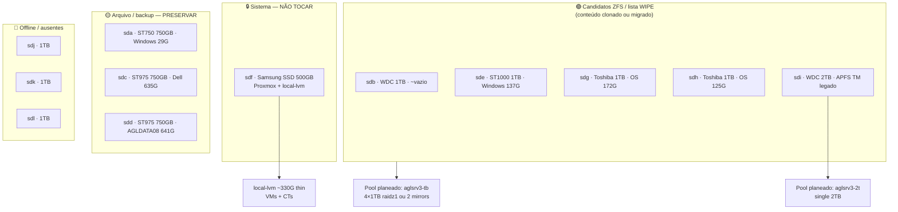

# AGLSRV3 — Mapa de discos

> **Host**: `aglsrv3` · Tailscale `100.123.5.81` · LAN `192.168.15.247/24` (AGLFG)  
> **Última auditoria**: 2026-05-30 (read-only; **nenhum wipe executado**)  
> **Pools ZFS**: nenhum (`zpool list` vazio) · `zfsutils-linux` instalado

Runbook relacionado: [`AGLSRV3-PIHOLE-CLONE.md`](AGLSRV3-PIHOLE-CLONE.md) · [`HOSTS.md`](HOSTS.md#-aglsrv3-proxmox-ve-host)

---

## Visão geral



---

## Inventário físico (online em 2026-05-30)

| Dev | Tamanho | Modelo | Serial | ROTA | Estado SMART | Papel |
|-----|---------|--------|--------|------|--------------|-------|
| **sdf** | 465.8G | Samsung SSD 850 EVO 500GB | S2RANX0H564404D | SSD | PASSED | **Sistema Proxmox** |
| **sda** | 698.6G | ST750LM022 HN-M750MBB | S2X2J90C525025 | HDD | PASSED | Arquivo backup |
| **sdb** | 931.5G | WDC WD10SPZX-75Z10T1 | WX91A48LL4CN | HDD | PASSED | **Wipe → ZFS 1TB** |
| **sdc** | 698.6G | ST9750420AS | 6WS2Q9CJ | HDD | PASSED | Arquivo backup |
| **sdd** | 698.6G | ST9750420AS | 6WS2Q6QR | HDD | PASSED* | Arquivo backup |
| **sde** | 931.5G | ST1000LM024 HN-M101MBB | S33JJ5CG901030 | HDD | PASSED | **Wipe → ZFS 1TB** |
| **sdg** | 931.5G | TOSHIBA MQ01ABD100 | X6KLT31BT | HDD | PASSED | **Wipe → ZFS 1TB** |
| **sdh** | 931.5G | TOSHIBA MQ01ABD100 | X6KLT319T | HDD | PASSED | **Wipe → ZFS 1TB** |
| **sdi** | 1.8T | WDC WD20SPZX-75UA7T0 | WXB1E39AE1J3 | HDD | PASSED | **Wipe → ZFS 2TB** |

\* **sdd**: SMART PASSED mas **UDMA_CRC_Error_Count = 4931** → problema de **cabo/porta/SATA**, não sectores reassignados. Trocar cabo antes de confiar no disco a longo prazo; **não** incluir no ZFS.

### Discos ausentes (2026-05-30)

| Dev | Tamanho (histórico) | Estado | Notas |
|-----|---------------------|--------|-------|
| **sdj** | ~932G | **Não detectado** | Sessão anterior: offline, `DID_BAD_TARGET`, hardreset failed |
| **sdk** | ~932G | **Não detectado** | Sessão anterior: 8 pending sectors, I/O errors |
| **sdl** | ~932G | **Não detectado** | Sessão anterior: offline, hardreset failed |

Reconectar fisicamente → repetir SMART long + `badblocks -sv` antes de qualquer wipe ou pool.

---

## Partições e uso de dados

### sdf — sistema (intocável)

| Partição | Uso | Montagem / papel |
|----------|-----|------------------|
| sdf1 | LVM PV | `pve` VG |
| sdf2 | vfat | `/boot/efi` |
| (LVM) | ext4 + thin | `pve-root` (~96G), **local-lvm** (~330G thin, ~35% usado) |

**Proxmox storage**: `local` (dir ~30% usado), `local-lvm` (thin).

### Candidatos wipe (1 TB + 2 TB)

| Dev | Partição | FS / label | Uso (df) | Conteúdo conhecido |
|-----|----------|------------|----------|-------------------|
| **sdb** | sdb3 | NTFS | **128M / 930G (1%)** | Instalação Windows vazia / já clonada para SSD 500G |
| **sde** | sde3 | NTFS «Windows» | **137G / 918G (15%)** | Windows legado (clonado) |
| **sdg** | sdg3 | NTFS «OS» | **172G / 471G (37%)** | zeladoria, Pegasus (~9G histórico) |
| **sdg** | sdg4 | NTFS «BACKUP» | **114M / 448G (1%)** | Partição backup quase vazia |
| **sdh** | sdh3 | NTFS «OS» | **125G / 918G (14%)** | tesouraria (~17G histórico) |
| **sdi** | sdi1 | vfat EFI | 200M | — |
| **sdi** | sdi2 | **APFS** | ~1.8T | Time Machine macOS (**migrado** para outro destino) |

### Arquivo — preservar (750 GB)

| Dev | Partição | FS / label | Uso (df) | Conteúdo |
|-----|----------|------------|----------|----------|
| **sda** | sda2 | NTFS «OS» | **29G / 698G (5%)** | Windows legado |
| **sdc** | sdc5 | NTFS «Sistema» | **635G / 691G (92%)** | Dell — Users ElaineAparecida, kakos |
| **sdd** | sdd1–2 | vfat/NTFS | USB boot/install | Legado instalador |
| **sdd** | sdd3 | NTFS «AGLDATA08» | **641G / 667G (97%)** | `BB` ~573G, `apps` ~67G |

---

## SMART — atributos críticos (2026-05-30)

| Dev | Reallocated | Pending | Offline uncorr. | UDMA_CRC | POH | Error log |
|-----|-------------|---------|-----------------|----------|-----|-----------|
| sda | 0 | 0 | 0 | 0 | 6000 | vazio |
| sdb | 0 | 0 | 0 | 0 | 1935 | vazio |
| sdc | 0 | 0 | 0 | 0 | 20813 | vazio |
| sdd | 0 | 0 | 0 | **4931** | 28841 | vazio |
| sde | 0 | 0 | 0 | 0 | 585 | vazio |
| sdg | 0 | — | — | 0 | 13493 | vazio |
| sdh | 0 | — | — | 0 | 2764 | vazio |
| sdi | 0 | 0 | 0 | 0 | 3800 | vazio |

**Testes SMART short** (2026-05-30): sde, sdg, sdh — *Completed without error*.

---

## Testes de superfície e I/O (read-only)

Ferramentas instaladas no host: `smartmontools`, `testdisk`, `badblocks`, `zfsutils-linux`.

### Amostra de leitura (`dd` 1–2 GB, read-only)

| Dev | Velocidade | Nota |
|-----|------------|------|
| sdb | 113 MB/s | Normal |
| sde | **24 MB/s** | Lento — último na fila de wipe; monitorizar |
| sdg | 109 MB/s | Normal |
| sdh | 118 MB/s | Normal |
| sdi | 52 MB/s | Aceitável para 2 TB |

### badblocks `-sv` (read-only, background 2026-05-30)

Iniciados em `/tmp/badblocks-{sdb,sde,sdg,sdh,sdi}.log`. Até ~2–3% de progresso: **0 erros** em todos. Scan completo de 1 TB demora várias horas.

```bash
ssh root@100.123.5.81 'grep -o "[0-9.]*% done.*errors)" /tmp/badblocks-sdb.log | tail -1'
ps aux | grep 'badblocks -sv' | grep -v grep
```

---

## `/dev/disk/by-id` (wipe / zpool — usar sempre by-id)

| Dev | by-id |
|-----|-------|
| sdb | `ata-WDC_WD10SPZX-75Z10T1_WX91A48LL4CN` |
| sde | `ata-ST1000LM024_HN-M101MBB_S33JJ5CG901030` |
| sdg | `ata-TOSHIBA_MQ01ABD100_X6KLT31BT` |
| sdh | `ata-TOSHIBA_MQ01ABD100_X6KLT319T` |
| sdi | `ata-WDC_WD20SPZX-75UA7T0_WXB1E39AE1J3` |
| sdf | `ata-Samsung_SSD_850_EVO_500GB_S2RANX0H564404D` (**não wipe**) |

---

## Consumidores de `local-lvm` (sdf)

| VMID | Nome | Disco aprox. | Estado (2026-05-30) |
|------|------|--------------|---------------------|
| 101 | AGLHQ10 | + NVMe passthrough | running |
| 102 | AGLHQ11 | 240G | — |
| 103 | opnsense | 40G (~99% cheio) | — |
| 105 | AGLMAC07 | 256G | — |
| 108 | truenas | 32G | — |
| 117 | pihole3 | 12G | running |
| 106 | cloudflared3 | 4G | running |
| 104 | cloudflared | — | stopped |

Backups vzdump em `/var/lib/vz/dump/` (~11G): incl. pihole 2026-05-28, AGLMAC07 2023 — **não apagar sem OK**.

---

## Decisões e plano ZFS

### Política acordada

1. **ZFS só em 1 TB + 2 TB** — conteúdo já clonado para SSDs 500G ou migrado (Time Machine).
2. **750 GB (sda, sdc, sdd)** — permanecem como **backup offline**, fora do pool.
3. **sdf** — sistema; intocável.
4. **Wipe** — apenas com **autorização explícita por serial/by-id**.

### Pools planeados (pós-wipe + badblocks OK)

| Pool | Discos | Layout | Capacidade útil ~ |
|------|--------|--------|-------------------|
| `aglsrv3-tb` | sdb, sde, sdg, sdh | **raidz1** (4×1TB) | ~2,7 TB |
| `aglsrv3-tb` | (alternativa) | **2× mirror** | ~1,86 TB (mais conservador) |
| `aglsrv3-2t` | sdi | single (sem redundância) | ~1,8 TB |

Se **sdj/sdk/sdl** voltarem e passarem SMART+badblocks, reavaliar raidz1 de **7×1TB** ou mirrors adicionais.

### Lista WIPE proposta (ordem sugerida)

| # | Dev | Serial | Motivo ordem |
|---|-----|--------|--------------|
| 1 | sdb | WX91A48LL4CN | Quase vazio; melhor I/O |
| 2 | sdh | X6KLT319T | SMART OK |
| 3 | sdg | X6KLT31BT | SMART OK |
| 4 | sdi | WXB1E39AE1J3 | TM migrado |
| 5 | sde | S33JJ5CG901030 | I/O lento (24 MB/s) |

### Comandos (referência — **não executar sem OK**)

```bash
# Wipe exemplo (substituir by-id)
wipefs -a /dev/disk/by-id/ata-WDC_WD10SPZX-75Z10T1_WX91A48LL4CN
sgdisk --zap-all /dev/disk/by-id/ata-WDC_WD10SPZX-75Z10T1_WX91A48LL4CN

# Pool exemplo (após wipe de todos os 1TB)
zpool create -f -o ashift=12 aglsrv3-tb raidz1 \
  /dev/disk/by-id/ata-WDC_WD10SPZX-75Z10T1_WX91A48LL4CN \
  /dev/disk/by-id/ata-ST1000LM024_HN-M101MBB_S33JJ5CG901030 \
  /dev/disk/by-id/ata-TOSHIBA_MQ01ABD100_X6KLT31BT \
  /dev/disk/by-id/ata-TOSHIBA_MQ01ABD100_X6KLT319T

pvesm add zfspool aglsrv3-tb -pool aglsrv3-tb
```

---

## Pendências operacionais

- [ ] Confirmar conclusão de `badblocks` nos 5 candidatos (0 erros até ~3%).
- [ ] SMART **long** nos candidatos wipe (opcional mas recomendado).
- [ ] Trocar cabo SATA do **sdd** (UDMA_CRC).
- [ ] Reconectar **sdj/sdk/sdl** se ainda existirem fisicamente.
- [ ] Autorização explícita de wipe por serial.
- [ ] Tailscale CT117 (`aglsrv3-pihole`) — ver [`AGLSRV3-PIHOLE-CLONE.md`](AGLSRV3-PIHOLE-CLONE.md).
- [ ] VM103 opnsense — disco ~99% cheio (limpeza ou resize).

---

## Histórico de auditoria

| Data | Acção |
|------|--------|
| 2026-05-28 | Inventário inicial, instalação `testdisk`, scans read-only NTFS |
| 2026-05-30 | SMART completo, df por partição, `dd` I/O, SMART short, `badblocks -sv` em background |
| 2026-05-30 | Mapa de wipe proposto (5 discos); sda/sdc/sdd preservados |
