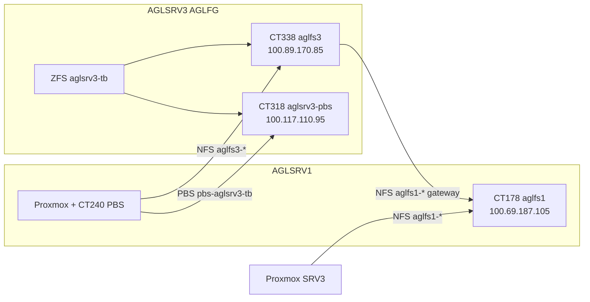

# AGLSRV3 — PBS (aglsrv3-tb) e partilhas cross-site (Tailscale)

> **Sites:** AGLFG (AGLSRV3) ↔ datacenter (AGLSRV1) — redes distintas, ligação via **Tailscale**.

## Arquitectura



| Serviço | CT | Tailscale | Função |
|---------|-----|-----------|--------|
| **aglfs3** | 338 | `100.89.170.85` | Samba/NFS local (`aglsrv3-tb`) + gateway opcional para aglfs1 |
| **aglsrv3-pbs** | 318 | `100.117.110.95` | Backups vzdump → datastore **`aglsrv3-tb`** |
| **aglfs1** | 178 (SRV1) | `100.69.187.105` | Fileserver principal SRV1 (overpower/spark) |

---

## Setup automático (recomendado)

```bash
cd /mnt/overpower/apps/dev/agl/agl-hostman

# Ver plano
bash scripts/proxmox/aglsrv3-cross-site-setup.sh --dry-run

# Aplicar tudo
bash scripts/proxmox/aglsrv3-cross-site-setup.sh --apply
```

Fases:
1. `pbs-setup-renumbered-hosts.sh` — liga storages → PBS, job `backup-aglsrv3-pbs-daily`
2. `aglsrv3-pbs-consolidate.sh` — primary `pbs-aglsrv3-tb`, desactiva `pbs-local*` vazios
3. `pct-aglfs3-optimize-exports.sh` — exports `/mnt/*` + Tailscale
4. `aglsrv3-aglfs1-client-link.sh --gateway-ct338` — monta aglfs1 no host + re-export Samba no CT338
5. `aglsrv3-remote-storage-link.sh` — AGLSRV1 consome aglfs3 + PBS remoto

---

## PBS — storage `aglsrv3-tb`

| Camada | Path / ID |
|--------|-----------|
| ZFS pool | `aglsrv3-tb` (raidz1 5×1TB) |
| Dataset backups | `aglsrv3-tb/backups` → CT318 `/mnt/backups` (legado) |
| Dataset PBS primary | `aglsrv3-tb/pbs-aglsrv3-tb` → `/mnt/pbs-aglsrv3-tb` |
| pvesm | **`pbs-aglsrv3-tb`** |
| Datastore PBS | **`aglsrv3-tb`** |
| Job | `backup-aglsrv3-pbs-daily` @ 04:15 |

Backups manuais seguros:

```bash
bash scripts/backup/aglsrv3-vzdump-sequential.sh --remote --apply
```

Host root (pxar):

```bash
bash scripts/proxmox/aglsrv3-host-backup-install.sh --remote --apply
/usr/local/sbin/aglsrv3-host-root-backup.sh
```

---

## Samba / NFS — aglfs3 (local AGLFG)

| Share Samba | Path CT338 | Export NFS |
|-------------|------------|------------|
| `shares` | `/mnt/shares` | `/mnt/shares` |
| `overpower` | `/mnt/overpower` | `/mnt/overpower` |
| `power` | `/mnt/power` | `/mnt/power` |
| `storage` | `/mnt/storage` | `/mnt/storage` |

**Windows (Tailscale):** `\\100.89.170.85\overpower`  
**Linux mount:**

```bash
mount -t nfs -o vers=3,nolock 100.89.170.85:/mnt/overpower /mnt/aglfs3-overpower
```

**AGLSRV1** (já configurado se `aglsrv3-remote-storage-link.sh --apply`):

| pvesm | Export |
|-------|--------|
| `aglfs3-shares` | `/mnt/shares` |
| `aglfs3-overpower` | `/mnt/overpower` |
| `aglfs3-power` | `/mnt/power` |
| `aglfs3-storage` | `/mnt/storage` |

---

## aglfs1 remoto (SRV1 → SRV3)

Montagem no **host AGLSRV3** (Proxmox):

| pvesm | Origem aglfs1 |
|-------|---------------|
| `aglfs1-shares` | `100.69.187.105:/mnt/shares` |
| `aglfs1-overpower` | `100.69.187.105:/mnt/overpower` |
| `aglfs1-power` | `100.69.187.105:/mnt/power` |
| `aglfs1-storage` | `100.69.187.105:/mnt/storage` |

Com **`--gateway-ct338`**, o CT338 também monta aglfs1 e expõe Samba:

- `\\100.89.170.85\aglfs1-overpower` → dados do site SRV1 no site AGLFG

**Envio de ficheiros / backups entre sites:**

```bash
# SRV3 → copiar para aglfs1 (site SRV1)
rsync -avP /caminho/local/ /mnt/pve/aglfs1-overpower/backups/aglsrv3/

# SRV1 → puxar de aglfs3
rsync -avP /mnt/pve/aglfs3-overpower/destino/ user@100.89.170.85:/mnt/overpower/destino/
```

Para backups Proxmox **SRV1 → PBS SRV3**, usar storage `pbs-aglsrv3-tb` no AGLSRV1 (remoto).

---

## Verificação

```bash
# AGLSRV3
ssh root@100.123.5.81 'pvesm status | grep -E "pbs|aglfs1"; pct exec 318 -- proxmox-backup-manager datastore list; pct exec 338 -- exportfs -v | grep /mnt/'

# AGLSRV1
ssh root@100.107.113.33 'pvesm status | grep -E "aglfs3|pbs-aglsrv3"; showmount -e 100.89.170.85'
```

---

## Referências

- [`AGLSRV3-AGLFS3-CLONE.md`](AGLSRV3-AGLFS3-CLONE.md)
- [`AGLSRV3-DISKS.md`](AGLSRV3-DISKS.md)
- [`AGLFS1_NFS_MOUNT_CONFIGURATION.md`](AGLFS1_NFS_MOUNT_CONFIGURATION.md)
- `scripts/proxmox/aglsrv-vmid-map.env`
