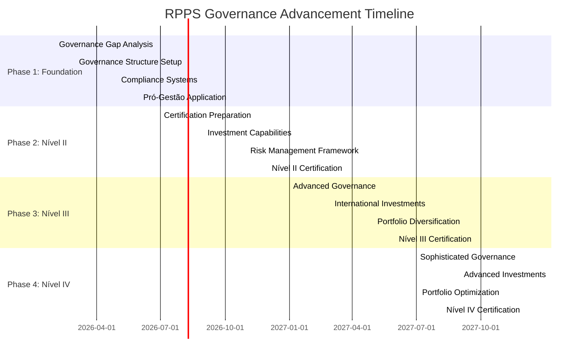

# Roadmap for RPPS Governance Advancement to Higher Levels under CMN 5.272

**Project**: CMN Legislation Analysis
**Task ID**: 2ee1e523-ab8b-4a78-a910-4eba882d59c2
**Document Version**: 1.0
**Date**: February 8, 2026

---

## Executive Summary

This roadmap provides a comprehensive 24-month implementation plan for RPPS institutions to advance governance levels from their current status to higher tiers (Nível II-IV) under CMN Resolution 5.272. The progressive governance structure enables access to enhanced investment opportunities, with each level offering increased investment flexibility, diversification capabilities, and potential returns. The roadmap focuses on Pró-Gestão certification requirements, implementation steps, resource allocation, risk mitigation, and success metrics to guide institutions through this transformative transition.

---

## 1. Regulatory Framework Overview

### 1.1 CMN 5.272 Key Provisions

- **Effective Date**: February 2, 2026
- **Transition Period**: 24 months for implementation
- **Four-Tier Governance System**: Nível I, II, III, IV (with progressive benefits)
- **Investment Philosophy**: Governance-based progressive access to investments

### 1.2 Governance-Investment Relationship

| Governance Level | Investment Access | Key Benefits |
|------------------|------------------|--------------|
| **Nível I** | Basic investments only | Treasury bonds, basic fixed income |
| **Nível II** | Enhanced fixed income, some variable income | ETFs, credit products, 40% variable income |
| **Nível III** | Diversified portfolio with international access | 50% variable income, international funds, real estate |
| **Nível IV** | Maximum investment flexibility | 60% variable income, structured products, private equity |

---

## 2. Pró-Gestão Certification Requirements

### 2.1 Certification Levels and Requirements

#### **Nível II Certification Requirements**
- **Governance Structure**:
  - Independent Council members with financial expertise
  - Internal control committee with 3 trained members (1 from control area)
  - Regular board meetings (minimum quarterly)

- **Compliance Requirements**:
  - Internal audit function
  - Risk management policies
  - Documentation systems
  - Employee training programs

- **Investment Permissions**:
  - Fixed income ETFs (80% limit)
  - Credit products from financial institutions (20%)
  - Basic variable income investments (40%)

#### **Nível III Certification Requirements**
- **Enhanced Governance**:
  - Specialized investment committee
  - Independent risk manager
  - External audit requirements
  - Sophisticated risk management framework

- **Operational Requirements**:
  - Advanced portfolio management systems
  - Stress testing capabilities
  - Regular compliance reporting
  - Stakeholder communication protocols

- **Investment Permissions**:
  - International investments (10%)
  - Real estate funds (20%)
  - Structured products (15%)
  - 50% variable income limit

#### **Nível IV Certification Requirements**
- **Sophisticated Governance**:
  - Dedicated investment governance committee
  - Chief Investment Officer (CIO) role
  - Advanced risk management framework
  - Comprehensive internal control structure

- **Specialized Requirements**:
  - International investment management capabilities
  - Structured products expertise
  - Advanced analytics and reporting
  - Regular regulatory reporting

- **Investment Permissions**:
  - All Nível III benefits
  - Additional 10% variable income (total 60%)
  - Private equity and venture capital (10%)
  - Comprehensive international framework

### 2.2 Certification Process Timeline

| Phase | Duration | Key Activities |
|-------|----------|---------------|
| **Self-Assessment** | 1-2 months | Gap analysis, documentation review |
| **Preparation** | 2-3 months | Implementation, training, systems upgrade |
| **Application** | 1 month | Documentation submission, verification |
| **Assessment** | 1-2 months | On-site audit, evaluation |
| **Certification** | 1 month | Decision, feedback, improvement |

---

## 3. Implementation Roadmap by Governance Level

### 3.1 Phase 1: Foundation Building (Months 1-6)

#### **Objectives**
- Complete governance gap analysis
- Establish basic governance structure
- Implement compliance systems
- Begin Pró-Gestão certification process

#### **Key Activities**
1. **Governance Assessment (Month 1)**
   - Current governance level evaluation
   - Gap analysis against Nível II requirements
   - Risk profile assessment

2. **Governance Structure Establishment (Months 2-3)**
   - Board member recruitment/financial training
   - Internal control committee formation
   - Policy framework development

3. **Systems Implementation (Months 4-6)**
   - Compliance management system
   - Internal audit procedures
   - Training programs for staff

#### **Success Metrics**
- Governance gap analysis completed
- Basic governance structure operational
- Compliance systems implemented
- Pró-Gestão application submitted

#### **Resource Requirements**
- **Human Resources**: 1 governance consultant, 2 compliance officers, 1 internal auditor
- **Technology**: Compliance management software, document management system
- **Budget**: R$ 500,000 - R$ 1,000,000

### 3.2 Phase 2: Nível II Advancement (Months 7-12)

#### **Objectives**
- Achieve Nível II Pró-Gestão certification
- Upgrade investment capabilities
- Implement enhanced risk management
- Prepare for Nível III advancement

#### **Key Activities**
1. **Certification Process (Months 7-9)**
   - Documentation preparation
   - Implementation of requirements
   - Assessment preparation

2. **Investment Capability Enhancement (Months 8-10)**
   - Portfolio management system upgrade
   - Investment team training
   - Enhanced due diligence processes

3. **Risk Management Implementation (Months 9-11)**
   - Risk management framework
   - Stress testing capabilities
   - Regular monitoring systems

4. **Certification Achievement (Month 12)**
   - Final assessment
   - Certification achievement
   - Planning for next phase

#### **Success Metrics**
- Nível II certification achieved
- Enhanced investment capabilities operational
- Risk management framework implemented
- Team training completed

#### **Resource Requirements**
- **Human Resources**: 2 investment specialists, 1 risk manager, 1 compliance officer
- **Technology**: Portfolio management system, risk analytics software
- **Training**: Investment analysis, risk management, compliance
- **Budget**: R$ 1,500,000 - R$ 3,000,000

### 3.3 Phase 3: Nível III Advancement (Months 13-18)

#### **Objectives**
- Achieve Nível III Pró-Gestão certification
- Implement international investment capabilities
- Diversify portfolio with real estate and structured products
- Establish advanced risk management framework

#### **Key Activities**
1. **Advanced Governance Structure (Months 13-14)**
   - Investment committee establishment
   - Independent risk manager hiring
   - External audit relationship setup

2. **International Investment Capability (Months 15-16)**
   - International investment policies
   - Currency risk management systems
   - Cross-border compliance frameworks

3. **Portfolio Diversification (Months 16-17)**
   - Real estate investment framework
   - Structured products capability
   - Enhanced portfolio analytics

4. **Nível III Certification (Month 18)**
   - Documentation preparation
   - Process implementation
   - Assessment and certification

#### **Success Metrics**
- Nível III certification achieved
- International investment capabilities operational
- Portfolio diversified across asset classes
- Advanced risk management framework implemented

#### **Resource Requirements**
- **Human Resources**: CIO, international investment specialist, real estate expert
- **Technology**: International investment platform, real estate analytics
- **Training**: International investments, structured products
- **Budget**: R$ 2,000,000 - R$ 4,000,000

### 3.4 Phase 4: Nível IV Advancement (Months 19-24)

#### **Objectives**
- Achieve Nível IV Pró-Gestão certification
- Implement maximum investment flexibility
- Establish sophisticated investment governance
- Optimize portfolio for enhanced returns

#### **Key Activities**
1. **Sophisticated Governance (Months 19-20)**
   - Dedicated investment governance committee
   - Advanced risk management framework
   - Comprehensive internal controls

2. **Advanced Investment Capabilities (Months 21-22)**
   - Private equity and venture capital framework
   - Structured products expertise
   - Advanced analytics and reporting

3. **Portfolio Optimization (Months 22-23)**
   - Strategic asset allocation
   - Performance optimization
   - Continuous improvement systems

4. **Nível IV Certification (Month 24)**
   - Final documentation
   - Assessment process
   - Certification achievement

#### **Success Metrics**
- Nível IV certification achieved
- Maximum investment flexibility operational
- Enhanced portfolio performance
- Sophisticated governance framework established

#### **Resource Requirements**
- **Human Resources**: Investment strategist, private equity specialist, structured products expert
- **Technology**: Advanced analytics platform, portfolio optimization tools
- **Training**: Advanced investment strategies, portfolio optimization
- **Budget**: R$ 3,000,000 - R$ 5,000,000

---

## 4. Resource Requirements and Budget Estimates

### 4.1 Human Resources Requirements

| Role | Phase 1 | Phase 2 | Phase 3 | Phase 4 | Total FTE |
|------|---------|---------|---------|---------|-----------|
| **Governance Consultant** | 1 | 0 | 0 | 0 | 1 |
| **Compliance Officer** | 1 | 1 | 1 | 1 | 4 |
| **Internal Auditor** | 1 | 0 | 0 | 0 | 1 |
| **Investment Specialist** | 0 | 2 | 1 | 1 | 4 |
| **Risk Manager** | 0 | 1 | 1 | 1 | 3 |
| **CIO** | 0 | 0 | 1 | 1 | 2 |
| **International Investment Specialist** | 0 | 0 | 1 | 1 | 2 |
| **Real Estate Expert** | 0 | 0 | 1 | 1 | 2 |
| **Private Equity Specialist** | 0 | 0 | 0 | 1 | 1 |
| **Technology/Systems** | 1 | 1 | 1 | 1 | 4 |
| **Training & Development** | 0.5 | 1 | 1 | 1 | 3.5 |

### 4.2 Technology Requirements

| Category | Phase 1 | Phase 2 | Phase 3 | Phase 4 | Total Cost |
|----------|---------|---------|---------|---------|------------|
| **Compliance Management** | R$ 200,000 | R$ 100,000 | R$ 50,000 | R$ 50,000 | R$ 400,000 |
| **Portfolio Management** | R$ 100,000 | R$ 300,000 | R$ 500,000 | R$ 700,000 | R$ 1,600,000 |
| **Risk Analytics** | R$ 50,000 | R$ 200,000 | R$ 400,000 | R$ 600,000 | R$ 1,250,000 |
| **International Investments** | R$ 0 | R$ 150,000 | R$ 300,000 | R$ 400,000 | R$ 850,000 |
| **Real Estate Analytics** | R$ 0 | R$ 0 | R$ 200,000 | R$ 300,000 | R$ 500,000 |
| **Advanced Analytics** | R$ 0 | R$ 0 | R$ 0 | R$ 400,000 | R$ 400,000 |
| **Total Technology** | R$ 350,000 | R$ 750,000 | R$ 1,450,000 | R$ 2,250,000 | R$ 4,800,000 |

### 4.3 Training Requirements

| Category | Phase 1 | Phase 2 | Phase 3 | Phase 4 | Total Cost |
|----------|---------|---------|---------|---------|------------|
| **Governance Training** | R$ 100,000 | R$ 50,000 | R$ 50,000 | R$ 50,000 | R$ 250,000 |
| **Compliance Training** | R$ 150,000 | R$ 100,000 | R$ 50,000 | R$ 50,000 | R$ 350,000 |
| **Investment Training** | R$ 0 | R$ 200,000 | R$ 300,000 | R$ 400,000 | R$ 900,000 |
| **Risk Management Training** | R$ 0 | R$ 150,000 | R$ 200,000 | R$ 250,000 | R$ 600,000 |
| **International Training** | R$ 0 | R$ 0 | R$ 200,000 | R$ 250,000 | R$ 450,000 |
| **Advanced Training** | R$ 0 | R$ 0 | R$ 0 | R$ 300,000 | R$ 300,000 |
| **Total Training** | R$ 250,000 | R$ 500,000 | R$ 800,000 | R$ 1,300,000 | R$ 2,850,000 |

### 4.4 Total Budget Estimates

| Category | Year 1 (Months 1-12) | Year 2 (Months 13-24) | Total |
|----------|---------------------|----------------------|-------|
| **Human Resources** | R$ 2,500,000 | R$ 4,500,000 | R$ 7,000,000 |
| **Technology** | R$ 1,100,000 | R$ 3,700,000 | R$ 4,800,000 |
| **Training** | R$ 750,000 | R$ 2,100,000 | R$ 2,850,000 |
| **Consulting** | R$ 500,000 | R$ 500,000 | R$ 1,000,000 |
| **Contingency (10%)** | R$ 435,000 | R$ 630,000 | R$ 1,065,000 |
| **Total** | **R$ 5,285,000** | **R$ 11,430,000** | **R$ 16,715,000** |

---

## 5. Risk Assessment and Mitigation Strategies

### 5.1 Risk Matrix

| Risk Level | Risk Description | Impact | Probability | Mitigation Strategy |
|-----------|------------------|--------|-------------|---------------------|
| **High** | Certification delay | High | Medium | Early engagement with certifying bodies |
| **High** | Implementation resource constraints | High | High | Phased resource allocation, contingency planning |
| **Medium** | Technology integration challenges | Medium | Medium | Pilot testing, phased implementation |
| **Medium** | Stakeholder resistance | Medium | Medium | Change management program, clear communication |
| **Low** | Regulatory changes | Low | Low | Continuous monitoring, adaptive planning |

### 5.2 Key Risk Mitigation Strategies

#### **1. Certification Delay Risk**
- **Strategy**: Early engagement with certifying bodies
- **Actions**:
  - Pre-assessment workshops
  - Regular progress reviews
  - Buffer time in project timeline
- **Owner**: Governance Committee

#### **2. Resource Constraints Risk**
- **Strategy**: Phased resource allocation and contingency planning
- **Actions**:
  - Resource forecasting
  - Flexible staffing plans
  - Budget reserve allocation
- **Owner**: Financial Controller

#### **3. Technology Integration Risk**
- **Strategy**: Pilot testing and phased implementation
- **Actions**:
  - System testing periods
  - User training programs
  - Technical support teams
- **Owner**: Technology Manager

#### **4. Stakeholder Resistance Risk**
- **Strategy**: Change management and clear communication
- **Actions**:
  - Stakeholder mapping
  - Communication plan
  - Success celebration activities
- **Owner**: Change Management Officer

---

## 6. Success Metrics and KPIs

### 6.1 Governance Level Progression

| Metric | Nível II Target | Nível III Target | Nível IV Target | Measurement Method |
|--------|----------------|------------------|----------------|-------------------|
| **Certification Status** | Achieved by Month 12 | Achieved by Month 18 | Achieved by Month 24 | Certification documents |
| **Governance Maturity Score** | 80% | 90% | 95% | Assessment framework |
| **Policy Implementation** | 100% | 100% | 100% | Policy audit results |
| **Training Completion** | 100% | 100% | 100% | Training records |

### 6.2 Investment Performance Metrics

| Metric | Nível II | Nível III | Nível IV | Target |
|--------|----------|----------|----------|--------|
| **Portfolio Diversification** | 3 asset classes | 5 asset classes | 7+ asset classes | Increasing diversification |
| **Return on Investment** | CDI + 2% | CDI + 3% | CDI + 4% | Excess return targets |
| **Risk-Adjusted Returns** | Sharpe > 0.8 | Sharpe > 1.0 | Sharpe > 1.2 | Risk-adjusted performance |
| **Compliance Score** | 95% | 97% | 99% | Compliance audits |

### 6.3 Operational Excellence Metrics

| Metric | Target | Frequency | Responsibility |
|--------|--------|-----------|----------------|
| **Process Efficiency** | 90% completion rate | Monthly | Operations Manager |
| **Risk Management Effectiveness** | 100% identified risks mitigated | Quarterly | Risk Manager |
| **Stakeholder Satisfaction** | 85% satisfaction score | Semi-annually | Communications Officer |
| **Regulatory Compliance** | 100% compliance | Monthly | Compliance Officer |

---

## 7. Timeline and Milestones

### 7.1 24-Month Implementation Timeline

### 7.2 Quarterly Review Points

| Quarter | Review Focus | Decision Points |
|---------|--------------|-----------------|
| **Q1 2026** | Foundation establishment | Governance structure validation |
| **Q2 2026** | Nível II preparation | Certification readiness assessment |
| **Q3 2026** | Nível II implementation | Mid-course corrections |
| **Q4 2026** | Nível II achievement | Planning for Nível III |
| **Q1 2027** | Nível III preparation | Resource allocation review |
| **Q2 2027** | Nível III implementation | Progress evaluation |
| **Q3 2027** | Nível III achievement | Nível IV planning |
| **Q4 2027** | Nível IV implementation | Final preparations |
| **Q1 2028** | Nível IV achievement | Roadmap completion |

---

## 8. Implementation Checklist

### 8.1 Governance Level Advancement Checklist

#### **Nível II Advancement Checklist**
- [ ] Governance gap analysis completed
- [ ] Board financial expertise assessment
- [ ] Internal control committee established
- [ ] Compliance management system implemented
- [ ] Basic risk policies developed
- [ ] Staff training programs completed
- [ ] Pró-Gestão application submitted
- [ ] Documentation system ready
- [ ] Internal audit function operational
- [ ] Certification process initiated

#### **Nível III Advancement Checklist**
- [ ] Investment committee established
- [ ] Independent risk manager hired
- [ ] External audit relationship established
- [ ] International investment policies developed
- [ ] Real estate investment framework ready
- [ ] Advanced portfolio management system implemented
- [ ] Stress testing capabilities operational
- [ ] Enhanced reporting system in place
- [ ] Nível III documentation prepared
- [ ] Certification process completed

#### **Nível IV Advancement Checklist**
- [ ] Dedicated investment governance committee established
- [ ] CIO position filled
- [ ] Advanced risk management framework implemented
- [ ] Private equity framework developed
- [ ] Structured products expertise acquired
- [ ] International investment platform operational
- [ ] Advanced analytics system implemented
- [ ] Portfolio optimization tools in place
- [ ] Comprehensive internal controls established
- [ ] Nível IV certification achieved

---

## 9. Conclusion and Next Steps

### 9.1 Key Success Factors

1. **Leadership Commitment**: Strong board and executive support
2. **Resource Allocation**: Adequate funding and staffing
3. **Change Management**: Effective stakeholder engagement
4. **Technology Enablement**: Right systems and tools
5. **Continuous Improvement**: Regular reviews and adaptations

### 9.2 Implementation Success Indicators

- **Timeline Adherence**: 100% milestone achievement
- **Budget Compliance**: ±10% variance tolerance
- **Quality Standards**: 95%+ implementation quality
- **Stakeholder Satisfaction**: 85%+ approval rating
- **Regulatory Compliance**: 100% compliance achievement

### 9.3 Recommended Next Steps

1. **Immediate Actions** (Next 30 days):
   - Establish governance advancement steering committee
   - Conduct detailed gap analysis
   - Develop implementation budget
   - Engage certifying bodies for initial guidance

2. **Short-term Actions** (Next 3 months):
   - Complete governance assessment
   - Begin Phase 1 implementation
   - Hire key personnel
   - Set up monitoring systems

3. **Medium-term Actions** (Next 6 months):
   - Progress through Phase 1
   - Begin Phase 2 preparations
   - Develop investment enhancement plan
   - Implement training programs

This roadmap provides a comprehensive framework for RPPS institutions to systematically advance their governance levels and unlock enhanced investment opportunities under CMN 5.272. The structured approach ensures compliance, maximizes benefits, and minimizes risks throughout the 24-month transition period.