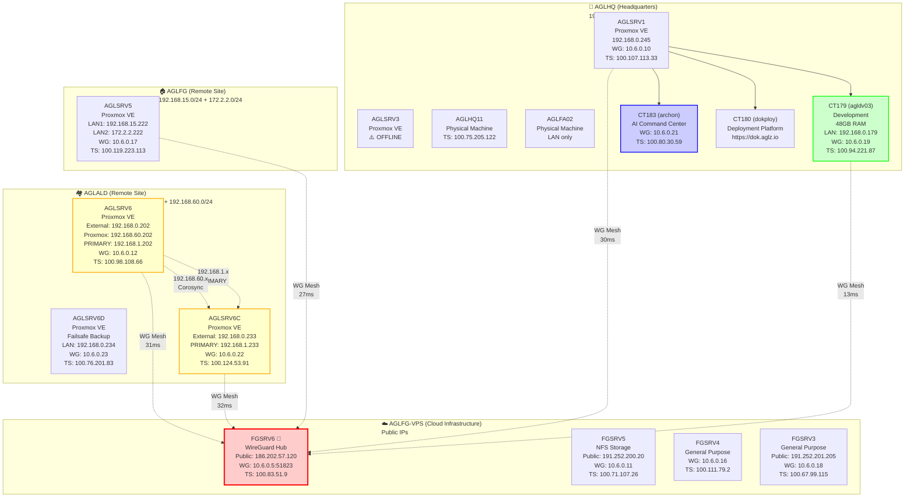
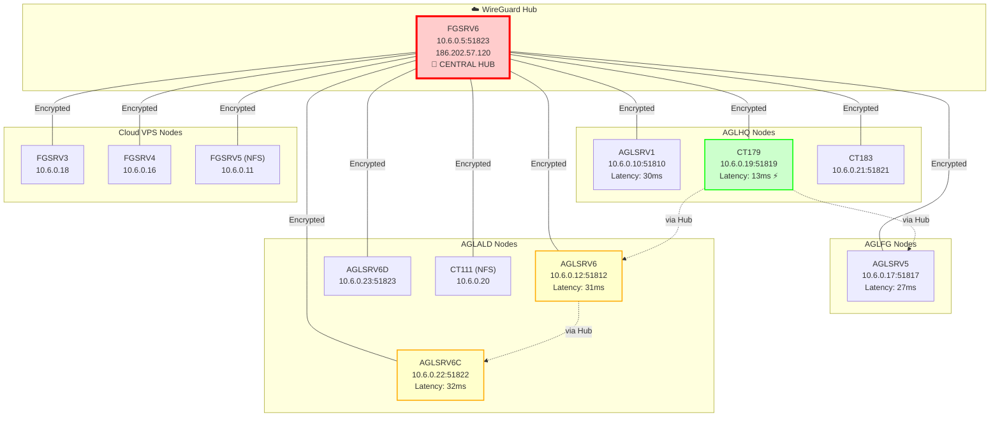
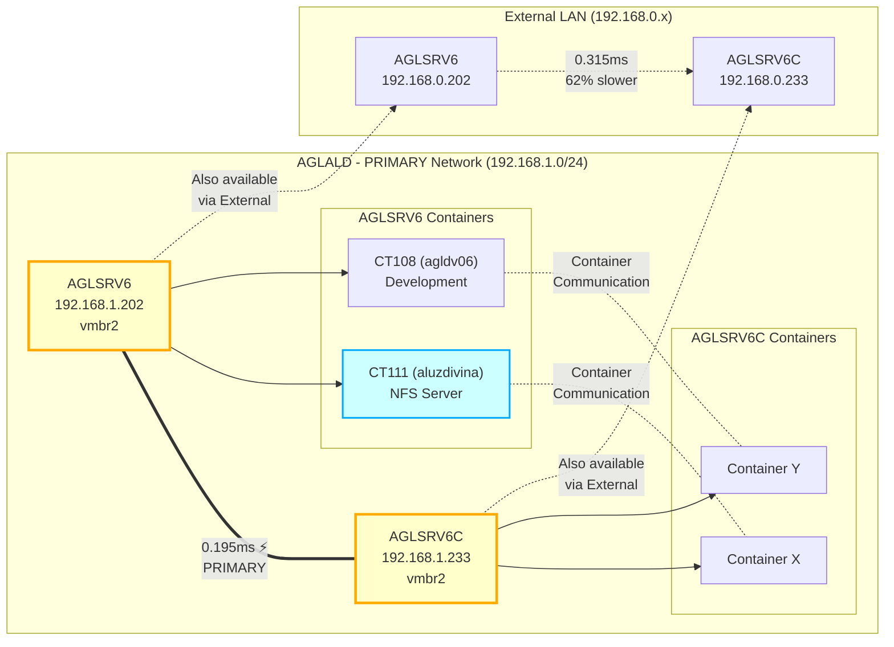
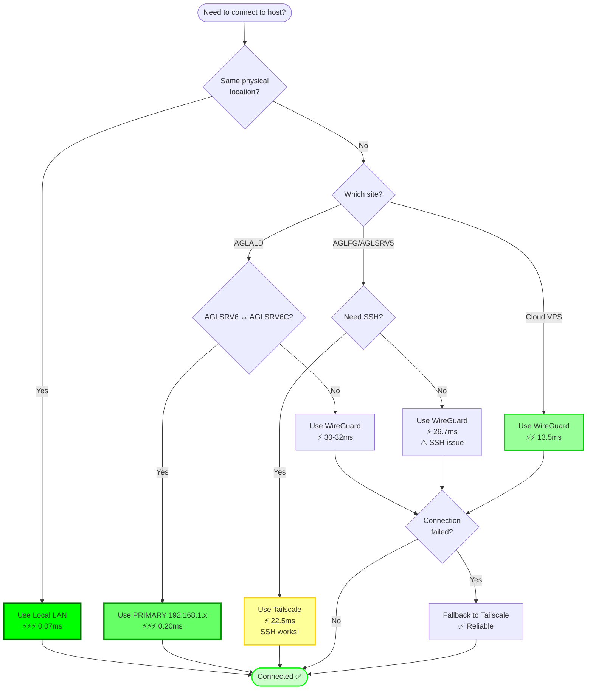
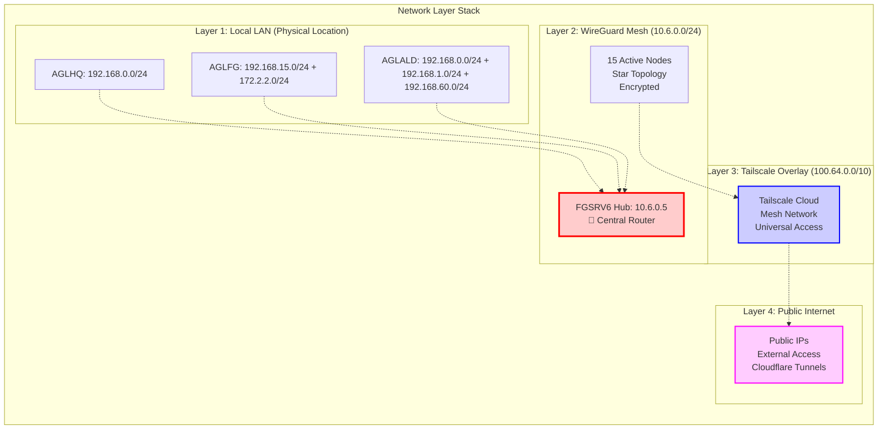
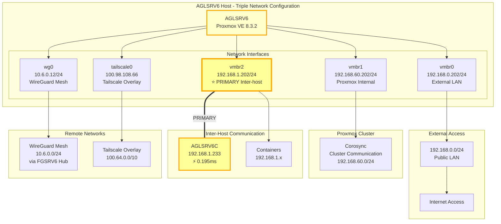

# Infrastructure Topology Diagrams

> **Last Updated**: 2025-11-08 | **Version**: 1.0.0
> **Format**: Mermaid diagrams (render in GitHub, VSCode, or Mermaid Live Editor)

---

## 📍 Physical Location Topology

---

## 🔗 WireGuard Mesh Topology

---

## 🎯 PRIMARY Network (192.168.1.x) - AGLALD Inter-Host Communication

---

## 📊 Network Performance Hierarchy

```mermaid
graph TD
    subgraph Performance["Network Performance (Latency)"]
        LAN["Local LAN<br/>0.07ms<br/>⚡⚡⚡ 400x faster"]
        PRIMARY["PRIMARY Inter-host<br/>192.168.1.x<br/>0.20ms<br/>⚡⚡⚡ Best local"]
        EXT_LAN["External LAN<br/>192.168.0.x<br/>0.32ms<br/>⚡⚡ Local alt"]
        WG_CLOUD["WireGuard Cloud<br/>FGSRV6 Hub<br/>13.5ms<br/>⚡⚡ Excellent"]
        TS_AGLFG["Tailscale AGLFG<br/>22.5ms<br/>⚡ Best for AGLSRV5"]
        WG_AGLFG["WireGuard AGLFG<br/>26.7ms<br/>⚡ Alternative"]
        WG_AGLALD["WireGuard AGLALD<br/>30-32ms<br/>⚡ Best for remote"]
        TS_AGLALD["Tailscale AGLALD<br/>37ms<br/>✅ Reliable fallback"]
    end

    LAN --> PRIMARY
    PRIMARY --> EXT_LAN
    EXT_LAN --> WG_CLOUD
    WG_CLOUD --> TS_AGLFG
    TS_AGLFG --> WG_AGLFG
    WG_AGLFG --> WG_AGLALD
    WG_AGLALD --> TS_AGLALD

    style LAN fill:#00ff00,stroke:#006600,stroke-width:3px
    style PRIMARY fill:#66ff66,stroke:#009900,stroke-width:3px
    style WG_CLOUD fill:#99ff99,stroke:#00cc00,stroke-width:2px
    style TS_AGLALD fill:#ffcccc,stroke:#ff6666,stroke-width:2px
```

---

## 🔄 Connection Decision Flow

---

## 🗺️ Complete Network Stack View

---

## 📍 AGLSRV6 Network Architecture (Triple Network)

---

## 🎨 Diagram Legend

### Node Types
- 🏢 **AGLHQ**: Headquarters (primary production)
- 🏠 **AGLFG**: Remote standalone site
- 🏘️ **AGLALD**: Remote site with backup/failover
- ☁️ **AGLFG-VPS**: Cloud infrastructure
- 🌟 **Hub**: Critical infrastructure component

### Connection Types
- `───` Solid line: Direct connection
- `===` Double line: PRIMARY/fastest connection
- `-.->` Dashed line: Routed/indirect connection
- `~~~` Wavy line: Logical relationship

### Performance Indicators
- ⚡⚡⚡ Excellent (<1ms)
- ⚡⚡ Very Good (1-20ms)
- ⚡ Good (20-40ms)
- ✅ Acceptable (40ms+)
- ⚠️ Warning/Issue

### Network Colors
- 🟢 Green: Best performance
- 🟡 Yellow: PRIMARY networks
- 🔴 Red: Critical infrastructure
- 🔵 Blue: Overlay networks
- 🟣 Purple: Public/external

---

## 📚 Related Documentation

- **Network Topology**: `TOPOLOGY.md` - Physical locations and network architecture
- **Host Configuration**: `HOSTS.md` - Detailed host network configurations
- **Connection Matrix**: `CONNECTIONS.md` - Connection methods and priorities
- **Network Tests**: `NETWORK-TESTS.md` - Validation and performance benchmarks
- **WireGuard Mesh**: `WIREGUARD.md` - Complete mesh configuration

---

## 🔧 Rendering These Diagrams

### In GitHub
All Mermaid diagrams render automatically in GitHub markdown files.

### In VSCode
1. Install "Markdown Preview Mermaid Support" extension
2. Open this file and use Markdown Preview (Ctrl+Shift+V)

### In Mermaid Live Editor
1. Visit https://mermaid.live
2. Copy any diagram code block
3. Paste to edit and export

### In Documentation Sites
Most modern documentation generators (MkDocs, Docusaurus, etc.) support Mermaid natively.

---

**Document Version**: 1.0.0
**Last Updated**: 2025-11-08
**Maintainer**: Claude Code (agl-hostman project)

**Diagram Count**: 8 diagrams covering complete infrastructure topology
