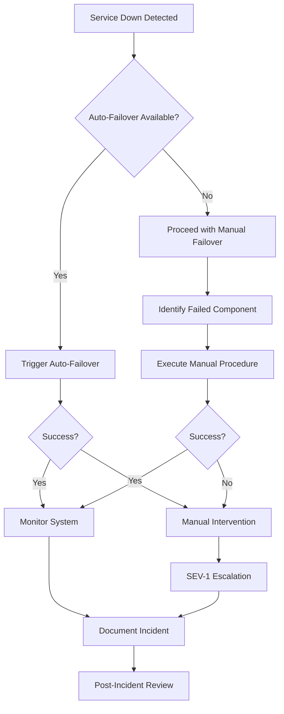
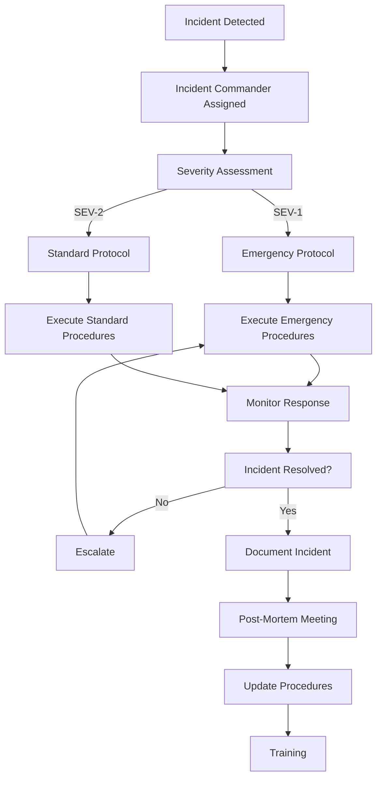

# AGL Hostman - Detailed Failover Procedures

**Document Version**: 2.0
**Last Updated**: 2026-02-11
**Classification**: Internal - Operations Team
**Maintainer**: DevOps Team

---

## 📋 Table of Contents

1. [Emergency Contacts](#emergency-contacts)
2. [Failover Overview](#failover-overview)
3. [Component-Specific Failover Procedures](#component-specific-failover-procedures)
4. [Automated Failover Systems](#automated-failover-systems)
5. [Manual Failover Procedures](#manual-failover-procedures)
6. [Verification & Rollback](#verification--rollback)
7. [Incident Response](#incident-response)
8. [Post-Failover Actions](#post-failover-actions)
9. [Training & Testing](#training--testing)
10. [Emergency Procedures](#emergency-procedures)

---

## 🆘 Emergency Contacts

### Primary Contacts

| Role | Name | Contact | Escalation |
|------|------|---------|------------|
| **DevOps Lead** | [Name] | devops@agl.local | Primary |
| **DBA Lead** | [Name] | dba@agl.local | Database Issues |
| **System Architect** | [Name] | arch@agl.local | Architecture |
| **Security Officer** | [Name] | security@agl.local | Security Issues |

### On-Call Rotation

| Day | Primary | Backup |
|-----|---------|--------|
| Monday | DevOps-01 | DevOps-02 |
| Tuesday | DevOps-02 | DevOps-03 |
| Wednesday | DevOps-03 | DevOps-01 |
| Thursday | DevOps-01 | DevOps-02 |
| Friday | DevOps-02 | DevOps-03 |
| Weekend | DevOps-03 | DevOps-01 |

### Vendor Contacts

| Vendor | Service | Contact | SLA |
|--------|---------|---------|-----|
| **Proxmox Support** | Emergency support | support@proxmox.com | 4-hour response |
| **Cloud Provider** | Infrastructure | cloud-support@provider.com | 1-hour response |
| **Hardware Vendor** | Hardware support | 1-800-123-4567 | 8-hour response |

---

## 🔧 Failover Overview

### Severity Levels

| Severity | Description | Response Time |
|----------|-------------|---------------|
| **SEV-1** | Complete service outage | 15 minutes |
| **SEV-2** | Major functionality broken | 1 hour |
| **SEV-3** | Partial degradation | 4 hours |
| **SEV-4** | Minor issues | 1 business day |

### Failover Decision Tree

```
┌─────────────────────────────────────────────────────────────┐
│                    FAILOVER DECISION TREE                    │
├─────────────────────────────────────────────────────────────┤
│                                                             │
│  SERVICE DOWN?                                              │
│  └── YES ────────────┐                                       │
│     │                │                                       │
│     ▼                ▼                                       │
│  COMPONENT FAILED?  AUTO FAILOVER AVAILABLE?                  │
│     │                │                                       │
│     ├── YES ────────► AUTO FAILOVER                          │
│     │                                                             │
│     └── NO ────────► MANUAL FAILOVER PROCEDURE                │
│                                                             │
│  FAILOVER SUCCESSFUL?                                       │
│     ├── YES ────────► MONITOR & DOCUMENT                     │
│     │                                                             │
│     └── NO ────────► ESCALATE TO SEV-1                        │
│                                                             │
└─────────────────────────────────────────────────────────────┘
```

### RTO/RPO Matrix

| Component | RTO | RPO | Criticality |
|-----------|-----|-----|--------------|
| **Load Balancer** | 1 min | 0 min | Critical |
| **Database Master** | 10 min | < 1 min | Critical |
| **Application Servers** | 2 min | 0 min | Important |
| **Cache Layer** | 1 min | 0 min | Important |
| **File Storage** | 30 min | < 4 hours | Standard |

---

## 🔄 Component-Specific Failover Procedures

### 1. Load Balancer Failover

#### HAProxy Failover

**Detection Methods:**
- Health check failures (3 consecutive)
- Process monitoring
- VIP availability checks

**Automated Recovery:**
```bash
#!/bin/bash
# haproxy_failover.sh
# Auto-failover script for HAProxy

VIP="10.0.1.10"
LB1="10.0.1.11"
LB2="10.0.1.12"
CHECK_INTERVAL=5
MAX_CHECKS=3

check_haproxy() {
    local host=$1
    if curl -f http://$host:8404/stats >/dev/null 2>&1; then
        return 0
    else
        return 1
    fi
}

# Check current master
CURRENT_MASTER=$(ip addr show | grep $VIP | awk '{print $7}')
echo "Current master: $CURRENT_MASTER"

# Monitor and failover
while true; do
    if [ "$CURRENT_MASTER" = "$LB1" ]; then
        STANDBY=$LB2
        TARGET=$LB1
    else
        STANDBY=$LB1
        TARGET=$LB2
    fi

    # Check target health
    if ! check_haproxy $TARGET; then
        echo "HAProxy $TARGET unhealthy"
        CHECK_COUNT=0

        while [ $CHECK_COUNT -lt $MAX_CHECKS ]; do
            sleep $CHECK_INTERVAL
            if ! check_haproxy $TARGET; then
                CHECK_COUNT=$((CHECK_COUNT + 1))
                echo "Check $CHECK_COUNT of $MAX_CHECKS failed"
            else
                echo "HAProxy $ recovered"
                break
            fi
        done

        # Trigger failover if all checks failed
        if [ $CHECK_COUNT -eq $MAX_CHECKS ]; then
            echo "Triggering failover from $TARGET to $STANDBY"

            # Move VIP to standby
            ssh $STANDBY "ip addr add $VIP/32 dev eth0"
            ssh $STANDBY "systemctl restart keepalived"

            # Remove VIP from target
            ssh $TARGET "ip addr del $VIP/32 dev eth0"

            # Verify failover
            sleep 10
            if check_haproxy $STANDBY; then
                echo "Failover successful - VIP moved to $STANDBY"
                CURRENT_MASTER=$STANDBY
            else
                echo "Failover failed - investigate manually"
                exit 1
            fi
        fi
    fi

    sleep $CHECK_INTERVAL
done
```

#### Keepalived VIP Failover

**Configuration:**
```bash
#!/bin/bash
# keepalived_setup.sh
# Setup Keepalived for VIP management

cat > /etc/keepalived/keepalived.conf <<EOF
vrrp_script check_haproxy {
    script "/usr/bin/curl -f http://localhost/health"
    interval 2
    timeout 2
    rise 2
    fall 3
}

vrrp_instance VI_1 {
    state BACKUP
    interface eth0
    virtual_router_id 51
    priority 100
    advert_int 1
    virtual_ipaddress {
        10.0.1.10/24 dev eth0
    }
    track_script {
        check_haproxy
    }

    # Authentication
    authentication {
        auth_type PASS
        auth_pass AGL2024
    }

    # Notify scripts
    notify_master "/usr/local/bin/keepalived_notify.sh master"
    notify_backup "/usr/local/bin/keepalived_notify.sh backup"
    notify_fault "/usr/local/bin/keepalived_notify.sh fault"
}
EOF

# Create notify script
cat > /usr/local/bin/keepalived_notify.sh <<EOF
#!/bin/bash
case \$1 in
    master)
        echo "$(date): HAProxy in MASTER state" >> /var/log/keepalived.log
        ;;
    backup)
        echo "$(date): HAProxy in BACKUP state" >> /var/log/keepalived.log
        ;;
    fault)
        echo "$(date): HAProxy in FAULT state - investigating" >> /var/log/keepalived.log
        ;;
esac
EOF

chmod +x /usr/local/bin/keepalived_notify.sh
systemctl restart keepalived
```

**Manual VIP Management:**
```bash
#!/bin/bash
# vip_management.sh

VIP="10.0.1.10"

# Check current VIP owner
check_vip_owner() {
    if ip addr show | grep -q $VIP; then
        ip addr show | grep $VIP | awk '{print $7}'
    else
        echo "VIP not assigned"
    fi
}

# Force failover
force_failover() {
    local target=$1
    local current=$(check_vip_owner)

    echo "Current VIP owner: $current"
    echo "Target: $target"

    if [ "$current" = "$target" ]; then
        echo "VIP already on $target"
        return 0
    fi

    # Remove VIP from current owner
    if [ -n "$current" ]; then
        ssh $current "ip addr del $VIP/32 dev eth0"
    fi

    # Add VIP to target
    ssh $target "ip addr add $VIP/32 dev eth0"

    # Verify
    sleep 5
    if check_vip_owner | grep -q $target; then
        echo "VIP successfully moved to $target"
        return 0
    else
        echo "VIP move failed"
        return 1
    fi
}
```

### 2. Database Failover

#### MySQL Master-Slave Failover

**Detection Script:**
```bash
#!/bin/bash
# mysql_health_check.sh

DB_MASTER="10.0.3.10"
DB_SLAVE="10.0.3.20"
DB_USER="monitor"
DB_PASS="password"

check_master() {
    mysql -h $DB_MASTER -u $DB_USER -p$DB_PASS -e "SELECT 1" >/dev/null 2>&1
    return $?
}

check_slave() {
    mysql -h $DB_SLAVE -u $DB_USER -p$DB_PASS -e "SELECT 1" >/dev/null 2>&1
    return $?
}

check_replication() {
    local lag=$(mysql -h $DB_SLAVE -u $DB_USER -p$DB_PASS -e \
        "SHOW SLAVE STATUS\G" | grep "Seconds_Behind_Master" | awk '{print $2}')

    if [ -z "$lag" ] || [ "$lag" -gt 300 ]; then
        return 1
    else
        return 0
    fi
}

# Health status
if check_master && check_slave && check_replication; then
    echo "MySQL replication healthy"
    exit 0
else
    echo "MySQL issue detected:"
    if ! check_master; then
        echo "  - Master unreachable"
    fi
    if ! check_slave; then
        echo "  - Slave unreachable"
    fi
    if ! check_replication; then
        echo "  - Replication lag > 5 minutes"
    fi
    exit 1
fi
```

**Automated Failover Script:**
```python
#!/usr/bin/env python3
# mysql_failover.py
import subprocess
import time
import sys

def mysql_command(cmd, host="10.0.3.10"):
    """Execute MySQL command"""
    try:
        result = subprocess.run([
            "mysql", "-h", host, "-u", "monitor", "-p'password'",
            "-e", cmd
        ], capture_output=True, text=True)
        return result.returncode == 0, result.stdout, result.stderr
    except Exception as e:
        return False, "", str(e)

def check_master_status():
    """Check if master is accessible"""
    success, _, _ = mysql_command("SELECT 1")
    return success

def get_best_slave():
    """Find the best slave to promote"""
    slaves = ["10.0.3.20", "10.0.3.21"]
    best_slave = None
    min_lag = float('inf')

    for slave in slaves:
        success, output, _ = mysql_command("SHOW SLAVE STATUS\G", slave)
        if success:
            # Parse replication lag
            for line in output.split('\n'):
                if "Seconds_Behind_Master" in line:
                    lag = int(line.split(':')[1].strip())
                    if lag < min_lag:
                        min_lag = lag
                        best_slave = slave

    return best_slave, min_lag

def promote_slave(slave_host):
    """Promote slave to master"""
    print(f"Promoting {slave_host} to master...")

    # Stop replication
    mysql_command("STOP SLAVE", slave_host)

    # Reset slave settings
    mysql_command("RESET SLAVE ALL", slave_host)

    # Enable read-write
    mysql_command("SET GLOBAL read_only = OFF", slave_host)
    mysql_command("SET GLOBAL super_read_only = OFF", slave_host)

    # Get new master status
    success, output, _ = mysql_command("SHOW MASTER STATUS", slave_host)
    if success:
        print(f"Successfully promoted {slave_host} to master")
        return True
    else:
        print(f"Failed to promote {slave_host}")
        return False

def reconfigure_slaves(new_master):
    """Reconfigure other slaves to follow new master"""
    slaves = ["10.0.3.20", "10.0.3.21"]
    slaves.remove(new_master)

    for slave in slaves:
        print(f"Reconfiguring {slave} to follow {new_master}")

        # Stop replication
        mysql_command("STOP SLAVE", slave)

        # Change master
        mysql_command(f"""
        CHANGE MASTER TO
            MASTER_HOST='{new_master}',
            MASTER_USER='repl_user',
            MASTER_PASSWORD='password',
            MASTER_AUTO_POSITION=1
        """, slave)

        # Start replication
        mysql_command("START SLAVE", slave)

def main():
    if check_master_status():
        print("Master is still accessible - no failover needed")
        sys.exit(0)

    best_slave, lag = get_best_slave()

    if not best_slave:
        print("No suitable slave found for promotion")
        sys.exit(1)

    if lag > 300:
        print(f"Replication lag too high: {lag} seconds")
        sys.exit(1)

    print(f"Best slave: {best_slave}, lag: {lag} seconds")

    if promote_slave(best_slave):
        reconfigure_slaves(best_slave)
        print("MySQL failover completed successfully")
        sys.exit(0)
    else:
        print("MySQL failover failed")
        sys.exit(1)

if __name__ == "__main__":
    main()
```

#### Manual MySQL Failover
```bash
#!/bin/bash
# mysql_manual_failover.sh

NEW_MASTER="10.0.3.21"
SLAVES=("10.0.3.20")

echo "=== Manual MySQL Failover ==="
echo "New master: $NEW_MASTER"

# Verify new master is ready
if ! mysql -h $NEW_MASTER -u root -p'password' -e "SELECT 1"; then
    echo "ERROR: Cannot connect to new master"
    exit 1
fi

# Promote slave
echo "Promoting $NEW_MASTER to master..."
mysql -h $NEW_MASTER -u root -p'password' -e "
    STOP SLAVE;
    RESET SLAVE ALL;
    SET GLOBAL read_only = OFF;
    SET GLOBAL super_read_only = OFF;
"

# Verify promotion
mysql -h $NEW_MASTER -u root -p'password' -e "SHOW MASTER STATUS\G"

# Update application configuration
echo "Updating application configuration..."
sed -i "s/10.0.3.10/$NEW_MASTER/g" /etc/app/database.conf
systemctl reload app

# Reconfigure slaves
for slave in "${SLAVES[@]}"; do
    echo "Reconfiguring slave $slave..."
    mysql -h $slave -u root -p'password' -e "
        STOP SLAVE;
        CHANGE MASTER TO
            MASTER_HOST='$NEW_MASTER',
            MASTER_USER='repl_user',
            MASTER_PASSWORD='password',
            MASTER_AUTO_POSITION=1;
        START SLAVE;
    "
done

echo "MySQL failover complete"
```

### 3. Redis Failover

#### Redis Sentinel Failover

**Sentinel Configuration:**
```redis
# /etc/redis/sentinel.conf
port 26379
bind 10.0.4.10
daemonize yes

# Monitor Redis master
sentinel monitor mymaster 10.0.4.10 6379 2
sentinel down-after-milliseconds mymaster 5000
sentinel failover-timeout mymaster 10000
sentinel parallel-syncs mymaster 1

# Authentication
sentinel auth-pass mymaster redis-password
```

**Health Check Script:**
```bash
#!/bin/bash
# redis_health.sh

REDIS_MASTER="10.0.4.10"
REDIS_SENTINEL="10.0.4.20"

check_redis() {
    local host=$1
    if redis-cli -h $host -a "redis-password" PING >/dev/null 2>&1; then
        return 0
    else
        return 1
    fi
}

check_sentinel() {
    local sentinel=$1
    if redis-cli -h $sentinel -p 26378 PING >/dev/null 2>&1; then
        return 0
    else
        return 1
    fi
}

# Get current master from Sentinel
get_current_master() {
    redis-cli -h $REDIS_SENTINEL -p 26378 -a "redis-password" \
        SENTINEL get-master-addr-by-name mymaster | head -1
}

# Check system health
if check_redis $REDIS_MASTER && check_sentinel $REDIS_SENTINEL; then
    current_master=$(get_current_master)
    echo "Redis system healthy - Master: $current_master"
    exit 0
else
    echo "Redis system unhealthy:"
    if ! check_redis $REDIS_MASTER; then
        echo "  - Master unreachable"
    fi
    if ! check_sentinel $REDIS_SENTINEL; then
        echo "  - Sentinel unreachable"
    fi
    exit 1
fi
```

#### Manual Redis Failover
```bash
#!/bin/bash
# redis_manual_failover.sh

REDIS_MASTER="10.0.4.10"
REDIS_SENTINEL="10.0.4.20"
NEW_MASTER="10.0.4.11"

echo "=== Manual Redis Failover ==="

# Verify current master
if redis-cli -h $REDIS_MASTER -a "redis-password" PING >/dev/null 2>&1; then
    echo "WARNING: Master is still accessible"
    read -p "Continue anyway? (y/N): " confirm
    if [[ $confirm != [yY] ]]; then
        exit 0
    fi
fi

# Check candidate slave
if ! redis-cli -h $NEW_MASTER -a "redis-password" PING >/dev/null 2>&1; then
    echo "ERROR: Candidate slave not accessible"
    exit 1
fi

# Promote slave
echo "Promoting $NEW_MASTER to master..."
redis-cli -h $NEW_MASTER -a "redis-password" SLAVEOF NO ONE

# Update application configuration
echo "Updating application configuration..."
sed -i "s/$REDIS_MASTER/$NEW_MASTER/g" /etc/app/redis.conf
systemctl reload app

# Notify Sentinels
echo "Notifying Sentinels..."
redis-cli -h $REDIS_SENTINEL -p 26378 -a "redis-password" SENTINEL failover mymaster

# Verify failover
sleep 10
new_master=$(redis-cli -h $REDIS_SENTINEL -p 26378 -a "redis-password" \
    SENTINEL get-master-addr-by-name mymaster | head -1)

if [ "$new_master" = "$NEW_MASTER" ]; then
    echo "Redis failover successful - New master: $new_master"
    exit 0
else
    echo "Redis failover failed"
    exit 1
fi
```

### 4. Application Failover

#### Containerized Application Failover

**Health Endpoint:**
```php
<?php
// health.php
$health = [
    'status' => 'healthy',
    'timestamp' => date('c'),
    'checks' => [
        'database' => check_database(),
        'cache' => check_cache(),
        'storage' => check_storage(),
        'dependencies' => check_dependencies()
    ]
];

function check_database() {
    try {
        $pdo = new PDO('mysql:host=mysql-master;dbname=agl_database', 'app_user', 'app_password');
        return 'ok';
    } catch (Exception $e) {
        return 'error';
    }
}

function check_cache() {
    try {
        $redis = new Redis();
        $redis->connect('redis-master', 6379);
        $redis->ping();
        return 'ok';
    } catch (Exception $e) {
        return 'error';
    }
}

function check_storage() {
    if (is_writable('/shared/uploads')) {
        return 'ok';
    } else {
        return 'error';
    }
}

function check_dependencies() {
    // Check external services
    return 'ok';
}

header('Content-Type: application/json');
echo json_encode($health);
```

**Health Monitoring:**
```bash
#!/bin/bash
# app_health_monitor.sh

APP_ENDPOINTS=(
    "http://10.0.2.10:8080/health"
    "http://10.0.2.11:8080/health"
    "http://10.0.2.12:8080/health"
)

check_endpoint() {
    local endpoint=$1
    if curl -f -s $endpoint >/dev/null 2>&1; then
        return 0
    else
        return 1
    fi
}

# Check all endpoints
failed_nodes=0
for endpoint in "${APP_ENDPOINTS[@]}"; do
    if ! check_endpoint $endpoint; then
        echo "ERROR: $endpoint failed"
        failed_nodes=$((failed_nodes + 1))

        # Restart container
        node=$(echo $endpoint | cut -d: -f1)
        echo "Restarting container on $node"
        ssh $node "docker restart app"
    fi
done

# If more than 50% failed, trigger failover
if [ $failed_nodes -gt 1 ]; then
    echo "CRITICAL: $failed_nodes nodes failed - triggering failover"
    /scripts/app_failover.sh
fi
```

**Rolling Update Procedure:**
```bash
#!/bin/bash
# app_rolling_update.sh

NAMESPACE="production"
APP_NAME="app"
BLUE_GREEN="green"

# 1. Drain node
kubectl cordon $APP_NAME-$BLUE_GREEN
kubectl drain $APP_NAME-$BLUE_GREEN --ignore-daemonsets --delete-local-data

# 2. Update image
kubectl set image deployment/$APP_NAME \
    $APP_NAME=registry.example.com/$APP_NAME:latest \
    --namespace $NAMESPACE

# 3. Wait for deployment
kubectl rollout status deployment/$APP_NAME --namespace $NAMESPACE

# 4. Verify health
kubectl exec -it deployment/$APP_NAME --namespace $NAMESPACE -- curl -f http://localhost:8080/health

# 5. Uncordon node
kubectl uncordon $APP_NAME-$BLUE_GREEN

# 6. Switch traffic (if blue-green)
if [ "$BLUE_GREEN" = "green" ]; then
    # Update load balancer
    /scripts/switch_traffic.sh green
fi
```

### 5. Storage Failover

#### ZFS Pool Failover

**Health Monitoring:**
```bash
#!/bin/bash
# zfs_health_monitor.sh

POOL="agl-storage"

# Check pool health
if ! zpool status $POOL | grep -q "state: ONLINE"; then
    echo "CRITICAL: ZFS pool $POOL is not ONLINE"
    exit 2
fi

# Check capacity
CAPACITY=$(zpool list -H -o capacity $POOL | tr -d '%')
if [ $CAPACITY -gt 90 ]; then
    echo "CRITICAL: ZFS pool at ${CAPACITY}% capacity"
    exit 2
elif [ $CAPACITY -gt 80 ]; then
    echo "WARNING: ZFS pool at ${CAPACITY}% capacity"
    exit 1
fi

# Check errors
ERRORS=$(zpool status $POOL | grep -i errors | awk '{print $NF}' | head -1)
if [ "$ERRORS" != "0" ]; then
    echo "WARNING: ZFS pool has $ERRORS errors"
    exit 1
fi

echo "OK: ZFS pool healthy - Capacity: ${CAPACITY}%"
exit 0
```

**Manual Pool Recovery:**
```bash
#!/bin/bash
# zfs_recovery.sh

POOL="agl-storage"

echo "=== ZFS Pool Recovery ==="

# Check pool status
echo "Current pool status:"
zpool status $POOL

# If offline, attempt to import
if zpool list -H -o name | grep -q "^$POOL$"; then
    echo "Pool already imported"
else
    echo "Attempting to import pool..."
    zpool import $POOL
fi

# Check for errors
if zpool status $POOL | grep -i "errors"; then
    echo "Repairing pool..."
    zpool scrub $POOL
    sleep 300  # Wait 5 minutes for scrub

    # Check again
    if zpool status $POOL | grep -i "errors"; then
        echo "ERROR: Pool still has errors - manual intervention required"
        exit 1
    fi
fi

# Verify data integrity
echo "Verifying data integrity..."
zpool scrub $POOL

echo "ZFS recovery complete"
```

---

## 🤖 Automated Failover Systems

### 1. Orchestrator Configuration

#### Database Orchestrator
```yaml
# orchestrator-config.yml
{
  "Discovery": {
    "Backend": "file",
    "ConfigurationFile": "/etc/orchestrator/discovery.json"
  },
  "MySQLTopology": {
    "MySQLConnectTimeout": 3,
    "MySQLReadTimeout": 3,
    "MySQLDefaultPort": 3306,
    "SemiSyncEnabled": true,
    "GTIDEnabled": true,
    "DetectCluster": false,
    "InstancePollInterval": 5
  },
  "Failover": {
    "Candidates": "10.0.3.20,10.0.3.21",
    "ExcludedCandidates": "",
    "SlavePriorityFactor": "slave_priority",
    "SlaveIoCapFactor": "slave_io_running",
    "SlaveSqlCapFactor": "slave_sql_running",
    "LastSeenAcceptedDelay": 30,
    "ReadOnlyOnReplicationFailure": true,
    "ReplicationLagQuery": "SELECT TIMESTAMPDIFF(SECOND, NOW(), ts) FROM replication_status"
  },
  "Alerts": {
    "FailureDetection": "true",
    "OnFailure": "webhook",
    "Webhook": "http://localhost:8080/failover"
  }
}
```

#### Failover Webhook
```python
#!/usr/bin/env python3
# webhook_handler.py
from flask import Flask, request, jsonify
import subprocess
import logging

app = Flask(__name__)
logging.basicConfig(level=logging.INFO)

@app.route('/failover', methods=['POST'])
def handle_failover():
    data = request.json
    cluster = data.get('cluster')
    failed = data.get('failed')

    logging.info(f"Failover detected for cluster {cluster}: {failed}")

    # Execute failover
    try:
        subprocess.run(['python', '/scripts/mysql_failover.py'], check=True)
        logging.info("Failover completed successfully")
        return jsonify({'status': 'success'}), 200
    except subprocess.CalledProcessError as e:
        logging.error(f"Failover failed: {e}")
        return jsonify({'status': 'failed', 'error': str(e)}), 500

if __name__ == '__main__':
    app.run(host='0.0.0.0', port=8080)
```

### 2. Kubernetes Controller

#### Custom Controller for High Availability
```yaml
# ha-controller.yaml
apiVersion: apiextensions.k8s.io/v1
kind: CustomResourceDefinition
metadata:
  name: haresources.example.com
spec:
  group: example.com
  versions:
  - name: v1
    served: true
    storage: true
    schema:
      openAPIV3Schema:
        type: object
        properties:
          spec:
            type: object
            properties:
              type:
                type: string
                enum: ["mysql", "redis", "application"]
              instances:
                type: integer
                minimum: 2
              readinessProbe:
                type: object
              livenessProbe:
                type: object
  scope: Namespaced
  names:
    plural: haresources
    singular: haresource
    kind: HAResource
    shortNames: ["ha"]

---
apiVersion: v1
kind: ServiceAccount
metadata:
  name: ha-controller
  namespace: kube-system

---
apiVersion: rbac.authorization.k8s.io/v1
kind: ClusterRole
metadata:
  name: ha-controller-role
rules:
- apiGroups: [""]
  resources: ["pods", "services", "configmaps"]
  verbs: ["get", "list", "watch", "create", "update", "patch", "delete"]
- apiGroups: ["example.com"]
  resources: ["haresources"]
  verbs: ["get", "list", "watch", "create", "update", "patch", "delete"]

---
apiVersion: rbac.authorization.k8s.io/v1
kind: ClusterRoleBinding
metadata:
  name: ha-controller-binding
roleRef:
  apiGroup: rbac.authorization.k8s.io
  kind: ClusterRole
  name: ha-controller-role
subjects:
- kind: ServiceAccount
  name: ha-controller
  namespace: kube-system

---
apiVersion: apps/v1
kind: Deployment
metadata:
  name: ha-controller
  namespace: kube-system
spec:
  replicas: 3
  selector:
    matchLabels:
      app: ha-controller
  template:
    metadata:
      labels:
        app: ha-controller
    spec:
      serviceAccountName: ha-controller
      containers:
      - name: controller
        image: ha-controller:latest
        args:
        - --leader-elect=true
        - --metrics-bind-address=127.0.0.1:8080
        - --health-probe-bind-address=0.0.0.0:8081
```

### 3. Monitoring Integration

#### Prometheus Alerting Rules
```yaml
# alert_rules.yml
groups:
- name: database_failover
  rules:
  - alert: MysqlMasterDown
    expr: up{job="mysql", role="master"} == 0
    for: 1m
    labels:
      severity: critical
      component: database
    annotations:
      summary: "MySQL master instance is down"
      description: "MySQL master instance {{ $labels.instance }} has been down for more than 1 minute."

  - alert: MysqlReplicationLag
    expr: mysql_slave_status_seconds_behind_master > 300
    for: 5m
    labels:
      severity: warning
      component: database
    annotations:
      summary: "MySQL replication lag detected"
      description: "MySQL replication lag is {{ $value }} seconds on {{ $labels.instance }}."

  - alert: RedisMasterDown
    expr: up{job="redis", role="master"} == 0
    for: 1m
    labels:
      severity: critical
      component: cache
    annotations:
      summary: "Redis master is down"
      description: "Redis master instance {{ $labels.instance }} has been down for more than 1 minute."

  - alert: ApplicationInstanceDown
    expr: up{job="application"} == 0
    for: 2m
    labels:
      severity: warning
      component: application
    annotations:
      summary: "Application instance down"
      description: "Application instance {{ $labels.instance }} is down."

  - alert: LoadBalancerUnhealthy
    expr: haproxy_up_server == 0
    for: 1m
    labels:
      severity: critical
      component: loadbalancer
    annotations:
      summary: "Load balancer server unhealthy"
      description: "HAProxy server {{ $labels.instance }} is unhealthy."
```

---

## 🛠️ Manual Failover Procedures

### 1. Emergency Manual Failover

#### Emergency Decision Flowchart


#### Emergency Call Protocol
```bash
#!/bin/bash
# emergency_protocol.sh

INCIDENT_ID=$1
SEVERITY=$2

# Record incident
echo "$(date): EMERGENCY $SEV-$SEVERITY - $INCIDENT_ID" >> /var/incidents/emergency.log

# Notify team
EMERGENCY_CONTACTS=(
    "devops-lead@agl.local"
    "dba-lead@agl.local"
    "security-officer@agl.local"
)

for contact in "${EMERGENCY_CONTACTS[@]}"; do
    /scripts/alert/email.sh "$contact" "EMERGENCY: $INCIDENT_ID - Severity $SEVERITY"
done

# PagerDuty notification
curl -X POST "https://events.pagerduty.com/v2/enqueue" \
    -H "Content-Type: application/json" \
    -d '{
        "routing_key": "your-routing-key",
        "event_action": "trigger",
        "payload": {
            "summary": "EMERGENCY: $INCIDENT_ID",
            "severity": "critical",
            "source": "agl-hostman",
            "custom_details": {
                "incident_id": "'$INCIDENT_ID'",
                "severity": "'$SEVERITY'"
            }
        }
    }'

# Create emergency ticket
curl -X POST "$TICKET_API" \
    -H "Content-Type: application/json" \
    -d "{
        \"title\": \"EMERGENCY: $INCIDENT_ID\",
        \"priority\": \"emergency\",
        \"severity\": \"P1\",
        \"description\": \"Emergency incident $INCIDENT_ID at $(date)\"
    }"

echo "Emergency protocol initiated for $INCIDENT_ID"
```

### 2. Step-by-Step Manual Procedures

#### Manual Database Failover
```bash
#!/bin/bash
# manual_db_failover.sh

echo "=== Manual Database Failover ==="

# Step 1: Verify master failure
echo "Step 1: Verifying master failure"
if mysql -h 10.0.3.10 -u root -p'password' -e "SELECT 1" >/dev/null 2>&1; then
    echo "WARNING: Master is still accessible. Check before proceeding."
    read -p "Continue? (y/N): " confirm
    if [[ $confirm != [yY] ]]; then
        exit 0
    fi
fi

# Step 2: Choose best slave
echo "Step 2: Choosing best slave"
candidates=("10.0.3.20" "10.0.3.21")
best_candidate=""
min_lag=999999

for candidate in "${candidates[@]}"; do
    lag=$(mysql -h $candidate -u root -p'password' -e \
        "SHOW SLAVE STATUS\G" | grep "Seconds_Behind_Master" | awk '{print $2}')

    if [ -n "$lag" ] && [ "$lag" -lt $min_lag ]; then
        min_lag=$lag
        best_candidate=$candidate
    fi
done

if [ -z "$best_candidate" ]; then
    echo "ERROR: No suitable candidate found"
    exit 1
fi

echo "Selected candidate: $best_candidate (lag: $min_lag seconds)"

# Step 3: Promote slave
echo "Step 3: Promoting slave to master"
mysql -h $best_candidate -u root -p'password' -e "
    STOP SLAVE;
    RESET SLAVE ALL;
    SET GLOBAL read_only = OFF;
    SET GLOBAL super_read_only = OFF;
"

# Step 4: Update application configuration
echo "Step 4: Updating application configuration"
sed -i "s/10.0.3.10/$best_candidate/g" /etc/app/database.conf
systemctl reload app

# Step 5: Reconfigure other slaves
for candidate in "${candidates[@]}"; do
    if [ "$candidate" != "$best_candidate" ]; then
        echo "Reconfiguring $candidate"
        mysql -h $candidate -u root -p'password' -e "
            STOP SLAVE;
            CHANGE MASTER TO
                MASTER_HOST='$best_candidate',
                MASTER_USER='repl_user',
                MASTER_PASSWORD='password',
                MASTER_AUTO_POSITION=1;
            START SLAVE;
        "
    fi
done

echo "Database failover complete"
```

#### Manual Application Failover
```bash
#!/bin/bash
# manual_app_failover.sh

ENVIRONMENT=$1
BLUE_GREEN=$2

echo "=== Manual Application Failover ($ENVIRONMENT - $BLUE_GREEN) ==="

# Step 1: Check current deployment
echo "Step 1: Checking current deployment"
kubectl get deployment app-deployment -n $ENVIRONMENT

# Step 2: Drain nodes
echo "Step 2: Draining nodes"
NODES=$(kubectl get nodes -l app=app -n $ENVIRONMENT -o jsonpath='{.items[*].metadata.name}')

for node in $NODES; do
    echo "Draining $node"
    kubectl cordon $node -n $ENVIRONMENT
    kubectl drain $node --ignore-daemonsets --delete-local-data --timeout=5m
done

# Step 3: Update deployment
echo "Step 3: Updating deployment"
kubectl set image deployment/app-deployment \
    app=registry.example.com/app:latest \
    --namespace $ENVIRONMENT

# Step 4: Wait for rollout
echo "Step 4: Waiting for rollout"
kubectl rollout status deployment/app-deployment -n $ENVIRONMENT

# Step 5: Verify health
echo "Step 5: Verifying health"
for pod in $(kubectl get pods -l app=app -n $ENVIRONMENT -o jsonpath='{.items[*].metadata.name}'); do
    if kubectl exec $pod -n $ENVIRONMENT -- curl -f http://localhost:8080/health; then
        echo "✓ $pod healthy"
    else
        echo "✗ $pod unhealthy"
        exit 1
    fi
done

# Step 6: Switch traffic
if [ "$BLUE_GREEN" = "green" ]; then
    echo "Step 6: Switching traffic to green"
    /scripts/switch_traffic.sh green
fi

# Step 7: Uncordon nodes
for node in $NODES; do
    echo "Uncordoning $node"
    kubectl uncordon $node -n $ENVIRONMENT
done

echo "Application failover complete"
```

#### Manual Load Balancer Failover
```bash
#!/bin/bash
# manual_lb_failover.sh

VIP="10.0.1.10"
LB1="10.0.1.11"
LB2="10.0.1.12"

echo "=== Manual Load Balancer Failover ==="

# Step 1: Check current status
echo "Step 1: Checking current status"
current_owner=$(ip addr show | grep $VIP | awk '{print $7}')
echo "Current VIP owner: $current_owner"

# Step 2: Choose target
if [ "$current_owner" = "$LB1" ]; then
    target=$LB2
else
    target=$LB1
fi

echo "Target: $target"

# Step 3: Verify target health
echo "Step 3: Verifying target health"
if ! curl -f http://$target:8404/stats >/dev/null 2>&1; then
    echo "ERROR: Target $target is unhealthy"
    exit 1
fi

# Step 4: Execute failover
echo "Step 4: Executing failover"
# Move VIP to target
ssh $target "ip addr add $VIP/32 dev eth0"
ssh $target "systemctl restart keepalived"

# Remove VIP from current owner
if [ -n "$current_owner" ]; then
    ssh $current_owner "ip addr del $VIP/32 dev eth0"
fi

# Step 5: Verify failover
sleep 10
new_owner=$(ip addr show | grep $VIP | awk '{print $7}')

if [ "$new_owner" = "$target" ]; then
    echo "✓ Failover successful - VIP moved to $target"

    # Verify service availability
    if curl -f http://$VIP/health >/dev/null 2>&1; then
        echo "✓ Service available via VIP"
    else
        echo "⚠️ Service not available via VIP"
    fi
else
    echo "✗ Failover failed"
    exit 1
fi

echo "Load balancer failover complete"
```

---

## ✅ Verification & Rollback

### 1. Verification Procedures

#### Post-Failover Checklist
```bash
#!/bin/bash
# post_failover_check.sh

echo "=== Post-Failover Verification ==="

# Database checks
echo "1. Database checks:"
mysql -u root -p'password' -h 10.0.3.21 -e "SHOW MASTER STATUS\G"
mysql -u root -p'password' -h 10.0.3.20 -e "SHOW SLAVE STATUS\G"

# Application checks
echo "2. Application checks:"
for i in {10,11,12}; do
    if curl -f http://10.0.2.$i:8080/health; then
        echo "   ✓ App server 10.0.2.$i"
    else
        echo "   ✗ App server 10.0.2.$i"
    fi
done

# Load balancer checks
echo "3. Load balancer checks:"
curl -f http://10.0.1.10/health
curl -u admin:password http://10.0.1.10:8404/stats | grep "Status"

# Cache checks
echo "4. Cache checks:"
redis-cli -h 10.0.4.11 PING

# Storage checks
echo "5. Storage checks:"
zpool status agl-storage

# Network checks
echo "6. Network checks:"
ping -c 3 10.0.1.10
ping -c 3 10.0.3.21
ping -c 3 10.0.4.11

echo "=== Verification Complete ==="
```

#### Service Health Dashboard
```python
#!/usr/bin/env python3
# health_dashboard.py
import subprocess
import json
from datetime import datetime

def check_service(name, command):
    try:
        result = subprocess.run(command, shell=True, capture_output=True, text=True)
        return result.returncode == 0, result.stdout, result.stderr
    except Exception as e:
        return False, "", str(e)

def main():
    services = {
        'mysql_master': {
            'command': 'mysql -u root -p\'password\' -h 10.0.3.21 -e "SELECT 1"',
            'critical': True
        },
        'mysql_slave': {
            'command': 'mysql -u root -p\'password\' -h 10.0.3.20 -e "SHOW SLAVE STATUS\\G"',
            'critical': True
        },
        'application': {
            'command': 'curl -f http://10.0.1.10/health',
            'critical': True
        },
        'redis': {
            'command': 'redis-cli -h 10.0.4.11 PING',
            'critical': True
        },
        'storage': {
            'command': 'zpool status agl-storage',
            'critical': False
        }
    }

    results = []
    for name, config in services.items():
        healthy, output, error = check_service(name, config['command'])
        status = "HEALTHY" if healthy else "UNHEALTHY"

        results.append({
            'service': name,
            'status': status,
            'critical': config['critical'],
            'output': output,
            'error': error
        })

    # Generate dashboard
    print(json.dumps({
        'timestamp': datetime.now().isoformat(),
        'services': results
    }, indent=2))

if __name__ == "__main__":
    main()
```

### 2. Rollback Procedures

#### Application Rollback
```bash
#!/bin/bash
# app_rollback.sh

NAMESPACE="production"
VERSION="1.1.0"
BACKUP_VERSION="1.0.0"

echo "=== Application Rollback ==="

# Step 1: Backup current deployment
echo "Step 1: Backing up current deployment"
kubectl rollout history deployment/app-deployment --namespace $NAMESPACE
kubectl rollout undo deployment/app-deployment --to-revision=$VERSION --namespace $NAMESPACE

# Step 2: Verify rollback
echo "Step 2: Verifying rollback"
kubectl rollout status deployment/app-deployment --namespace $NAMESPACE

# Step 3: Check health
echo "Step 3: Checking health"
kubectl get pods -l app=app --namespace $NAMESPACE

# Step 4: Test functionality
echo "Step 4: Testing functionality"
for pod in $(kubectl get pods -l app=app -n $ENVIRONMENT -o jsonpath='{.items[*].metadata.name}'); do
    if kubectl exec $pod -n $ENVIRONMENT -- curl -f http://localhost:8080/health; then
        echo "✓ $pod healthy"
    else
        echo "✗ $pod unhealthy - investigating"
        kubectl logs $pod --namespace $NAMESPACE --tail=50
    fi
done

# Step 5: Monitor for issues
echo "Step 5: Monitoring for issues"
timeout 300 bash -c 'while true; do kubectl get pods -l app=app --namespace $NAMESPACE; sleep 30; done'

echo "Rollback process complete"
```

#### Database Rollback
```bash
#!/bin/bash
# db_rollback.sh

BACKUP_DATE="2026-02-10"
BACKUP_TYPE="full"

echo "=== Database Rollback ==="

# Step 1: Stop writes
echo "Step 1: Stopping writes"
mysql -u root -p'password' -h 10.0.3.21 -e "
    SET GLOBAL read_only = ON;
    SET GLOBAL super_read_only = ON;
"

# Step 2: Restore from backup
echo "Step 2: Restoring from backup"
gunzip -c /backup/mysql/agl_database_${BACKUP_DATE}.sql.gz | \
    mysql -u root -p'password' agl_database

# Step 3: Verify integrity
echo "Step 3: Verifying integrity"
mysql -u root -p'password' -h 10.0.3.21 -e "
    USE agl_database;
    CHECK TABLE *;
    ANALYZE TABLE *;
"

# Step 4: Reconfigure replication
echo "Step 4: Reconfiguring replication"
mysql -u root -p'password' -h 10.0.3.20 -e "
    STOP SLAVE;
    RESET SLAVE ALL;
    CHANGE MASTER TO
        MASTER_HOST='10.0.3.21',
        MASTER_USER='repl_user',
        MASTER_PASSWORD='password',
        MASTER_AUTO_POSITION=1;
    START SLAVE;
"

# Step 5: Test functionality
echo "Step 5: Testing functionality"
mysql -u root -p'password' -h 10.0.3.21 -e "SELECT COUNT(*) FROM users;"
mysql -u root -p'password' -h 10.0.3.20 -e "SHOW SLAVE STATUS\G"

echo "Database rollback complete"
```

#### Emergency Rollback
```bash
#!/bin/bash
# emergency_rollback.sh

echo "=== EMERGENCY ROLLBACK ==="

# Step 1: Identify failed change
echo "Step 1: Identifying failed change"
# Based on timestamp or deployment tag

# Step 2: Quick restore
echo "Step 2: Quick restore"
# Restore from most recent backup
# Or rollback previous deployment

# Step 3: Basic verification
echo "Step 3: Basic verification"
# Check core services are running

# Step 4: Notify team
echo "Step 4: Notifying team"
# Send emergency notification

echo "EMERGENCY ROLLBACK COMPLETE"
```

---

## 🚨 Incident Response

### 1. Incident Response Workflow

#### Incident Response Flowchart


#### Incident Commander Checklists
```bash
#!/bin/bash
# incident_commander_checklist.sh

INCIDENT_ID=$1
SEVERITY=$2

echo "=== Incident Commander Checklist: $INCIDENT_ID ==="

# Initial Actions
echo "1. Initial Actions:"
echo "   [ ] Confirm incident detection"
echo "   [ ] Assess severity level"
echo "   [ ] Notify stakeholders"
echo "   [ ] Assign incident commander"
echo "   [ ] Document initial findings"

# Communication
echo "2. Communication:"
echo "   [ ] Notify on-call team"
echo "   [ ] Update status page"
echo "   [ ] Prepare communication template"
echo "   [ ] Communicate with affected users"

# Technical Actions
echo "3. Technical Actions:"
echo "   [ ] Isolate affected systems"
echo "   [ ] Implement workaround"
echo "   [ ] Execute failover if needed"
echo "   [ ] Monitor system health"

# Resolution
echo "4. Resolution:"
echo "   [ ] Implement permanent fix"
echo "   [ ] Verify all services restored"
echo "   [ ] Monitor for secondary issues"
echo "   [ ] Document resolution steps"

# Post-Incident
echo "5. Post-Incident:"
echo "   [ ] Schedule post-mortem"
echo "   [ ] Update runbooks"
echo "   [ ] Team training"
echo "   [ ] Process improvement"

echo "Checklist completed"
```

### 2. Communication Templates

#### Incident Notification Template
```
Subject: [SEV-1/SEV-2/SEV-3/SEV-4] INCIDENT NOTIFICATION: [Incident ID]

INCIDENT SUMMARY:
- Incident ID: [ID]
- Severity: [SEV-1/SEV-2/SEV-3/SEV-4]
- Time Detected: [Timestamp]
- Affected Services: [List of services]
- Impact: [Description of impact]

CURRENT STATUS:
- [Current status of incident]
- [Actions being taken]
- [Estimated time to resolution]

NEXT UPDATE:
- Next update at: [Time]
- Contact: [Incident Commander]

---
INCIDENT COMMANDER: [Name]
ON-CALL TEAM: [Team]
```

#### Resolution Notification Template
```
Subject: RESOLVED: [Incident ID]

RESOLUTION SUMMARY:
- Incident ID: [ID]
- Resolved at: [Timestamp]
- Duration: [Duration]
- Root Cause: [Brief description]
- Solution Implemented: [Description]

SYSTEM STATUS:
- [ ] All services restored
- [ ] Full functionality verified
- [ ] Monitoring shows normal

IMPACT ASSESSMENT:
- Downtime experienced: [Duration]
- Users affected: [Number]
- Business impact: [Assessment]

POST-MORTEM:
- Post-mortem scheduled: [Date/Time]
- Incident report available: [Link]
- Process improvements: [List]

---
THANK YOU FOR YOUR PATIENCE
```

### 3. Incident Documentation

#### Incident Report Template
```markdown
# Incident Report: [INCIDENT ID]

## Executive Summary
[Brief description of the incident and its impact]

## Timeline
- [Time]: Incident detected by [System]
- [Time]: Incident commander assigned - [Name]
- [Time]: Initial containment achieved
- [Time]: Root cause identified
- [Time]: Resolution completed

## Technical Details
### Affected Systems
[List of affected systems]

### Root Cause Analysis
[Detailed analysis of what caused the incident]

### Impact Assessment
- Downtime: [Duration]
- Users affected: [Number]
- Business impact: [Description]

## Resolution Steps
1. [Step 1]
2. [Step 2]
3. [Step 3]

## Prevention Measures
1. [Measure 1]
2. [Measure 2]
3. [Measure 3]

## Lessons Learned
[What we learned from this incident]

## Follow-up Actions
- [ ] Action item 1
- [ ] Action item 2
- [ ] Action item 3

## Attachments
- [ ] Monitoring screenshots
- [ ] Configuration backups
- [ ] Error logs

---
Report prepared by: [Name]
Date: [Date]
```

---

## 📋 Post-Failover Actions

### 1. Documentation Update

#### Update Runbooks
```bash
#!/bin/bash
# update_runbooks.sh

echo "=== Updating Runbooks ==="

# Update failover procedures
cat > /docs/runbooks/mysql-failover.md <<EOF
# MySQL Failover Procedure

## Automated Failover
When MySQL master fails, Orchestrator automatically detects and promotes the best slave.

1. Detection: Orchestrator monitors MySQL instances
2. Verification: Confirms master is unreachable
3. Selection: Chooses slave with lowest lag
4. Promotion: Promotes slave to master
5. Reconfiguration: Updates other slaves

## Manual Failover
1. Verify master is down
2. Choose best slave (lowest lag)
3. Promote slave: STOP SLAVE; RESET SLAVE ALL; SET read_only=OFF
4. Update application configuration
5. Reconfigure other slaves

## Verification
mysql -h new-master -e "SHOW MASTER STATUS"
mysql -h slave -e "SHOW SLAVE STATUS\G"
EOF

# Update emergency procedures
cat > /docs/runbooks/emergency.md <<EOF
# Emergency Procedures

### SEV-1 - Complete Service Outage
1. Notify emergency contacts immediately
2. Execute emergency rollback if available
3. Escalate to on-call engineer
4. Document all actions

### Network Partition
1. Check quorum requirements
2. Isolate minority partition
3. Restore majority partition
4. Rejoin systems

### Data Corruption
1. Identify affected data
2. Restore from backup
3. Verify integrity
4. Update monitoring

## Emergency Contacts
- DevOps Lead: devops-lead@agl.local
- DBA Lead: dba-lead@agl.local
- Security Officer: security@agl.local
EOF

echo "Runbooks updated"
```

#### Update Monitoring Alerts
```bash
#!/bin/bash
# update_monitoring.sh

echo "=== Updating Monitoring Configuration ==="

# Update alert thresholds
cat > /etc/prometheus/alert_rules.yml <<EOF
groups:
- name: database_alerts
  rules:
  - alert: MysqlReplicationLag
    expr: mysql_slave_status_seconds_behind_master > 300
    for: 5m
    labels:
      severity: warning
    annotations:
      summary: "MySQL replication lag detected"
      description: "Replication lag is {{ \$value }} seconds"

  - alert: MysqlMasterDown
    expr: up{job="mysql", role="master"} == 0
    for: 1m
    labels:
      severity: critical
    annotations:
      summary: "MySQL master down"
      description: "MySQL master is down for more than 1 minute"
EOF

# Update dashboards
cat > /etc/grafana/databases.json <<EOF
{
  "dashboard": {
    "title": "Database High Availability",
    "panels": [
      {
        "title": "Replication Lag",
        "type": "graph",
        "targets": [{
          "expr": "mysql_slave_status_seconds_behind_master"
        }]
      },
      {
        "title": "Master Status",
        "type": "singlestat",
        "targets": [{
          "expr": "mysql_up{role=\"master\"}"
        }]
      }
    ]
  }
}
EOF

# Restart monitoring services
systemctl restart prometheus
systemctl restart grafana

echo "Monitoring configuration updated"
```

### 2. System Optimization

#### Performance Tuning
```bash
#!/bin/bash
# performance_tuning.sh

echo "=== Performance Tuning ==="

# MySQL optimization
echo "Optimizing MySQL..."
cat > /etc/mysql/mysql.conf.d/performance.cnf <<EOF
[mysqld]
innodb_buffer_pool_size = 4G
innodb_file_per_table = ON
innodb_flush_log_at_trx_commit = 2
innodb_flush_method = O_DIRECT
innodb_buffer_pool_instances = 4
innodb_log_file_size = 1G
innodb_log_buffer_size = 16M
EOF

# Redis optimization
echo "Optimizing Redis..."
cat > /etc/redis/redis.conf <<EOF
maxmemory 4gb
maxmemory-policy allkeys-lru
save 900 1
save 300 10
save 60 10000
appendonly yes
appendfsync everysec
auto-aof-rewrite-percentage 100
auto-aof-rewrite-min-size 64mb
EOF

# System optimization
echo "Optimizing system..."
echo "vm.swappiness=10" >> /etc/sysctl.conf
echo "net.core.rmem_max=16777216" >> /etc/sysctl.conf
echo "net.core.wmem_max=16777216" >> /etc/sysctl.conf
sysctl -p

# Restart services
systemctl restart mysql
systemctl restart redis

echo "Performance tuning complete"
```

### 3. Training & Documentation

#### Team Training Materials
```markdown
# High Availability Training Materials

## 1. Architecture Overview
- Multi-tier architecture with redundancy at each layer
- Active-active configurations for critical services
- Automated failover with manual override capabilities

## 2. Failover Procedures
### Load Balancer Failover
- HAProxy health checks
- Keepalived VIP management
- Manual intervention procedures

### Database Failover
- MySQL replication monitoring
- Orchestrator automation
- Manual promotion procedures

### Application Failover
- Container health checks
- Rolling update procedures
- Blue-green deployment strategy

## 3. Monitoring & Alerting
- Prometheus metrics collection
- Grafana dashboard visualization
- Alert escalation procedures

## 4. Incident Response
- Severity classification
- Communication protocols
- Resolution procedures

## 5. Testing & Validation
- Failover testing checklist
- Performance validation
- Documentation verification

## Practical Exercises
1. Simulate database failure
2. Execute load balancer failover
3. Perform application rollback
4. Handle network partition
5. Document incident response
```

---

## 🎓 Training & Testing

### 1. Training Program

#### Training Schedule
```bash
#!/bin/bash
# training_schedule.sh

# Define training modules
MODULES=(
    "HA Architecture Overview"
    "Failover Procedures"
    "Monitoring & Alerting"
    "Incident Response"
    "Practical Exercises"
)

# Schedule training sessions
for i in "${!MODULES[@]}"; do
    module="${MODULES[$i]}"
    date=$(date -d "+$((i * 7)) days" "+%Y-%m-%d")

    cat > "/tmp/training_${i}_${date}.md" <<EOF
# Training Module: $module

## Date: $date
## Duration: 2 hours
## Location: Virtual

### Topics Covered
- Module specific content
- Hands-on exercises
- Q&A session

### Prerequisites
- Basic Linux knowledge
- Understanding of databases
- Networking fundamentals

### Materials
- Presentation slides
- Lab environment access
- Documentation links

### Registration
Please register by sending email to training@agl.local with subject:
"Training Registration: $module"

EOF
done

echo "Training schedules created"
```

#### Hands-on Lab Setup
```bash
#!/bin/bash
# setup_lab.sh

# Create temporary lab environment
echo "Setting up lab environment..."

# Create isolated network
docker network create lab-network

# Deploy MySQL master
docker run -d --name mysql-master \
    --network lab-network \
    -e MYSQL_ROOT_PASSWORD=password \
    -e MYSQL_DATABASE=agl \
    mysql:8.0

# Deploy MySQL slave
docker run -d --name mysql-slave \
    --network lab-network \
    -e MYSQL_ROOT_PASSWORD=password \
    -e MYSQL_REPLICA_USER=repl \
    -e MYSQL_REPLICA_PASSWORD=password \
    mysql:8.0

# Deploy Redis
docker run -d --name redis \
    --network lab-network \
    redis:7

# Deploy application
docker run -d --name app \
    --network lab-network \
    -e DB_HOST=mysql-master \
    -e REDIS_HOST=redis \
    nginx:alpine

echo "Lab environment ready"
```

### 2. Testing Framework

#### Automated Testing
```python
#!/usr/bin/env python3
# automated_tests.py
import subprocess
import time
import unittest

class FailoverTests(unittest.TestCase):
    def setUp(self):
        """Setup test environment"""
        self.master = "10.0.3.10"
        self.slave = "10.0.3.20"

    def test_mysql_failover(self):
        """Test MySQL master failover"""
        # Step 1: Verify master is accessible
        result = subprocess.run([
            "mysql", "-h", self.master, "-u", "root",
            "-p'password'", "-e", "SELECT 1"
        ])
        self.assertEqual(result.returncode, 0)

        # Step 2: Simulate master failure
        subprocess.run(["systemctl", "stop", "mysql"])
        time.sleep(10)

        # Step 3: Verify failover
        result = subprocess.run([
            "mysql", "-h", self.slave, "-u", "root",
            "-p'password'", "-e", "SHOW MASTER STATUS\G"
        ])
        self.assertEqual(result.returncode, 0)

        # Step 4: Restore master
        subprocess.run(["systemctl", "start", "mysql"])

    def test_application_health(self):
        """Test application health checks"""
        # Test health endpoint
        result = subprocess.run([
            "curl", "-f", "http://10.0.2.10:8080/health"
        ])
        self.assertEqual(result.returncode, 0)

    def test_load_balancer(self):
        """Test load balancer failover"""
        # Check initial state
        result = subprocess.run([
            "ip", "addr", "show", "|", "grep", "10.0.1.10"
        ])
        self.assertIn("10.0.1.10", result.stdout)

        # Simulate failure
        subprocess.run(["systemctl", "stop", "haproxy"])
        time.sleep(5)

        # Verify failover
        result = subprocess.run([
            "ip", "addr", "show", "|", "grep", "10.0.1.10"
        ])
        # Verify VIP moved to standby

if __name__ == "__main__":
    unittest.main()
```

### 3. Test Scenarios

#### Comprehensive Test Plan
```markdown
# High Availability Testing Plan

## Test Categories

### 1. Unit Tests
- Component health checks
- Configuration validation
- Service monitoring

### 2. Integration Tests
- Service-to-service communication
- Data replication integrity
- Load balancer distribution

### 3. Failover Tests
- Automatic failover
- Manual failover
- Partial failure scenarios

### 4. Performance Tests
- Load testing under failure
- Response time measurements
- Throughput validation

## Test Schedule

### Daily Tests
- Health checks
- Backup verification
- Monitoring validation

### Weekly Tests
- Failover simulation (partial)
- Performance benchmarks
- Configuration validation

### Monthly Tests
- Complete failover drill
- Load testing
- Security testing

### Quarterly Tests
- Disaster recovery
- Multi-site failover
- Full system recovery

## Test Scenarios

### Component Failure Scenarios
1. Single server failure
2. Database corruption
3. Network partition
4. Storage failure
5. Application crash

### System Failure Scenarios
1. Complete site failure
2. Data center loss
3. Network outage
4. Power failure
5. Natural disaster

### Recovery Scenarios
1. Point-in-time recovery
2. Complete system restore
3. Cross-site recovery
4. Data restoration
5. Service restoration

## Success Criteria

### Availability Targets
- 99.9% uptime during testing
- RTO < 15 minutes for critical services
- RPO < 1 hour for critical data

### Performance Targets
- < 5% performance degradation
- No data loss during failover
- Automatic recovery within SLA

### Functional Targets
- All services operational after recovery
- Data consistency maintained
- User sessions preserved where possible
```

---

## 🚨 Emergency Procedures

### 1. Crisis Management

#### Emergency Call Tree
```
INCIDENT DETECTED
    ↓
INCIDENT COMMANDER (Primary)
    ↓
DEVOPS TEAM (On-call)
    ↓
DBA TEAM (If database issue)
    ↓
SECURITY TEAM (If security issue)
    ↓
INFRASTRUCTURE LEAD (Escalation)
    ↓
CTO (Executive)
```

#### Emergency Contact Template
```bash
#!/bin/bash
# emergency_contacts.sh

cat > /tmp/emergency_contacts.txt <<EOF
EMERGENCY CONTACTS

PRIMARY CONTACTS:
- Incident Commander: [Name] - [Phone]
- DevOps On-call: [Name] - [Phone]
- DBA On-call: [Name] - [Phone]
- Security On-call: [Name] - [Phone]

SECONDARY CONTACTS:
- Infrastructure Lead: [Name] - [Phone]
- Engineering Manager: [Name] - [Phone]
- CTO: [Name] - [Phone]

VENDOR CONTACTS:
- Proxmox Support: support@proxmox.com
- Cloud Provider: cloud-support@provider.com
- Hardware Vendor: 1-800-123-4567

SLA ESCALATIONS:
- P1: 15 minutes
- P2: 1 hour
- P3: 4 hours
- P4: 8 hours

INCIDENT RESPONSE:
- https://incident-response.agl.local
- Emergency Procedures: /docs/emergency-procedures.md
- Runbooks: /docs/runbooks/

EOF

echo "Emergency contacts updated"
```

### 2. Disaster Recovery

#### Complete Site Failure Procedure
```bash
#!/bin/bash
# site_failure.sh

echo "=== SITE FAILURE PROCEDURE ==="

# Step 1: Declare disaster
echo "Step 1: Declaring disaster"
curl -X POST "$INCIDENT_API" \
    -H "Content-Type: application/json" \
    -d "{
        \"incident_type\": \"site_failure\",
        \"severity\": \"sev-1\",
        \"description\": \"Complete site failure detected\"
    }"

# Step 2: Assess damage
echo "Step 2: Assessing damage"
# Check connectivity to all systems
for host in 10.0.1.0/24 10.0.2.0/24 10.0.3.0/24; do
    nmap -sn $host | grep "Nmap scan report"
done

# Step 3: Activate DR site
echo "Step 3: Activating DR site"
# Restore from offsite backups
/scripts/restore_from_dr.sh

# Step 4: Failover to DR
echo "Step 4: Failing over to DR site"
/scripts/dr_failover.sh

# Step 5: Verify services
echo "Step 5: Verifying services"
/scripts/dr_verification.sh

# Step 6: Update DNS
echo "Step 6: Updating DNS"
/scripts/update_dns_dr.sh

echo "Site recovery complete"
```

### 3. Communication Procedures

#### Emergency Communication Plan
```markdown
# Emergency Communication Plan

## Notification Channels

### Primary Channels
- PagerDuty (Critical alerts)
- Slack (Team notifications)
- Email (Stakeholder updates)
- SMS (On-call alerts)

### Secondary Channels
- Phone tree (Manual escalation)
- Status page (Public updates)
- Twitter (Public communication)

## Message Templates

### Initial Alert
```
Subject: [SEV-1] ALERT: [System] Down at [Time]

INCIDENT NOTIFICATION:
- System: [System Name]
- Severity: SEV-1
- Detected at: [Time]
- Impact: [Description]
- Status: [Investigating]
```

### Status Updates
```
Subject: STATUS UPDATE: [Incident ID]

CURRENT STATUS:
- [Current status]
- Actions taken: [List]
- Next steps: [Timeline]
- ETA: [Estimated time]

Updates every 30 minutes.
```

### Resolution
```
Subject: RESOLVED: [Incident ID]

RESOLUTION SUMMARY:
- Resolved at: [Time]
- Root cause: [Brief]
- Duration: [Duration]
- Post-mortem: [Link]
```

## Communication Protocol

### Frequency Updates
- SEV-1: Every 15 minutes
- SEV-2: Every 30 minutes
- SEV-3: Every hour
- SEV-4: Every 4 hours

### Escalation Points
- First hour: Technical team
- Second hour: Management team
- Third hour: Executive team
- Fourth hour: PR team

## Stakeholder Communication

### Internal
- Engineering team
- Product team
- Management
- Executive

### External
- Customers
- Partners
- Vendors
- Regulatory

## Documentation Requirements
- All communications logged
- Response times tracked
- Resolution documented
- Lessons learned captured
```

---

## 📝 Document Control

### Version History

| Version | Date | Changes | Author |
|---------|------|---------|--------|
| 1.0 | 2025-10-14 | Initial document creation | DevOps Team |
| 2.0 | 2026-02-11 | Complete failover procedures | DevOps Team |

### Related Documentation

- [HA Architecture Documentation](./HA-Architecture-Documentation.md)
- [SLA Compliance Guide](./sla-compliance-guide.md)
- [Disaster Recovery Runbook](./disaster-recovery-runbook.md)
- [Operations Manual](./operations-manual.md)

### Training Resources

- [HA Training Materials](/docs/training/ha-training.md)
- [Incident Response Playbook](/docs/incident-response.md)
- [Testing Framework](/docs/testing/ha-testing.md)

---

**Document Control**:
- **Version**: 2.0
- **Status**: Active
- **Next Review**: 2026-05-11
- **Approver**: DevOps Team

**END OF DETAILED FAILOVER PROCEDURES**