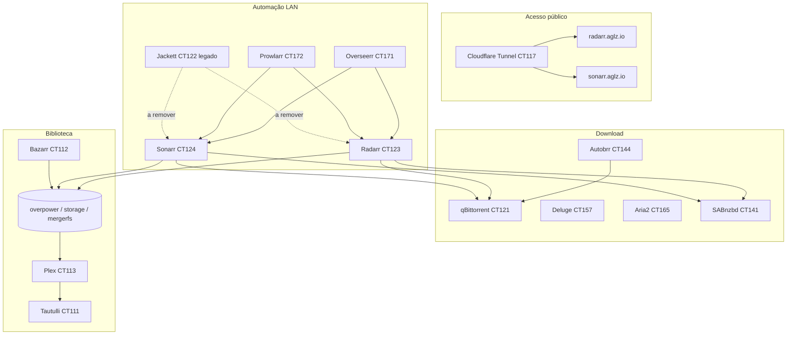

# Stack media AGL (Radarr / Sonarr / *arr)

Documentação operacional do stack de automação media no **AGLSRV1** (Proxmox), incluindo histórico, estado actual, modo manutenção e plano de implementação.

| Documento | Conteúdo |
|-----------|----------|
| **Este ficheiro** | Visão geral, arquitectura, como estava, o que mudou, o que vamos implementar |
| [`MEDIA-ARR-MAINTENANCE.md`](MEDIA-ARR-MAINTENANCE.md) | Modo pausa (sem downloads), verificação e reactivação |
| [`CT165-ARIA2.md`](CT165-ARIA2.md) | aria2 CT165 — ports, hook, script `ct165-aria2-improve.sh` |
| [`INFRA.md`](INFRA.md) | Inventário geral de CTs/VMs AGL |
| [`CLOUDFLARE-TUNNELS.md`](CLOUDFLARE-TUNNELS.md) | Túneis Cloudflare (CT117) |
| `scripts/media/arr-freeze-downloads.sh` | Congelar downloads via API |
| `scripts/media/arr-unfreeze-downloads.sh` | Reactivar (após espaço em disco) |

**Última actualização:** 2026-06-02  
**Host Proxmox:** AGLSRV1 — SSH Tailscale `root@100.107.113.33`, LAN `192.168.0.245`  
**Storage em expansão:** discos novos no host **AGLSRV3** (utilizador a resolver capacidade)

---

## 1. Arquitectura e fluxo



**Fluxo desejado (alvo):** Overseerr → Radarr/Sonarr → Prowlarr (indexers) → qBittorrent/SABnzbd → import atomic/hardlink → Plex → Tautulli.

---

## 2. Inventário de contentores (AGLSRV1)

| VMID | Nome | IP LAN | Porta(s) | Função |
|------|------|--------|----------|--------|
| 111 | tautulli | 192.168.0.111 | — | Analytics Plex |
| 112 | bazarr | 192.168.0.112 | — | Legendas |
| 113 | plexmediaserver | 192.168.0.113 | 32400 | Plex |
| 121 | qbittorrent | 192.168.0.121 | **8090** (WebUI) | Cliente torrent principal |
| 122 | jackett | 192.168.0.122 | 9117 | Indexer legado |
| 123 | radarr | 192.168.0.123 | 7878 | Filmes |
| 124 | sonarr | 192.168.0.124 | 8989 | Séries |
| 141 | sabnzbd | 192.168.0.141 | 8080 | Usenet |
| 144 | autobrr | 192.168.0.144 | 7456 | Grabs IRC/RSS |
| 157 | deluge | 192.168.0.157 | — | Torrent (backup/desactivado nos *arr) |
| 165 | aria2 | 192.168.0.165 | **6800** RPC, **6880** UI | Download ([`CT165-ARIA2.md`](CT165-ARIA2.md); cliente *arr congelado) |
| 170 | homarr | 192.168.0.170 | — | Dashboard |
| 171 | overseerr | 192.168.0.171 | — | Pedidos media |
| 172 | prowlarr | 192.168.0.172 | 9696 | Indexer manager (primário) |
| 117 | cloudflared | 192.168.0.117 | — | Túnel `aglsrv1` + `aglsrv1b` |

**URLs públicas (túnel `aglsrv1`, ingress remoto):** `radarr.aglz.io`, `sonarr.aglz.io` → backends `http://192.168.0.123:7878` e `:8989`.

---

## 3. Como estava (baseline antes das correcções)

Registo do estado **antes** da sessão de troubleshooting e optimização (Maio 2026). Serve de referência para rollback mental e auditoria.

### 3.1 Sintomas reportados

- `radarr.aglz.io` / `sonarr.aglz.io` devolviam **502** via Cloudflare.
- Warnings/erros na UI Radarr e Sonarr (health, indexers, paths).
- Storage **sem espaço livre** em vários volumes (`/mnt/storage`, overpower quase cheio).
- Utilizador a expandir capacidade no **AGLSRV3** — downloads não devem arrancar até haver espaço.

### 3.2 Rede e túnel (CT117)

| Aspecto | Estado anterior | Problema |
|---------|-----------------|----------|
| Tailscale `accept-routes` | Activado (via peer **man6d** / AGLSRV6D) | Rota `192.168.0.0/24` desviada para Tailscale em vez de `eth0` |
| Acesso LAN `192.168.0.123` do CT117 | Falha intermitente | `no route to host` → **502** no Cloudflare |
| Fix aplicado | `tailscale set --accept-routes=false` (`RouteAll: false`) | Tráfego LAN volta por `vmbr0` |

**Estado actual (2026-05-29):** `RouteAll: false` no CT117. Confirmar persistência após reboot do CT.

### 3.3 Mounts Proxmox (CT123 / CT124)

| Aspecto | Antes | Depois |
|---------|-------|--------|
| `mp0–mp9` | **Em falta** (CT123/124 sem binds de storage) | Alinhados com CT113 Plex (ver secção 4) |
| Efeito | Root folders inacessíveis ou inconsistentes; import/copy em vez de hardlink | Paths `/mnt/overpower`, `/mnt/storage`, etc. visíveis nos *arr |

**CT121 (qBittorrent):** continua **sem** `mp0–mp9` — pendente no plano (secção 6). Diagnóstico de performance e benchmark: [`DOWNLOAD-CLIENTS-PERF.md`](DOWNLOAD-CLIENTS-PERF.md).

### 3.4 Indexadores

| Problema | Detalhe |
|----------|---------|
| IP Jackett morto | Indexers apontavam para `192.168.0.96` (host antigo) |
| Duplicação | Jackett **e** Prowlarr no mesmo tracker (ex. FilmesHDTorrent) |
| Prowlarr | Apps Radarr/Sonarr com `fullSync`; 19 indexers activos |
| Rate limit | Erros **429** em trackers (YTS, Badass Torrents, etc.) |

**Radarr (antes da limpeza parcial):** 16 indexers (mix Prowlarr + Jackett + RSS directos).  
**Sonarr:** 22 indexers (incl. Jackett-FilmesHDTorrent, feeds legados).

### 3.5 Integrações incorrectas

| Serviço | Valor errado | Valor correcto |
|---------|--------------|----------------|
| Notificação Plex (Sonarr/Radarr) | `192.168.0.80` | `192.168.0.113` (CT113) |
| Jackett API | `192.168.0.96` | `192.168.0.122:9117` |
| qBittorrent WebUI (Radarr client) | host `192.168.0.121`, port **8090** | Mantido; credenciais só em DB local |

### 3.6 Paths e downloads

| Aspecto | Estado |
|---------|--------|
| Symlink `/mnt/power/downs/...` | Incompleto em CT123; corrigido para apontar a overpower |
| Remote Path Mappings (Radarr) | 5 entradas para host `192.168.0.90` (paths qBit antigos no Proxmox) |
| Root folders Radarr | 7 paths; só `/mnt/overpower/...` com ~393 GB livres; `/mnt/storage/...` com **0 GB** reportados |
| Fila Radarr | ~**2768** itens na queue (muitos `paused` / `downloading`) |
| qBittorrent | ~12k torrents na lista; sem downloads activos no momento da pausa |

### 3.7 Download clients (*arr) — antes do freeze

**Activos** em Radarr e Sonarr:

- Aria2 AGLSRV1  
- qBittorrent AGLSRV1  
- SABnzbd AGLSRV1  

**Desactivados:** Deluge (várias instâncias), qBittorrent AGLLX06.

### 3.8 Prowlarr — perfil antes do freeze

| Campo | Valor |
|-------|-------|
| `Standard.enableRss` | `true` |
| `Standard.enableAutomaticSearch` | `true` |
| `Standard.enableInteractiveSearch` | `true` |

### 3.9 Erros UI conhecidos (não todos resolvidos)

- **Good Boy:** dois filmes TMDb (2025/2026) → `MultipleMoviesFoundException`.
- **Coleções:** subpastas `Movies-FULLHD` em falta no disco.
- **Media removida** do TMDb/TVDB — limpeza manual na UI.
- **RootFolderCheck** em paths `/mnt/power/...` — pode ser cache de health após symlink.
- **Telegram Sonarr:** timeouts ocasionais para `api.telegram.org`.

### 3.10 Autobrr

- Serviço **activo** no CT144 antes do freeze.

---

## 4. Intervenções já realizadas (cronologia)

| Data | Acção | Resultado |
|------|--------|-----------|
| 2026-05-29 | Fix Tailscale CT117 `accept-routes=false` | `radarr.aglz.io` / `sonarr.aglz.io` passam de 502 a 302/303 |
| 2026-05-29 | Adicionar `mp0–mp9` em CT123 e CT124 (igual CT113) | 7/7 root folders Radarr acessíveis |
| 2026-05-29 | Remover indexers Jackett `192.168.0.96` | Eliminado host morto |
| 2026-05-29 | Symlink downloads `radarr` overpower | Path coerente em CT123 |
| 2026-05-29 | Plex notifications → `192.168.0.113` | SQLite Sonarr/Radarr |
| 2026-05-29 | **Freeze downloads** (storage cheio) | Clientes *arr OFF; Autobrr parado |
| 2026-05-29 | **Grabs reactivados**, downloads mantidos OFF | Prowlarr RSS/auto ON; fila pode crescer sem transferir |
| 2026-05-29 | Scripts `arr-freeze-downloads.sh` / `arr-unfreeze-downloads.sh` | Automatização no repo |
| 2026-05-29 | Documentação neste ficheiro | Baseline + plano |

**Ficheiro repo:** `.claude/helpers/hook-handler.cjs` — correcção `pre-bash` para emitir JSON (desbloqueio de comandos no ambiente Claude).

**Persistência Proxmox:** `/etc/pve/nodes/algsrv1/lxc/123.conf` e `124.conf` com mounts.

---

## 5. Estado actual (2026-05-29)

### 5.1 Modo manutenção — **grabs ON, downloads OFF**

| Componente | Estado |
|------------|--------|
| Prowlarr `Standard` | RSS **ON**, auto search **ON**, interactive **ON** |
| Radarr download clients | **Todos desactivados** |
| Sonarr download clients | **Todos desactivados** |
| Autobrr CT144 | **Parado** (enviaria para qBit sem passar pelos *arr) |
| Transferências qBit/SAB/Aria2 | **Sem envio** a partir dos *arr |

A fila Radarr/Sonarr **pode crescer** com novos grabs; não ocupa disco de download até reactivar clientes.

Detalhe operacional: [`MEDIA-ARR-MAINTENANCE.md`](MEDIA-ARR-MAINTENANCE.md).

```bash
# Verificar
bash scripts/media/arr-freeze-downloads.sh --verify-only
```

### 5.2 Mounts actuais (Proxmox)

**CT123, CT124, CT113** (idênticos):

```
mp0: /mnt/shares      → /mnt/shares
mp1: /overpower/base  → /mnt/overpower
mp2: /spark/base      → /mnt/power
mp5: /mnt/storage     → /mnt/storage
mp6–mp9: Extracted / Extracted_New (vários aliases legacy)
```

**CT121, CT172:** sem binds `mp*` — **gap** para hardlinks e para Prowlarr ver paths locais.

### 5.3 Modelo de paths (referência)

| Mount no CT | Origem no host AGLSRV1 | Uso típico |
|-------------|------------------------|------------|
| `/mnt/overpower` | `/overpower/base` | Media principal, downloads finished |
| `/mnt/power` | `/spark/base` | Legado; symlink para overpower onde aplicável |
| `/mnt/storage` | mergerfs pool | Biblioteca expandida (espaço crítico) |
| `/mnt/shares` | `/mnt/shares` | Partilhas |

**Downloads torrent (qBit):** categorias `radarr` / `sonarr` sob `/mnt/overpower/downs/torFinished/` (quando mounts alinhados).

### 5.4 Remote Path Mappings (Radarr) — mantidos

Mapeiam host **`192.168.0.90`** (instância qBit/reporting antigo no cluster) para paths locais nos CT123:

| Remote (host .90) | Local (CT123) |
|-------------------|---------------|
| `/mnt/pve/power/downs/` | `/mnt/overpower/downs/` |
| `/mnt/pve/overpower/media/` | `/mnt/overpower/media/` |
| `/mnt/disks/gd/BB/Extracted/Movies/` | `/mnt/storage/Extracted/Movies/` |
| `/mnt/pve/common/media/Extracted_New/Movies/` | `/mnt/storage/Extracted_New/Movies/` |
| `/mnt/disks/gd/BB/Extracted_New/Movies/` | `/mnt/storage/Extracted_New/Movies/` |

**Plano:** reduzir dependência de RPM quando CT121 partilhar a mesma árvore de mounts que Radarr ([TRaSH – remote path mapping](https://trash-guides.info/Radarr/Tips/Radarr-remote-path-mapping/)).

### 5.5 Segurança e segredos

- **API keys** Radarr/Sonarr/Prowlarr: em `config.xml` dentro de cada CT — **não** commitar no Git.
- **Credenciais qBittorrent:** em SQLite dos *arr (`DownloadClients`) — usar scripts ou UI para rotação.
- Documentação usa apenas IPs, ports e nomes de serviço.

---

## 6. O que vamos implementar (roadmap)

Implementação **faseada** — só avançar fases dependentes de storage quando AGLSRV3/mergerfs tiver espaço validado.

### Fase 0 — Pré-requisitos (AGLSRV3 + utilizador)

| # | Tarefa | Critério de sucesso |
|---|--------|---------------------|
| 0.1 | Novos discos no AGLSRV3 integrados no pool/mergerfs | `df` com espaço livre adequado nas root folders |
| 0.2 | Política de retenção / limpeza | Espaço livre sustentável (TB definido pela equipa) |
| 0.3 | Decisão sobre migrar biblioteca de `/mnt/overpower` vs `/mnt/storage` | Documentar path canónico único |

**Bloqueio actual:** Fase 1+ de downloads **não** deve correr até 0.1 concluído.

### Fase 1 — Storage e mounts (sem arrancar grabs)

| # | Tarefa | Notas |
|---|--------|-------|
| 1.1 | Replicar `mp0–mp9` no **CT121** (qBittorrent) | **Feito 2026-06-03** — `ct-download-mounts-apply.sh`; ver [`DOWNLOAD-CLIENTS-ROADMAP.md`](DOWNLOAD-CLIENTS-ROADMAP.md) |
| 1.2 | Opcional: `mp*` no **CT172** (Prowlarr) | Só se necessário para testes locais |
| 1.3 | Unificar path lógico `/data` (documentação interna) | Ex.: `/data/media`, `/data/downloads` → binds reais |
| 1.4 | Validar hardlink test | Download e biblioteca no mesmo filesystem |
| 1.5 | Revisar Remote Path Mappings | Remover entradas obsoletas se host passar a `192.168.0.121` |

### Fase 2 — Indexadores e rate limits (Prowlarr-first)

| # | Tarefa | Referência |
|---|--------|------------|
| 2.1 | Remover indexers **Jackett** duplicados em Radarr/Sonarr | Manter só URLs `192.168.0.172:9696/*` |
| 2.2 | Desactivar ou aposentar **CT122 Jackett** | Após 2.1 validado |
| 2.3 | Criar perfis Prowlarr: `RSS-Only`, `Automatic`, `Interactive` | [TRaSH – API limitada](https://trash-guides.info/Prowlarr/prowlarr-setup-limited-api/) |
| 2.4 | `queryLimit` / `grabLimit` / cooldown em trackers com 429 | YTS, Badass, etc. |
| 2.5 | Intervalo RSS Sonarr/Radarr ≥ **15–20 min** | Reduzir carga |

### Fase 3 — Qualidade de release (TRaSH)

| # | Tarefa | Ferramenta |
|---|--------|------------|
| 3.1 | Importar Custom Formats + Quality Profiles HD | [TRaSH Guides](https://trash-guides.info/) |
| 3.2 | Perfil 4K separado (opcional) | Recyclarr ou Profilarr |
| 3.3 | Naming conventions Sonarr/Radarr | TRaSH naming |

**Ferramentas candidatas:** [Recyclarr](https://recyclarr.dev/) (YAML + cron) ou [Profilarr](https://github.com/Dictionarry-Hub/Profilarr) (UI).

### Fase 4 — Higiene de biblioteca e fila

| # | Tarefa |
|---|--------|
| 4.1 | Limpar fila Radarr (~2768) — itens obsoletos / duplicados |
| 4.2 | Resolver conflito **Good Boy** (TMDb duplicado) |
| 4.3 | Criar pastas de coleção em falta ou desactivar monitorização |
| 4.4 | Remover media fantasma (TMDb/TVDB removed) |
| 4.5 | Avaliar **Cleanuparr** para torrents stalled |

### Fase 5 — Reactivar downloads (controlado)

| # | Tarefa | Ordem |
|---|--------|-------|
| 5.1 | `bash scripts/media/arr-unfreeze-downloads.sh` | Após confirmação interactiva |
| 5.2 | Prowlarr → RSS ON, auto search ON (intervalos da Fase 2) | Primeiro |
| 5.3 | Activar clientes *arr (qBit + SABnzbd; Aria2 se necessário) | Segundo |
| 5.4 | `systemctl start autobrr` | Opcional / trackers IRC |
| 5.5 | Monitorizar fila e `df` durante 48h | Rollback = freeze script |

### Fase 6 — Experiência utilizador

| # | Tarefa |
|---|--------|
| 6.1 | Overseerr ↔ Plex `192.168.0.113` — teste pedido completo |
| 6.2 | Bazarr — perfil PT+EN |
| 6.3 | Homarr — widgets health + Overseerr |
| 6.4 | Tautulli — alertas; rever Telegram timeout |
| 6.5 | Uptime Kuma — HTTP checks `radarr.aglz.io`, etc. |

### Fase 7 — Opcional / avançado

- **Unpackerr** (extracção RAR automática)  
- **Notifiarr** (notificações unificadas)  
- **Tdarr** (transcode batch)  
- Consolidar **Deluge** vs **qBittorrent** (hoje redundante)  
- **Jellyseerr** se migrar de Plex para Jellyfin  

---

## 7. Matriz de decisão (resumo)

| Tema | Antes | Agora | Alvo |
|------|-------|-------|------|
| Downloads | Activos | **OFF** (clientes desactivados) | `arr-unfreeze-downloads.sh` pós-AGLSRV3 |
| Grabs (Prowlarr) | ON | **ON** | OFF só com `--no-grabs` |
| Prowlarr vs Jackett | Duplicado | Ambos existem; Prowlarr sync | Só Prowlarr |
| Mounts *arr | CT123/124 sem mp | mp0–mp9 OK | CT121 + path `/data` |
| Cloudflare → LAN | Rota TS incorrecta | `RouteAll: false` | Persistir no boot |
| Qualidade releases | Manual / misto | — | TRaSH + Recyclarr |
| Espaço storage | Crítico | Utilizador expande AGLSRV3 | ≥ X TB livres (definir) |

---

## 8. Comandos úteis

```bash
# Estado CTs media
ssh root@100.107.113.33 'pct status 111 112 113 121 122 123 124 141 144 157 165 171 172 117'

# Logs Radarr
ssh root@100.107.113.33 'pct exec 123 -- journalctl -u radarr -n 80 --no-pager'

# Teste LAN
ssh root@100.107.113.33 'pct exec 117 -- curl -sI http://192.168.0.123:7878 | head -3'

# Freeze / verify
bash scripts/media/arr-freeze-downloads.sh --verify-only
```

---

## 9. Histórico de alterações deste documento

| Data | Alteração |
|------|-----------|
| 2026-06-02 | CT165: doc [`CT165-ARIA2.md`](CT165-ARIA2.md), script `ct165-aria2-improve.sh` |
| 2026-05-29 | Criação: baseline, intervenções, freeze, roadmap fases 0–7 |

---

## 10. Referências externas

- [TRaSH Guides](https://trash-guides.info/)  
- [Servarr Wiki – Prowlarr](https://wiki.servarr.com/prowlarr)  
- [Recyclarr](https://recyclarr.dev/)  
- [awesome-arr](https://github.com/Ravencentric/awesome-arr)  
- [Arr stack Docker guide (2026)](https://corelab.tech/arr-stack-docker-compose-guide/)  
