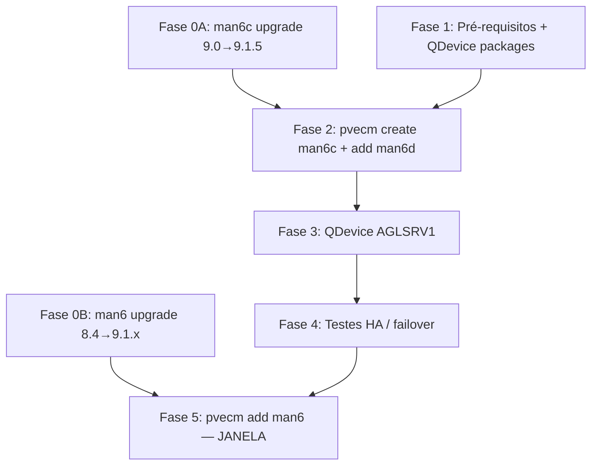

# Plano de Implementação — Cluster Proxmox (AGLSRV6 + AGLSRV6C + AGLSRV6D)

> **Status**: 📋 Plano v2.0 — Fases 0–4 executáveis após alinhamento PVE 9.x; Fase 5 requer janela  
> **Criação**: 2025-11-08 · **Revisão**: 2026-06-03  
> **Versão**: 2.0.0  
> **Scripts**: [`cluster-scripts/`](../cluster-scripts/) (não `scripts/proxmox/cluster/`)

---

## 🎯 Objetivo

Cluster Proxmox **3 nós** no site **AGLALD**, com **QDevice** em AGLSRV1 para quorum tolerante a falhas:

| Papel | Host | Hostname | WG | Tailscale | LAN principal |
|-------|------|----------|-----|-----------|---------------|
| Produção | AGLSRV6 | man6 | 10.6.0.12 | 100.98.108.66 | 192.168.0.202 / **192.168.1.202** (vmbr2) |
| Extensão | AGLSRV6C | man6c | 10.6.0.22 | 100.124.53.91 | 192.168.0.233 / **192.168.1.233** (vmbr2) |
| Extensão | AGLSRV6D | man6d | 10.6.0.23 | 100.76.201.83 | 192.168.0.234 (enp2s0) |
| QDevice | AGLSRV1 | algsrv1 | 10.6.0.10 | 100.107.113.33 | 192.168.0.245 |

**Nome do cluster:** `agl-cluster`  
**Quorum alvo:** `expected votes = 2` (configuração 2/4 com QDevice) — ver [`QUORUM-2-4-SUMMARY.md`](QUORUM-2-4-SUMMARY.md)

---

## 📸 Estado verificado (2026-06-03)

Inventário live via Tailscale SSH:

| Nó | PVE | Kernel | Cluster | CTs | VMs | NTP |
|----|-----|--------|---------|-----|-----|-----|
| man6 | **8.4.16** | 6.8.12-15-pve | standalone | **14** | **6** | ✅ sync |
| man6c | **9.0.11** | 6.14.11-4-pve | standalone | 0 | 0 | ✅ sync |
| man6d | **9.1.5** | 6.14.11-4-pve | standalone | 0 | 0 | ✅ sync |
| AGLSRV1 (QDevice) | 9.0.3 | 6.11.0-2-pve | — | — | — | — |

**Latência medida (ping, 2 pacotes):**

| Origem → Destino | Via | RTT médio |
|------------------|-----|-----------|
| man6 → man6c | 192.168.1.233 (vmbr2) | **~0,16 ms** |
| man6 → man6c | 10.6.0.22 (wg0) | ~0,44 ms |
| man6d → man6 | 192.168.1.202 | ~0,25 ms |
| man6d → man6 | 10.6.0.12 (wg0) | ~0,42 ms |

> **Nota:** O plano v1 assumia latência WG ~30–40 ms (site remoto). Os três hosts estão **co-localizados em AGLALD**; a LAN **192.168.1.0/24** (vmbr2 man6↔man6c) é o link preferido para Corosync.

**Pré-requisitos já concluídos (2026-06):**

- [x] Tailscale alinhado nos 3 nós (`accept-dns=false`, `accept-routes=false`, `--ssh`)
- [x] vmbr2 / eth2 operacional (man6, man6c; CT101/114 cloudflared)
- [x] WireGuard mesh 10.6.0.0/24 activo nos 3 nós
- [x] Timezone `America/Sao_Paulo` + relógio sincronizado

---

## 🚨 Bloqueador #1 — Versões Proxmox incompatíveis

**Todos os nós do cluster devem correr a mesma major (e, para join, tipicamente a mesma minor) do Proxmox VE.**

| Situação actual | Impacto |
|-----------------|---------|
| man6 = PVE **8.4** | **Não pode** fazer join a cluster PVE 9.x |
| man6c = 9.0.11 vs man6d = 9.1.5 | **Risco** ao criar cluster só com 6C+6D; alinhar antes |

### Decisão recomendada

1. **Fase 0A (sem downtime em man6):** Actualizar **man6c** de 9.0.11 → **9.1.5** (igual man6d).  
2. **Fase 0B (janela curta em man6):** Actualizar **man6** de 8.4.16 → **9.1.x** (seguir [guia oficial de upgrade PVE 8→9](https://pve.proxmox.com/wiki/Upgrade_from_8_to_9)).  
3. **Só então:** Fases 2–5 (cluster + join man6).

**Alternativa conservadora:** Executar Fases 2–4 **apenas** com man6c + man6d (ambos PVE 9.x alinhados), validar quorum/HA, e deixar man6 standalone até concluir upgrade 8→9.

---

## 🚨 Avisos críticos (produção man6)

### Nunca executar `pvecm add` no man6 fora de janela

- 14 CTs + 6 VMs; serviços críticos: CT101/114 (cloudflared), CT111 (NFS aluzdivina), CT113 (PBS), CT121 (WireGuard hub), CT108 (agldv06)
- Join sobrescreve `/etc/pve`; VMIDs duplicados entre nós causam conflito
- CT113 com lock `backup` — verificar jobs PBS antes da janela

### CTs / VMs no man6 (referência migração Fase 5)

**CTs (running):** 101, 102, 108, 109, 110, 111, 113, 114, 117, 121, 201  
**CTs (stopped):** 104, 107, 116  
**VMs (running):** 105 (aglhq26), 200 (WinServer2016)  
**VMs (stopped):** 100, 103, 106, 112  

---

## 🛣️ Estratégia de implementação (v2)



**Ordem de criação do cluster (inalterada em espírito):**

1. **man6c** cria o cluster (nó vazio)
2. **man6d** entra no cluster
3. **QDevice** em AGLSRV1
4. Testes HA / quorum 2/4
5. **man6** entra **só após** PVE 9.x alinhado + janela de manutenção

---

## 🌐 Rede do cluster (v2 — dual-link)

### Link preferido por par

| Par de nós | link0 (primário) | link1 (backup) |
|------------|------------------|----------------|
| man6 ↔ man6c | **192.168.1.202 / .233** (vmbr2) | 10.6.0.12 / .22 (wg0) |
| man6c ↔ man6d | 192.168.0.233 / .234 (LAN) | 10.6.0.22 / .23 (wg0) |
| man6 ↔ man6d | 10.6.0.12 / .23 (wg0) | 192.168.0.202 / .234 se roteável |

### Comandos Corosync (após alinhamento PVE 9.x)

```bash
# man6c — criar cluster (preferir LAN inter-host)
pvecm create agl-cluster --link0 192.168.1.233 --link1 10.6.0.22

# man6d — join
pvecm add 192.168.1.233 --link0 192.168.0.234 --link1 10.6.0.23
# ou, se vmbr2 for adicionado ao man6d: --link0 192.168.1.234

# man6 — SOMENTE na janela, após upgrade PVE 9
pvecm add 192.168.1.233 --link0 192.168.1.202 --link1 10.6.0.12
```

### Melhoria opcional — vmbr2 no man6d

man6d **não tem** hoje interface em 192.168.1.0/24, mas alcança `.202` por roteamento (~0,25 ms). Para topologia simétrica e menor dependência de rotas:

- Adicionar NIC/bridge **vmbr2** com IP **192.168.1.234/24** (mesmo switch que man6/man6c)
- Actualizar `cluster-scripts/02-create-cluster.sh` para usar IPs vmbr2

### Portas e firewall

| Serviço | Portas | Notas |
|---------|--------|-------|
| Corosync | UDP 5405–5412 | Entre todos os nós |
| SSH | TCP 22 | Join cluster (`pvecm add`) |
| QDevice | TCP 5403 | AGLSRV1 ↔ nós cluster |

Tailscale **não** substitui link Corosync — usar IPs LAN/WG directos.

---

## 📋 Pré-requisitos

### 1. Rede

- [x] WG mesh 10.6.0.0/24
- [x] vmbr2 192.168.1.0/24 (man6, man6c)
- [x] Latência LAN inter-host &lt; 1 ms (medido)
- [ ] Portas UDP 5405–5412 abertas host-a-host (testar na Fase 1)
- [ ] SSH root entre nós (chaves) — validar man6c↔man6d↔AGLSRV1

### 2. Sistema

- [x] Timezone America/Sao_Paulo
- [x] NTP sincronizado
- [ ] **Mesma versão PVE em todos os nós do cluster** ← **bloqueador**
- [x] Hostnames únicos: man6, man6c, man6d
- [ ] `/etc/hosts` consistente (man6 usa `servidor6.aglz.io`; considerar aliases cluster)

### 3. Storage

- [x] man6c / man6d sem CTs/VMs
- [ ] Backups PBS de **todos** CTs/VMs do man6 antes da Fase 5
- [ ] Inventário storage: man6 usa local + SSHFS + PBS — **sem storage partilhado** entre nós; HA limitado a migración online se destino tiver capacidade

> **Decisão storage:** Cluster sem Ceph/NFS partilhado = **orquestração centralizada** + migração manual/planeada. NFS CT111 permanece serviço de rede, não storage Proxmox clusterizado.

### 4. Software

- [ ] `corosync-qnetd` em AGLSRV1
- [ ] `pve-ha-manager` nos nós cluster
- [ ] Actualizar `cluster-scripts/01-prerequisites.sh` para validar versão PVE e latência vmbr2

---

## 🔧 Fases de implementação

### Fase 0A — Alinhar man6c → 9.1.x (PRÉ-JANELA) ✅ 2026-06-03

**Resultado:** man6c actualizado **9.0.11 → 9.1.19** (`pve-manager/9.1.19`).

**Pendente:** ~~alinhar **man6d** (ainda 9.1.5) → 9.1.19~~ ✅ **2026-06-03** — man6d **9.1.19** (build `076d7c3c108f0346`, igual man6c).

---

### Fase 0B — Upgrade man6 8.4 → 9.1.x (JANELA DEDICADA, ~2–3 h + buffer)

**Risco detalhado:** [`docs/maint/AGLSRV6-PVE8-TO-9-UPGRADE-RISKS.md`](maint/AGLSRV6-PVE8-TO-9-UPGRADE-RISKS.md) — cenários de falha e plano **≤8 h**.

**Bloqueador actual:** `pve8to9` **FAIL** — pacote `systemd-boot` instalado (remover antes da janela).

---

### Fase 1 — Preparação (PRÉ-JANELA, 30–45 min)

**Script:** [`cluster-scripts/01-prerequisites.sh`](../cluster-scripts/01-prerequisites.sh)

1. Verificar conectividade (WG + 192.168.1.x + 192.168.0.x)
2. Instalar `corosync-qnetd` em AGLSRV1
3. Instalar `pve-ha-manager` em man6c/man6d
4. Testar portas Corosync (`nc -u -z`)
5. Documentar estado man6 (VMIDs, `/etc/pve`, storages)

---

### Fase 2 — Cluster base man6c + man6d (PRÉ-JANELA, 15–20 min)

**Pré-condição:** man6c e man6d na **mesma** versão PVE 9.1.x  
**Script:** [`cluster-scripts/02-create-cluster.sh`](../cluster-scripts/02-create-cluster.sh) — **actualizar** para `--link0` em 192.168.1.233 antes de executar

```bash
# Em man6c
pvecm create agl-cluster --link0 192.168.1.233 --link1 10.6.0.22

# Em man6d
pvecm add 192.168.1.233 --link0 192.168.0.234 --link1 10.6.0.23

pvecm expected 2
pvecm status
```

---

### Fase 3 — QDevice AGLSRV1 (PRÉ-JANELA, 10–15 min)

**Script:** [`cluster-scripts/03-setup-qdevice.sh`](../cluster-scripts/03-setup-qdevice.sh)

```bash
# AGLSRV1
apt install -y corosync-qnetd

# man6c (nó com quorum inicial)
pvecm qdevice setup 10.6.0.10
pvecm status   # Qdevice present, Quorate Yes, Expected votes 2
```

---

### Fase 4 — Testes (PRÉ-JANELA, 20–30 min)

**Script:** [`cluster-scripts/04-test-cluster.sh`](../cluster-scripts/04-test-cluster.sh)

1. VM teste em man6c, HA enable
2. Stop man6c → failover para man6d
3. Simular perda quorum (documentar recuperação)
4. Validar cenário **man6c+man6d offline, man6 standalone** — man6 **ainda não** no cluster; produção intacta

---

### Fase 5 — Join man6 (JANELA MANUTENÇÃO, 2–3 h)

**Pré-condições:**

- [ ] man6 em PVE **9.1.x** (Fase 0B concluída)
- [ ] Fases 1–4 OK
- [ ] Backup PBS completo
- [ ] Plano rollback lido ([`CLUSTER-RISKS-AND-MAINTENANCE.md`](CLUSTER-RISKS-AND-MAINTENANCE.md))

**Script:** [`cluster-scripts/05-add-aglsrv6.sh`](../cluster-scripts/05-add-aglsrv6.sh)

**Sequência resumida:**

1. Comunicar downtime (cloudflared, NFS, agldv06, PBS)
2. Opcional: migrar CTs leves para man6c/man6d **antes** do join (VMIDs livres no cluster)
3. Parar CTs/VMs ou aceitar restart pós-join
4. `pvecm add 192.168.1.233 --link0 192.168.1.202 --link1 10.6.0.12` no man6
5. `pvecm status` — 3 nós + QDevice
6. Reconciliar storage definitions em `/etc/pve/storage.cfg`
7. Arrancar CTs/VMs; testar túneis Cloudflare e NFS

---

## 📅 Cronograma sugerido

| Semana | Actividade | Downtime man6 |
|--------|------------|---------------|
| 1 | Fase 0A (man6c upgrade) + Fase 1 | Nenhum |
| 1 | Fases 2–4 (cluster 6C+6D + QDevice) | Nenhum |
| 2 | Fase 0B (man6 upgrade 8→9) | **Sim** (~1–2 h) |
| 3 | Fase 5 (join man6) | **Sim** (~2–3 h) |

---

## 🚨 Rollback

**Antes do join man6:** remover man6d do cluster (`pvecm delnode man6d`), limpar corosync no nó removido — ver [`cluster-scripts/README.md`](../cluster-scripts/README.md).

**Depois do join man6:** rollback complexo; preferir **não** avançar Fase 5 sem Fases 2–4 validadas.

---

## 📁 Artefactos no repositório

| Ficheiro | Descrição |
|----------|-----------|
| [`docs/PROXMOX-CLUSTER-PLAN.md`](PROXMOX-CLUSTER-PLAN.md) | Este plano |
| [`cluster-scripts/01–05`](../cluster-scripts/) | Scripts de execução |
| [`docs/CLUSTER-RISKS-AND-MAINTENANCE.md`](CLUSTER-RISKS-AND-MAINTENANCE.md) | Riscos e manutenção |
| [`docs/QUORUM-2-4-SUMMARY.md`](QUORUM-2-4-SUMMARY.md) | Quorum 2/4 |
| [`docs/troubleshooting/AGLSRV6-CLOUDFLARED6-ETH2-TAILSCALE-2026-06.md`](troubleshooting/AGLSRV6-CLOUDFLARED6-ETH2-TAILSCALE-2026-06.md) | Rede vmbr2 / Tailscale |

### TODO técnico (repo)

- [ ] Actualizar `02-create-cluster.sh` para links 192.168.1.x + quorum 2/4
- [ ] Adicionar check de versão PVE em `01-prerequisites.sh`
- [ ] Documentar runbook upgrade man6 8→9 em `docs/maint/AGLSRV6-PVE8-TO-9-UPGRADE.md` (criar na execução)

---

## ✅ Próximos passos imediatos

1. **Aprovar** cronograma e janelas (0B + 5)
2. **Executar Fase 0A** — man6c → 9.1.5
3. **Actualizar scripts** em `cluster-scripts/` (links vmbr2)
4. **Executar Fases 1–4** sem tocar no man6
5. **Agendar Fase 0B** (upgrade man6) e **Fase 5** (join) em janelas separadas ou contínuas

---

**Revisão:** 2026-06-03 · **Versão:** 2.0.0 · **Autor:** infra AGL (agl-hostman)
