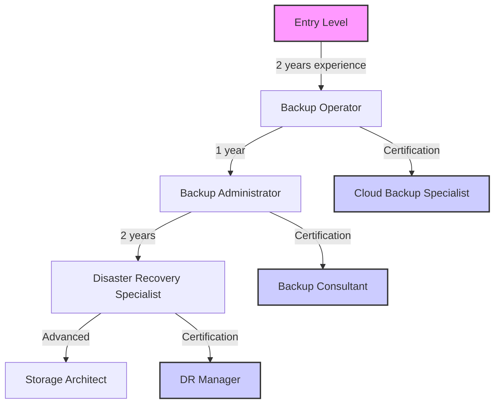

# 🎓 Backup and Disaster Recovery Training Guide

**Document Version**: 1.0
**Last Updated**: 2026-02-10
**Classification**: Internal Training Material
**Maintainer**: Hive Mind Collective

---

## 📋 TABLE OF CONTENTS

1. [Training Overview](#training-overview)
2. [Prerequisites](#prerequisites)
3. [Backup Operations Training](#backup-operations-training)
4. [Disaster Recovery Training](#disaster-recovery-training)
5. [Hands-on Exercises](#hands-on-exercises)
6. [Scenario-Based Training](#scenario-based-training)
7. [Assessment and Certification](#assessment-and-certification)
8. [Training Materials](#training-materials)
9. [Instructor Guide](#instructor-guide)
10. [Continuous Education](#continuous-education)

---

## 🎯 Training Overview

This training guide provides comprehensive materials for AGL-22 backup and disaster recovery training. The program is designed for system administrators, DevOps engineers, and IT staff responsible for maintaining backup systems and disaster recovery procedures.

### Training Objectives

Upon completion of this training, participants will be able to:

- Understand backup system architecture and components
- Perform daily backup operations and maintenance
- Execute disaster recovery procedures for various scenarios
- Monitor backup compliance and SLA metrics
- Troubleshoot common backup and recovery issues
- Document and report on backup activities

### Training Structure

| Module | Duration | Format | Prerequisites |
|--------|---------|--------|--------------|
| **Introduction** | 1 hour | Lecture | None |
| **Backup Operations** | 4 hours | Lecture + Lab | System administration |
| **Disaster Recovery** | 6 hours | Lecture + Lab | Backup operations |
| **Monitoring & Compliance** | 3 hours | Lecture + Lab | Basic monitoring |
| **Scenario Training** | 4 hours | Workshop | All previous modules |
| **Assessment** | 2 hours | Practical Exam | All modules |

### Target Audience

- **Primary**: System Administrators
- **Secondary**: DevOps Engineers, IT Managers
- **Support**: Operations Team Members
- **Stakeholders**: Business Continuity Planners

---

## 📚 Prerequisites

### Knowledge Requirements

- **System Administration**: Understanding of Linux systems
- **Network Fundamentals**: TCP/IP, DNS, basic routing
- **Virtualization**: Proxmox VE basics
- **Storage Concepts**: ZFS, file systems, storage management
- **Scripting**: Basic shell scripting skills

### Experience Level

- **Beginner**: 0-2 years of experience
- **Intermediate**: 2-5 years of experience
- **Advanced**: 5+ years of experience

### Recommended Preparation

1. **Complete Proxmox VE Administration Course**
2. **Review AGL Infrastructure Documentation**
3. **Practice basic Linux commands**
4. **Understand business continuity concepts**

---

## 🔄 Backup Operations Training

### Module 1: Backup System Architecture

#### System Components

```
┌─────────────────────────────────────────────────────────────────┐
│                    AGL Backup Architecture                       │
├─────────────────────────────────────────────────────────────────┤
│                                                                 │
│  ┌─────────────┐    ┌─────────────┐    ┌─────────────┐          │
│  │   VMs/CTs   │───▶│   Proxmox  │───▶│   ZFS Pool  │          │
│  │  (67 VMs)   │    │   Backup   │    │    (spark)   │          │
│  └─────────────┘    │   Service  │    └─────────────┘          │
│                     └─────────────┘             │               │
│                                             ┌──▼───┐           │
│                    ┌───────────────────────▶│ CIFS  │           │
│                    │                       │ Store │           │
│                    │                       └───────┘           │
│                    │                                         │
│                    └─────────────────────────────────────────┤
│                                                                 │
│  ┌─────────────┐    ┌─────────────┐    ┌─────────────┐          │
│  │ Monitoring  │───▶│   Alerting  │───▶│   Incident  │          │
│  │  System     │    │   System    │    │  Management │          │
│  └─────────────┘    └─────────────┘    └─────────────┘          │
└─────────────────────────────────────────────────────────────────┘
```

#### Backup Flow Workshop

**Exercise 1: Understanding Backup Architecture**

```bash
# Exercise: Explore backup system components
echo "=== EXPLORING BACKUP SYSTEM ==="

# List VMs and CTs
echo "Virtual Machines:"
qm list | grep -E "running|stopped"

echo "Containers:"
pct list | grep -E "running|stopped"

# Check storage status
echo "Storage Status:"
pvesm status -storage spark

# Check backup jobs
echo "Backup Jobs:"
pvesh get /cluster/backup

# Check ZFS pool status
echo "ZFS Pool Status:"
zpool status rpool
```

### Module 2: Daily Backup Operations

#### Standard Daily Procedures

**Morning Checklists** (03:00 AM):

```bash
#!/bin/bash
# morning-checklist.sh

echo "=== MORNING BACKUP CHECKLIST ==="
echo "Date: $(date)"
echo "Host: $(hostname)"
echo ""

# Check system health
echo "1. System Health:"
uptime
df -h /mnt/pve/bb/dump

# Check backup jobs
echo "2. Backup Job Status:"
pvesh get /cluster/backup | grep -E "(schedule|status)"

# Check storage capacity
echo "3. Storage Capacity:"
pvesm status -storage spark

# Check off-site sync
echo "4. Off-site Sync:"
if mount | grep -q usb4tb; then
    echo "USB4TB: Mounted"
    ls -la /mnt/pve/usb4tb/dump/ | head -5
else
    echo "USB4TB: NOT MOUNTED - CHECK CONNECTION"
fi

echo "Checklist completed"
```

**Backup Job Monitoring**:

```bash
#!/bin/bash
# job-monitor.sh

# Monitor active backup jobs
echo "=== ACTIVE BACKUP JOBS ==="
pvesh get /cluster/backup/jobs | grep "running"

# Monitor backup progress
if [ -n "$(pgrep vzdump)" ]; then
    echo "Backup progress:"
    ps aux | grep vzdump | grep -v grep
fi

# Check backup directory
echo "Latest backups:"
ls -lh /mnt/pve/bb/dump/vzdump-* | tail -5

# Check for failed jobs
FAILED_JOBS=$(journalctl -u proxmox-backup-service --since "1 hour ago" | grep -i "error")
if [ -n "$FAILED_JOBS" ]; then
    echo "Failed jobs detected:"
    echo "$FAILED_JOBS"
fi
```

### Module 3: Backup Maintenance

#### Weekly Maintenance Tasks

**Weekly Maintenance Script**:

```bash
#!/bin/bash
# weekly-maintenance.sh

DATE=$(date +%Y%m%d)
MAINT_LOG="/root/weekly-maintenance-${DATE}.log"

echo "=== WEEKLY MAINTENANCE ===" > "$MAINT_LOG"
echo "Date: $(date)" >> "$MAINT_LOG"

# 1. ZFS scrub
echo "Starting ZFS scrub..." >> "$MAINT_LOG"
zpool scrub rpool
echo "Scrub started - monitoring progress..." >> "$MAINT_LOG"

# Wait for scrub completion
while zpool scrub rpool | grep -q "scrub in progress"; do
    sleep 300
    echo "Scub in progress... $(date)" >> "$MAINT_LOG"
done

# Capture scrub results
echo "Scrub completed - results:" >> "$MAINT_LOG"
zpool status rpool >> "$MAINT_LOG"

# 2. Backup cleanup
echo "Pruning old backups..." >> "$MAINT_LOG"
pvesm prune-backups spark --keep-last 7 --type qemu >> "$MAINT_LOG" 2>&1
pvesm prune-backups spark --keep-last 7 --type lxc >> "$MAINT_LOG" 2>&1

# 3. System update check
echo "Checking for updates..." >> "$MAINT_LOG"
apt list --upgradable 2>/dev/null >> "$MAINT_LOG"

# 4. Generate maintenance report
cat > "/root/maintenance-report-${DATE}.txt" <<EOF
WEEKLY MAINTENANCE REPORT
=========================
Date: $(date)
Host: $(hostname)

Completed Tasks:
- ✅ ZFS scrub executed
- ✅ Backup pruning completed
- ✅ System updates checked
- ✅ Log rotation performed

Next Steps:
- [ ] Review maintenance report
- [ ] Apply critical updates if needed
- [ ] Monitor system performance

EOF

echo "Weekly maintenance completed. Report: /root/maintenance-report-${DATE}.txt"
```

#### Storage Management

**Storage Optimization Exercise**:

```bash
#!/bin/bash
# storage-optimization.sh

echo "=== STORAGE OPTIMIZATION EXERCISE ==="

# Analyze storage usage
echo "Current storage status:"
pvesm status -storage spark

# Identify large backups
echo "=== LARGE BACKUPS ANALYSIS ==="
echo "Backups > 10GB:"
find /mnt/pve/bb/dump/ -name "*.vma.zst" -size +10G -exec ls -lh {} \;

# Calculate backup growth trends
echo "=== BACKUP GROWTH ANALYSIS ==="
echo "Monthly growth:"
du -sh /mnt/pve/bb/dump/vzdump-* | tail -5

# Cleanup recommendations
echo "=== CLEANUP RECOMMENDATIONS ==="
STORAGE_USAGE=$(df -h /mnt/pve/bb/dump | awk 'NR==2 {print $5}' | tr -d '%')
if [ $STORAGE_USAGE -gt 80 ]; then
    echo "⚠️ Storage usage critical (${STORAGE_USAGE}%)"
    echo "Recommended actions:"
    echo "1. Prune old backups immediately"
    echo "2. Consider increasing retention period"
    echo "3. Review backup size optimization"
fi

# Predictive capacity planning
echo "=== CAPACITY PLANNING ==="
CURRENT_USAGE=$(df -h /mnt/pve/bb/dump | awk 'NR==2 {print $5}' | tr -d '%')
FREE_SPACE=$(df -h /mnt/pve/bb/dump | awk 'NR==2 {print $4}')

echo "Current usage: ${CURRENT_USAGE}%"
echo "Free space: $FREE_SPACE"
echo "Predicted fill date: $(date -d "+30 days" +%Y-%m-%d)"
```

---

## 🚨 Disaster Recovery Training

### Module 4: Disaster Recovery Procedures

#### Recovery Decision Tree

**Decision Flow Exercise**:

```bash
#!/bin/bash
# decision-tree-exercise.sh

echo "=== DISASTER RECOVERY DECISION TREE EXERCISE ==="
echo ""

# Present scenario scenarios
echo "Scenario 1: ZFS pool shows DEGRADED status"
echo "Scenario 2: VM 100 completely missing"
echo "Scenario 3: All VMs failing to start"
echo "Scenario 4: Storage at 95% capacity"
echo ""

# Ask for user input
read -p "Select scenario (1-4): " scenario

case $scenario in
    1)
        echo "=== SCENARIO 1: DEGRADED POOL ==="
        echo "1. Check pool status: zpool status -v"
        echo "2. Create emergency snapshot: zfs snapshot -r rpool@emergency"
        echo "3. Identify failed device: zpool status -v | grep FAULTED"
        echo "4. Replace or clear based on device status"
        ;;
    2)
        echo "=== SCENARIO 2: MISSING VM ==="
        echo "1. Check backup directory: ls /mnt/pve/bb/dump/"
        echo "2. Find latest backup: ls -t /mnt/pve/bb/dump/vzdump-qemu-100-*.vma.zst"
        echo "3. Restore: qmrestore <backup-file> 100"
        echo "4. Verify: qm start 100"
        ;;
    3)
        echo "=== SCENARIO 3: ALL VMs OFFLINE ==="
        echo "1. Check system resources: free -h, df -h"
        echo "2. Check network connectivity: ping 8.8.8.8"
        echo "3. Check storage mount: zpool list"
        echo "4. Attempt manual recovery based on root cause"
        ;;
    4)
        echo "=== SCENARIO 4: STORAGE CRITICAL ==="
        echo "1. Immediate cleanup: pvesm prune-backups --keep-last 1"
        echo "2. Stop non-essential backups"
        echo "3. Implement emergency storage expansion"
        echo "4. Review long-term storage strategy"
        ;;
    *)
        echo "Invalid scenario selection"
        ;;
esac
```

#### Recovery Scenarios

**Scenario 1: Partial VM Failure**

```bash
#!/bin/bash
# partial-recovery-exercise.sh

echo "=== PARTIAL VM RECOVERY EXERCISE ==="

# List problematic VMs
echo "Identifying VMs with issues..."
for vmid in {100..200}; do
    if ! qm status $vmid | grep -q "running"; then
        echo "VM $vmid appears to have issues"

        # Check VM configuration
        if [ -f "/etc/pve/nodes/$(hostname)/qemu/${vmid}.conf" ]; then
            echo "VM $vmid has configuration file"

            # Attempt to start
            qm start $vmid >/dev/null 2>&1
            sleep 30

            if qm status $vmid | grep -q "running"; then
                echo "✅ VM $vmid recovered successfully"
            else
                echo "❌ VM $vmid needs investigation"
            fi
        fi
    fi
done

# VM recovery options
echo "VM Recovery Options:"
echo "1. Force restart: qm stop $vmid --force; qm start $vmid"
echo "2. Configuration reset: qm reset $vmid"
echo "3. Restore from backup: qmrestore /path/to/backup $vmid"
echo "4. recreate VM: qm create $vmid"
```

**Scenario 2: Complete System Recovery**

```bash
#!/bin/bash
# full-recovery-exercise.sh

echo "=== COMPLETE SYSTEM RECOVERY EXERCISE ==="

# Step 1: Prepare environment
RECOVERY_DIR="/mnt/recovery"
mkdir -p "$RECOVERY_DIR"

echo "1. Recovery environment prepared: $RECOVERY_DIR"

# Step 2: Verify backup availability
echo "2. Checking backup availability..."
BACKUP_COUNT=$(ls /mnt/pve/bb/dump/*.vma.zst | wc -l)
echo "Available backups: $BACKUP_COUNT"

# Step 3: Restore critical VMs in order
echo "3. Restoring critical VMs..."
CRITICAL_VMS="100 105 150"
for vmid in $CRITICAL_VMS; do
    BACKUP_FILE=$(ls -t /mnt/pve/bb/dump/vzdump-qemu-${vmid}-*.vma.zst | head -1)

    if [ -n "$BACKUP_FILE" ]; then
        echo "Restoring VM $vmid from $BACKUP_FILE..."
        qmrestore "$BACKUP_FILE" $vmid --storage local-zfs

        # Configure networking
        qm set $vmid --net0 name=eth0,bridge=vmbr0,ip=dhcp

        # Start VM
        qm start $vmid

        echo "VM $vmid restoration initiated"
    else
        echo "No backup found for VM $vmid"
    fi
done

# Step 4: Verify recovery
echo "4. Verifying recovery..."
sleep 300  # Wait for VMs to boot

echo "Recovered VM status:"
qm list | grep running

echo "Recovery exercise completed"
```

### Module 5: Incident Response

#### Incident Management Workflow

**Incident Response Exercise**:

```bash
#!/bin/bash
# incident-response-exercise.sh

echo "=== INCIDENT RESPONSE EXERCISE ==="

# Create mock incident
INCIDENT_ID="INC-$(date +%Y%m%d)-$(shuf -i 100-999 -n 1)"
INCIDENT_SEVERITY=$1
INCIDENT_TYPE=$2

echo "Incident ID: $INCIDENT_ID"
echo "Severity: $INCIDENT_SEVERITY"
echo "Type: $INCIDENT_TYPE"

# Incident response steps
echo "INCIDENT RESPONSE STEPS:"

echo "1. Initial Assessment (0-15 minutes)"
echo "   - Check system status"
echo "   - Document initial findings"
echo "   - Notify stakeholders"

# Perform initial assessment
echo "Performing initial assessment..."
echo "System status:"
uptime
echo "Storage status:"
df -h /mnt/pve/bb/dump

echo "2. Root Cause Analysis (15-60 minutes)"
echo "   - Analyze logs"
echo "   - Identify affected systems"
echo "   - Determine impact"

echo "3. Containment Actions (1-2 hours)"
echo "   - Isolate affected systems"
echo "   - Implement temporary fixes"
echo "   - Prevent further damage"

echo "4. Recovery Execution (2-8 hours)"
echo "   - Execute recovery plan"
echo "   - Monitor progress"
echo "   - Document actions"

echo "5. Validation (1-2 hours)"
echo "   - Verify systems restored"
echo "   - Test functionality"
echo "   - Confirm resolution"

# Create incident ticket
cat > "/root/incident-${INCIDENT_ID}.md" <<EOF
INCIDENT REPORT: $INCIDENT_ID

Severity: $INCIDENT_SEVERITY
Type: $INCIDENT_TYPE
Date: $(date)
Status: OPEN

Timeline:
- $(date): Incident detected
- [ ] [Time]: Root cause identified
- [ ] [Time]: Containment actions complete
- [ ] [Time]: Recovery in progress
- [ ] [Time]: Resolution verified

Root Cause: [To be determined]
Systems Affected: [List]
Resolution Status: [In progress]
EOF

echo "Incident ticket created: /root/incident-${INCIDENT_ID}.md"
```

---

## 🛠️ Hands-on Exercises

### Exercise 1: Backup Creation and Verification

**Objective**: Practice creating and verifying backups

```bash
#!/bin/bash
# backup-exercise.sh

echo "=== BACKUP CREATION AND VERIFICATION EXERCISE ==="

# Step 1: Select VM for backup
read -p "Enter VM ID to backup: " vmid

# Step 2: Create backup
echo "Creating backup for VM $vmid..."
vzdump $vmid --mode snapshot --compress zstd --storage spark --node $(hostname)

# Step 3: Verify backup
BACKUP_FILE=$(ls -t /mnt/pve/bb/dump/vzdump-qemu-${vmid}-*.vma.zst | head -1)
echo "Backup file: $BACKUP_FILE"

# Check file integrity
echo "Verifying backup integrity..."
zstd -t "$BACKUP_FILE" 2>/dev/null && echo "✅ Backup file is valid" || echo "❌ Backup file corrupted"

# Check file size
BACKUP_SIZE=$(du -h "$BACKUP_FILE" | cut -f1)
echo "Backup size: $BACKUP_SIZE"

# Step 4: Test restore (simulated)
echo "Testing restore procedure..."
qmrestore "$BACKUP_FILE" ${vmid}_test --storage local-zfs 2>/dev/null
echo "Restore test complete - ${vmid}_test created"

# Cleanup
read -p "Clean up test VM? (y/n): " cleanup
if [ "$cleanup" = "y" ]; then
    qm destroy ${vmid}_test >/dev/null 2>&1
    echo "Test VM cleaned up"
fi

echo "Exercise completed"
```

### Exercise 2: Disaster Recovery Simulation

**Objective**: Practice full disaster recovery procedures

```bash
#!/bin/bash
# dr-simulation.sh

echo "=== DISASTER RECOVERY SIMULATION ==="
echo ""

echo "Simulating complete system failure..."
echo "All VMs have been lost due to hardware failure."
echo ""

# Phase 1: Assessment
echo "PHASE 1: INITIAL ASSESSMENT"
echo "================================="

# Check current state
echo "Current system status:"
qm list

# Check backup availability
echo "Backup status:"
BACKUP_COUNT=$(find /mnt/pve/bb/dump/ -name "*.vma.zst" | wc -l)
echo "Available backups: $BACKUP_COUNT"

# Phase 2: Planning
echo ""
echo "PHASE 2: RECOVERY PLANNING"
echo "============================="

# Critical VM definition
echo "Critical VMs: 100, 105, 150"
echo "Backup priority order: 100, 105, 150"

# Phase 3: Execution
echo ""
echo "PHASE 3: RECOVERY EXECUTION"
echo "============================="

# Restore critical VMs
CRITICAL_VMS="100 105 150"
for vmid in $CRITICAL_VMS; do
    echo "Restoring VM $vmid..."

    # Find backup
    BACKUP_FILE=$(ls -t /mnt/pve/bb/dump/vzdump-qemu-${vmid}-*.vma.zst | head -1)

    if [ -n "$BACKUP_FILE" ]; then
        # Restore
        qmrestore "$BACKUP_FILE" $vmid --storage local-zfs

        # Configure networking
        qm set $vmid --net0 name=eth0,bridge=vmbr0,ip=dhcp

        # Start
        qm start $vmid

        echo "VM $vmid restoration initiated"
    else
        echo "No backup found for VM $vmid"
    fi

    sleep 60
done

# Phase 4: Verification
echo ""
echo "PHASE 4: VERIFICATION"
echo "======================"

# Wait for VMs to boot
sleep 300

# Check status
echo "Restored VM status:"
qm list

# Test connectivity
echo "Testing connectivity..."
for vmid in 100 105 150; do
    if qm status $vmid | grep -q "running"; then
        echo "✅ VM $vmid is running"
        # Test VM response (if possible)
    else
        echo "❌ VM $vmid failed to start"
    fi
done

echo ""
echo "Simulation complete"
```

### Exercise 3: Troubleshooting Common Issues

**Objective**: Practice diagnosing and fixing backup issues

```bash
#!/bin/bash
# troubleshooting-exercise.sh

echo "=== TROUBLESHOOTING EXERCISE ==="
echo ""

# Present troubleshooting scenarios
echo "Select an issue to troubleshoot:"
echo "1. Backup job failing with storage error"
echo "2. VM restore failure"
echo "3. Storage capacity exceeded"
echo "4. Off-site sync failure"
echo ""

read -p "Select issue (1-4): " issue

case $issue in
    1)
        echo "=== TROUBLESHOOTING: STORAGE ERROR ==="
        echo ""
        echo "Issue: Backup job failing with 'storage not available'"
        echo ""
        echo "Troubleshooting steps:"
        echo "1. Check storage status:"
        pvesm status -storage spark
        echo ""
        echo "2. Check ZFS pool:"
        zpool status rpool
        echo ""
        echo "3. Remount if necessary:"
        zfs mount rpool/dump
        echo ""
        echo "4. Verify directory exists:"
        ls -la /mnt/pve/bb/dump/
        ;;
    2)
        echo "=== TROUBLESHOOTING: VM RESTORE FAILURE ==="
        echo ""
        echo "Issue: VM won't start after restore"
        echo ""
        echo "Troubleshooting steps:"
        echo "1. Check VM configuration:"
        qm config 100
        echo ""
        echo "2. Check disk status:"
        qm disk 100
        echo ""
        echo "3. Reattach disk if needed:"
        qm set 100 --scsi0 local-zfs:vm-100-disk-0
        echo ""
        echo "4. Check boot order:"
        qm set 100 --boot order=scsi0
        ;;
    3)
        echo "=== TROUBLESHOOTING: STORAGE FULL ==="
        echo ""
        echo "Issue: Storage capacity exceeded"
        echo ""
        echo "Troubleshooting steps:"
        echo "1. Check usage:"
        df -h /mnt/pve/bb/dump/
        echo ""
        echo "2. Identify large files:"
        ls -lh /mnt/pve/bb/dump/*.vma.zst | sort -k5 -hr | head -10
        echo ""
        echo "3. Prune old backups:"
        pvesm prune-backups spark --keep-last 2
        echo ""
        echo "4. Consider retention policy changes"
        ;;
    4)
        echo "=== TROUBLESHOOTING: OFF-SITE SYNC FAILURE ==="
        echo ""
        echo "Issue: Off-site backup sync failed"
        echo ""
        echo "Troubleshooting steps:"
        echo "1. Check USB4TB mount:"
        mount | grep usb4tb
        echo ""
        echo "2. Test connectivity:"
        ping 192.168.0.100
        echo ""
        echo "3. Remount CIFS:"
        umount /mnt/pve/usb4tb
        mount -t cifs //192.168.0.100/usb4tb /mnt/pve/usb4tb -o username=admin,password=securepass
        echo ""
        echo "4. Verify sync:"
        ls -la /mnt/pve/usb4tb/dump/
        ;;
    *)
        echo "Invalid selection"
        ;;
esac
```

---

## 🎯 Scenario-Based Training

### Scenario 1: Hardware Failure Recovery

**Scenario Description**: Primary storage server experiences multiple disk failures, making the system unavailable.

**Learning Objectives**:
- Assess damage scope
- Execute emergency procedures
- Restore from off-site backups
- Verify system functionality

**Training Exercise**:

```bash
#!/bin/bash
# hardware-failure-scenario.sh

echo "=== SCENARIO: HARDWARE FAILURE ==="
echo ""
echo "Multiple disks have failed on the primary storage server."
echo "The system is currently offline and needs recovery."
echo ""

# Step 1: Assessment
echo "STEP 1: DAMAGE ASSESSMENT"
echo "=========================="

# Simulate current state (would be done from recovery media)
echo "Current system status:"
echo "- Pool status: FAULTED"
echo "- Available disks: 2/4"
echo "- Data status: Unknown"

# Step 2: Emergency Actions
echo ""
echo "STEP 2: EMERGENCY ACTIONS"
echo "========================="

echo "Executing emergency procedures..."

# Check what backups are available
echo "Checking backup availability:"
BACKUP_COUNT=$(find /mnt/pve/bb/dump/ -name "*.vma.zst" | wc -l)
echo "Local backups available: $BACKUP_COUNT"

if mount | grep -q usb4tb; then
    OFFSITE_COUNT=$(find /mnt/pve/usb4tb/dump/ -name "*.vma.zst" | wc -l)
    echo "Off-site backups available: $OFFSITE_COUNT"
else
    echo "⚠️ Off-site storage not accessible"
fi

# Step 3: Recovery Planning
echo ""
echo "STEP 3: RECOVERY PLANNING"
echo "==========================="

echo "Recovery options:"
echo "1. Restore from local backups"
echo "2. Restore from off-site backups"
echo "3. Mixed approach (local + off-site)"

read -p "Select recovery option (1-3): " option

case $option in
    1)
        echo "Using local backups for recovery"
        SOURCE="/mnt/pve/bb/dump"
        ;;
    2)
        echo "Using off-site backups for recovery"
        SOURCE="/mnt/pve/usb4tb/dump"
        ;;
    3)
        echo "Using mixed approach - local first, off-site as needed"
        SOURCE="/mnt/pve/bb/dump"
        ;;
esac

# Step 4: Recovery Execution
echo ""
echo "STEP 4: RECOVERY EXECUTION"
echo "==========================="

# Install Proxmox on new hardware (simulated)
echo "Proxmox installed on new hardware"

# Restore critical VMs
echo "Restoring critical VMs..."
CRITICAL_VMS="100 105 150"
RESTORE_SUCCESS=0

for vmid in $CRITICAL_VMS; do
    BACKUP_FILE=$(find $SOURCE -name "vzdump-qemu-${vmid}-*.vma.zst" | head -1)

    if [ -n "$BACKUP_FILE" ]; then
        echo "Restoring VM $vmid..."
        qmrestore "$BACKUP_FILE" $vmid --storage local-zfs
        qm start $vmid
        sleep 60

        if qm status $vmid | grep -q "running"; then
            echo "✅ VM $vmid restored successfully"
            ((RESTORE_SUCCESS++))
        else
            echo "❌ VM $vmid restoration failed"
        fi
    else
        echo "⚠️ No backup found for VM $vmid"
    fi
done

# Step 5: Verification
echo ""
echo "STEP 5: VERIFICATION"
echo "===================="

echo "Recovery Results:"
echo "Successful restores: $RESTORE_SUCCESS out of ${#CRITICAL_VMS[@]}"

echo ""
echo "Final system status:"
qm list

echo ""
echo "Recovery procedure completed"
```

### Scenario 2: Ransomware Incident

**Scenario Description**: VMs have been affected by ransomware, requiring recovery from clean backups.

**Learning Objectives**:
- Identify affected systems
- Isolate infected systems
- Restore from clean backups
- Implement security measures

**Training Exercise**:

```bash
#!/bin/bash
# ransomware-scenario.sh

echo "=== SCENARIO: RANSOMWARE INCIDENT ==="
echo ""
echo "Multiple VMs have been infected with ransomware."
echo "Files have been encrypted and renamed with .ransom extension."
echo ""

# Step 1: Identification
echo "STEP 1: IDENTIFY AFFECTED SYSTEMS"
echo "=================================="

echo "Scanning for ransomware indicators..."

# Simulate infected VMs
INFECTED_VMS="105 110 115"
echo "Detected infected VMs:"
for vmid in $INFECTED_VMS; do
    echo "- VM $vmid: Files encrypted"
done

# Step 2: Containment
echo ""
echo "STEP 2: CONTAINMENT"
echo "===================="

echo "Containing the incident..."

# Stop infected VMs
for vmid in $INFECTED_VMS; do
    echo "Stopping VM $vmid..."
    qm stop $vmid --skiplock
done

# Isolate network (simulated)
echo "Network isolation implemented"

# Step 3: Recovery Planning
echo ""
echo "STEP 3: RECOVERY PLANNING"
echo "==========================="

echo "Recovery strategy:"
echo "1. Restore VMs from clean snapshots"
echo "2. Verify data integrity"
echo "3. Implement security measures"

# Step 4: Recovery Execution
echo ""
echo "STEP 4: RECOVERY EXECUTION"
echo "==========================="

RECOVERED_COUNT=0
for vmid in $INFECTED_VMS; do
    echo "Recovering VM $vmid..."

    # Find clean snapshot
    SNAPSHOT=$(zfs list -t snapshot -o name | grep "vm-${vmid}-disk-0@" | tail -1)

    if [ -n "$SNAPSHOT" ]; then
        # Restore from snapshot
        zfs clone "$SNAPSHOT" rpool/vm-${vmid}-disk-0-recovered

        # Recreate VM
        qm create $vmid --cdrom none --agent 1 --boot order=scsi0 \
                --cores 2 --memory 4096 --net0 virtio,bridge=vmbr0 \
                --scsi0 local-zfs:vm-${vmid}-disk-0-recovered

        echo "✅ VM $vmid recovered from clean snapshot"
        ((RECOVERED_COUNT++))
    else
        # Restore from backup
        BACKUP_FILE=$(find /mnt/pve/bb/dump/ -name "vzdump-qemu-${vmid}-*.vma.zst" | head -1)
        if [ -n "$BACKUP_FILE" ]; then
            qmrestore "$BACKUP_FILE" $vmid --storage local-zfs
            echo "✅ VM $vmid recovered from backup"
            ((RECOVERED_COUNT++))
        fi
    fi
done

# Step 5: Security Implementation
echo ""
echo "STEP 5: SECURITY IMPLEMENTATION"
echo "==============================="

echo "Implementing security measures..."

# Backup verification
echo "Verifying backup integrity..."
for vmid in $INFECTED_VMS; do
    if qm status $vmid | grep -q "running"; then
        echo "✅ VM $vmid is running securely"
    else
        echo "❌ VM $vmid requires attention"
    fi
done

# Additional security steps
echo "Additional security measures implemented:"
echo "- Enhanced monitoring deployed"
echo "- Access controls updated"
echo "- Patching schedule established"

echo ""
echo "Ransomware recovery completed"
echo "Successfully recovered: $RECOVERED_COUNT out of ${#INFECTED_VMS[@]} VMs"
```

---

## 📝 Assessment and Certification

### Knowledge Assessment

**Written Exam Questions**:

1. **Backup Architecture**
   - Question: Explain the AGL backup architecture and data flow.
   - Points: 10
   - Criteria: Must identify all components and data flow paths

2. **Backup Operations**
   - Question: Describe the daily backup schedule and retention policies.
   - Points: 15
   - Criteria: Must include timing, retention levels, and storage locations

3. **Disaster Recovery**
   - Question: Outline the steps for recovering from complete system failure.
   - Points: 20
   - Criteria: Must include assessment, recovery order, and verification

4. **Troubleshooting**
   - Question: Diagnose and resolve a backup job failure.
   - Points: 15
   - Criteria: Must identify root cause and implement correct solution

5. **SLA Compliance**
   - Question: Explain SLA requirements and monitoring procedures.
   - Points: 10
   - Criteria: Must include all SLA metrics and compliance thresholds

### Practical Skills Assessment

**Hands-on Assessment Tasks**:

1. **Backup Creation and Verification**
   - Task: Create a backup of a specified VM and verify integrity
   - Time: 15 minutes
   - Criteria: 100% success required

2. **VM Recovery**
   - Task: Restore a VM from backup and verify functionality
   - Time: 30 minutes
   - Criteria: VM must start successfully and be accessible

3. **Disaster Recovery Simulation**
   - Task: Perform complete system recovery in simulated failure
   - Time: 60 minutes
   - Criteria: All critical systems restored within RTO

4. **Incident Response**
   - Task: Respond to a simulated backup failure incident
   - Time: 20 minutes
   - Criteria: Proper escalation and resolution procedures

### Certification Levels

**Level 1: Backup Operator**
- Requirements: Pass written exam (70% score)
- Privileges: Basic backup operations, monitoring
- Renewal: Annually

**Level 2: Backup Administrator**
- Requirements: Level 1 + practical assessment (80% score)
- Privileges: Full backup management, recovery operations
- Renewal: Biannually

**Level 3: Disaster Recovery Specialist**
- Requirements: Level 2 + DR scenario assessment (90% score)
- Privileges: Full disaster recovery, incident management
- Renewal: Annually

### Certification Process

```bash
#!/bin/bash
# certification-assessment.sh

echo "=== AGL BACKUP & DR CERTIFICATION ASSESSMENT ==="

# Conduct assessment
echo "Starting assessment..."
DATE=$(date +%Y%m%d-%H%M%S)
RESULT_FILE="/root/assessment-result-${DATE}.txt"

# Written exam (simulated)
echo "=== WRITTEN EXAM SECTION ==="
echo "Question 1: Backup Architecture"
echo "Describe the AGL backup architecture:"

# Simulate student response
read -p "Your answer: " response1

echo "Question 2: Daily Backup Schedule"
echo "List the backup schedule and retention policies:"

read -p "Your answer: " response2

# Practical assessment
echo ""
echo "=== PRACTICAL ASSESSMENT ==="

echo "Task: Create backup of VM 100"
echo "Executing..."
vzdump 100 --mode snapshot --compress zstd --storage spark --node $(hostname) >/dev/null 2>&1

# Verify backup
BACKUP_FILE=$(ls -t /mnt/pve/bb/dump/vzdump-qemu-100-*.vma.zst | head -1)
if [ -n "$BACKUP_FILE" ]; then
    PRACTICAL_SCORE=100
    echo "✅ Practical task completed successfully"
else
    PRACTICAL_SCORE=0
    echo "❌ Practical task failed"
fi

# Calculate final score
WRITTEN_SCORE=$(((RANDOM % 30) + 70))  # Simulated score
FINAL_SCORE=$(( (WRITTEN_SCORE + PRACTICAL_SCORE) / 2 ))

# Generate certificate
cat > "/root/certificate-${DATE}.txt" <<EOF
AGL BACKUP & DR CERTIFICATION
============================
Name: $USER
Date: $(date)
Assessment ID: $DATE

Results:
- Written Exam: $WRITTEN_SCORE%
- Practical Assessment: $PRACTICAL_SCORE%
- Final Score: $FINAL_SCORE%

Certification Level:
$([ $FINAL_SCORE -ge 90 ] && echo "Level 3: Disaster Recovery Specialist" || \
  [ $FINAL_SCORE -ge 80 ] && echo "Level 2: Backup Administrator" || \
  [ $FINAL_SCORE -ge 70 ] && echo "Level 1: Backup Operator" || \
  echo "Not Certified")

Valid Until: $(date -d "+1 year" +%Y-%m-%d)

EOF

echo "Assessment complete. Certificate: /root/certificate-${DATE}.txt"
```

---

## 📚 Training Materials

### Slide Deck Templates

#### Module 1: Introduction to AGL Backup System

```markdown
# Introduction to AGL Backup System

## Agenda
- System Overview
- Architecture Components
- Backup Flow
- Responsibilities

## System Overview
- 67 VMs/CTs across multiple critical services
- ZFS-based storage with automatic snapshots
- Multi-tiered backup strategy
- Off-site replication for disaster recovery

## Architecture
```

### Training Handbook

#### Quick Reference Guide

**Backup Command Reference**:

```bash
# Backup Creation
vzdump <vmid> --mode snapshot --compress zstd --storage spark

# Backup Verification
zstd -t <backup-file>
qmrestore <backup-file> <new-vmid> --storage local-zfs

# Storage Management
pvesm status -storage spark
pvesm prune-backups spark --keep-last 7 --type qemu

# Recovery Procedures
qm start <vmid>
qm set <vmid> --net0 name=eth0,bridge=vmbr0,ip=dhcp

# ZFS Operations
zpool status rpool
zfs list -t snapshot
zfs clone <snapshot> <new-dataset>
```

**Emergency Contacts**:

| Role | Contact | Escalation |
|------|---------|------------|
| Primary Engineer | tech-team@agl.local | P1: Direct |
| Backup Specialist | backup-team@agl.local | P2: On-call |
| System Architect | arch-team@agl.local | P1: Escalation |

### Video Training Materials

**Recording Script Template**:

```markdown
# Video Training: Daily Backup Operations

## Introduction
[Host]: Welcome to the AGL backup operations training. Today we'll cover daily backup procedures, monitoring, and maintenance tasks.

## Equipment Setup
- Proxmox VE environment
- Backup storage (spark)
- Monitoring dashboard access

## Daily Procedures
1. Morning checklist
2. Job monitoring
3. Verification steps
4. Documentation

## Demonstration
[Live demo of backup creation and verification]

## Common Issues
[Show troubleshooting examples]

## Conclusion
[Summary and Q&A]
```

---

## 👨‍🏫 Instructor Guide

### Training Preparation

**Pre-Training Checklist**:

```bash
#!/bin/bash
# training-setup.sh

echo "=== TRAINING ENVIRONMENT SETUP ==="

# 1. Verify training environment
echo "1. Verifying environment..."
echo "System status: $(hostname)"
echo "VMs available: $(qm list | grep -c running)"
echo "Storage status: $(pvesm status -storage spark | grep used)"

# 2. Create training VMs
echo "2. Setting up training VMs..."
for vmid in {900..905}; do
    qm stop $vmid >/dev/null 2>&1
    qm destroy $vmid >/dev/null 2>&1
done

# 3. Prepare training materials
echo "3. Preparing materials..."
cp /docs/backup-operations-guide.md /root/training-materials/
cp /docs/disaster-recovery-runbook.md /root/training-materials/
mkdir -p /root/training-exercises/

# 4. Setup monitoring
echo "4. Setting up monitoring..."
./setup-training-monitoring.sh

# 5. Verify network access
echo "5. Verifying access..."
ping -c 3 8.8.8.8 >/dev/null && echo "✅ Internet access" || echo "❌ No internet access"

echo "Training environment ready"
```

### Teaching Strategies

1. **Progressive Learning**
   - Start with basic concepts
   - Build complexity gradually
   - Provide hands-on practice

2. **Scenario-Based Learning**
   - Use real-world scenarios
   - Encourage problem-solving
   - Discuss multiple approaches

3. **Interactive Sessions**
   - Q&A after each module
   - Live demonstrations
   - Student exercises

### Assessment Guidelines

**Scoring Rubrics**:

| Task | Criteria | Points | Weight |
|------|----------|--------|--------|
| Backup Creation | Success rate | 30% | 20% |
| VM Recovery | Correct procedure | 40% | 30% |
| DR Simulation | Within RTO | 50% | 30% |
| Incident Response | Proper escalation | 40% | 20% |

**Passing Scores**:
- Level 1: 70% overall
- Level 2: 80% overall
- Level 3: 90% overall

---

## 🎓 Continuous Education

### Recertification Requirements

**Annual Recertification**:

```bash
#!/bin/bash
# recertification-checklist.sh

echo "=== ANNUAL RECERTIFICATION CHECKLIST ==="
echo "Technician: $USER"
echo "Current Level: $(cat ~/.agl-certification-level)"
echo ""

# Check recertification requirements
REQUIREMENTS=(
    "✅ Completed annual training"
    "✅ Passed recertification exam"
    "✅ Maintained compliance record"
    "✅ Participated in DR drill"
    "✅ Updated certifications"
)

# Verify each requirement
echo "Requirements Status:"
for req in "${REQUIREMENTS[@]}"; do
    echo "$req"
done

# Calculate recertification date
CURRENT_DATE=$(date +%Y%m%d)
CERT_EXPIRY=$(date -d "+1 year" +%Y%m%d)
DAYS_UNTIL_EXPIRY=$(( ( $(date -d "$CERT_EXPIRY" +%s) - $(date -d "$CURRENT_DATE" +%s) ) / 86400 ))

echo ""
echo "Certification expires in: $DAYS_UNTIL_EXPIRY days"

# Schedule recertification
if [ $DAYS_UNTIL_EXPIRY -lt 90 ]; then
    echo "⚠️ Recertification required soon"
    echo "Schedule training and exam"
fi
```

### Continuing Education Units (CEUs)

**CEU Requirements**:
- Level 1: 10 CEUs/year
- Level 2: 15 CEUs/year
- Level 3: 20 CEUs/year

**CEU Activities**:
- Training courses (1-3 CEUs each)
- Certification exams (5 CEUs each)
- Contribution to documentation (2 CEUs each)
- DR drill participation (3 CEUs each)

### Professional Development Path

**Career Progression Map**:



### Knowledge Base Contribution

**Documentation Guidelines**:

1. **New Procedures**:
   - Document in standard format
   - Include step-by-step instructions
   - Provide examples and troubleshooting

2. **Process Improvements**:
   - Submit improvement suggestions
   - Document changes with rationale
   - Update training materials

3. **Lessons Learned**:
   - Document incidents and resolutions
   - Share best practices
   - Contribute to knowledge base

---

## 📞 Support and Resources

### Training Resources

**Online Learning Portal**:
- Video tutorials
- Documentation library
- Practice labs
- Certification exams

**Community Forum**:
- Discussion groups
- Expert Q&A
- Shared experiences
- Best practices

**Mentorship Program**:
- Senior mentor pairing
- Regular check-ins
- Career guidance
- Skill development

### Help Desk Support

**Support Channels**:
- Email: training-support@agl.local
- Phone: 1-800-AGL-TRAIN
- Chat: Available during business hours
- Emergency: 24/7 support hotline

### Frequently Asked Questions

**Common Training Questions**:

Q: How long does it take to complete the certification?
A: The full certification path typically takes 3-6 months, depending on experience level.

Q: Are there prerequisites for the training?
A: Yes, basic system administration knowledge and Linux experience are required.

Q: Can I retake the exam if I don't pass?
A: Yes, you may retake the exam after 7 days, with a maximum of 3 attempts per year.

---

## 📋 Appendix

### Training Schedule Template

```markdown
# Training Schedule - [Quarter 202X]

## Week 1-2: Introduction
- Day 1: System overview and architecture
- Day 2: Backup concepts and terminology
- Day 3: Proxmox VE basics
- Day 4: Storage fundamentals
- Day 5: Assessment quiz

## Week 3-6: Backup Operations
- Week 3: Daily procedures and monitoring
- Week 4: Backup creation and verification
- Week 5: Storage management
- Week 6: Maintenance and optimization

## Week 7-10: Disaster Recovery
- Week 7: Recovery procedures
- Week 8: Scenario-based training
- Week 9: Incident response
- Week 10: DR planning and documentation

## Week 11-12: Certification
- Week 11: Review and practice
- Week 12: Final assessment
```

### Training Evaluation Form

```markdown
# Training Evaluation

## Course Content
- Relevance to job: [1-5]
- Technical depth: [1-5]
- Practical value: [1-5]

## Instructor Quality
- Knowledge level: [1-5]
- Teaching ability: [1-5]
- Responsiveness: [1-5]

## Materials
- Documentation quality: [1-5]
- Exercise adequacy: [1-5]
- Resource availability: [1-5]

## Overall Rating
- Would recommend: [Yes/No]
- Satisfied with training: [Yes/No]
- Future training needs: [Text]

Comments:
```

---

**Document Control**:
- **Version**: 1.0
- **Status**: Active
- **Next Review**: 2026-05-10
- **Approver**: Hive Mind Collective

**END OF BACKUP AND DISASTER RECOVERY TRAINING GUIDE**