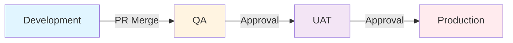

# Deployment Promotion Process

## Overview

This document defines the standard process for promoting deployments through the AGL Hostman environments: **Development → QA → UAT → Production**.

## Promotion Workflow



## Environments & Gates

### 1. Development (dev)
**Automatic Deployment**

**Trigger:**
- Push to feature branch
- Pull request creation
- Manual trigger via Dashboard

**No approval required** - All team members can deploy.

**Auto-deploy Configuration:**
```yaml
# config/deployments.yml
environments:
  development:
    auto_deploy: true
    branches:
      - "feature/*"
      - "bugfix/*"
      - "hotfix/*"
    notification_channels:
      - slack: "#dev-notifications"
```

**Promotion to QA:**
- Pull request reviewed and approved
- Merged to `develop` branch
- Automatic deployment to QA

### 2. Quality Assurance (qa)
**Semi-Automatic Deployment**

**Trigger:**
- Merge to `develop` branch
- Manual trigger after PR approval
- Scheduled nightly builds

**Approval Required:**
- At least 1 code review approval
- All CI checks passing (tests, linting, security)
- No merge conflicts

**Approval Command (API):**
```bash
POST /api/deployments/approve
{
  "deploymentId": "dep_qa_123",
  "approver": "user@example.com",
  "comment": "Approved for QA testing",
  "environment": "qa"
}
```

**QA Checklist:**
- [ ] Smoke tests pass
- [ ] Integration tests pass
- [ ] API endpoints functional
- [ ] Database migrations successful
- [ ] No critical bugs found
- [ ] Performance acceptable (<3s load time)

**Promotion to UAT:**
- QA team approval via Dashboard
- Minimum 24 hours of QA testing
- Bug severity: No critical/high bugs

### 3. User Acceptance Testing (uat)
**Manual Deployment with Approval Gate**

**Trigger:**
- Manual promotion from QA
- Scheduled release candidate
- Hotfix emergency deployment

**Approval Required:**
- QA lead approval
- Product manager sign-off
- Security review complete

**Approval Process:**
```bash
# Request promotion
POST /api/deployments/promote
{
  "fromEnvironment": "qa",
  "toEnvironment": "uat",
  "deploymentId": "dep_qa_456",
  "requestedBy": "qa-lead@example.com",
  "justification": "Ready for UAT - all QA tests passed"
}

# Approve promotion
POST /api/deployments/approve-promotion
{
  "promotionId": "prom_789",
  "approver": "product-manager@example.com",
  "approverRole": "product-manager",
  "comment": "Approved for UAT testing"
}
```

**UAT Testing Requirements:**
- [ ] Business requirements validated
- [ ] User acceptance criteria met
- [ ] End-to-end scenarios tested
- [ ] Performance under load
- [ ] Accessibility compliance
- [ ] Browser compatibility (Chrome, Firefox, Safari)
- [ ] Mobile responsiveness verified
- [ ] Security review passed

**Minimum UAT Duration:**
- **Minor releases:** 3 days
- **Major releases:** 7 days
- **Hotfixes:** 24 hours (emergency)

**Promotion to Production:**
- UAT stakeholders approval
- Change advisory board (CAB) approval for major releases
- Release notes published
- Rollback plan documented

### 4. Production (production)
**Manual Deployment with Multiple Approvals**

**Approval Required:**
- DevOps lead approval
- Technical director approval
- CAB approval for major releases
- Scheduled maintenance window (for major releases)

**Approval Command:**
```bash
POST /api/deployments/approve
{
  "deploymentId": "dep_prod_123",
  "environment": "production",
  "approvals": [
    {
      "approver": "devops-lead@example.com",
      "role": "devops-lead",
      "status": "approved",
      "comment": "Infrastructure ready"
    },
    {
      "approver": "tech-director@example.com",
      "role": "technical-director",
      "status": "approved",
      "comment": "Approved for production"
    }
  ],
  "scheduledAt": "2026-01-20T02:00:00Z",
  "maintenanceWindow": {
    "start": "2026-01-20T02:00:00Z",
    "end": "2026-01-20T04:00:00Z",
    "estimatedDowntime": "15 minutes"
  }
}
```

**Production Checklist:**
- [ ] All previous environment approvals complete
- [ ] Rollback plan documented and tested
- [ ] Monitoring alerts configured
- [ ] On-call engineer assigned
- [ ] Communication plan executed
- [ ] Backup verified before deployment
- [ ] Database migrations tested in staging
- [ ] Feature flags configured
- [ ] Load balancing verified
- [ ] SSL certificates valid

## Promotion API Endpoints

### Request Promotion
```http
POST /api/deployments/promote HTTP/1.1
Authorization: Bearer <token>
Content-Type: application/json

{
  "fromEnvironment": "qa",
  "toEnvironment": "uat",
  "deploymentId": "dep_qa_456",
  "requestedBy": "user@example.com",
  "justification": "Ready for next environment",
  "scheduledAt": "2026-01-18T10:00:00Z"
}
```

### Approve Promotion
```http
POST /api/deployments/approve-promotion HTTP/1.1
Authorization: Bearer <token>
Content-Type: application/json

{
  "promotionId": "prom_789",
  "approver": "user@example.com",
  "approverRole": "qa-lead",
  "comment": "Approved for UAT",
  "conditions": ["All tests passed", "No critical bugs"]
}
```

### Reject Promotion
```http
POST /api/deployments/reject-promotion HTTP/1.1
Authorization: Bearer <token>
Content-Type: application/json

{
  "promotionId": "prom_789",
  "approver": "user@example.com",
  "reason": "Performance issues detected",
  "blockers": ["API response time >5s", "Memory leaks"]
}
```

### Check Promotion Status
```http
GET /api/deployments/promotions/prom_789/status HTTP/1.1
Authorization: Bearer <token>

Response:
{
  "promotionId": "prom_789",
  "status": "pending_approval", // pending_approval, approved, rejected, deployed
  "fromEnvironment": "qa",
  "toEnvironment": "uat",
  "currentApprovals": ["qa-lead@example.com"],
  "requiredApprovals": ["qa-lead", "product-manager"],
  "requestedAt": "2026-01-16T10:00:00Z",
  "scheduledAt": "2026-01-18T10:00:00Z"
}
```

## Approval Matrix

| Environment | Required Approvers | Minimum Approvals | Auto-Deploy | Approval Time Limit |
|-------------|-------------------|-------------------|-------------|---------------------|
| Development | None | 0 | ✅ Yes | N/A |
| QA | 1 Code Reviewer | 1 | ✅ Yes (PR merge) | 24 hours |
| UAT | QA Lead + PM | 2 | ❌ No | 48 hours |
| Production | DevOps + Tech Director | 2 | ❌ No | 72 hours |

## Deployment Windows

### Standard Deployments
- **Development:** Anytime
- **QA:** Anytime (auto on PR merge)
- **UAT:** Business hours (9 AM - 5 PM UTC)
- **Production:** Maintenance windows only
  - **Tuesday/Thursday:** 2:00 AM - 4:00 AM UTC
  - **Emergency:** Anytime with additional approval

### Emergency Deployments
**Definition:** Critical security patches or production-hotfixes.

**Requirements:**
- Additional approval from Technical Director
- Emergency ticket created
- All stakeholders notified
- Rollback plan mandatory
- Post-incident review required

## Rollback Triggers

A deployment may be rolled back if:

**Automatic Rollback (Health Check Failure):**
- Container fails health checks (3 consecutive failures)
- HTTP endpoint returns 5xx errors (>50% requests)
- Response time >10 seconds
- Memory/CPU usage >90% for 5 minutes

**Manual Rollback:**
- Critical bug discovered post-deployment
- Data corruption or loss
- Security vulnerability
- Performance degradation >50%
- User-reported blocking issues

See [Rollback Documentation](./rollbacks.md) for rollback procedures.

## Notification Channels

### Deployment Events
```yaml
# config/notifications.yml
deployments:
  events:
    - triggered: slack "#deployments", email team@agl.io
    - building: slack "#deployments"
    - success: slack "#deployments", email team@agl.io
    - failed: slack "#alerts", email oncall@agl.io, SMS oncall
    - rolled_back: slack "#alerts", email management@agl.io

  environments:
    production:
      - slack: "#production-deployments"
      - email: ["devops@agl.io", "management@agl.io"]
      - wait_for_approval: true
```

### Approval Requests
```yaml
approvals:
  requested:
    slack: "#deployment-approvals"
    email: approvers@agl.io
    message: |
      Deployment ${deploymentId} awaiting approval for ${environment}
      Requested by: ${requestedBy}
      Justification: ${justification}
      Approve: ${approvalUrl}
```

## Best Practices

### Before Promotion
1. **Test thoroughly** in current environment
2. **Document all changes** (release notes)
3. **Verify rollback plan** is viable
4. **Notify all stakeholders** of upcoming deployment
5. **Check environment capacity** can handle load

### During Promotion
1. **Monitor deployment logs** in real-time
2. **Track metrics** (response times, error rates)
3. **Communicate progress** via status dashboard
4. **Be ready to rollback** if issues arise
5. **Document any anomalies** during deployment

### After Promotion
1. **Verify all functionality** works in new environment
2. **Monitor for issues** (24-hour watch period)
3. **Gather feedback** from stakeholders
4. **Update documentation** with any changes
5. **Celebrate success** 🎉

## Troubleshooting Promotion Issues

### Promotion Stuck in "Pending Approval"
**Solution:** Check if all required approvers have been notified. Manually remind approvers via Dashboard.

### Approval Timeout
**Solution:** Re-request approval with updated justification. Contact approvers directly if urgent.

### Environment Mismatch
**Solution:** Verify source environment matches expected state. Re-deploy to source if needed.

### Dependency Conflicts
**Solution:** Check if dependent services are compatible in target environment. Update dependencies first.

## Related Documentation

- [Rollbacks](./rollbacks.md) - Rollback procedures
- [Troubleshooting](./troubleshooting.md) - Common issues and solutions
- [WebSocket Events](../websocket/events.md) - Real-time deployment events
- [API Reference](../api/overview.md) - Deployment API endpoints

## Quick Reference

### Promotion Commands
```bash
# Request promotion
curl -X POST https://agl.io/api/deployments/promote \
  -H "Authorization: Bearer $TOKEN" \
  -d '{"fromEnvironment":"qa","toEnvironment":"uat","deploymentId":"dep_qa_456"}'

# Approve promotion
curl -X POST https://agl.io/api/deployments/approve-promotion \
  -H "Authorization: Bearer $TOKEN" \
  -d '{"promotionId":"prom_789","comment":"Approved"}'

# Check status
curl https://agl.io/api/deployments/promotions/prom_789/status \
  -H "Authorization: Bearer $TOKEN"
```

### WebSocket Monitoring
```javascript
// Monitor promotion status
Echo.channel('deployments.promotions')
  .listen('.promotion.status.changed', (data) => {
    console.log(`Promotion ${data.promotionId}: ${data.status}`);
  });
```
