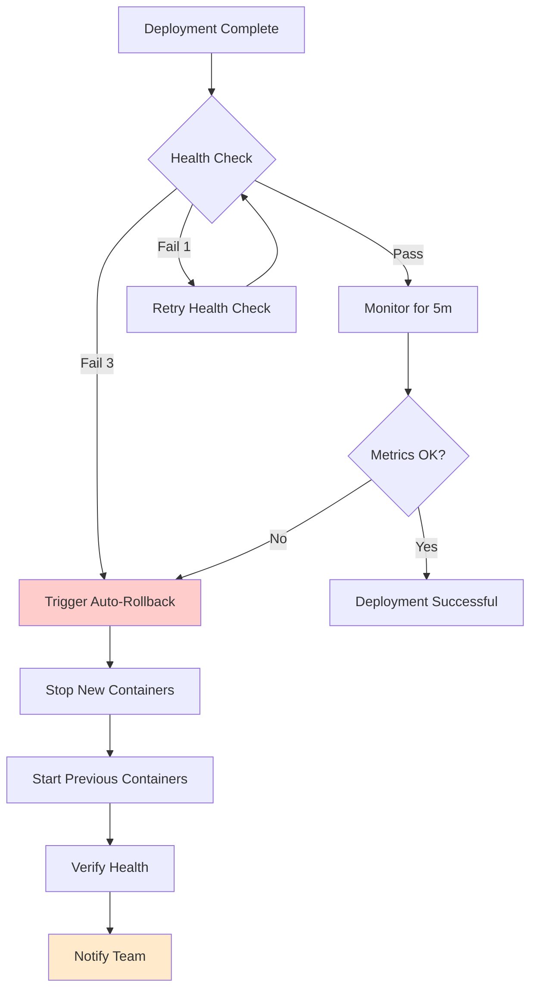

# Deployment Rollback Procedures

## Overview

This document provides comprehensive rollback procedures for AGL Hostman deployments, including automatic rollback triggers, manual rollback processes, and verification steps.

## Rollback Triggers

### Automatic Rollback Triggers

**Health Check Failures:**
```yaml
# Automatic rollback on health check failure
auto_rollback:
  enabled: true
  triggers:
    health_check:
      consecutive_failures: 3
      interval: 30s
      timeout: 10s

    http_errors:
      error_rate_threshold: 50  # 50% of requests
      duration: 2m
      status_codes: [500, 502, 503, 504]

    performance:
      response_time_threshold: 10s  # 10 seconds
      duration: 5m

    resources:
      cpu_usage_threshold: 90  # 90%
      memory_usage_threshold: 90  # 90%
      duration: 5m
```

**Example Automatic Rollback Flow:**


### Manual Rollback Triggers

**Business Logic Issues:**
- Critical bugs discovered post-deployment
- Data corruption or data loss
- Incorrect business logic
- Feature regression
- User-reported blocking issues

**Security Issues:**
- Security vulnerability exposed
- Authentication/authorization failures
- Data privacy breach
- Unauthorized access

**Performance Issues:**
- Response time degradation >50%
- Database query timeouts
- Memory leaks
- High CPU usage (sustained >80%)

**Integration Issues:**
- API failures
- Third-party service disruptions
- Database connection failures
- Cache issues

## Rollback Strategies

### 1. Immediate Rollback (Full Revert)
**Use case:** Critical issues requiring immediate revert to previous version.

**Time to execute:** 2-5 minutes

**Process:**
```bash
# Via Dashboard
Dashboard → Deployments → Select Deployment → Rollback → Choose Previous Version

# Via API
POST /api/deployments/rollback
{
  "deploymentId": "dep_prod_123",
  "targetVersion": "v1.2.2",
  "reason": "Critical bug in payment processing",
  "initiatedBy": "devops-lead@example.com",
  "immediate": true
}
```

**Steps:**
1. Identify previous stable version
2. Stop current containers (graceful shutdown, 30s timeout)
3. Start previous version containers
4. Verify health checks
5. Run smoke tests
6. Monitor metrics for 10 minutes

**Pros:**
- Fastest rollback option
- Returns to known good state
- Minimal user impact (2-5 min downtime)

**Cons:**
- Loses all changes in rolled-back version
- May not be viable if database schema changed

### 2. Blue-Green Rollback
**Use case:** Zero-downtime rollback using blue-green deployment strategy.

**Time to execute:** 1-2 minutes

**Process:**
```bash
# Switch traffic back to previous environment
POST /api/deployments/switch-traffic
{
  "deploymentId": "dep_prod_123",
  "targetEnvironment": "green",  # Previous version
  "strategy": "blue-green",
  "downtime": "zero"
}
```

**Steps:**
1. Keep both old (green) and new (blue) running
2. Switch Traefik routes to point to green
3. Monitor traffic on green environment
4. Stop blue environment after verification

**Pros:**
- Zero downtime
- Instant rollback (just routing change)
- Can switch back and forth for A/B testing

**Cons:**
- Requires 2x infrastructure resources
- More complex setup
- Database migrations must be backward compatible

### 3. Canary Rollback
**Use case:** Gradual rollback after canary deployment showed issues.

**Time to execute:** 5-10 minutes

**Process:**
```bash
# Reduce canary traffic to zero
POST /api/deployments/canary/adjust
{
  "deploymentId": "dep_prod_123",
  "canaryTraffic": 0,  # 0% traffic to new version
  "baselineTraffic": 100  # 100% traffic to old version
}
```

**Steps:**
1. Gradually reduce traffic to new version (100% → 75% → 50% → 25% → 0%)
2. Monitor error rates at each step
3. Complete rollback if errors persist
4. Stop canary containers

**Pros:**
- Controlled rollback
- Minimizes impact
- Can stop rollback at any point

**Cons:**
- Slower than immediate rollback
- Still serves some traffic to problematic version
- Complex monitoring required

### 4. Database Rollback
**Use case:** Database schema changes or data migrations causing issues.

**Time to execute:** 10-30 minutes (depending on data volume)

**Process:**
```bash
# Execute rollback migration
POST /api/deployments/database/rollback
{
  "deploymentId": "dep_prod_123",
  "migration": "2024_01_15_000000_add_payment_status_table",
  "rollbackTo": "2024_01_10_000000",
  "backupId": "backup_20240116_020000",
  "verifyDataIntegrity": true
}
```

**Steps:**
1. **Pre-rollback backup verification**
   ```bash
   # Verify backup exists and is valid
   pg_verifybackup /var/backups/postgresql/backup_20240116_020000
   ```

2. **Stop application writes**
   ```bash
   # Set application to maintenance mode
   php artisan down --message="Rolling back database changes"
   ```

3. **Execute rollback migration**
   ```bash
   # Run rollback migration
   php artisan migrate:rollback --step=1
   ```

4. **Restore data if needed**
   ```bash
   # Restore from backup
   pg_restore -d hostman_prod /var/backups/postgresql/backup_20240116_020000
   ```

5. **Verify data integrity**
   ```bash
   # Run data verification checks
   php artisan db:verify --checksum
   ```

6. **Bring application back online**
   ```bash
   php artisan up
   ```

**Pros:**
- Handles schema changes
- Restores data consistency
- Can use selective restores

**Cons:**
- Longest rollback time
- Potential data loss if backup not recent
- High complexity

## Rollback API

### Initiate Rollback
```http
POST /api/deployments/rollback HTTP/1.1
Authorization: Bearer <token>
Content-Type: application/json

{
  "deploymentId": "dep_prod_123",
  "targetVersion": "v1.2.2",
  "strategy": "immediate",  // immediate, blue-green, canary
  "reason": "Critical payment processing bug",
  "initiatedBy": "devops-lead@example.com",
  "notifications": {
    "slack": "#production-incidents",
    "email": ["oncall@agl.io", "management@agl.io"]
  }
}

Response:
{
  "rollbackId": "rollback_456",
  "status": "in_progress",
  "estimatedDuration": 300,  // seconds
  "steps": [
    {"step": "stop_containers", "status": "pending"},
    {"step": "start_previous_version", "status": "pending"},
    {"step": "verify_health", "status": "pending"},
    {"step": "run_smoke_tests", "status": "pending"}
  ]
}
```

### Monitor Rollback Progress
```http
GET /api/deployments/rollbacks/rollback_456 HTTP/1.1
Authorization: Bearer <token>

Response:
{
  "rollbackId": "rollback_456",
  "status": "in_progress",
  "progress": 50,  // percentage
  "currentStep": "Starting previous containers",
  "startedAt": "2026-01-16T10:30:00Z",
  "estimatedCompletion": "2026-01-16T10:35:00Z",
  "logs": [
    {"time": "10:30:00", "message": "Stopping current containers..."},
    {"time": "10:31:00", "message": "Containers stopped successfully"},
    {"time": "10:32:00", "message": "Starting previous version v1.2.2..."}
  ]
}
```

### Cancel Rollback
```http
POST /api/deployments/rollbacks/rollback_456/cancel HTTP/1.1
Authorization: Bearer <token>
Content-Type: application/json

{
  "reason": "Issue resolved, cancelling rollback",
  "cancelledBy": "devops-lead@example.com"
}
```

## WebSocket Events for Rollbacks

### RollbackInitiated
```javascript
// Channel: deployments.{deploymentId}
{
  eventType: "rollback.initiated",
  rollbackId: "rollback_456",
  deploymentId: "dep_prod_123",
  fromVersion: "v1.2.3",
  toVersion: "v1.2.2",
  strategy: "immediate",
  initiatedBy: "devops-lead@example.com",
  reason: "Critical payment processing bug",
  timestamp: "2026-01-16T10:30:00Z"
}
```

### RollbackProgressUpdated
```javascript
{
  eventType: "rollback.progress.updated",
  rollbackId: "rollback_456",
  progress: 50,
  currentStep: "Starting previous containers",
  status: "in_progress",
  timestamp: "2026-01-16T10:32:00Z"
}
```

### RollbackCompleted
```javascript
{
  eventType: "rollback.completed",
  rollbackId: "rollback_456",
  deploymentId: "dep_prod_123",
  status: "success",  // success, failed, partial
  duration: 285,  // seconds
  finalVersion: "v1.2.2",
  healthChecks: "passing",
  timestamp: "2026-01-16T10:35:00Z"
}
```

## Pre-Rollback Checklist

Before initiating a rollback, ensure:

- [ ] **Root cause identified** - Understand what went wrong
- [ ] **Previous version verified** - Confirm previous version was stable
- [ ] **Rollback plan documented** - Have clear rollback steps
- [ ] **Backup verified** - Database backup is valid and recent
- [ ] **Stakeholders notified** - Inform team and users if needed
- [ ] **Monitoring ready** - Ensure monitoring and alerting are active
- [ ] **On-call assigned** - Have engineer ready to handle issues
- [ ] **Communication plan** - Prepare announcement if user-facing

## Post-Rollback Verification

After rollback, verify:

### Health Checks
```bash
# Container health
docker ps --filter "name=hostman-prod" --format "table {{.Names}}\t{{.Status}}"

# HTTP endpoint health
curl -f https://agl.io/health || echo "Health check failed"

# Database connectivity
php artisan db:check

# Redis connectivity
php artisan redis:ping
```

### Smoke Tests
```bash
# Run automated smoke tests
php artisan test --testsuite=Smoke

# Manual smoke test checklist
- [ ] Homepage loads
- [ ] Login functional
- [ ] API endpoints responding
- [ ] Database queries working
- [ ] Cache functioning
- [ ] Background jobs processing
```

### Metrics Verification
```bash
# Check response times
curl -w "@curl-format.txt" https://agl.io/api/containers

# Monitor error rates
tail -f /var/log/nginx/error.log | grep "5xx"

# Check resource usage
docker stats --no-stream hostman-prod-app
```

## Rollback Decision Tree

```
Is there a critical issue?
│
├─ YES → Is it a data loss/corruption issue?
│         │
│         ├─ YES → Immediate Rollback + Database Restore
│         │
│         └─ NO → Is it a performance issue?
│                   │
│                   ├─ YES → Canary Rollback (monitor traffic)
│                   │
│                   └─ NO → Immediate Rollback
│
└─ NO → Continue monitoring (no rollback)
```

## Rollback Best Practices

### 1. **Fast Rollbacks**
- Automate rollback triggers where possible
- Use blue-green deployment for instant rollback
- Pre-define rollback scripts and procedures
- Practice rollbacks in non-production environments

### 2. **Communication**
- Notify team immediately of rollback
- Communicate with users if service is affected
- Post incident summary after rollback
- Document lessons learned

### 3. **Monitoring**
- Monitor rollback progress in real-time
- Verify all health checks pass
- Check metrics for 10-15 minutes post-rollback
- Set up enhanced monitoring temporarily

### 4. **Post-Incident Process**
```bash
# Create incident ticket
curl -X POST https://linear.app/api/issues \
  -d '{"title":"Incident: Rollback dep_prod_123","labels":["incident"]}'

# Schedule post-mortem
# Root cause analysis
# Improvement plan
# Update runbooks
```

## Rollback Scenarios

### Scenario 1: API 500 Errors
**Trigger:** 50%+ requests returning 500 errors

**Rollback Type:** Immediate Rollback

**Steps:**
1. Auto-rollback triggers after 2 minutes
2. Previous version (v1.2.2) containers start
3. Health checks verified
4. Team notified via Slack #alerts
5. Post-mortem scheduled

### Scenario 2: Database Migration Failure
**Trigger:** Migration stuck or data corruption detected

**Rollback Type:** Database Rollback

**Steps:**
1. Stop application (maintenance mode)
2. Verify backup from before migration
3. Restore database from backup
4. Run rollback migration
5. Verify data integrity
6. Start application
7. Run smoke tests

### Scenario 3: Performance Degradation
**Trigger:** Response time increased from 500ms to 8s

**Rollback Type:** Canary Rollback

**Steps:**
1. Reduce canary traffic to 50%
2. Monitor error rates and response times
3. If no improvement, reduce to 0% (full rollback)
4. Investigate performance issue in rolled-back version
5. Fix and redeploy when ready

### Scenario 4: Feature Flag Bug
**Trigger:** New feature causing user issues

**Rollback Type:** Feature Flag Rollback (No deployment rollback)

**Steps:**
1. Disable feature flag in configuration
2. Restart containers (no version change)
3. Verify issue resolved
4. Fix feature in development
5. Test and redeploy when ready

## Emergency Rollback Procedure

**For critical production emergencies:**

1. **Page on-call engineer** (SMS + Phone call)
2. **Assess situation** (5 minutes maximum)
3. **Make rollback decision** (yes/no)
4. **Execute rollback** (use immediate rollback strategy)
5. **Verify system health**
6. **Communicate status** (Slack #incidents)
7. **Document incident** (create ticket)
8. **Post-mortem** (within 24 hours)

## Rollback Metrics

Track these metrics to improve rollback processes:

- **Rollback Frequency:** % of deployments rolled back
- **Rollback Success Rate:** % of rollbacks that resolve the issue
- **Mean Time to Rollback (MTTR):** Average time from issue detection to rollback completion
- **Rollback Downtime:** Average service downtime during rollback
- **Post-Rollback Failure Rate:** % of rollbacks that introduce new issues

**Target Metrics:**
- Rollback Frequency: <5% of deployments
- Rollback Success Rate: >95%
- MTTR: <10 minutes
- Rollback Downtime: <5 minutes
- Post-Rollback Failure Rate: <2%

## Related Documentation

- [Promotion Process](./promotion-process.md) - Environment promotion and approval gates
- [Troubleshooting](./troubleshooting.md) - Common deployment issues
- [WebSocket Events](../websocket/events.md) - Real-time deployment and rollback events
- [API Reference](../api/overview.md) - Rollback API endpoints
