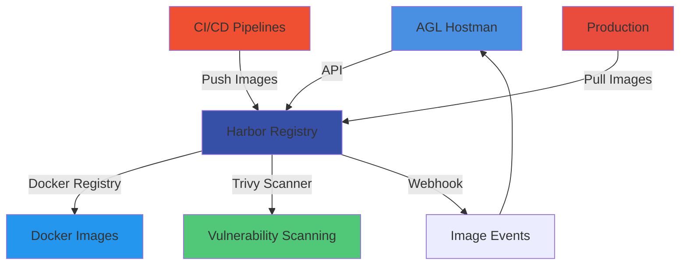

# Harbor Registry Integration Guide

## Overview

AGL Hostman integrates with Harbor for container registry management, providing secure image storage, vulnerability scanning, and access control for Docker images.

## Architecture



## Prerequisites

### Harbor Setup
1. **Harbor Instance:** Deployed and accessible (v2.8+ recommended)
2. **Projects:** Created for application images
3. **Users:** Appropriate service account created
4. **Network:** Reachable from AGL Hostman and deployment nodes

### Required Permissions
```properties
Harbor Robot Account Permissions:
- Project: Read, Write, Delete
- Repository: Pull, Push, Delete
- Artifact: Read, Delete
- Tag: Create, Delete
- Scan: Execute (for vulnerability scanning)
- Immutable Tag: Read
- Webhook: Read, Create, Delete
```

## Configuration

### Environment Variables
```env
# Harbor API Configuration
HARBOR_HOST=https://harbor.agl.io
HARBOR_USERNAME=agl-hostman-robot
HARBOR_PASSWORD=your-robot-account-secret
HARBOR_TIMEOUT=60

# Optional: Skip SSL verification (not recommended for production)
HARBOR_VERIFY_SSL=true

# Default project and repository
HARBOR_DEFAULT_PROJECT=agl-hostman
HARBOR_DEFAULT_REPOSITORY=applications

# Vulnerability scanning configuration
HARBOR_SCAN_ON_PUSH=true
HARBOR_SEVERITY_THRESHOLD=high  # low, medium, high, critical
```

### Robot Account Creation
```bash
# 1. Login to Harbor web UI
# 2. Administration → Robot Accounts → New Robot Account
# 3. Name: agl-hostman-robot
# 4. Expiration: 90 days (recommended)
# 5. Permissions:
#    - Project: agl-hostman (Read, Write, Delete)
#      - Repository: Pull, Push, Delete
#      - Artifact: Read, Delete
#      - Tag: Create, Delete
#      - Scan: Execute
# 6. Copy robot account secret (shown only once!)
# 7. Add to AGL Hostman .env file
```

### Service Configuration
```php
// config/harbor.php
return [
    'host' => env('HARBOR_HOST'),
    'username' => env('HARBOR_USERNAME'),
    'password' => env('HARBOR_PASSWORD'),
    'timeout' => env('HARBOR_TIMEOUT', 60),
    'verify_ssl' => env('HARBOR_VERIFY_SSL', true),

    'defaults' => [
        'project' => env('HARBOR_DEFAULT_PROJECT', 'agl-hostman'),
        'repository' => env('HARBOR_DEFAULT_REPOSITORY', 'applications'),
    ],

    'scanning' => [
        'on_push' => env('HARBOR_SCAN_ON_PUSH', true),
        'severity_threshold' => env('HARBOR_SEVERITY_THRESHOLD', 'high'),
    ],
];
```

## API Usage

### Service Initialization
```php
use App\Services\HarborService;

class ImageController extends Controller
{
    protected $harbor;

    public function __construct(HarborService $harbor)
    {
        $this->harbor = $harbor;
    }
}
```

### Common Operations

#### 1. List All Projects
```php
public function projects()
{
    $projects = $this->harbor->getProjects();

    return response()->json([
        'data' => $projects,
        'count' => count($projects)
    ]);
}
```

#### 2. List Repositories in Project
```php
public function repositories($project)
{
    $repositories = $this->harbor->getRepositories($project);

    return response()->json([
        'data' => $repositories,
        'project' => $project,
        'count' => count($repositories)
    ]);
}
```

#### 3. List Image Tags
```php
public function tags(Request $request, $project, $repository)
{
    $validated = $request->validate([
        'page' => 'integer|min:1',
        'page_size' => 'integer|min:1|max:100',
    ]);

    $tags = $this->harbor->getTags(
        $project,
        $repository,
        $validated['page'] ?? 1,
        $validated['page_size'] ?? 10
    );

    return response()->json([
        'data' => $tags,
        'project' => $project,
        'repository' => $repository,
        'count' => count($tags)
    ]);
}
```

#### 4. Get Image Manifest
```php
public function manifest($project, $repository, $reference)
{
    $manifest = $this->harbor->getManifest(
        $project,
        $repository,
        $reference  // tag or digest
    );

    return response()->json([
        'data' => [
            'manifest' => $manifest,
            'size' => $manifest['size'],
            'layers' => $manifest['layers'],
            'created' => $manifest['created'],
        ]
    ]);
}
```

#### 5. Push Image (Direct Upload)
```php
public function pushImage(Request $request)
{
    $validated = $request->validate([
        'image_path' => 'required|string',  // Local path to tar file
        'project' => 'required|string',
        'repository' => 'required|string',
        'tag' => 'required|string',
    ]);

    // Push image to Harbor
    $result = $this->harbor->pushImage(
        $validated['image_path'],
        $validated['project'],
        $validated['repository'],
        $validated['tag']
    );

    return response()->json([
        'data' => $result,
        'message' => 'Image pushed successfully'
    ], 201);
}
```

#### 6. Pull Image Info
```php
public function pullImage($project, $repository, $tag)
{
    $image = $this->harbor->getImageInfo(
        $project,
        $repository,
        $tag
    );

    return response()->json([
        'data' => [
            'name' => $image['name'],
            'tag' => $image['tag'],
            'digest' => $image['digest'],
            'size' => $image['size'],
            'created' => $image['created'],
            'pushed_at' => $image['pushed_at'],
            'pull_count' => $image['pull_count'],
            'scan_status' => $image['scan_status'],
        ]
    ]);
}
```

#### 7. Delete Image Tag
```php
public function deleteTag($project, $repository, $tag)
{
    try {
        $this->harbor->deleteTag($project, $repository, $tag);

        return response()->json([
            'message' => 'Tag deleted successfully'
        ], 200);
    } catch (\Exception $e) {
        return response()->json([
            'error' => 'Failed to delete tag',
            'message' => $e->getMessage()
        ], 500);
    }
}
```

#### 8. Scan Image for Vulnerabilities
```php
public function scanImage($project, $repository, $tag)
{
    $scan = $this->harbor->scanImage($project, $repository, $tag);

    return response()->json([
        'data' => $scan,
        'message' => 'Vulnerability scan initiated'
    ], 202);
}
```

#### 9. Get Scan Results
```php
public function scanResults($project, $repository, $tag)
{
    $results = $this->harbor->getScanResults($project, $repository, $tag);

    return response()->json([
        'data' => [
            'scan_status' => $results['status'],  // Success, Failed, Pending
            'severity' => $results['severity'],  // None, Low, Medium, High, Critical
            'vulnerabilities' => $results['vulnerabilities'],
            'fixable' => $results['fixable'],
            'scan_time' => $results['completed_at'],
            'summary' => [
                'total' => $results['summary']['total'],
                'critical' => $results['summary']['critical'],
                'high' => $results['summary']['high'],
                'medium' => $results['summary']['medium'],
                'low' => $results['summary']['low'],
            ]
        ]
    ]);
}
```

#### 10. Copy Image Between Projects
```php
public function copyImage(Request $request)
{
    $validated = $request->validate([
        'source_project' => 'required|string',
        'source_repository' => 'required|string',
        'source_tag' => 'required|string',
        'destination_project' => 'required|string',
        'destination_repository' => 'required|string',
    ]);

    $result = $this->harbor->copyImage(
        $validated['source_project'],
        $validated['source_repository'],
        $validated['source_tag'],
        $validated['destination_project'],
        $validated['destination_repository']
    );

    return response()->json([
        'data' => $result,
        'message' => 'Image copied successfully'
    ], 201);
}
```

## Webhook Integration

### Configure Harbor Webhook
```php
public function configureWebhook(Request $request)
{
    $validated = $request->validate([
        'project' => 'required|string',
        'name' => 'required|string',
        'events' => 'required|array',  // push_images, scan_image, etc.
        'events.*' => 'in:push_images,delete_images,pull_images,scan_image',
    ]);

    $webhook = $this->harbor->createWebhook(
        $validated['project'],
        $validated['name'],
        route('harbor.webhook'),  // AGL Hostman endpoint
        $validated['events'],
        true  // enabled
    );

    return response()->json([
        'data' => $webhook
    ], 201);
}
```

### Handle Harbor Webhook
```php
// Route: /api/webhooks/harbor
public function handleWebhook(Request $request)
{
    $payload = $request->all();

    switch ($payload['type']) {
        case 'push_image':
            $this->handleImagePushed($payload);
            break;

        case 'scan_image':
            $this->handleImageScanned($payload);
            break;

        case 'delete_image':
            $this->handleImageDeleted($payload);
            break;
    }

    return response()->json(['status' => 'success']);
}

protected function handleImagePushed($payload)
{
    $project = $payload['event_data']['repo_name'];
    $repository = explode('/', $project)[1];
    $tag = $payload['event_data']['tag'];
    $digest = $payload['event_data']['digest'];

    // Broadcast WebSocket event
    broadcast(new ImagePushedEvent([
        'project' => $project,
        'repository' => $repository,
        'tag' => $tag,
        'digest' => $digest,
        'pushed_at' => now()
    ]));

    // Trigger automatic vulnerability scan if enabled
    if (config('harbor.scanning.on_push')) {
        $this->harbor->scanImage($project, $repository, $tag);
    }
}

protected function handleImageScanned($payload)
{
    $project = $payload['event_data']['repo_name'];
    $repository = explode('/', $project)[1];
    $tag = $payload['event_data']['tag'];
    $scanResults = $payload['event_data']['scan'];

    // Check severity threshold
    $severity = $scanResults['severity'];
    $threshold = config('harbor.scanning.severity_threshold');

    $severityLevels = ['none', 'low', 'medium', 'high', 'critical'];
    $severityIndex = array_search($severity, $severityLevels);
    $thresholdIndex = array_search($threshold, $severityLevels);

    if ($severityIndex >= $thresholdIndex) {
        // Alert team about vulnerability
        $this->alertVulnerability([
            'project' => $project,
            'repository' => $repository,
            'tag' => $tag,
            'severity' => $severity,
            'vulnerabilities' => $scanResults['summary']['total']
        ]);
    }

    // Broadcast scan complete event
    broadcast(new ImageScannedEvent([
        'project' => $project,
        'repository' => $repository,
        'tag' => $tag,
        'severity' => $severity,
        'scan_results' => $scanResults
    ]));
}
```

## Docker Client Configuration

### Login to Harbor
```bash
# From deployment servers
docker login harbor.agl.io \
  --username agl-hostman-robot \
  --password <robot-secret>

# Or use Docker config
cat > ~/.docker/config.json <<EOF
{
  "auths": {
    "harbor.agl.io": {
      "auth": "$(echo -n 'agl-hostman-robot:<robot-secret>' | base64)"
    }
  }
}
EOF
```

### Push Image
```bash
# Tag image
docker tag myapp:latest harbor.agl.io/agl-hostman/myapp:latest

# Push to Harbor
docker push harbor.agl.io/agl-hostman/myapp:latest
```

### Pull Image
```bash
# Pull from Harbor
docker pull harbor.agl.io/agl-hostman/myapp:latest
```

## Vulnerability Management

### Automatic Scanning on Push
```php
// Enable automatic scanning
$harbor->setProjectScanOnPush('agl-hostman', true);

// This ensures all pushed images are automatically scanned
```

### Vulnerability Severity Levels
```php
// Define severity thresholds
$thresholds = [
    'none' => 0,      // No vulnerabilities
    'low' => 1,       // Low severity issues
    'medium' => 2,    // Medium severity issues
    'high' => 3,      // High severity issues
    'critical' => 4   // Critical severity issues
];

// Block deployment if threshold exceeded
if ($severityIndex >= $thresholdIndex) {
    throw new \Exception(
        "Image has {$severity} vulnerabilities exceeding threshold of {$threshold}"
    );
}
```

### Vulnerability Alerting
```php
protected function alertVulnerability($data)
{
    // Send alert to Slack
    Http::post(config('services.slack.webhook'), [
        'text' => sprintf(
            '🚨 Vulnerability Alert: %s/%s:%s has %s vulnerabilities',
            $data['project'],
            $data['repository'],
            $data['tag'],
            $data['severity']
        ),
        'attachments' => [[
            'color' => 'danger',
            'fields' => [
                ['title' => 'Severity', 'value' => $data['severity'], 'short' => true],
                ['title' => 'Vulnerabilities', 'value' => $data['vulnerabilities'], 'short' => true],
            ]
        ]]
    ]);

    // Create incident ticket
    // ...

    // Send email to security team
    // ...
}
```

## Image Retention Policy

### Configure Retention Policy
```php
public function setRetentionPolicy(Request $request, $project)
{
    $validated = $request->validate([
        'algorithm' => 'required|in:orphan,last_pushed,n_since_created',
        'params' => 'required|array',
        'params.days' => 'integer|min:1',
        'params.keep_n' => 'integer|min:1',
    ]);

    $policy = $this->harbor->setRetentionPolicy(
        $project,
        $validated['algorithm'],
        $validated['params']
    );

    return response()->json([
        'data' => $policy
    ]);
}
```

### Example Retention Policies
```php
// Keep last 10 tags
$harbor->setRetentionPolicy('agl-hostman', 'orphan', [
    'keep_n' => 10,
    'latest_first' => true
]);

// Delete tags older than 30 days
$harbor->setRetentionPolicy('agl-hostman', 'last_pushed', [
    'days' => 30,
    'keep_latest_n' => 5
]);
```

## Replication

### Configure Replication to Remote Registry
```php
public function configureReplication(Request $request)
{
    $validated = $request->validate([
        'source_project' => 'required|string',
        'destination_registry' => 'required|string',
        'destination_project' => 'required|string',
        'filters' => 'nullable|array',
        'triggers' => 'required|array',  // manual, scheduled, event_based
    ]);

    $replication = $this->harbor->createReplicationPolicy([
        'name' => sprintf('%s-to-%s', $validated['source_project'], $validated['destination_project']),
        'src_registry' => ['id' => 1],  // Local Harbor
        'dest_registry' => [
            'url' => $validated['destination_registry'],
            'username' => env('REMOTE_REGISTRY_USERNAME'),
            'password' => env('REMOTE_REGISTRY_PASSWORD'),
        ],
        'src_namespace' => $validated['source_project'],
        'dest_namespace' => $validated['destination_project'],
        'filters' => $validated['filters'] ?? [],
        'triggers' => $validated['triggers'],
        'deletion' => false,
        'override' => true,
    ]);

    return response()->json([
        'data' => $replication
    ], 201);
}
```

### Execute Manual Replication
```php
public function executeReplication($policyId)
{
    $execution = $this->harbor->executeReplication($policyId);

    return response()->json([
        'data' => $execution,
        'message' => 'Replication initiated'
    ], 202);
}
```

## Troubleshooting

### Common Issues

#### Issue: Authentication Failed
**Error:** `401 Unauthorized`

**Solutions:**
1. Verify robot account credentials
2. Check robot account expiration
3. Verify robot account has required permissions
4. Regenerate robot account secret if needed

```bash
# Test robot account credentials
curl -u 'agl-hostman-robot:<secret>' \
  https://harbor.agl.io/api/v2.0/projects
```

#### Issue: Pull Rate Limit Exceeded
**Error:** `429 Too Many Requests`

**Solutions:**
1. Configure pull rate limiting in Harbor
2. Use image caching on deployment servers
3. Implement replication for frequently pulled images

```php
// Check pull rate limit
$limits = $harbor->getProjectPullRateLimit('agl-hostman');
```

#### Issue: Scan Timeout
**Error:** `Vulnerability scan timed out`

**Solutions:**
1. Increase Trivy scanner timeout
2. Use more powerful scanner instance
3. Scan images during off-peak hours

```php
// Increase scan timeout
$harbor->setScanTimeout(600); // 10 minutes
```

#### Issue: Large Image Upload Timeout
**Error:** `Image upload timed out`

**Solutions:**
1. Increase Harbor timeout configuration
2. Use direct S3/MinIO storage backend
3. Compress images before upload
4. Use layer caching for faster uploads

## Best Practices

### 1. Use Semantic Versioning
```bash
# Good: Semantic versioning
harbor.agl.io/agl-hostman/myapp:1.2.3
harbor.agl.io/agl-hostman/myapp:1.2.4
harbor.agl.io/agl-hostman/myapp:2.0.0

# Bad: Random hashes
harbor.agl.io/agl-hostman/myapp:abc123def
harbor.agl.io/agl-hostman/myapp:xyz789ghi
```

### 2. Multi-Architecture Images
```bash
# Build for multiple architectures
docker buildx build \
  --platform linux/amd64,linux/arm64 \
  -t harbor.agl.io/agl-hostman/myapp:latest \
  --push .
```

### 3. Layer Caching
```dockerfile
# Optimize Dockerfile for layer caching
FROM node:18-alpine AS builder
WORKDIR /app
# Copy package files first (for better caching)
COPY package*.json ./
RUN npm ci --only=production
# Copy source code
COPY . .
RUN npm run build
```

### 4. Minimal Image Size
```dockerfile
# Use alpine or distroless images
FROM node:18-alpine  # ~120MB
# Instead of
FROM node:18  # ~900MB
```

### 5. Scan Before Production
```php
// Always scan before deploying to production
$scanResults = $harbor->getScanResults('agl-hostman', 'myapp', '1.2.3');

if ($scanResults['severity'] !== 'none') {
    // Block deployment if vulnerabilities found
    throw new \Exception('Image has unresolved vulnerabilities');
}
```

## Security Considerations

### 1. Robot Account Rotation
```bash
# Rotate robot accounts every 90 days
# 1. Delete old robot account
# 2. Create new robot account
# 3. Update .env files
# 4. Restart services
```

### 2. Immutable Tags
```php
// Make production tags immutable
$harbor->setImmutableTag('agl-hostman', 'myapp', '1.2.3', true);
```

### 3. Content Trust
```bash
# Enable Docker Content Trust (Notary)
export DOCKER_CONTENT_TRUST=1
docker push harbor.agl.io/agl-hostman/myapp:1.2.3
```

### 4. Network Policies
```yaml
# Restrict Harbor access to specific IPs
# Harbor firewall configuration
firewall-cmd --permanent --add-rich-rule='rule family="ipv4" source address="10.0.0.0/8" service name="https" accept'
firewall-cmd --reload
```

## Monitoring & Metrics

### Harbor Metrics
```php
// Get project statistics
$stats = $harbor->getProjectStatistics('agl-hostman');

return response()->json([
    'data' => [
        'repo_count' => $stats['repo_count'],
        'total_pulls' => $stats['pull_count'],
        'total_pushes' => $stats['push_count'],
        'storage_bytes' => $stats['storage_bytes'],
        'scan_overview' => $stats['scan_overview'],
    ]
]);
```

### Custom Metrics
```php
// Track deployment image pulls
$pulls = DB::table('image_pulls')
    ->where('project', 'agl-hostman')
    ->where('repository', 'myapp')
    ->where('created_at', '>=', now()->subDays(30))
    ->count();
```

## API Reference

### Endpoints
```http
# Projects
GET    /api/harbor/projects
GET    /api/harbor/projects/{id}
POST   /api/harbor/projects
PUT    /api/harbor/projects/{id}
DELETE /api/harbor/projects/{id}

# Repositories & Tags
GET    /api/harbor/projects/{project}/repositories
GET    /api/harbor/projects/{project}/repositories/{repository}/artifacts
GET    /api/harbor/projects/{project}/repositories/{repository}/artifacts/{reference}
DELETE /api/harbor/projects/{project}/repositories/{repository}/artifacts/{reference}

# Vulnerability Scanning
POST   /api/harbor/projects/{project}/repositories/{repository}/artifacts/{reference}/scan
GET    /api/harbor/projects/{project}/repositories/{repository}/artifacts/{reference}/scan

# Replication
GET    /api/harbor/replication/policies
POST   /api/harbor/replication/policies
POST   /api/harbor/replication/execution

# Webhooks
GET    /api/harbor/projects/{project}/webhooks
POST   /api/harbor/projects/{project}/webhooks
PUT    /api/harbor/projects/{project}/webhooks/{id}
DELETE /api/harbor/projects/{project}/webhooks/{id}
```

## Related Documentation

- [Dokploy Integration](./dokploy.md) - Deployment automation
- [Proxmox Integration](./proxmox.md) - Container management
- [WebSocket Events](../websocket/events.md) - Real-time image events
- [Security Best Practices](../security/overview.md) - Container security
