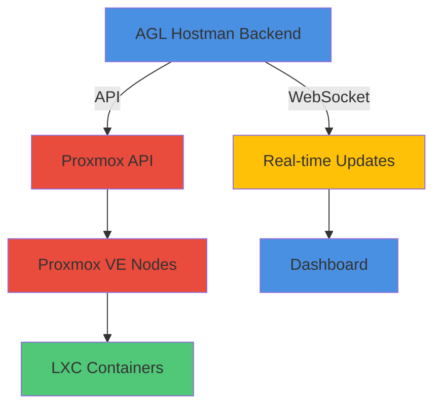

# Proxmox VE Integration Guide

## Overview

AGL Hostman integrates with Proxmox VE to manage LXC containers, providing automated container creation, monitoring, and management capabilities.

## Architecture



## Prerequisites

### Proxmox VE Setup
1. **Proxmox VE Version:** 8.x or later
2. **API Access:** Enabled and accessible
3. **Network:** Hostname/IP reachable from AGL Hostman
4. **Permissions:** Appropriate role with VM/Container management permissions

### Required Permissions
```properties
Proxmox User Permissions:
- /nodes/{node}/ - [Audit, Allocate]
- /nodes/{node}/lxc - [VM.Admin.PowerMgmt, VM.Allocate, VM.Config.Memory]
- /nodes/{node}/lxc/{vmid} - [VM.Config.Network, VM.Config.Options]
- /access/users - [User.Modify]
- /access/tokens - [User.Modify]
```

## Configuration

### Environment Variables
```env
# Proxmox API Configuration
PROXMOX_HOST=https://proxmox.agl.io:8006
PROXMOX_USERNAME=root@pam!agl-hostman
PROXMOX_TOKEN_ID=agl-hostman-token
PROXMOX_TOKEN_SECRET=your-token-secret-here
PROXMOXRealm=pam

# Optional: Skip SSL verification (not recommended for production)
PROXMOX_VERIFY_SSL=true
PROXMOX_TIMEOUT=30
```

### API Token Creation
```bash
# 1. Login to Proxmox web UI
# 2. Datacenter → Permissions → API Tokens
# 3. Select user: root@pam
# 4. Click "Add": Token ID: agl-hostman-token
# 5. Copy the token secret (shown only once!)
# 6. Add to AGL Hostman .env file
```

### Service Configuration
```php
// config/proxmox.php
return [
    'host' => env('PROXMOX_HOST'),
    'username' => env('PROXMOX_USERNAME'),
    'token_id' => env('PROXMOX_TOKEN_ID'),
    'token_secret' => env('PROXMOX_TOKEN_SECRET'),
    'realm' => env('PROXMOX_REALM', 'pam'),
    'verify_ssl' => env('PROXMOX_VERIFY_SSL', true),
    'timeout' => env('PROXMOX_TIMEOUT', 30),
];
```

## API Usage

### Service Initialization
```php
use App\Services\ProxmoxService;

class ContainerController extends Controller
{
    protected $proxmox;

    public function __construct(ProxmoxService $proxmox)
    {
        $this->proxmox = $proxmox;
    }
}
```

### Common Operations

#### 1. List All Containers
```php
public function index()
{
    $containers = $this->proxmox->getContainers();

    return response()->json([
        'data' => $containers,
        'count' => count($containers)
    ]);
}
```

#### 2. Get Container Details
```php
public function show($vmid)
{
    $container = $this->proxmox->getContainer($vmid);

    return response()->json([
        'data' => $container
    ]);
}
```

#### 3. Create Container
```php
public function store(Request $request)
{
    $validated = $request->validate([
        'node' => 'required|string',
        'vmid' => 'required|integer|unique:containers,vmid',
        'hostname' => 'required|string',
        'template' => 'required|string', // e.g., 'local:vztmpl/ubuntu-22.04-standard_22.04-1_amd64.tar.zst'
        'cores' => 'integer|min:1|max=16',
        'memory' => 'integer|min:512|max:32768', // MB
        'swap' => 'integer|min:0|max:8192', // MB
        'storage' => 'required|string', // e.g., 'local-lvm:32'
        'password' => 'required|string',
        'ssh_public_keys' => 'nullable|string',
        'network' => 'required|array', // IP configuration
        'features' => 'nullable|array', // Additional features
    ]);

    $container = $this->proxmox->createContainer($validated);

    return response()->json([
        'data' => $container,
        'message' => 'Container creation initiated'
    ], 202);
}
```

#### 4. Start Container
```php
public function start($vmid)
{
    try {
        $this->proxmox->startContainer($vmid);

        return response()->json([
            'message' => 'Container start initiated'
        ], 202);
    } catch (\Exception $e) {
        return response()->json([
            'error' => 'Failed to start container',
            'message' => $e->getMessage()
        ], 500);
    }
}
```

#### 5. Stop Container
```php
public function stop($vmid)
{
    try {
        $this->proxmox->stopContainer($vmid);

        return response()->json([
            'message' => 'Container stop initiated'
        ], 202);
    } catch (\Exception $e) {
        return response()->json([
            'error' => 'Failed to stop container',
            'message' => $e->getMessage()
        ], 500);
    }
}
```

#### 6. Restart Container
```php
public function restart($vmid)
{
    try {
        $this->proxmox->restartContainer($vmid);

        return response()->json([
            'message' => 'Container restart initiated'
        ], 202);
    } catch (\Exception $e) {
        return response()->json([
            'error' => 'Failed to restart container',
            'message' => $e->getMessage()
        ], 500);
    }
}
```

#### 7. Delete Container
```php
public function destroy($vmid)
{
    try {
        // Stop container first
        $this->proxmox->stopContainer($vmid);

        // Wait for stop to complete
        sleep(5);

        // Delete container
        $this->proxmox->deleteContainer($vmid);

        return response()->json([
            'message' => 'Container deleted successfully'
        ], 200);
    } catch (\Exception $e) {
        return response()->json([
            'error' => 'Failed to delete container',
            'message' => $e->getMessage()
        ], 500);
    }
}
```

#### 8. Get Container Statistics
```php
public function stats($vmid)
{
    $stats = $this->proxmox->getContainerStats($vmid);

    return response()->json([
        'data' => [
            'cpu' => $stats['cpu'], // CPU usage percentage
            'memory' => [
                'used' => $stats['mem'],
                'total' => $stats['maxmem'],
                'usage_percent' => ($stats['mem'] / $stats['maxmem']) * 100
            ],
            'network' => [
                'in' => $stats['netin'],
                'out' => $stats['netout']
            ],
            'disk' => [
                'read' => $stats['diskread'],
                'write' => $stats['diskwrite']
            ],
            'uptime' => $stats['uptime']
        ]
    ]);
}
```

## Real-Time Updates

### WebSocket Events
AGL Hostman broadcasts real-time container status changes via WebSocket.

### Event: ContainerStatusChanged
**Channel:** `infrastructure.container.{vmid}`

**Event Data:**
```javascript
{
  eventType: "container.status.changed",
  vmid: 105,
  status: "running",  // running, stopped, creating, deleting
  node: "aglsrv6",
  cpu: 5.2,
  memory: 2048,
  maxMemory: 4096,
  disk: "local-lvm:32",
  network: {
    in: 1048576,
    out: 524288
  },
  uptime: 86400,
  timestamp: "2026-01-16T10:30:00Z"
}
```

### Frontend Subscription
```javascript
import Echo from 'laravel-echo';

// Subscribe to container updates
Echo.channel(`infrastructure.container.${vmid}`)
  .listen('.container.status.changed', (data) => {
    console.log(`Container ${data.vmid} status: ${data.status}`);

    // Update UI
    updateContainerStatus(data.vmid, data.status);
    updateContainerMetrics(data.vmid, {
      cpu: data.cpu,
      memory: data.memory,
      network: data.network
    });
  });
```

## Container Templates

### Supported Templates
```php
// Available container templates
$templates = [
    'ubuntu-22.04' => 'local:vztmpl/ubuntu-22.04-standard_22.04-1_amd64.tar.zst',
    'ubuntu-20.04' => 'local:vztmpl/ubuntu-20.04-standard_20.04-1_amd64.tar.zst',
    'debian-12' => 'local:vztmpl/debian-12-standard_12.0-1_amd64.tar.zst',
    'alpine-3.19' => 'local:vztmpl/alpine-3.19-standard_3.19.1-0_amd64.tar.zst',
];
```

### Custom Template Creation
```bash
# Create LXC template from running container
# 1. Create and configure container
# 2. Stop container
pct stop <vmid>

# 3. Create template
pct template <vmid>

# 4. Template will be available in local storage
# Path: /var/lib/vz/template/cache/
```

## Network Configuration

### Static IP Assignment
```php
$networkConfig = [
    'net0' => 'name=eth0,bridge=vmbr0,ip=192.168.1.100/24,gw=192.168.1.1'
];
```

### DHCP Configuration
```php
$networkConfig = [
    'net0' => 'name=eth0,bridge=vmbr0,ip=dhcp'
];
```

### Multiple Network Interfaces
```php
$networkConfig = [
    'net0' => 'name=eth0,bridge=vmbr0,ip=192.168.1.100/24,gw=192.168.1.1',
    'net1' => 'name=eth1,bridge=vmbr1,ip=10.0.0.100/24'
];
```

## Storage Configuration

### Storage Backends
```properties
local-lvm: LVM volume group (fast, local storage)
local-zfs: ZFS dataset (fast, snapshots, compression)
nfs: Network File System (shared storage)
ceph: Ceph RBD (distributed storage)
```

### Storage Allocation
```php
// Create container with specific storage
$storage = 'local-lvm:32';  // 32GB on local-lvm

// Or with ZFS compression
$storage = 'local-zfs:32,compress=zstd';
```

## Container Features

### Enable Nesting (Docker-in-LXC)
```php
$features = [
    'nesting=1'  // Allow nested virtualization
];
```

### Enable Keyctl
```php
$features = [
    'keyctl=1'  // Enable keyctl for containers
];
```

### Override Unprivileged
```php
// WARNING: Security risk - only for trusted containers
$features = [
    'unprivileged=0'  // Run as privileged container
];
```

## Troubleshooting

### Common Issues

#### Issue: API Connection Refused
**Error:** `cURL error 7: Failed to connect to proxmox.agl.io port 8006`

**Solutions:**
1. Check Proxmox API is enabled
2. Verify network connectivity
3. Check firewall rules
4. Verify SSL certificate

```bash
# Test API connectivity
curl -k https://proxmox.agl.io:8006/api2/json/cluster/resources

# Check Proxmox API status
systemctl status pveproxy
```

#### Issue: Authentication Failed
**Error:** `401 Permission denied`

**Solutions:**
1. Verify API token is valid
2. Check token permissions
3. Verify token hasn't expired
4. Regenerate token if needed

```bash
# Test API token
curl -k \
  -H "Authorization: PVEAPIToken=root@pam!agl-hostman-token=uuid-secret" \
  https://proxmox.agl.io:8006/api2/json/version
```

#### Issue: Container Creation Failed
**Error:** `400 Parameter verification failed`

**Solutions:**
1. Verify template exists
2. Check VMID is unique
3. Validate network configuration
4. Ensure sufficient storage

```php
// Validate VMID is available
if ($this->proxmox->vmidExists($vmid)) {
    throw new \Exception("VMID {$vmid} already in use");
}
```

#### Issue: Container Won't Start
**Error:** `Container configuration file missing`

**Solutions:**
1. Check container configuration
2. Verify storage is mounted
3. Check for lock files
4. Verify network bridge exists

```bash
# Check container config
cat /etc/pve/lxc/<vmid>.conf

# Remove lock files
rm /var/lock/lxc/lxc/<vmid>
```

## Monitoring & Metrics

### Metrics Collection
```php
// Get container metrics for monitoring
$metrics = $this->proxmox->getContainerMetrics($vmid);

// Store metrics in database for historical analysis
DB::table('container_metrics')->insert([
    'vmid' => $vmid,
    'cpu_usage' => $metrics['cpu'],
    'memory_usage' => $metrics['memory'],
    'disk_usage' => $metrics['disk'],
    'network_in' => $metrics['netin'],
    'network_out' => $metrics['netout'],
    'recorded_at' => now()
]);
```

### Alert Thresholds
```yaml
# config/alerts.yml
proxmox:
  containers:
    cpu_warning: 80
    cpu_critical: 95
    memory_warning: 80
    memory_critical: 95
    disk_warning: 85
    disk_critical: 95
```

## Best Practices

### 1. Resource Limits
```php
// Always set resource limits
$limits = [
    'cores' => 2,  // Limit CPU cores
    'memory' => 2048,  // 2GB RAM
    'swap' => 1024,  // 1GB swap
];
```

### 2. Unprivileged Containers
```php
// Use unprivileged containers for security
$features = [
    'unprivileged=1'  // Default, more secure
];
```

### 3. Regular Snapshots
```bash
# Create snapshot before changes
pct snapshot <vmid> pre-upgrade-$(date +%Y%m%d)

# List snapshots
pct snapshot <vmid> list

# Restore snapshot
pct snapshot <vmid> rollback pre-upgrade-YYYYMMDD
```

### 4. Backup Strategy
```bash
# Backup container configuration
vzdump --dumpdir /backup --mode snapshot --all 1

# Backup specific container
vzdump --dumpdir /backup --mode snapshot <vmid>
```

## Security Considerations

### API Token Security
- Rotate tokens regularly (90 days)
- Use least privilege permissions
- Store tokens in environment variables
- Never commit tokens to version control
- Use token restrictions (IP, expiration)

### Network Security
```yaml
# Proxmox firewall
pve-firewall enable
pve-firewall add <vmid> --action ACCEPT --proto tcp --dport 22 --source 192.168.1.0/24
```

### Container Isolation
- Use unprivileged containers
- Limit container resources
- Implement network quotas
- Use AppArmor profiles
- Regular security updates

## API Reference

### Endpoints
```http
# List all containers
GET /api/proxmox/containers

# Get container details
GET /api/proxmox/containers/{vmid}

# Create container
POST /api/proxmox/containers

# Update container
PUT /api/proxmox/containers/{vmid}

# Delete container
DELETE /api/proxmox/containers/{vmid}

# Start container
POST /api/proxmox/containers/{vmid}/start

# Stop container
POST /api/proxmox/containers/{vmid}/stop

# Restart container
POST /api/proxmox/containers/{vmid}/restart

# Get container stats
GET /api/proxmox/containers/{vmid}/stats

# Get container console
GET /api/proxmox/containers/{vmid}/console
```

## Related Documentation

- [Dokploy Integration](./dokploy.md) - Container deployment automation
- [WebSocket Events](../websocket/events.md) - Real-time container events
- [API Reference](../api/overview.md) - Complete API documentation
