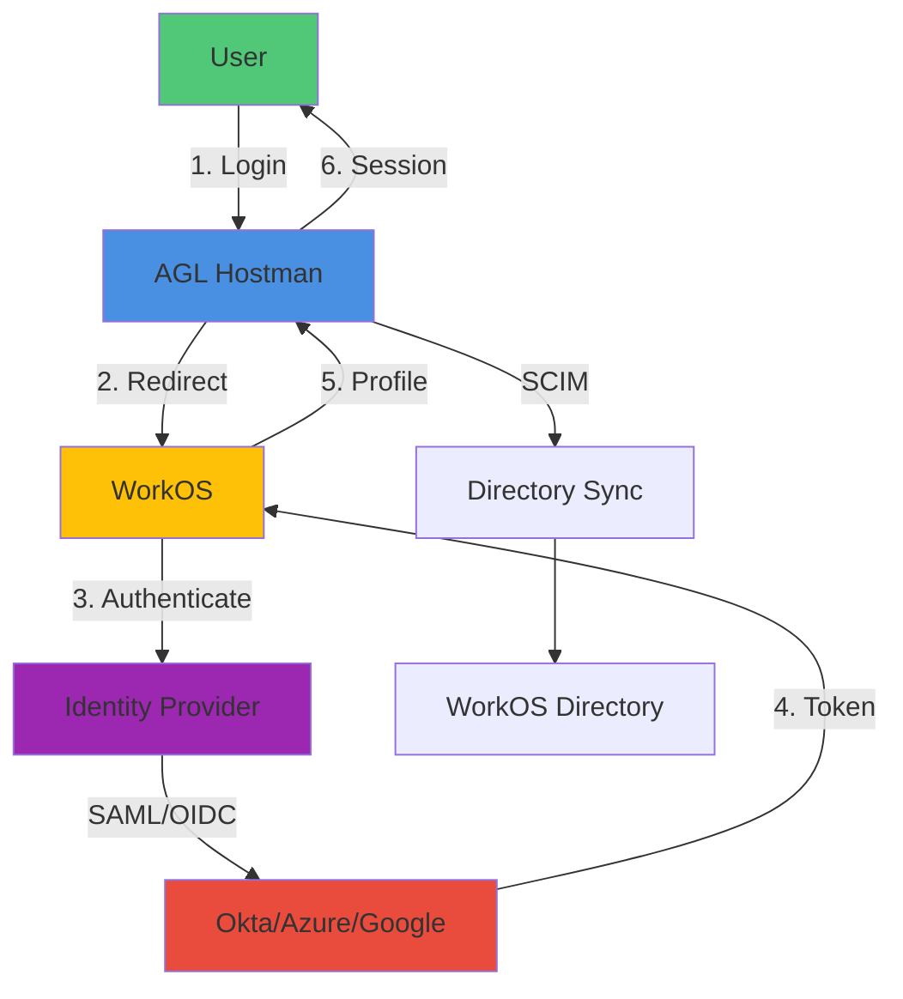

# WorkOS Authentication Integration Guide

## Overview

AGL Hostman integrates with WorkOS for enterprise authentication, providing SSO (Single Sign-On), SCIM (System for Cross-domain Identity Management), and user management capabilities.

## Architecture



## Prerequisites

### WorkOS Setup
1. **WorkOS Account:** Created and verified
2. **Application:** Configured in WorkOS dashboard
3. **API Key:** Generated (Production and Test)
4. **Connection:** SSO connection configured with IdP

### Identity Provider (IdP) Setup
Choose one of the following supported IdPs:
- **Okta:** SAML 2.0 or OpenID Connect
- **Azure AD:** SAML 2.0 or OpenID Connect
- **Google Workspace:** SAML 2.0 or OpenID Connect
- **OneLogin:** SAML 2.0
- **Other SAML 2.0** compliant IdPs

## Configuration

### Environment Variables
```env
# WorkOS API Configuration
WORKOS_API_KEY=sk_test_123456789  # Test or sk_production_...
WORKOS_CLIENT_ID=client_123456789
WORKOS_SECRET_KEY=secret_key_from_workos_dashboard

# WorkOS API Configuration
WORKOS_API_URL=https://api.workos.com

# SSO Configuration
WORKOS_REDIRECT_URI=https://agl.io/auth/callback
WORKOS_POST_LOGOUT_REDIRECT_URI=https://agl.io

# SCIM Configuration (optional)
WORKOS_SCIM_ENDPOINT=https://agl.io/scim/v2
WORKOS_SCIM_BEARER_TOKEN=scim_token_from_workos

# Session Configuration
WORKOS_SESSION_LIFETIME=43200  # 12 hours in seconds
WORKOS_REFRESH_TOKEN_LIFETIME=2592000  # 30 days
```

### WorkOS Dashboard Setup

#### 1. Create Application
```bash
# 1. Login to WorkOS Dashboard: https://dashboard.workos.com
# 2. Go to: Applications → Create Application
# 3. Fill in details:
#    - Name: AGL Hostman
#    - Description: Infrastructure Management Platform
#    - Environment: Production
#    - Development Mode: Disabled
# 4. Choose Connection Type:
#    - SAML 2.0 (for Okta, Azure AD, Google Workspace)
#    - OIDC (OpenID Connect)
# 5. Configure Callback URLs:
#    - Redirect URI: https://agl.io/auth/callback
#    - Post Logout Redirect URI: https://agl.io
# 6. Copy API Key and Client ID
# 7. Add to AGL Hostman .env file
```

#### 2. Configure SSO Connection
```bash
# For Okta:
# 1. Login to Okta Admin Console
# 2. Applications → Create App Integration → SAML 2.0
# 3. Configure SAML settings:
#    - Single Sign On URL: https://api.workos.com/sso/saml
#    - Audience URI: WorkOS Client ID
#    - Name ID Format: emailAddress
# 4. Copy Okta Issuer URL
# 5. Add to WorkOS Connection Settings

# For Azure AD:
# 1. Login to Azure Portal → Azure Active Directory
# 2. Enterprise Applications → New Application
# 3. Single Sign-On → SAML
# 4. Configure SAML settings:
#    - Identifier (Entity ID): WorkOS Client ID
#    - Reply URL (Assertion Consumer Service): https://api.workos.com/sso/saml
#    - Sign on URL: https://api.workos.com/sso/saml
# 5. Copy Azure AD Identifier
# 6. Add to WorkOS Connection Settings
```

### Service Configuration
```php
// config/workos.php
return [
    'api_key' => env('WORKOS_API_KEY'),
    'client_id' => env('WORKOS_CLIENT_ID'),
    'secret_key' => env('WORKOS_SECRET_KEY'),
    'api_url' => env('WORKOS_API_URL', 'https://api.workos.com'),

    'sso' => [
        'redirect_uri' => env('WORKOS_REDIRECT_URI'),
        'post_logout_redirect_uri' => env('WORKOS_POST_LOGOUT_REDIRECT_URI'),
    ],

    'scim' => [
        'endpoint' => env('WORKOS_SCIM_ENDPOINT'),
        'bearer_token' => env('WORKOS_SCIM_BEARER_TOKEN'),
    ],

    'session' => [
        'lifetime' => env('WORKOS_SESSION_LIFETIME', 43200),
        'refresh_lifetime' => env('WORKOS_REFRESH_TOKEN_LIFETIME', 2592000),
    ],

    'user' => [
        'model' => \App\Models\User::class,
        'roles' => ['admin', 'advanced', 'common'],
    ],
];
```

## API Usage

### Service Initialization
```php
use WorkOS\WorkOS;
use App\Services\WorkoSsoService;

class AuthController extends Controller
{
    protected $workos;

    protected $ssoService;

    public function __construct(WorkoSsoService $ssoService)
    {
        $this->workos = new WorkOS(env('WORKOS_API_KEY'));
        $this->ssoService = $ssoService;
    }
}
```

### SSO Authentication Flow

#### 1. Initiate SSO Login
```php
public function login(Request $request)
{
    // Generate state parameter for CSRF protection
    $state = Str::random(40);

    // Store state in session
    session()->put('workos_state', $state);
    session()->put('workos_redirect', $request->query('redirect', '/dashboard'));

    // Get authorization URL
    $authorizationUrl = $this->ssoService->getAuthorizationUrl(
        $state,
        ['profile', 'email']  // scopes
    );

    return redirect($authorizationUrl);
}
```

#### 2. Handle SSO Callback
```php
public function callback(Request $request)
{
    // Validate state parameter
    $state = $request->query('state');
    if ($state !== session()->get('workos_state')) {
        throw new \Exception('Invalid state parameter');
    }

    // Exchange authorization code for user profile
    $profile = $this->ssoService->handleCallback(
        $request->query('code')
    );

    // Find or create user
    $user = User::firstOrCreate(
        ['email' => $profile['email']],
        [
            'name' => $profile['first_name'] . ' ' . $profile['last_name'],
            'workos_user_id' => $profile['user_id'],
            'role' => $this->determineUserRole($profile),
        ]
    );

    // Create session
    Auth::login($user, true);

    // Create refresh token (optional)
    $refreshToken = $this->createRefreshToken($user);

    // Redirect to intended URL
    $redirect = session()->pull('workos_redirect', '/dashboard');

    return redirect($redirect);
}
```

#### 3. Logout
```php
public function logout(Request $request)
{
    // Get WorkOS connection ID
    $connectionId = Auth::user()->workos_connection_id;

    // Get logout URL
    $logoutUrl = $this->ssoService->getLogoutUrl(
        $connectionId,
        env('WORKOS_POST_LOGOUT_REDIRECT_URI')
    );

    // Logout user
    Auth::logout();

    // Clear session
    $request->session()->invalidate();
    $request->session()->regenerateToken();

    // Redirect to WorkOS logout
    return redirect($logoutUrl);
}
```

### User Management

#### 1. Determine User Role from WorkOS Profile
```php
protected function determineUserRole(array $profile)
{
    // Check groups/roles from IdP
    if (isset($profile['groups'])) {
        if (in_array('AGL-Admins', $profile['groups'])) {
            return 'admin';
        } elseif (in_array('AGL-Advanced', $profile['groups'])) {
            return 'advanced';
        }
    }

    // Check custom attributes from IdP
    if (isset($profile['attributes']['role'])) {
        $role = $profile['attributes']['role'];
        if (in_array($role, ['admin', 'advanced', 'common'])) {
            return $role;
        }
    }

    // Default role
    return 'common';
}
```

#### 2. Sync User with WorkOS Directory
```php
public function syncUser(User $user)
{
    // Update user in WorkOS directory
    $workosUser = $this->ssoService->updateUser([
        'id' => $user->workos_user_id,
        'first_name' => explode(' ', $user->name)[0],
        'last_name' => explode(' ', $user->name)[1] ?? '',
        'email' => $user->email,
        'state' => 'active',
        'role' => $user->role,
    ]);

    return $workosUser;
}
```

### JWT Token Management

#### 1. Generate JWT Token
```php
public function generateToken(User $user)
{
    $token = $this->workos->getJwt([
        'sub' => $user->workos_user_id,
        'email' => $user->email,
        'role' => $user->role,
        'iat' => time(),
        'exp' => time() + config('workos.session.lifetime'),
    ]);

    return $token;
}
```

#### 2. Verify JWT Token
```php
public function verifyToken(Request $request)
{
    $token = $request->bearerToken();

    try {
        $decoded = $this->workos->verifyJwt($token);

        $user = User::where('workos_user_id', $decoded['sub'])->firstOrFail();

        return $user;
    } catch (\Exception $e) {
        throw new AuthenticationException('Invalid token');
    }
}
```

### Middleware Integration

#### 1. WorkOS Authentication Middleware
```php
// app/Http/Middleware/WorkOSAuthenticated.php
class WorkOSAuthenticated
{
    public function handle(Request $request, Closure $next)
    {
        if (!Auth::check()) {
            return redirect()->route('workos.login');
        }

        // Check if user authenticated via WorkOS
        if (!Auth::user()->workos_user_id) {
            Auth::logout();
            return redirect()->route('workos.login')
                ->with('error', 'Please use WorkOS SSO to login');
        }

        return $next($request);
    }
}
```

#### 2. Role-Based Authorization Middleware
```php
// app/Http/Middleware/WorkOSRole.php
class WorkOSRole
{
    public function handle(Request $request, Closure $next, ...$roles)
    {
        if (!Auth::check()) {
            return redirect()->route('workos.login');
        }

        $userRole = Auth::user()->role;

        if (!in_array($userRole, $roles)) {
            abort(403, 'Unauthorized access');
        }

        return $next($request);
    }
}
```

#### 3. Apply Middleware to Routes
```php
// routes/web.php
Route::middleware(['workos.auth'])->group(function () {
    Route::get('/dashboard', [DashboardController::class, 'index'])->name('dashboard');

    // Admin-only routes
    Route::middleware(['workos.role:admin'])->group(function () {
        Route::get('/admin', [AdminController::class, 'index'])->name('admin');
        Route::get('/admin/users', [AdminUserController::class, 'index'])->name('admin.users');
    });

    // Admin or Advanced users
    Route::middleware(['workos.role:admin,advanced'])->group(function () {
        Route::get('/deployments', [DeploymentController::class, 'index'])->name('deployments');
    });
});
```

## SCIM Integration

### SCIM Endpoints

#### 1. SCIM 2.0 Discovery
```php
// GET /scim/v2
public function discovery()
{
    return response()->json([
        'schemas' => ['urn:ietf:params:scim:schemas:core:2.0'],
        'patch' => [
            'supported' => true,
        ],
        'bulk' => [
            'supported' => false,
        ],
        'filter' => [
            'supported' => true,
        ],
        'changePassword' => [
            'supported' => false,
        ],
        'sort' => [
            'supported' => false,
        ],
        'authenticationSchemes' => [
            [
                'name' => 'OAuth Bearer Token',
                'description' => 'Authentication using Bearer Token',
                'specUri' => 'http://www.rfc-editor.org/info/rfc6750',
                'type' => 'oauthbearertoken',
                'primary' => true,
            ]
        ]
    ]);
}
```

#### 2. List Users (SCIM GET /Users)
```php
// GET /scim/v2/Users
public function listUsers(Request $request)
{
    // Verify SCIM bearer token
    if (!$this->verifyScimToken($request)) {
        return response()->json(['error' => 'Unauthorized'], 401);
    }

    $query = User::query();

    // Filter support
    if ($request->has('filter')) {
        $this->applyScimFilter($query, $request->query('filter'));
    }

    // Pagination
    $startIndex = $request->query('startIndex', 1);
    $count = $request->query('count', 100);

    $total = $query->count();
    $users = $query
        ->offset($startIndex - 1)
        ->limit($count)
        ->get();

    return response()->json([
        'schemas' => ['urn:ietf:params:scim:api:messages:2.0:ListResponse'],
        'totalResults' => $total,
        'startIndex' => (int) $startIndex,
        'itemsPerPage' => $users->count(),
        'Resources' => $users->map(fn($user) => $this->userToScim($user))->toArray(),
    ]);
}
```

#### 3. Get User (SCIM GET /Users/{id})
```php
// GET /scim/v2/Users/{id}
public function getUser(Request $request, $id)
{
    if (!$this->verifyScimToken($request)) {
        return response()->json(['error' => 'Unauthorized'], 401);
    }

    $user = User::where('workos_user_id', $id)->firstOrFail();

    return response()->json([
        'schemas' => ['urn:ietf:params:scim:schemas:core:2.0:User'],
        'id' => $user->workos_user_id,
        'userName' => $user->email,
        'name' => [
            'givenName' => explode(' ', $user->name)[0],
            'familyName' => explode(' ', $user->name)[1] ?? '',
        ],
        'active' => true,
        'emails' => [
            [
                'value' => $user->email,
                'primary' => true,
            ]
        ],
    ]);
}
```

#### 4. Create User (SCIM POST /Users)
```php
// POST /scim/v2/Users
public function createUser(Request $request)
{
    if (!$this->verifyScimToken($request)) {
        return response()->json(['error' => 'Unauthorized'], 401);
    }

    $validated = $request->validate([
        'userName' => 'required|email',
        'name.givenName' => 'required|string',
        'name.familyName' => 'nullable|string',
        'active' => 'nullable|boolean',
    ]);

    // Check if user already exists
    $user = User::firstWhere('email', $validated['userName']);

    if ($user) {
        // Return existing user
        return response()->json($this->userToScim($user), 200);
    }

    // Create new user
    $user = User::create([
        'name' => $validated['name']['givenName'] . ' ' . ($validated['name']['familyName'] ?? ''),
        'email' => $validated['userName'],
        'role' => 'common',  // Default role
        'password' => bcrypt(Str::random(32)),  // Random password (SSO only)
    ]);

    return response()->json($this->userToScim($user), 201);
}
```

#### 5. Update User (SCIM PATCH /Users/{id})
```php
// PATCH /scim/v2/Users/{id}
public function updateUser(Request $request, $id)
{
    if (!$this->verifyScimToken($request)) {
        return response()->json(['error' => 'Unauthorized'], 401);
    }

    $user = User::where('workos_user_id', $id)->firstOrFail();

    // Handle SCIM PATCH operations
    foreach ($request->input('Operations', []) as $operation) {
        if ($operation['op'] === 'replace') {
            $path = $operation['path'];
            $value = $operation['value'];

            switch ($path) {
                case 'active':
                    $user->active = $value;
                    break;
                case 'name.givenName':
                    $name = explode(' ', $user->name);
                    $name[0] = $value;
                    $user->name = implode(' ', $name);
                    break;
                // Handle other paths...
            }
        }
    }

    $user->save();

    return response()->json($this->userToScim($user), 200);
}
```

#### 6. Delete User (SCIM DELETE /Users/{id})
```php
// DELETE /scim/v2/Users/{id}
public function deleteUser(Request $request, $id)
{
    if (!$this->verifyScimToken($request)) {
        return response()->json(['error' => 'Unauthorized'], 401);
    }

    $user = User::where('workos_user_id', $id)->firstOrFail();

    // Soft delete or deactivate user
    $user->delete();

    return response()->json(null, 204);
}
```

### SCIM Helper Functions

#### User to SCIM Format
```php
protected function userToScim(User $user)
{
    return [
        'schemas' => ['urn:ietf:params:scim:schemas:core:2.0:User'],
        'id' => $user->workos_user_id,
        'userName' => $user->email,
        'name' => [
            'givenName' => explode(' ', $user->name)[0],
            'familyName' => explode(' ', $user->name)[1] ?? '',
        ],
        'active' => !$user->trashed(),
        'emails' => [
            [
                'value' => $user->email,
                'primary' => true,
            ]
        ],
        'urn:ietf:params:scim:schemas:extension:enterprise:2.0:User' => [
            'employeeNumber' => $user->id,
            'department' => $this->mapRoleToDepartment($user->role),
        ]
    ];
}
```

#### Verify SCIM Token
```php
protected function verifyScimToken(Request $request)
{
    $token = $request->bearerToken();

    return $token === env('WORKOS_SCIM_BEARER_TOKEN');
}
```

## Frontend Integration

### React Login Component
```javascript
// resources/js/components/Auth/Login.jsx
import React, { useState } from 'react';
import { useAuth } from '../hooks/useAuth';

export function Login() {
    const [loading, setLoading] = useState(false);
    const { login } = useAuth();

    const handleWorkOSLogin = async () => {
        setLoading(true);
        try {
            // Redirect to WorkOS SSO
            window.location.href = '/api/auth/workos/login';
        } catch (error) {
            console.error('Login failed:', error);
            setLoading(false);
        }
    };

    return (
        <div className="min-h-screen flex items-center justify-center bg-gray-50">
            <div className="max-w-md w-full bg-white rounded-lg shadow-md p-8">
                <h1 className="text-2xl font-bold text-center mb-6">
                    Sign in to AGL Hostman
                </h1>

                <button
                    onClick={handleWorkOSLogin}
                    disabled={loading}
                    className="w-full bg-blue-600 text-white py-3 rounded-lg font-medium hover:bg-blue-700 transition-colors"
                >
                    {loading ? 'Redirecting...' : 'Sign in with SSO'}
                </button>

                <p className="mt-4 text-sm text-gray-600 text-center">
                    Use your WorkOS SSO credentials to sign in
                </p>
            </div>
        </div>
    );
}
```

### Auth Hook
```javascript
// resources/js/hooks/useAuth.js
import { useState, useEffect } from 'react';
import axios from 'axios';

export function useAuth() {
    const [user, setUser] = useState(null);
    const [loading, setLoading] = useState(true);

    useEffect(() => {
        fetchUser();
    }, []);

    const fetchUser = async () => {
        try {
            const response = await axios.get('/api/auth/me');
            setUser(response.data);
        } catch (error) {
            setUser(null);
        } finally {
            setLoading(false);
        }
    };

    const login = () => {
        window.location.href = '/api/auth/workos/login';
    };

    const logout = async () => {
        await axios.post('/api/auth/logout');
        setUser(null);
        window.location.href = '/';
    };

    return {
        user,
        loading,
        login,
        logout,
        isAuthenticated: !!user,
    };
}
```

## Troubleshooting

### Common Issues

#### Issue: SSO Login Redirect Loop
**Symptoms:** Continuously redirects between AGL Hostman and WorkOS

**Solutions:**
1. Check redirect URI configuration in WorkOS dashboard
2. Verify session state parameter validation
3. Check for middleware conflicts
4. Clear browser cookies and session

```php
// Debug: Log SSO flow
Log::info('SSO Flow', [
    'state' => session()->get('workos_state'),
    'request_state' => $request->query('state'),
]);
```

#### Issue: SCIM Token Invalid
**Error:** `401 Unauthorized` on SCIM endpoints

**Solutions:**
1. Verify SCIM bearer token matches WorkOS configuration
2. Check token is not expired
3. Ensure HTTPS is used in production
4. Regenerate SCIM token in WorkOS dashboard

#### Issue: User Role Not Syncing
**Symptoms:** Users have default role instead of mapped role

**Solutions:**
1. Check IdP group/role attribute mapping
2. Verify SCIM payload contains correct groups
3. Check role determination logic
4. Ensure WorkOS connection is configured correctly

```php
// Debug: Log profile data
Log::info('WorkOS Profile', [
    'profile' => $profile,
    'groups' => $profile['groups'] ?? [],
    'attributes' => $profile['attributes'] ?? [],
]);
```

#### Issue: Session Expiring Too Quickly
**Symptoms:** Users logged out frequently

**Solutions:**
1. Increase session lifetime in configuration
2. Check session cookie settings
3. Verify JWT token expiration
4. Implement refresh token rotation

```php
// Increase session lifetime
'session' => [
    'lifetime' => 43200,  // 12 hours
    'expire_on_close' => false,
],
```

## Best Practices

### 1. Use HTTPS in Production
```env
# Always use HTTPS in production
WORKOS_REDIRECT_URI=https://agl.io/auth/callback
APP_URL=https://agl.io
```

### 2. Implement Proper Logout
```php
// Don't just logout, also logout from WorkOS
public function logout(Request $request)
{
    $logoutUrl = $this->ssoService->getLogoutUrl(
        Auth::user()->workos_connection_id,
        env('WORKOS_POST_LOGOUT_REDIRECT_URI')
    );

    Auth::logout();
    $request->session()->invalidate();

    return redirect($logoutUrl);
}
```

### 3. Use Secure Session Cookies
```php
// config/session.php
'secure' => env('APP_ENV') === 'production',
'http_only' => true,
'same_site' => 'lax',
```

### 4. Monitor Authentication Events
```php
// Log authentication events
Log::info('User Login', [
    'user_id' => $user->id,
    'workos_user_id' => $user->workos_user_id,
    'ip' => $request->ip(),
    'user_agent' => $request->userAgent(),
]);
```

### 5. Implement MFA (Multi-Factor Authentication)
```bash
# Enable MFA in WorkOS Dashboard
# 1. Go to: Application → MFA
# 2. Enable MFA policy
# 3. Configure MFA methods (TOTP, SMS, etc.)
```

## Security Considerations

### 1. State Parameter Validation
```php
// Always validate state parameter to prevent CSRF
if ($request->query('state') !== session()->get('workos_state')) {
    throw new \Exception('Invalid state parameter');
}
```

### 2. Token Storage
```php
// Never store tokens in localStorage (XSS vulnerable)
// Use secure HTTP-only cookies
return response()
    ->cookie('token', $token, 43200, '/', null, true, true, false, 'Strict');
```

### 3. Rate Limiting
```php
// Rate limit authentication endpoints
Route::middleware(['throttle:5,1'])->group(function () {
    Route::get('/auth/workos/login', [AuthController::class, 'login']);
});
```

### 4. Audit Logging
```php
// Log all authentication-related events
Log::channel('audit')->info('Authentication Event', [
    'event' => 'sso_login',
    'user_id' => $user->id,
    'ip' => $request->ip(),
    'timestamp' => now(),
]);
```

## Monitoring & Metrics

### Authentication Metrics
```php
// Track authentication metrics
Metrics::increment('auth.sso.login_success');
Metrics::timing('auth.sso.login_duration', $duration);

// Track failed logins
Metrics::increment('auth.sso.login_failed', [
    'reason' => 'invalid_state'
]);
```

### Dashboard Integration
```php
// Display authentication metrics on dashboard
$metrics = [
    'total_users' => User::count(),
    'active_sessions' => DB::table('sessions')->count(),
    'sso_logins_today' => Metric::where('name', 'auth.sso.login_success')
        ->where('created_at', '>=', today())
        ->sum('value'),
];
```

## API Reference

### Endpoints
```http
# SSO Authentication
GET  /api/auth/workos/login
GET  /api/auth/workos/callback
POST /api/auth/logout

# User Management
GET  /api/auth/me
GET  /api/auth/users
GET  /api/auth/users/{id}
PUT  /api/auth/users/{id}

# SCIM 2.0
GET    /scim/v2
GET    /scim/v2/Users
GET    /scim/v2/Users/{id}
POST   /scim/v2/Users
PATCH  /scim/v2/Users/{id}
DELETE /scim/v2/Users/{id}
GET    /scim/v2/Groups
GET    /scim/v2/ServiceProviderConfig
```

## Related Documentation

- [API Authentication](../api/authentication.md) - JWT token authentication
- [WebSocket Events](../websocket/events.md) - Real-time authentication events
- [Security Best Practices](../security/overview.md) - Application security
- [User Management](../admin/users.md) - User role management
