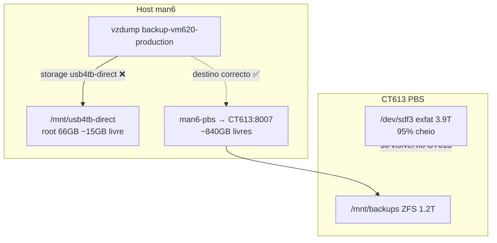

# Força-tarefa — Backups AGLSRV6 + PBS (VM620 produção)

**Criado:** 2026-07-09  
**Estado:** 🔴 CRÍTICO — VM620 sem backup válido desde falhas diárias em `usb4tb-direct`  
**Host:** man6 / AGLSRV6 — `100.98.108.66` (Tailscale)  
**Epic bd:** `agl-hostman-*` (força-tarefa backups VM620)

## Resumo executivo

A VM620 (`WinServer2016-VirtIO`, `192.168.0.200`) aloja **MSSQL de produção legado** e **ficheiros em shares Windows**. O job `backup-vm620-production` está activo mas **falha todas as noites** com `No space left on device` porque o storage Proxmox `usb4tb-direct` aponta para um directório de **66 GB no root do host**, não para o USB físico de 3,9 TB (montado apenas **dentro do CT613**).

**Risco actual:** RPO efectivo = ∞ para VM620; DR de MSSQL legado e shares depende de cópias manuais antigas.

| Métrica | Alvo | Actual |
|--------|------|--------|
| RPO VM620 (vzdump) | ≤ 24 h | **Falha diária** |
| RPO MSSQL (native backup) | ≤ 24 h | **Não implementado** |
| RPO shares SMB | ≤ 24 h | **Fora do vzdump** |
| Espaço PBS `backups` | < 80% | ~35% (~802 GB livres) |
| Espaço USB CT613 | < 85% | **~95%** (~209 GB livres) |

## Diagrama — problema de storage



## Equipa e papéis

| Papel | Responsável | Escopo |
|-------|-------------|--------|
| **Lead infra** | Werner / ops AGL | Decisões storage, janelas, PBS |
| **DBA / MSSQL** | Carlos + DBA | Native backup, consistência SQL, restore test |
| **Implementação** | Agentes / scripts repo | Jobs, docs, automação |
| **Validação** | Lead infra + DBA | Restore VM620 + query MSSQL + shares |

## Inventário relevante

| Recurso | ID / IP | Notas |
|---------|---------|-------|
| VM produção MSSQL legado | **620** @ `192.168.0.200` | Guest agent **não responde**; fs-freeze ignorado |
| CT MSSQL Linux primário | **610** @ `192.168.0.110` | SymmetricDS / apps actuais |
| PBS | **CT613** @ `192.168.0.231` | Datastore principal `backups` → `/mnt/backups` |
| Storage PVE | `man6-pbs` | PBS remoto, ~840 GB livres |
| Storage PVE | `usb4tb-direct` | **dir no root host** — inadequado para VM 500 GB |
| USB físico | `/dev/sdf3` | Montado **só no CT613** em `/mnt/usb4tb-direct` |

## Fases de trabalho

### Fase 0 — Estabilização imediata (P0, hoje)

**Objectivo:** Voltar a ter pelo menos um backup completo da VM620 no PBS ZFS.

- [ ] **P0.1** Alterar job `backup-vm620-production`: `storage` → `man6-pbs` (canónico em `scripts/proxmox/pbs-setup-renumbered-hosts.sh`)
- [ ] **P0.2** Executar backup manual VM620 (janela fora de pico; ~500 GB — estimar 2–6 h via LAN)
- [ ] **P0.3** Confirmar backup no PBS: `proxmox-backup-client list` / UI CT613
- [ ] **P0.4** Correr `./scripts/proxmox/aglsrv6-backup-health.sh --remote`

```bash
# No man6 (ou via agldv03)
ssh root@100.98.108.66
pvesh set /cluster/backup/backup-vm620-production --storage man6-pbs
# Backup manual (opcional, janela dedicada)
vzdump 620 --storage man6-pbs --mode snapshot --compress zstd --notes-template "VM620 manual P0"
```

**Critério de sucesso:** Task vzdump VM620 `OK` + snapshot listado em datastore `backups`.

---

### Fase 1 — Arquitectura storage USB + PBS (P1, 1–3 dias)

**Objectivo:** Eliminar ambiguidade host vs CT613; USB não pode ser destino vzdump directo no host sem montagem no host.

**Opções (escolher uma):**

| Opção | Descrição | Prós | Contras |
|-------|-----------|------|---------|
| **A (recomendada curto prazo)** | VM620 + tiers críticos → `man6-pbs` (ZFS); USB só retenção longa via PBS datastore `usb4tb-direct` no CT613 | Já funciona; 802 GB livres | USB a 95% — limpar antes |
| **B** | Montar `/dev/sdf3` no **host** man6 (fstab + path único) | vzdump directo USB no host | Conflito com mount actual no CT613; requer remount planeado |
| **C** | Passthrough USB ao host, CT613 acede via NFS/iSCSI | Separação clara | Mais trabalho; janela longa |

**Tarefas:**

- [ ] **P1.1** Documentar decisão (A/B/C) em wiki `llm-wiki` + actualizar este doc
- [ ] **P1.2** Prunar backups antigos no USB CT613 (libertar > 500 GB)
- [ ] **P1.3** Activar datastore PBS `usb4tb-direct` se for retenção tier-4 (actualmente `inactive` no PVE)
- [ ] **P1.4** Remover ou repoint `mp7` CT613 se host `/mnt/usb4tb-direct` deixar de ser usado
- [ ] **P1.5** Substituir disco Toshiba `sdd` (erro leitura ZFS) na janela de manutenção agendada

---

### Fase 2 — Reactivar tiers PBS (P1, após P0 OK)

Jobs desactivados em 2026-06-20 (pico) — reactivar com storage **man6-pbs** verificado:

| Job | Schedule | VMIDs | Storage |
|-----|----------|-------|---------|
| `backup-pbs-tier1-sql-6h` | `*/6` | 610, 620 | man6-pbs |
| `backup-pbs-tier2-infra-12h` | `2,14` | 601,602,609,614 | man6-pbs |
| `backup-pbs-tier3-daily` | `04:00` | 604,603,611,608,612,600,606 | man6-pbs |

```bash
bash scripts/proxmox/pbs-setup-renumbered-hosts.sh --host aglsrv6 --apply --remote
```

- [ ] **P2.1** Verificar espaço PBS após tier1 (610+620 a cada 6 h)
- [ ] **P2.2** Ajustar prune/GC se datastore > 70%
- [ ] **P2.3** Desactivar `repeat-missed` agressivo ou validar cache pós-`pvescheduler` restart

---

### Fase 3 — VM620 completa: SQL + shares (P1–P2)

**vzdump sozinho não cobre:**

1. **Consistência MSSQL** — guest agent down → sem VSS/fs-freeze
2. **Shares SMB** — dados fora do disco virtual da VM

**Tarefas:**

- [ ] **P3.1** Reparar **QEMU guest agent** na VM620 (janela; reinício se necessário)
- [ ] **P3.2** Implementar **SQL Server native backup** (Maintenance Plan ou Agent job) para share/NAS ou PBS-adjunct
- [ ] **P3.3** Inventariar shares (paths, tamanho, criticidade) — script Windows ou audit manual
- [ ] **P3.4** Backup shares: `robocopy` / `rclone` / agente para destino off-VM (NAS CT111, PBS, ou USB pós-limpeza)
- [ ] **P3.5** Documentar credenciais SA VM620 em `config/mssql-sync/mssql-sync.env` (local, não commit)

Ver também: [`MSSQL-DR-RUNBOOK-AGLSRV6.md`](MSSQL-DR-RUNBOOK-AGLSRV6.md)

---

### Fase 4 — Rede 60.x / 1.x (P2, janela planead)

Backups e MSSQL não devem usar LAN `192.168.0.x` (100 Mb) para tráfego bulk:

- [ ] **P4.1** Migrar CT613 PBS para `vmbr1` (`192.168.60.x`) ou `vmbr2` (`192.168.1.x`)
- [ ] **P4.2** Actualizar `man6-pbs` IP em `storage.cfg` + firewall
- [ ] **P4.3** Testar throughput backup pós-migração

---

### Fase 5 — Validação DR (P1, após primeiro backup OK)

- [ ] **P5.1** Restore test VM620 → VMID temporário (isolado)
- [ ] **P5.2** Boot + ping + porta 1433 + login SA
- [ ] **P5.3** Restore test `.bak` MSSQL nativo (se Fase 3 completa)
- [ ] **P5.4** Registar RPO/RTO medidos; actualizar runbook DR

---

## Monitorização

| Check | Comando / local |
|-------|-----------------|
| Saúde backups | `./scripts/proxmox/aglsrv6-backup-health.sh --remote` |
| Job VM620 | `grep -A12 backup-vm620 /etc/pve/jobs.cfg` |
| Tasks recentes | `pvesh get /nodes/man6/tasks --limit 10` |
| Espaço PBS | `pct exec 613 -- df -h /mnt/backups` |
| SQL VM620 | `/root/monitor_sqlserver_vm200.sh` (VMID=620) |
| Sync CT610 | `./scripts/mssql-sync/monitor-sync.sh` |

## Comunicação

- **E-mail job backup:** `carlos@aguileraz.net`
- **Alertas falsos VM200:** corrigidos 2026-06-22 → VMID 620
- **Status updates:** comentar epic bd + `#infra` / Linear AGLDV

## Referências repo

| Ficheiro | Uso |
|----------|-----|
| `scripts/proxmox/pbs-setup-renumbered-hosts.sh` | Jobs tier + VM620 canónicos |
| `scripts/proxmox/aglsrv6-backup-health.sh` | Health check automatizado |
| `scripts/proxmox/aglsrv-vmid-map.env` | Mapa renumber 200→620 |
| `docs/maint/MSSQL-DR-RUNBOOK-AGLSRV6.md` | DR MSSQL |
| `docs/HOSTS.md` | Topologia AGLSRV6 |

## Histórico de incidentes (Jun–Jul 2026)

1. Jobs vzdump presos (CT608 ~17 h) — parados; locks removidos  
2. PBS datastore 100% → repoint para `/mnt/backups` ZFS; GC  
3. Reencaminhamento emergência para `usb4tb-direct` — **introduziu regressão** (host root 66 GB)  
4. Tier2/tier3 desactivados durante pico  
5. Jul 2026: falhas diárias VM620 confirmadas — só ficheiros `.log` em `/mnt/usb4tb-direct/dump/`

---

**Próxima acção imediata:** concluir Fase 0 (P0.1–P0.4) antes de reactivar tiers ou mexer no USB.
