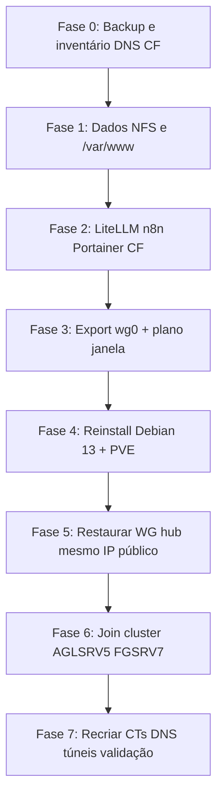

# FGSRV6 — Inventário pré-reinstalação (Debian 13 + Proxmox)

> **Auditoria live:** 2026-06-04 (via `ssh root@100.83.51.9`)  
> **Objetivo:** migrar dependências, depois formatar FGSRV6, instalar Debian 13 + Proxmox VE e integrar no ecossistema **AGLSRV5 / FGSRV7**.  
> **Substitui:** análises fragmentadas em `docs/fgsrv6-*`, `docs/wireguard/FGSRV6-*` (out/2025–jan/2026) — usar **este ficheiro** como checklist única até conclusão da migração.

---

## Resumo executivo

| Item | Estado documentado (repo) | Estado real (2026-06-04) |
|------|---------------------------|---------------------------|
| Tipo de host | Proxmox VE VPS | **Ubuntu 22.04.5 LTS** — **sem** `pveversion` / `pct` / `qm` |
| Papel WG | Hub `10.6.0.5:51823` | ✅ Hub ativo — **29 peers** em `wg0` |
| NFS | 197 GB → AGLSRV1 `fgsrv6-wg` | ✅ Export `/storage/nfs-export` (~7.1 GB usados no export) |
| Disco `/` | ~197 GB | **139 GB usados / 51 GB livres (74%)** — ver §1.4 breakdown |
| Cloudflare | `aglsrv5e` → n8n5e, portainer5e | ✅ Container `cloudflared-tunnel` (host network) |
| Análise “profunda única” | Não existia | **Este documento** + auditoria abaixo |

**Risco crítico:** formatar sem migrar **WireGuard hub**, **NFS em AGLSRV1**, **DNS/nginx**, **LiteLLM :4000**, **túnel Cloudflare** e **29 peers** deixa a mesh AGL offline ou degradada.

---

## Identidade e acesso

| Campo | Valor |
|-------|--------|
| Hostname | `vps41772` |
| Provider | Locaweb (`vps41772.publiccloud.com.br`) |
| IP público | `186.202.57.120` |
| Tailscale | `100.83.51.9` |
| WireGuard (hub) | `10.6.0.5/24`, listen **51823/udp** |
| Kernel | `5.15.0-1032-realtime` (Ubuntu) |
| Uptime (audit) | 52 dias |
| SSH (preferido) | `ssh root@100.83.51.9` |
| Chave (scripts repo) | `~/.ssh/fg_srv.pem` (IP público) |

### 1.4 Uso de disco (breakdown — audit 2026-06-04)

Sem Proxmox no host; o consumo concentra-se em **`/root`** e **Docker**, não só em `/var/www`:

| Path | Tamanho | Notas |
|------|---------|--------|
| `/root` (total) | **37 GB** | Inclui agente Azure, caches dev |
| `/root/myagent` | 14 GB | **Azure Pipelines** (`vsts.agent…`) |
| `/root/.cache` | 6.2 GB | pip, playwright, etc. |
| `/root/.nvm` | 5.7 GB | Node versions |
| `/var/lib/docker` | **19 GB** | overlay2 (stacks LiteLLM, n8n, …) |
| `/opt` | 5.7 GB | litellm, wg-easy, cloudflared, n8n compose |
| `/storage/nfs-export` | 7.1 GB | Export NFS real |
| `/var/www` | ~8+ GB | APIs PHP/Python (ver §3.2) |

**Implicação:** backup/migração deve incluir **volumes Docker** e decidir se `/root/myagent` e caches (`.nvm`, `.cache`) vão para o novo host ou são recriados.

---

## 1. WireGuard (hub) — migrar **antes** de formatar

### 1.1 Configuração no hub

- **Gestão:** `wg-quick@wg0` **active** + container **wg-easy** (UI `:51821`) — ambos presentes; dados em `/etc/wireguard/wg0.conf`.
- **Chave pública do servidor (hub):** `Dj8XsoPeDlgnqA4Ox++yDy+t4xGxYtEevxQh513fSA8=`
- **Backups no host:** `/root/wireguard-backup/` (out/2025), vários `wg0.conf.backup-*` em `/etc/wireguard/`.

### 1.2 Peers no hub (29) — mapa IP → função conhecida

| IP mesh | Função (doc INFRA / endpoints) | Handshake (audit) | Notas |
|---------|--------------------------------|-------------------|--------|
| 10.6.0.1 | CT120 (AGLSRV1) | ✅ ~11s | `191.183.137.104:51820` |
| 10.6.0.3 | CT121 (AGLSRV6) | ✅ ~29s | `189.100.69.60` |
| 10.6.0.4 | Reservado / peer sem endpoint | ⚠️ Sem handshake | Verificar se ainda necessário |
| 10.6.0.10 | **AGLSRV1** | ✅ ~4s | Tráfego NFS elevado; **cliente NFS** |
| 10.6.0.11 | **FGSRV5** | ✅ ~1m | |
| 10.6.0.12 | **AGLSRV6** | ✅ ~21s | |
| 10.6.0.13 | AGLSRV6B | ⚠️ RX 0 B | Possível peer morto |
| 10.6.0.14 | CT113 | ✅ ~54s | |
| 10.6.0.15 | CT172 | ⚠️ Só TX | Verificar |
| 10.6.0.16 | **FGSRV4** | ✅ ~1m | |
| 10.6.0.17 | **AGLSRV5** | ❌ **~29 dias** | **Atualizar peer após migração hub** |
| 10.6.0.18 | **FGSRV3** | ✅ ~17s | |
| 10.6.0.19 | **CT179 agldv03** | ✅ ~1m | |
| 10.6.0.20 | **CT111** | ✅ ~1m | |
| 10.6.0.21 | ? | ⚠️ Só TX | Identificar host |
| 10.6.0.22–23 | ? (preshared) | ⚠️ Sem handshake recente | |
| 10.6.0.24 | **agldv04** (51824) | ✅ ~43s | ListenPort próprio |
| 10.6.0.51 | CT138? | ❌ **~31 dias** | Doc troubleshooting CT138 |
| 10.6.0.52–58 | Vários (177.x / 189.x) | Misto | Inventariar por host |
| 10.6.0.56 | **FGSRV7?** (`191.252.93.227`) | ⚠️ Pouco tráfego | Confirmar |
| 10.6.0.59 | ? | Sem endpoint | |

### 1.3 O que alterar em **cada** peer (não só no hub)

Todos os nós com no `[Peer]` do **cliente**:

```ini
Endpoint = 186.202.57.120:51823
# ou Tailscale: Endpoint = 100.83.51.9:51823
PublicKey = Dj8XsoPeDlgnqA4Ox++yDy+t4xGxYtEevxQh513fSA8=
```

**Referências no repo:** `docs/INFRA.md`, `docs/WIREGUARD.md`, `config/optimization/wireguard-optimized.conf`, dezenas de CT/host docs.

**Estratégia recomendada:**

1. **Manter IP público** `186.202.57.120` no VPS após reinstall (Locaweb) → menos mudanças de Endpoint nos peers.
2. **Backup obrigatório** antes do format: `/etc/wireguard/wg0.conf`, `/root/wireguard-backup/`, export wg-easy JSON se usado para gestão.
3. **Janela de manutenção:** parar hub → todos os peers perdem mesh até novo hub online.
4. **Alternativa longo prazo:** segundo hub (FGSRV5/FGSRV7) — ver `docs/analysis/03-bottlenecks-and-pain-points.md` (SPOF).

---

## 2. NFS — dependência AGLSRV1

| Item | Valor |
|------|--------|
| Export FGSRV6 | `/storage/nfs-export` → `*(rw,...,fsid=0)` |
| Mount AGLSRV1 | `10.6.0.5:/` → `/mnt/pve/fgsrv6-wg` |
| Proxmox storage | `fgsrv6-wg` — **active**, ~70% usado no `pvesm` (verificar vs `du` ~7.1 GB) |
| Conteúdo crítico no mount | `images/241/vm-241-disk-0.raw` (**7.1 GB**) — migrar antes de desmontar |
| Dados no export (host) | ~7.1 GB em `/storage/nfs-export` (disco local tem muito mais em `/var/www`) |
| Backup local (Fase 0) | `.local/fgsrv6-backup-20260603/` (~182 MB) — **gitignored** |

**Ação:** antes do format, decidir destino dos dados em `fgsrv6-wg` (FGSRV5, FGSRV7, AGLSRV1 local) e **desmontar** / remover `pvesm` em AGLSRV1 após migração.

```bash
# AGLSRV1 — verificação
ssh root@100.107.113.33 'mount | grep fgsrv6; pvesm status | grep fgsrv6'
```

---

## 3. Nginx / DNS (host, não só Cloudflare)

### 3.1 `server_name` ativos (sites-enabled)

| Hostname | Tipo |
|----------|------|
| `aglpy01.aguileraz.net` | Python app (unix socket) |
| `aglpy02.aguileraz.net` | Python app |
| `api-v8-dev.falg.com.br` | PHP 8.4 (+ SSL em `api-v8-dev-ssl`) |
| `api-v8-qa.falg.com.br` | PHP 8.3 |
| `api-v9-dev.falg.com.br` | PHP (+ SSL `api-v9-dev-ssl`) |
| `default` | HTTP :80 default |

**Portas nginx:** `:80`, `:443` (certificados em `/etc/nginx/ssl/`).

### 3.2 DNS a validar na Cloudflare / registrars

Para **cada** hostname acima, confirmar registo **A/AAAA/CNAME** → `186.202.57.120` (ou proxy CF). O repo **não** lista todos os registos — inventário DNS na consola Cloudflare é **obrigatório** (tarefa manual).

### 3.3 Apps em `/var/www` (tamanho — candidatos a migrar)

| Path | Tamanho aprox. |
|------|----------------|
| `api-v8-dev` | 2.2 GB |
| `api-v9-dev` | 2.0 GB |
| `api-v8-qa` | 1.6 GB |
| `ald-sys*` (4 dirs) | ~544 MB cada |
| `aglpy01` / `aglpy02` | 540 MB / 84 MB |

---

## 4. Docker / serviços (estado 2026-06-04)

**Compose roots:** `/opt/litellm/`, `/opt/wg-easy/`, `/opt/docker/cloudflared/`, `/opt/docker/n8n/`

| Container | Imagem | Portas / notas |
|-----------|--------|----------------|
| `litellm-proxy` | litellm | **:4000** — gateway LLM (crítico para Cursor/OpenClaw remoto) |
| `litellm-db`, `litellm-redis` | postgres/redis | interno |
| `ruvector-postgres` | pgvector | **:5433** |
| `n8n-n8n-1` | n8n | **:5679** → 5678 |
| `n8n-traefik-1` | traefik | **:4080**, **:4443** (HTTPS front) |
| `portainer` | portainer-ce | **:9443** (host mode — sem mapeamento explícito no ps) |
| `cloudflared-tunnel` | cloudflared | host network, token em env |
| `wg-easy` | wg-easy | **:51821** |
| `openclaw-docker-*` | openclaw:local | **Created** (não Up) |

**Systemd relevante:**

- `nginx`, `docker`, `tailscaled`
- NFS: `nfs-server` stack (portas 2049, mountd, statd)
- `vsts.agent.aguileraz.FGSRV06.FGSRV06` — **Azure Pipelines agent**
- **Plex** (processos nativos, portas 32400/32401)

**Outros listeners:** Redis nativo `:6379`, **glances** `127.0.0.1:61209`, **dnsmasq** em interfaces internas.

### 4.1 Cloudflare Tunnel `aglsrv5e`

| Campo | Valor |
|-------|--------|
| Tunnel ID | `863fd93d-73c5-4c3e-90b5-7cbd37643f70` |
| Ingress (doc) | `n8n5e.aglz.io` → `https://186.202.57.120:4443` |
| | `portainer5e.aglz.io` → `https://186.202.57.120:9443` |
| Config path | `/opt/docker/cloudflared/` |

**Ação:** após migração, atualizar origens no dashboard CF ou recriar túnel; validar com `curl -I https://n8n5e.aglz.io`.

---

## 5. LiteLLM / OpenClaw / automação no repo

Scripts e docs que **assumem FGSRV6** (migrar ou desactivar):

- `scripts/litellm/sync-fgsrv06.sh`, `deploy-litellm-host.sh`, `replicate-all-hosts.sh`
- `scripts/deploy-openclaw-to-fgsrv06.sh`, `openclaw/fix-openclaw-agldv03-fgsrv06.sh`
- `scripts/copy-statusline-to-fgsrv6.sh`, `sync-zshrc-from-agldv03.sh` (FGSRV6 como fonte de `.zshrc`)
- `docs/OPENCLAW.md` — fgsrv6 marcado como migração pendente
- `docs/LITELLM-MULTI-HOST-DEPLOYMENT.md`

**Decisão:** LiteLLM em produção no FGSRV6 (`:4000`) — planear **CT dedicado** em FGSRV7/AGLSRV5 ou manter no novo FGSRV6 pós-Proxmox.

---

## 6. Proxmox pós-reinstall (alvo)

| Hoje | Alvo |
|------|------|
| Ubuntu 22.04, sem PVE | **Debian 13** + **Proxmox VE** |
| Cluster existente | **AGLSRV5 + FGSRV7** (`docs/PROXMOX-CLUSTER-AGLSRV5-FGSRV7.md`) |

**Nota:** FGSRV6 no doc histórico aparece como “Proxmox VPS”, mas o host actual **não tem PVE**. A reinstalação é **greenfield** para virtualização; serviços actuais passam para CT/VM no novo node ou para outros hosts.

**QDevice / hub WG:** `PROXMOX-CLUSTER-AGLSRV5-FGSRV7.md` sugere QNetd no FGSRV6 — reavaliar após join (FGSRV7 já tem cluster).

---

## 7. Ordem de migração recomendada



### Fase 0 — Preparação (sem downtime)

- [x] Backup `/etc/wireguard/`, `/root/wireguard-backup/`, dumps Docker (litellm-db, n8n, portainer) — ver `.local/fgsrv6-backup-20260603/` e `scripts/maint/fgsrv6-phase0-backup.sh`
- [ ] Inventário **DNS Cloudflare** — checklist em [`FGSRV6-DNS-CHECKLIST.md`](FGSRV6-DNS-CHECKLIST.md) (scan dashboard manual)
- [x] Storage `fgsrv6-wg` em AGLSRV1 — **7.1 GB** em `images/241/vm-241-disk-0.raw` (VMID 241 / agldv07); **sem** refs em `/etc/pve/qemu-server` no grep; `pvesm` reporta ~70% usado (possível métrica RRD legada vs uso real ~7 GB)
- [ ] Decidir IP mesh pós-reinstall (`10.6.0.5` mantém-se se hub no mesmo VPS)

### Fase 1 — Dados stateful

- [ ] `rsync` `/storage/nfs-export` → destino novo
- [ ] `rsync` `/var/www/*` + `/etc/nginx` + certs SSL
- [ ] Azure DevOps agent — re-register ou desactivar
- [ ] Plex — migrar ou descontinuar no VPS

### Fase 2 — Serviços expostos (pode ser CT no FGSRV7 temporariamente)

- [ ] LiteLLM stack (`/opt/litellm`)
- [ ] n8n + Traefik (`/opt/docker/n8n`)
- [ ] Portainer
- [ ] Cloudflare tunnel `aglsrv5e` — apontar para novo IP:porta
- [ ] Atualizar scripts `propagate-litellm-master-key.sh` etc.

### Fase 3 — WireGuard (janela de corte)

- [ ] Comunicar janela (~30–60 min mesh degradada)
- [ ] Parar `wg-quick@wg0` / wg-easy
- [ ] Guardar `wg0.conf` + chaves offline (1Password / vault)
- [ ] Formatar / reinstall

### Fase 4 — Rebuild FGSRV6

- [ ] Debian 13 + Proxmox VE (mesmo IP público se possível)
- [ ] Restaurar `wg0` hub, testar 3–5 peers críticos (AGLSRV1, CT179, FGSRV5)
- [ ] Rollout Endpoint nos restantes peers
- [ ] `tailscale up` (mesmo tailnet)

### Fase 5 — Cluster

- [ ] Join **AGLSRV5** / **FGSRV7** conforme runbook cluster
- [ ] Recriar CTs para nginx, litellm, n8n (não reinstalar tudo no host bare metal)

### Fase 6 — Validação

- [ ] `ping 10.6.0.5` de AGLSRV1, CT179, FGSRV5
- [ ] NFS remount ou descomissionar `fgsrv6-wg`
- [ ] `curl` APIs `api-v9-dev.falg.com.br`, túneis n8n5e/portainer5e
- [ ] Atualizar `docs/INFRA.md`, `docs/HOSTS.md`, `docs/TOPOLOGY.md` (tipo host real)

---

## 8. Comandos úteis (repetir auditoria)

```bash
# FGSRV6
ssh root@100.83.51.9 'hostname; wg show; docker ps -a; df -h /; exportfs -v'
ssh root@100.83.51.9 'grep -rh server_name /etc/nginx/sites-enabled/ | grep -v "#"'

# AGLSRV1 — dependência NFS
ssh root@100.107.113.33 'mount | grep fgsrv6; pvesm status | grep fgsrv6'

# Teste túneis
curl -sI https://n8n5e.aglz.io | head -5
curl -sI https://portainer5e.aglz.io | head -5
```

---

## 9. Documentação histórica (referência, não checklist)

| Ficheiro | Tema |
|----------|------|
| `docs/wireguard/FGSRV6-NFS-MIGRATION.md` | NFS Tailscale → WG |
| `docs/wireguard/FGSRV6-TROUBLESHOOTING.md` | Performance loopback NFS |
| `docs/fgsrv6-network-diagnostics.md` | Portas/out/2025 (desatualizado vs Docker actual) |
| `docs/CLOUDFLARE-TUNNELS.md` | aglsrv5e |
| `docs/troubleshooting/FGSRV6-SSH-INVESTIGATION-20260104.md` | SSH banner |
| `docs/analysis/03-bottlenecks-and-pain-points.md` | SPOF hub |

---

## 10. Decisões em aberto (precisam resposta humana)

1. **Manter FGSRV6 como hub WG** após Proxmox ou mover hub para FGSRV7/FGSRV5?
2. **LiteLLM** — CT no FGSRV7 vs novo CT no FGSRV6?
3. **APIs `api-v8/v9-dev.falg.com.br`** — ficam no novo FGSRV6 ou migram para FGSRV07/CT (como fg_antigo)?
4. **Descomissionar** peers obsoletos (`10.6.0.51`, `10.6.0.17` stale) antes do rebuild?
5. **IP público** — confirmação Locaweb de que `186.202.57.120` permanece após reinstall.

---

## Histórico

| Data | Alteração |
|------|-----------|
| 2026-06-04 | Criação — auditoria live + plano de migração consolidado |
| 2026-06-04 | Fase 0 executada — backup `.local/`, script `fgsrv6-phase0-backup.sh`, DNS checklist, disco CT241 em fgsrv6-wg |
