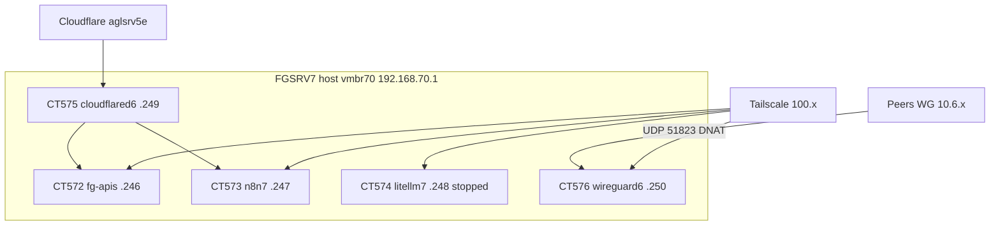

# Plano: FGSRV6 → CTs dedicados no FGSRV7

> **Estado:** 📋 **Aprovado parcialmente** (2026-06-16) — decisões críticas registadas em §12

> **Princípio:** um serviço (ou stack coerente) = **um CT novo**; **não** reutilizar CT549/547/570/571 nem volumes existentes no FGSRV7.

> **Inventário origem:** [`FGSRV6-PRE-REINSTALL-INVENTORY.md`](FGSRV6-PRE-REINSTALL-INVENTORY.md)

> **Rede (política):** **dual-stack permanente** — **WireGuard** (`10.6.0.0/24`, hub em LXC) + **Tailscale** (overlay `100.x`, expandir cobertura). Ver §4.5–§4.6.

---

## 1. Objectivos

| # | Objectivo |

| --- | ---------------------------------------------------------------------------------------------------------------------------- |

| 1 | Esvaziar o **FGSRV6** (format → Debian 13 + Proxmox) sem perder APIs, automação e túneis CF |

| 2 | Recriar serviços como **CTs novos** no **FGSRV7** (`vmbr70` / `192.168.70.0/24`) |

| 3 | Túnel Cloudflare **`aglsrv5e`** → **CT575 `cloudflared6`** (clone de **CT570**, ingress do FGSRV6) |

| 4 | **LiteLLM** réplica → **CT574 `litellm7`** (clone **CT186** AGLSRV1), **stopped** até cutover |

| 5 | **WireGuard hub** → **CT576 `wireguard6`** no FGSRV7; **expandir Tailscale** — política dual-stack (§4.5–§4.6) |

| 6 | **Remover** disco órfão **VMID 241** (`fgsrv6-wg` / `fileserver5-nfs`) — CT547 `agldv07` já é o sucessor |

| 7 | Após validação, descomissionar dependências NFS **`fileserver5-nfs`** (mount do FGSRV6 no FGSRV7 e AGLSRV1) |

**Fora de scope (decisão 2026-06-16):** CT577 `portainer6`, CT578 `ruvector7`.

---

## 2. Restrições do FGSRV7 (baseline)

| Recurso | Valor | Impacto no plano |

| ------------------- | ---------------------------------------- | ------------------------------------------------------------------------------------------------------------ |

| Disco `bkp`/`local` | **~64 GB livres** (78% usado) | CTs com discos **thin** — **OK por agora** (decisão §12.3); dados reais ~20 GB |

| RAM | **7,8 GB** total, **~4,5 GB** disponível | **Overcommit aceite** — CTs podem ter RAM nominal superior ao livre; swap 32 G no host; **574 stopped** inicialmente |

| Faixa VMID actual | **545–571** ocupada | Novos CTs: **572–576** (577–578 reservados mas **não usados**) |

| CTs existentes | **Não tocar** | 547 agldv07, 549 fg-legacy, 550 fg-ngrok, 570/571 cloudflared, etc. |

---

## 3. Mapa de CTs (escopo activo)

Convenção: sufixo **`7`** = FGSRV7; **`6`** = legado migrado do FGSRV6.

| VMID | Hostname | IP LAN (`vmbr70`) | Disco (thin) | RAM (nominal) | Origem | Stack / notas |

| ------- | ---------------- | ----------------- | ------------ | ------------- | ---------------------------- | ----------------------------------------------------------------------------- |

| **572** | **fg-apis** | `192.168.70.246` | 32 G | **1024–2048 M** | FGSRV6 `/var/www` + nginx | Validar se corre com **≤1024 M**; subir se necessário |

| **573** | **n8n7** | `192.168.70.247` | 16 G | 1536 M | n8n + volume `n8n_data` | Docker Compose; ingress via **cloudflared6** |

| **574** | **litellm7** | `192.168.70.248` | 32 G | **8192 M** | **Clone CT186** (AGLSRV1) | Réplica canónica; **`pct stop 574`** após restore — não consumir RAM até cutover |

| **575** | **cloudflared6** | `192.168.70.249` | 8 G | 512 M | Clone **CT570** + túnel **aglsrv5e** | `systemd` cloudflared; script `provision-cloudflared6-from-570.sh` |

| **576** | **wireguard6** | `192.168.70.250` | 8 G | 1024 M | Hub mesh **10.6.0.5** (backup Fase 0) | `wg0` em LXC; **UDP 51823** DNAT host FGSRV7; TS no CT ou host (§4.6) |

**CTs descartados:** ~~577 portainer6~~, ~~578 ruvector7~~.

**RAM em runtime (fase inicial, 574 stopped):** ~3,5 G CTs + host ≈ dentro do host com swap.

---

## 3.1 O que **não** migra para CT

| Item FGSRV6 | Decisão |

| --------------------------------- | ----------------------------------------------------- |

| `/root` caches, Azure agent, Plex | **Não migrar** |

| OpenClaw (Created) | **Fora de scope** |

| Portainer, ruvector-postgres | **Não migrar** (opcionais descartados) |

| NFS export `/storage/nfs-export` | **Descontinuar** após remover `images/241` |

| WireGuard hub no host | **Não** regressa ao novo FGSRV6 (só Proxmox) |

### 3.2 CT241 / disco órfão — **remover**

| Local | Acção |

| ------------------------------------------- | ---------------------------------------------------------------------------------- |

| AGLSRV1 `/mnt/pve/fgsrv6-wg/images/241/` | Apagar `vm-241-disk-0.raw` (~7,1 G) após confirmar **CT547** `agldv07` operacional |

| FGSRV7 `fileserver5-nfs` (`100.83.51.9:/…`) | Remover storage Proxmox + entrada `fstab` quando FGSRV6 NFS desligado |

| AGLSRV1 `fgsrv6-wg` | `umount` → `pvesm remove fgsrv6-wg` (último passo, pós-cutover) |

---

## 4. Arquitectura por CT

### 4.1 CT572 `fg-apis`

```

Internet / Cloudflare (DNS directo ou ingress cloudflared6)

        │

        ▼

  [nginx :80/:443]  PHP 8.3/8.4 FPM

        │

  /var/www/{api-v8-dev,api-v9-dev,api-v8-qa,ald-sys*,aglpy*}

```

- **Migração:** `rsync` desde FGSRV6 + restore `/etc/nginx` do backup Fase 0.

- **RAM:** criar com **1024 M**; smoke test PHP/nginx; aumentar para 1536–2048 M só se OOM.

- **DNS:** ver [`FGSRV6-DNS-CHECKLIST.md`](FGSRV6-DNS-CHECKLIST.md).

### 4.2 CT573 `n8n7`

- Docker Compose (n8n only); **sem** Traefik do FGSRV6.

- Restore: `.local/.../docker-volumes/n8n_data.tar.gz`.

- URL pública: **`n8n5e.aglz.io`** → ingress **aglsrv5e** → `http://192.168.70.247:5678`.

### 4.3 CT574 `litellm7` — clone CT186 (stopped)

**Decisão:** não reconstruir a partir do Docker do FGSRV6; **clonar o CT186 canónico** (AGLSRV1).

| Campo | CT186 (fonte) | CT574 (destino) |

| ------------ | -------------------------- | ---------------------------- |

| Host | AGLSRV1 | FGSRV7 |

| Stack | `/opt/agl-litellm` Docker | Idem (cópia bit-a-bit) |

| RAM template | 8192 M | 8192 M (stopped = 0 runtime) |

| LAN | `192.168.0.186` | `192.168.70.248` |

| TS | `100.125.249.8` | Novo hostname TS (opcional) |

**Procedimento (cross-node):**

1. **AGLSRV1:** `vzdump 186 --mode snapshot --compress zstd --storage <destino>` (ou stop + backup se preferir consistência DB).

2. **Transferir** artefacto para FGSRV7 (`scp`, NFS, ou storage partilhado).

3. **FGSRV7:** `qmrestore`/`pct restore` como VMID **574**, hostname `litellm7`.

4. Ajustar rede: `pct set 574 -net0 … ip=192.168.70.248/24,gw=192.168.70.1,bridge=vmbr70`.

5. Dentro do CT: actualizar IP estático se existir em `/etc/network/interfaces`; **não** duplicar Tailscale sem novo join.

6. **`pct stop 574`** + **`onboot 0`** até cutover planeado.

7. Cutover futuro: clientes `100.83.51.9:4000` → `http://192.168.70.248:4000` (ou TS no CT574).

**Referências:** `docs/LITELLM-OPENCLAW-DEDICATED-LXC.md`, `scripts/proxmox/bootstrap-ct186-litellm.sh`, `config/litellm/config.yaml`.

### 4.4 CT575 `cloudflared6` — clone CT570 + aglsrv5e

**Decisão:** clone operacional de **CT570** (`cloudflared7`), não Docker host-network como no FGSRV6.

| Campo | Valor |

| ---------- | ------------------------------------------------------------ |

| Túnel | **aglsrv5e** `863fd93d-73c5-4c3e-90b5-7cbd37643f70` |

| Script | `scripts/maint/fgsrv07/provision-cloudflared6-from-570.sh` |

| Token | JWT do instalador Zero Trust (mesmo túnel; novo connector) |

**Ingress a migrar do FGSRV6** (remover `portainer5e` — Portainer não migra):

```yaml
- hostname: n8n5e.aglz.io

  service: http://192.168.70.247:5678

# APIs — DNS directo ou via túnel (decidir no cutover):

- hostname: api-v9-dev.falg.com.br

  service: http://192.168.70.246:443

  originRequest:
    noTLSVerify: true
```

**Cutover:** parar `cloudflared-tunnel` Docker no FGSRV6 **depois** de CT575 com 4 conn CF + smoke `n8n5e`.

### 4.5 CT576 `wireguard6` — hub WG em LXC (dual-stack #1)

**Decisão:** manter **sempre** WireGuard mesh (`10.6.0.0/24`) num **LXC dedicado** no FGSRV7. O novo FGSRV6 (Debian + Proxmox) **não** hospeda WG.

| Componente       | Detalhe                                                                                                                 |
| ---------------- | ----------------------------------------------------------------------------------------------------------------------- |
| `wg0`            | IP hub **`10.6.0.5/24`**, listen **51823/udp** (preservar porta dos peers)                                              |
| Config           | Restore `/etc/wireguard/wg0.conf` do backup Fase 0 (29 peers)                                                           |
| LXC              | Debian 12; **unprivileged** + pass-through `/dev/net/tun` ([wiki Proxmox](https://pve.proxmox.com/wiki/OpenVPN_in_LXC)) |
| Host FGSRV7      | **DNAT UDP 51823** → `192.168.70.250`; `ip_forward=1` no CT                                                             |
| wg-easy          | Opcional (`:51821`); admin via **ngrok** (CT550) ou **Tailscale SSH** — não substitui mesh UDP                          |
| Endpoint cutover | Peers: `Endpoint = 191.252.93.227:51823` (IP público FGSRV7)                                                            |

**Papel do WG vs TS:**

| Camada                                 | Ferramenta            | Uso preferencial                              |
| -------------------------------------- | --------------------- | --------------------------------------------- |
| Mesh legado / NFS / IPs fixos `10.6.x` | **WireGuard**         | Mounts NFS, scripts com IP mesh, peers sem TS |
| Acesso geral, CTs, dev, NAT traversal  | **Tailscale**         | LiteLLM, OpenClaw, SSH, novos hosts           |
| Exposição HTTP pública                 | **Cloudflare Tunnel** | n8n, APIs (cloudflared6)                      |

**Não usar:** ngrok ou Cloudflare Tunnel como transporte WG (sem UDP).

### 4.6 Tailscale — expandir cobertura (dual-stack #2)

**Decisão:** manter e **expandir** Tailscale em paralelo ao WG; novos serviços e CTs entram na tailnet por defeito.

| Acção              | Detalhe                                                                                    |
| ------------------ | ------------------------------------------------------------------------------------------ |
| Novos CTs 572–576  | `tailscale up` em cada CT (padrão **570/571**); hostname `fgsrv7-*`                        |
| Host FGSRV7        | TS no host **ou** só nos CTs — preferir **TS por CT** para MagicDNS granular               |
| CTs migrados       | fg-apis, n8n7, litellm7, wireguard6 na tailnet                                             |
| Rotas              | CTs na LAN AGLSR1: **`--accept-routes=false`** (ver `docs/INFRA.md`)                       |
| Scripts            | Preferir URLs TS (`100.x`) em docs/scripts novos; manter `10.6.x` onde NFS/WG legado exige |
| Decom FGSRV3/4/5/6 | Remover peers WG mortos; garantir TS nos hosts que substituem funções                      |

**Referências:** `scripts/proxmox/pct-tailscale-up-litellm-openclaw.sh`, `docs/WIREGUARD.md`, `docs/INFRA.md` (Tailscale + WG mesh).

---

## 5. Cloudflare / DNS

| Hostname | Origem FGSRV6 | Destino proposto |

| -------------------------- | ----------------- | ---------------------------------------------- |

| `n8n5e.aglz.io` | :4443 Traefik | **cloudflared6** → **n8n7** :5678 |

| ~~`portainer5e.aglz.io`~~ | :9443 | **Remover** do túnel (Portainer não migra) |

| `api-v8-dev.falg.com.br` | nginx FGSRV6 | **fg-apis** |

| `api-v9-dev.falg.com.br` | idem | idem |

| `api-v8-qa.falg.com.br` | idem | idem |

| `aglpy01/02.aguileraz.net` | FGSRV6 | **fg-apis** |

Checklist: [`FGSRV6-DNS-CHECKLIST.md`](FGSRV6-DNS-CHECKLIST.md).

---

## 6. Rede FGSRV7 (escopo activo)



- **Firewall host:** DNAT **51823/udp** → CT576; forward LAN entre CTs.
- **Tailscale:** **um join por CT** 572–576 (expandir tailnet); documentar IPs TS em `docs/INFRA.md` após provisionar.

---

## 7. Fases de execução

### Fase A — Preparação (sem downtime)

- [x] Decisões críticas §12 registadas

- [x] Criar CTs **572, 573, 576** (template + bootstrap) — 2026-06-16

- [x] **574:** vzdump CT186 → restore FGSRV7 → **stop + onboot 0**

- [ ] **575:** cloudflared6 — **bloqueado:** token túnel `aglsrv5e` inválido no FGSRV6 (regenerar Zero Trust)

- [x] **576:** LXC `wireguard6`, `wg0.conf` restaurado — **wg0 parado** até Fase C
- [ ] **Tailscale:** join CTs 572–576 na tailnet (pre-auth keys)
- [x] Registar VMIDs 572–576 em `docs/PROXMOX-VMID-RENUMBER-2026-06.md`

### Fase B — Migração de dados (FGSRV6 ainda Up)

- [x] **572:** rsync `/var/www` (7,8 G) + nginx/ssl

- [ ] **573:** restore `n8n_data` + compose (imagem carregada; arranque container)

- [x] **574:** populado pelo clone 186 (stopped, onboot 0)

- [ ] **575:** systemd cloudflared — aguarda token CF válido

- [x] **576:** restore `wg0.conf`; wg0 **não** iniciado (cutover posterior)

### Fase C — Cutover (janela ~60 min)

1. Parar cloudflared Docker no FGSRV6
2. Start **575** → validar 4 conn CF + `curl` **n8n5e**
3. Start **572** → smoke test APIs
4. Start **576** → activar hub WG; rollout `Endpoint` → `191.252.93.227:51823`
5. _(Opcional nesta janela)_ Start **574** → `curl :4000/health`
6. Actualizar scripts/docs: `100.83.51.9` → destinos FGSRV7; registar IPs TS dos novos CTs

### Fase D — Limpeza FGSRV6 / NFS

- [ ] Remover `images/241` em AGLSRV1 + FGSRV7 `fileserver5-nfs`

- [ ] Remover `fgsrv6-wg` / `fileserver5-nfs` dos hosts

- [ ] Parar serviços FGSRV6 host

- [ ] **Format + Debian 13 + Proxmox** no FGSRV6 (**sem** WG)

### Fase E — Pós FGSRV6 reinstall

- [ ] Join cluster AGLSRV5 + FGSRV7 (se objectivo)
- [ ] Expandir TS a novos nodes do cluster; limpar peers WG obsoletos (FGSRV3/4/5/6)

---

## 8. Ordem de arranque RAM (574 stopped)

1. **575** cloudflared6 (512 M)
2. **576** wireguard6 (1024 M) — hub WG na janela de cutover
3. **573** n8n7 (1536 M)
4. **572** fg-apis (**1024 M** inicial → subir se OOM)
5. **574** litellm7 — **só no cutover LiteLLM** (8192 M)

**Pico sem 574:** ~3 G CTs + Proxmox — dentro do host com swap.

---

## 9. Estimativa de esforço

| Fase | Esforço | Risco |

| ------------------------- | ------------ | -------- |

| Criar 572–575 + bootstrap | 1–2 dias | Baixo |

| Clone 186 → 574 | 2–4 h | Médio |

| Migração rsync/restore | 1 dia | Médio |

| Cutover CF (+ APIs) | 2–4 h janela | **Alto** |

| WG hub (CT576) | 2–4 h janela | **Alto** |

| Limpeza NFS/241 | 1 h | Médio |

| Reinstall FGSRV6 | 1 dia | Alto |

---

## 10. Decisões fechadas

| # | Tema | Decisão |

| --- | ----------------- | ----------------------------------------------------------------------- |

| 1 | Rede dual-stack | **WG** hub **CT576** LXC + **Tailscale** expandido — duas ferramentas permanentes |
| 1b | Hub WG / FGSRV6 | Hub em **FGSRV7 CT576**; novo FGSRV6 **sem** WG |

| 2 | RAM | Overcommit OK; **574 stopped**; **572** testar com menos RAM |

| 3 | Disco thin | OK por agora |

| 4 | cloudflared6 | **Clone CT570** + ingress **aglsrv5e** do FGSRV6 |

| 5 | LiteLLM | **Clone CT186**, stopped até cutover |

| 6 | Portainer/ruvector| **Ignorar** (577/578 fora de scope) |

| 7 | portainer5e | **Remover** do túnel aglsrv5e na migração |

## 11. Decisões em aberto

| #   | Pergunta        | Notas                                                      |
| --- | --------------- | ---------------------------------------------------------- |
| 1   | APIs falg       | DNS directo IP FGSRV7 **vs** ingress cloudflared6          |
| 2   | Cutover LiteLLM | Activar 574 na mesma janela que APIs **vs** fase posterior |

---

## 12. Referências

- [`FGSRV6-PRE-REINSTALL-INVENTORY.md`](FGSRV6-PRE-REINSTALL-INVENTORY.md)

- [`FGSRV6-DNS-CHECKLIST.md`](FGSRV6-DNS-CHECKLIST.md)

- [`CLOUDFLARE-TUNNELS.md`](../CLOUDFLARE-TUNNELS.md) — **aglsrv5e**

- [`LITELLM-OPENCLAW-DEDICATED-LXC.md`](../LITELLM-OPENCLAW-DEDICATED-LXC.md) — CT186

- [`PROXMOX-VMID-RENUMBER-2026-06.md`](../PROXMOX-VMID-RENUMBER-2026-06.md)

- `scripts/maint/fgsrv6-phase0-backup.sh`

- `scripts/maint/fgsrv6-phase1-rsync-plan.sh`

- `scripts/maint/fgsrv07/provision-cloudflared6-from-570.sh`

- `scripts/maint/fgsrv07/provision-cloudflared7b-from-170.sh` (padrão clone)

---

## Histórico

| Data | Alteração |

| ---------- | ----------------------------------------------------------------------------------------- |

| 2026-06-16 | Plano inicial CTs dedicados FGSRV7 |

| 2026-06-16 | Política **dual-stack**: WG hub CT576 LXC + expandir Tailscale (§4.5–§4.6) |
