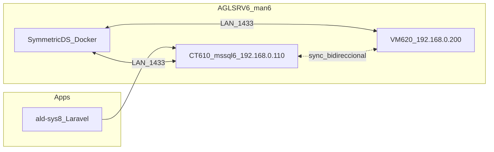

# Arquitectura — sync bidireccional MSSQL AGLSRV6

**Decisão:** **Opção B — SymmetricDS** (com preparação para Merge nativa se VM620 for upgraded).

## Porquê não Merge nativa (Opção A) agora

| Bloqueio             | Detalhe                                                               |
| -------------------- | --------------------------------------------------------------------- |
| VM620 Express        | Não pode ser Publisher/Distributor; SQL Agent indisponível            |
| Password SA VM620    | Diferente do CT610 — credencial em `mssql-sync.env` local (Fase 0 OK) |
| VM620 não pode parar | Upgrade de edição adiado                                              |

## Porquê SymmetricDS

- Sync **bidireccional** ao nível de linha sem exigir Publisher Express
- CT610 (**Developer 2022**) e VM620 (**Express 2016**) como nós JDBC
- Agent no CT610 apenas para jobs locais opcionais; motor SymmetricDS corre em Docker (CT610 ou LXC dedicado)
- Complementa PBS (`610,620`) — não substitui backup VM/LXC

## Topologia

## Nós SymmetricDS (piloto DB_IDE_Associacao)

| Engine        | Host JDBC       | Base              |
| ------------- | --------------- | ----------------- |
| `dbide-ct610` | `192.168.0.110` | DB_IDE_Associacao |
| `dbide-vm620` | `192.168.0.200` | DB_IDE_Associacao |

## Credenciais

| Uso         | Origem                                                           |
| ----------- | ---------------------------------------------------------------- |
| CT610 admin | `ald-sys8/src/.env` → `DB_USERNAME_ALD` / `DB_PASSWORD_ALD`      |
| VM620 admin | `MSSQL_VM620_SA_PASSWORD` em `config/mssql-sync/mssql-sync.env`  |
| Replicação  | Login `repl_mssql` — `scripts/mssql-sync/create-repl-logins.sql` |

Ficheiro local (não commitar): `config/mssql-sync/mssql-sync.env` (ver `.example`).

## Fases

1. **Piloto DB_IDE_Associacao** — 57 tabelas com PK; carga inicial VM620 → CT610; lag alvo &lt; 5 min
2. **CEP_Brasil, SILD** — rollout após piloto 48h estável
3. **ALD-SYS8** — último (200 tabelas; janela de manutenção)

## Evolução para Opção A

Se VM620 for upgraded para **Standard/Developer** e SQL Agent activo:

- Migrar sync crítico para **Merge Replication** com Distributor no CT610
- Manter SymmetricDS em paralelo até cutover validado
