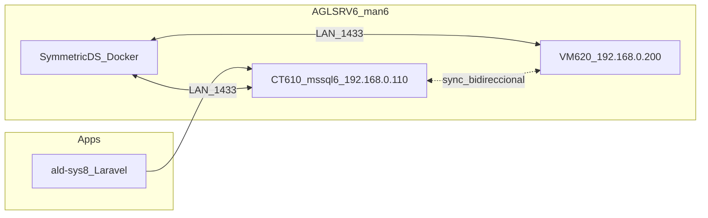

# Arquitectura — sync bidireccional MSSQL AGLSRV6

**Decisão:** **Opção B — SymmetricDS** (com preparação para Merge nativa se VM620 for upgraded).

## Porquê não Merge nativa (Opção A) agora

| Bloqueio | Detalhe |
|---------|---------|
| VM620 Express | Não pode ser Publisher/Distributor; SQL Agent indisponível |
| Password SA VM620 | Diferente de `ald-sys8` / CT610 — inventário VM620 incompleto |
| VM620 não pode parar | Upgrade de edição adiado |

## Porquê SymmetricDS

- Sync **bidireccional** ao nível de linha sem exigir Publisher Express
- CT610 (**Developer 2022**) e VM620 (**Express 2016**) como nós JDBC
- Agent no CT610 apenas para jobs locais opcionais; motor SymmetricDS corre em Docker (CT610 ou LXC dedicado)
- Complementa PBS (`610,620`) — não substitui backup VM/LXC

## Topologia

## Nós SymmetricDS (piloto SILD)

| Engine | Host JDBC | Base |
|--------|-----------|------|
| `sild-ct610` | `192.168.0.110` | SILD |
| `sild-vm620` | `192.168.0.200` | SILD |

## Credenciais

| Uso | Origem |
|-----|--------|
| CT610 admin | `ald-sys8/src/.env` → `DB_USERNAME_SYS` / `DB_PASSWORD_SYS` |
| VM620 admin | Definir `MSSQL_VM620_SA_PASSWORD` (não coincide com CT610) |
| Replicação | Login `repl_mssql` — `scripts/mssql-sync/create-repl-logins.sql` |

Ficheiro local (não commitar): `config/mssql-sync/mssql-sync.env` (ver `.example`).

## Fases

1. **Piloto SILD** — só tabelas com PK; lag alvo &lt; 5 min
2. **CEP_Brasil, DB_IDE_Associacao** — rollout após piloto 48h estável
3. **ALD-SYS8** — último (200 tabelas; janela de manutenção)

## Evolução para Opção A

Se VM620 for upgraded para **Standard/Developer** e SQL Agent activo:

- Migrar sync crítico para **Merge Replication** com Distributor no CT610
- Manter SymmetricDS em paralelo até cutover validado
