# Portfolio Restructuring Strategy for CMN 5.272 Compliance
## Implementation Guide: 2-Year Transition Period

**Task ID:** fe3bc28b-9ba0-4f65-b1f9-a5c9e1e8e41a
**Project:** CMN Legislation Analysis (cd6aa268-845d-43ae-b9d0-73ddb25ebc39)
**Effective Date:** February 2, 2026
**Transition Period:** 24 months (February 2026 - February 2028)

---

## Executive Summary

Resolução CMN nº 5.272 introduces a revolutionary four-tier governance system that fundamentally transforms RPPS investment management. This strategy provides a systematic approach to portfolio restructuring over the 2-year transition period, enabling institutions to optimize their investment allocations based on governance capabilities while managing risk, liquidity, and compliance requirements.

**Key Strategic Objectives:**
- Achieve governance level advancement (Nível I → Nível IV)
- Optimize portfolio allocation across new asset classes
- Minimize transition costs and market impact
- Maintain regulatory compliance throughout transition
- Maximize risk-adjusted returns within new limits

---

## 1. Risk Assessment Framework

### 1.1 Transition Risk Categories

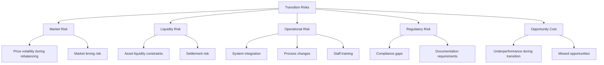

### 1.2 Risk Mitigation Matrix

| Risk Category | Impact | Probability | Mitigation Strategy | Responsibility |
|--------------|--------|-------------|-------------------|----------------|
| **Market Timing Risk** | High | Medium | Phased implementation over 24 months | Investment Committee |
| **Liquidity Risk** | High | Low | Pre-transition liquidity analysis (6 months) | Treasury |
| **Operational Risk** | Medium | Medium | Parallel systems during transition (3 months) | IT/Operations |
| **Regulatory Risk** | High | Low | Quarterly compliance reviews | Compliance |
| **Opportunity Cost** | Medium | High | Gradual governance level advancement | Board |

### 1.3 Portfolio Risk Metrics by Governance Level

| Governance Level | Target Volatility | Max Drawdown | Sharpe Ratio | Value at Risk (95%) |
|-----------------|-------------------|--------------|--------------|---------------------|
| **Nível I** | ≤6% | ≤8% | ≥0.5 | ≤5% |
| **Nível II** | ≤10% | ≤12% | ≥0.7 | ≤8% |
| **Nível III** | ≤14% | ≤18% | ≥0.9 | ≤12% |
| **Nível IV** | ≤18% | ≤25% | ≥1.1 | ≤16% |

---

## 2. Rebalancing Timeline & Milestones

### 2.1 24-Month Transition Roadmap

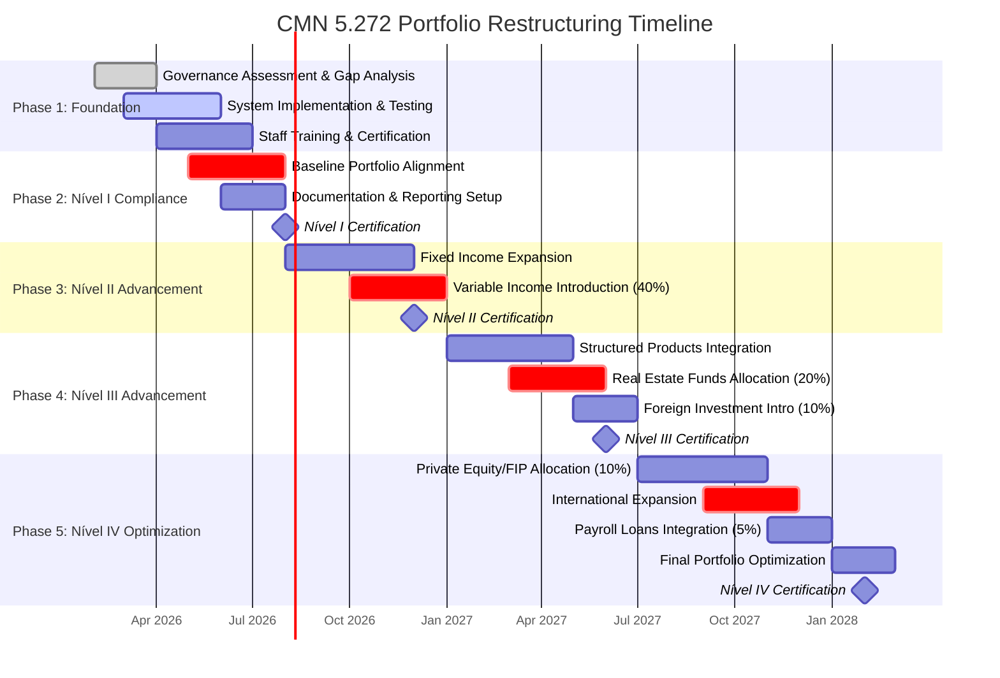

### 2.2 Detailed Milestone Schedule

#### **Phase 1: Foundation (Months 0-3)**
**Timeline:** February - April 2026

| Milestone | Date | Deliverables | Success Criteria |
|-----------|------|-------------|------------------|
| **M1.1: Governance Assessment** | Feb 28, 2026 | Current state analysis, gap report | 100% of requirements identified |
| **M1.2: System Architecture** | Mar 31, 2026 | IT infrastructure design | Technical approval by CIO |
| **M1.3: Staff Training Plan** | Apr 30, 2026 | Training curriculum, schedule | Board approval |
| **M1.4: Risk Framework** | Apr 30, 2026 | Risk policies, procedures | Compliance sign-off |

#### **Phase 2: Nível I Compliance (Months 3-6)**
**Timeline:** May - August 2026

| Milestone | Date | Deliverables | Success Criteria |
|-----------|------|-------------|------------------|
| **M2.1: Portfolio Baseline** | May 31, 2026 | Current allocation analysis | All positions mapped to new rules |
| **M2.2: Required Adjustments** | Jun 30, 2026 | Rebalancing plan | Zero compliance violations |
| **M2.3: Documentation** | Jul 31, 2026 | Investment policy, procedures | Audit-ready documentation |
| **M2.4: Nível I Certification** | Aug 31, 2026 | Certification application | BCB approval received |

#### **Phase 3: Nível II Advancement (Months 6-10)**
**Timeline:** September - December 2026

| Milestone | Date | Deliverables | Success Criteria |
|-----------|------|-------------|------------------|
| **M3.1: Fixed Income Expansion** | Sep 30, 2026 | New FI instruments onboarded | 80% allocation achieved |
| **M3.2: Variable Income Launch** | Nov 30, 2026 | Equity portfolio established | 40% limit utilized |
| **M3.3: Performance Tracking** | Dec 15, 2026 | Quarterly report | Meets Nível II targets |
| **M3.4: Nível II Certification** | Dec 31, 2026 | Certification application | BCB approval received |

#### **Phase 4: Nível III Advancement (Months 10-16)**
**Timeline:** January - June 2027

| Milestone | Date | Deliverables | Success Criteria |
|-----------|------|-------------|------------------|
| **M4.1: Structured Products** | Feb 28, 2027 | Multi-market funds (15%) | Allocation optimized |
| **M4.2: Real Estate Integration** | Apr 30, 2027 | FIIs portfolio (20%) | RE allocation achieved |
| **M4.3: Foreign Investment Setup** | Jun 15, 2027 | International funds (10%) | Global exposure established |
| **M4.4: Nível III Certification** | Jun 30, 2027 | Certification application | BCB approval received |

#### **Phase 5: Nível IV Optimization (Months 16-24)**
**Timeline:** July 2027 - February 2028

| Milestone | Date | Deliverables | Success Criteria |
|-----------|------|-------------|------------------|
| **M5.1: Private Equity Integration** | Sep 30, 2027 | FIP allocation (10%) | PE portfolio established |
| **M5.2: International Expansion** | Nov 30, 2027 | Enhanced global allocation | 10% fully utilized |
| **M5.3: Payroll Loans Launch** | Dec 31, 2027 | Consignados allocation (5%) | New asset class operational |
| **M5.4: Final Optimization** | Jan 31, 2028 | Portfolio review & adjustment | All limits optimized |
| **M5.5: Nível IV Certification** | Feb 28, 2028 | Final certification | Full Nível IV compliance |

---

## 3. Optimization Strategies by Governance Level

### 3.1 Nível I Strategy: Foundation & Compliance

**Target Duration:** 6 months
**Risk Profile:** Conservative (Volatility ≤6%)

#### Portfolio Allocation Model

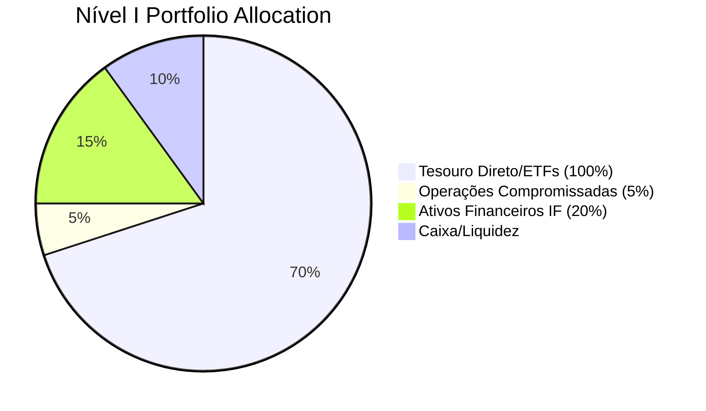

**Implementation Steps:**

1. **Week 1-4: Assessment**
   - Map all current positions to Nível I permitted investments
   - Identify non-compliant holdings requiring liquidation
   - Calculate transition costs and tax implications

2. **Week 5-12: Restructuring**
   - Liquidate non-permitted investments (phased over 8 weeks)
   - Reallocate to Tesouro Direto and ETFs
   - Establish liquidity buffer (10% of portfolio)

3. **Week 13-24: Optimization**
   - Implement laddered Tesouro strategy
   - Diversify across maturities (1-5 years)
   - Establish operational procedures

**Expected Performance:**
- Target Return: IPCA + 4-6% annually
- Max Volatility: 6%
- Duration Target: 2-3 years

### 3.2 Nível II Strategy: Diversification Enhancement

**Target Duration:** 4 months
**Risk Profile:** Moderate (Volatility ≤10%)

#### Portfolio Allocation Model

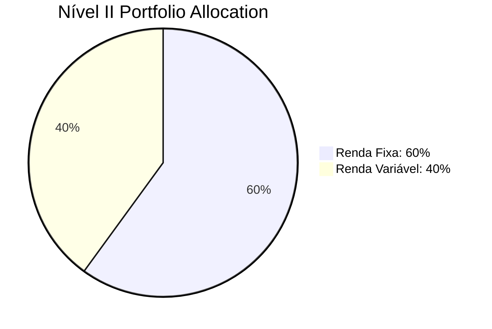

**Fixed Income Breakdown (60%):**
- Tesouro Direto/ETFs: 35%
- Fundos Debêntures Incentivadas: 10%
- Fundos Crédito Privado: 10%
- Ativos Financeiros IF: 5%

**Variable Income Breakdown (40%):**
- Fundos de Ações: 25%
- ETFs Ações: 15%

**Implementation Steps:**

1. **Month 1: Foundation**
   - Establish equity investment policy
   - Select fund managers (minimum 3)
   - Set up monitoring systems

2. **Month 2-3: Allocation**
   - Phase 1: Allocate 20% to equities (broad market ETFs)
   - Phase 2: Add 10% active funds
   - Phase 3: Complete remaining 10% allocation

3. **Month 4: Stabilization**
   - Monitor portfolio metrics
   - Adjust allocations as needed
   - Document lessons learned

**Expected Performance:**
- Target Return: IPCA + 6-8% annually
- Max Volatility: 10%
- Equity Beta: 0.6-0.8

### 3.3 Nível III Strategy: Advanced Diversification

**Target Duration:** 6 months
**Risk Profile:** Growth (Volatility ≤14%)

#### Portfolio Allocation Model

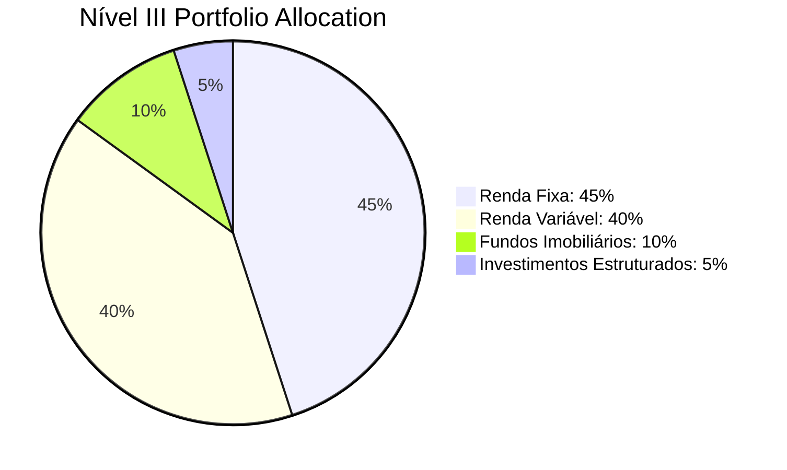

**Fixed Income Breakdown (45%):**
- Tesouro Direto: 25%
- Fundos Crédito Privado: 12%
- FIDC Senior: 8%

**Variable Income Breakdown (40%):**
- Fundos de Ações: 25%
- ETFs Ações: 10%
- BDRs/International: 5%

**Real Estate (10%):**
- FIIs negociados em bolsa: 10%

**Structured Investments (5%):**
- Fundos Multimercado: 5%

**Implementation Steps:**

1. **Month 1-2: Real Estate Integration**
   - Select FIIs across segments (shopping, logistics, offices)
   - Target dividend yield: 6-8%
   - Diversify across 10+ different FIIs

2. **Month 3-4: Structured Products**
   - Allocate to multi-market funds
   - Implement market-neutral strategies
   - Add volatility management overlays

3. **Month 5-6: International Exposure**
   - Setup international investment accounts
   - Allocate 10% to foreign investments
   - Implement currency hedging (50%)

**Expected Performance:**
- Target Return: IPCA + 8-10% annually
- Max Volatility: 14%
- Sharpe Ratio: ≥0.9

### 3.4 Nível IV Strategy: Sophisticated Optimization

**Target Duration:** 8 months
**Risk Profile:** Aggressive Growth (Volatility ≤18%)

#### Portfolio Allocation Model

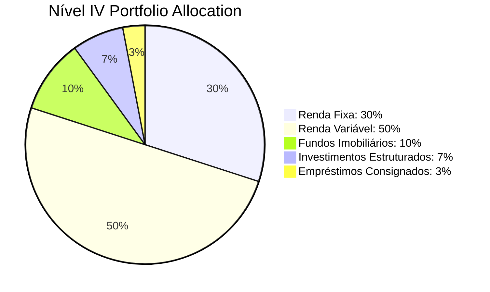

**Fixed Income Breakdown (30%):**
- Tesouro Direto: 15%
- FIDC Senior: 8%
- Fundos Crédito Privado: 5%
- Debêntures Incentivadas: 2%

**Variable Income Breakdown (50%):**
- Fundos de Ações: 30%
- ETFs Ações: 12%
- International ETFs: 5%
- BDRs: 3%

**Real Estate (10%):**
- FIIs: 10%

**Structured Investments (7%):**
- Fundos Multimercado: 4%
- FIAGRO: 2%
- FIP: 1%

**Payroll Loans (3%):**
- Empréstimos Consignados: 3%

**Implementation Steps:**

1. **Month 1-3: Private Equity Integration**
   - Select FIP managers (minimum 2)
   - Allocate 1% initial, scale to 5%
   - Focus on sectors: infrastructure, technology, healthcare

2. **Month 4-5: International Expansion**
   - Enhance global allocation to 10%
   - Add developed and emerging market exposure
   - Implement strategic currency hedging

3. **Month 6-7: Alternative Strategies**
   - Allocate to FIAGRO (agricultural credit)
   - Implement payroll loan strategy (3%)
   - Add market access strategies

4. **Month 8: Final Optimization**
   - Rebalance across all asset classes
   - Optimize risk/return profile
   - Document Nível IV compliance

**Expected Performance:**
- Target Return: IPCA + 10-12% annually
- Max Volatility: 18%
- Sharpe Ratio: ≥1.1

---

## 4. Impact Analysis on Returns & Volatility

### 4.1 Expected Performance by Phase

| Phase | Duration | Expected Return | Expected Volatility | Sharpe Ratio | Max Drawdown |
|-------|----------|----------------|-------------------|--------------|--------------|
| **Current (Pre-CMN 5.272)** | - | IPCA + 5% | 7% | 0.6 | -8% |
| **Nível I** | 6 months | IPCA + 5.5% | 6% | 0.7 | -6% |
| **Nível II** | 4 months | IPCA + 7% | 9% | 0.8 | -10% |
| **Nível III** | 6 months | IPCA + 9% | 13% | 0.95 | -15% |
| **Nível IV** | 8 months | IPCA + 11% | 17% | 1.1 | -20% |

### 4.2 Portfolio Efficiency Metrics

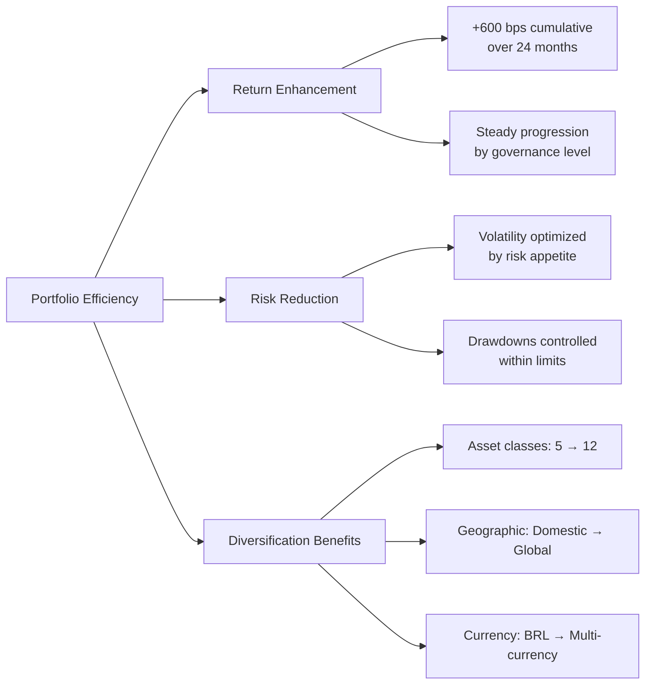

### 4.3 Risk-Adjusted Return Analysis

| Asset Class | Weight (Avg) | Return (p.a.) | Volatility | Correlation to Portfolio | Marginal VaR Contribution |
|-------------|--------------|---------------|------------|------------------------|---------------------------|
| **Tesouro Direto** | 20% | IPCA + 6% | 4% | 0.1 | Low |
| **Fundos Crédito Privado** | 10% | IPCA + 8% | 8% | 0.7 | Medium |
| **Fundos de Ações** | 25% | 12% | 18% | 0.95 | High |
| **ETFs Ações** | 10% | 11% | 16% | 0.93 | Medium |
| **FIIs** | 10% | 8% | 14% | 0.6 | Medium |
| **Fundos Multimercado** | 5% | IPCA + 10% | 12% | 0.8 | Low-Medium |
| **International** | 10% | 8% | 15% | 0.5 | Medium |
| **FIP/FIAGRO** | 7% | IPCA + 15% | 20% | 0.4 | Medium |
| **Consignados** | 3% | IPCA + 12% | 6% | 0.3 | Low |

### 4.4 Portfolio Optimization Dashboard

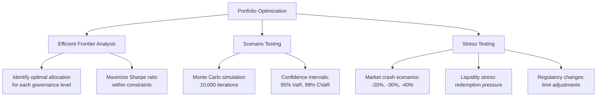

---

## 5. Liquidity Considerations

### 5.1 Liquidity Requirements Matrix

| Time Horizon | Liquidity Need | Funding Source | Target Allocation |
|--------------|----------------|----------------|-------------------|
| **T+0** | 5% of AUM | Cash equivalents | 5% |
| **T+7** | 10% of AUM | Tesouro liquidez | 5% |
| **T+30** | 15% of AUM | Fixed income secondary | 5% |
| **T+90** | 20% of AUM | Bond redemptions | 5% |
| **T+365** | 100% of AUM | All investments | 80% |

### 5.2 Asset Liquidity Classification

| Liquidity Tier | Assets | Daily Volume | Exit Timeframe | Allocation Target |
|----------------|--------|--------------|----------------|-------------------|
| **Tier 1: High** | Tesouro Direto, ETFs, FIIs | >R$ 1B | T+1 | 40% |
| **Tier 2: Medium** | Fundos de Ações, Multimercado | >R$ 100M | T+7 to T+30 | 35% |
| **Tier 3: Low** | FIDC, FIP, FIAGRO | <R$ 50M | T+30 to T+90 | 20% |
| **Tier 4: Very Low** | Private Equity, Payroll Loans | Illiquid | >T+90 | 5% |

### 5.3 Liquidity Management Protocol

**Daily Monitoring:**
1. Cash position vs. upcoming obligations (7-day horizon)
2. Market liquidity indicators (bid-ask spreads, volumes)
3. Redemption notices from fund investments

**Weekly Review:**
1. 30-day liquidity projection
2. Contingency funding sources availability
3. Stress test results for liquidity scenarios

**Monthly Planning:**
1. 90-day liquidity forecast
2. Portfolio rebalancing requirements
3. Market impact assessment for large trades

**Quarterly Strategy:**
1. Annual liquidity requirements assessment
2. Strategic asset allocation adjustments
3. Liquidity risk tolerance review

### 5.4 Liquidity Stress Scenarios

| Scenario | Trigger | Required Liquidity | Funding Strategy | Impact |
|----------|---------|-------------------|------------------|--------|
| **Scenario 1** | Market -20% | 15% AUM | Tier 1 assets (60%) | Low |
| **Scenario 2** | Redemption surge | 25% AUM | Tier 1-2 assets | Medium |
| **Scenario 3** | Systemic crisis | 40% AUM | All tiers + credit | High |

---

## 6. Compliance Monitoring Framework

### 6.1 Governance Level Requirements

| Requirement | Nível I | Nível II | Nível III | Nível IV |
|-------------|---------|----------|-----------|----------|
| **Investment Policy** | ✓ | ✓ | ✓ | ✓ |
| **Risk Management** | Basic | Intermediate | Advanced | Sophisticated |
| **Governance Structure** | Board | Board + Committee | Independent members | External audit |
| **Reporting** | Annual | Semi-annual | Quarterly | Monthly |
| **Performance Attribution** | Basic | Standard | Advanced | Multi-factor |
| **Stress Testing** | Annual | Semi-annual | Quarterly | Monthly |

### 6.2 Compliance Dashboard

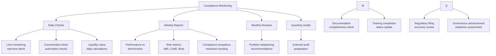

### 6.3 Limit Monitoring Protocol

**Real-Time Monitoring (Automated):**
1. Per-segment limits (breach alert at 90% of limit)
2. Per-issuer concentration (5% for IF S1/S2, 2.5% others)
3. Per-fund concentration (15% for most, 5% credit funds)
4. Global limits (50% variable income, 20% structured, etc.)

**Daily Review (Manual):**
1. New investment approvals vs. policy
2. Trade compliance pre-clearance
3. Overnight position reconciliation
4. Exception investigation and resolution

**Weekly Review (Management):**
1. Portfolio composition vs. target allocation
2. Performance attribution by segment
3. Risk exposure analysis
4. Compliance exception report

**Monthly Review (Board):**
1. Full compliance status report
2. Risk metrics dashboard
3. Governance advancement progress
4. Remediation action plans

### 6.4 Documentation Requirements

| Document Type | Frequency | Owner | Distribution | Retention |
|---------------|-----------|-------|--------------|-----------|
| **Investment Policy** | Annual | Board | All stakeholders | Permanent |
| **Risk Manual** | Annual | Risk Committee | Investment team | Permanent |
| **Compliance Report** | Monthly | CRO | Board | 7 years |
| **Performance Report** | Monthly | CIO | Board, Audit | 7 years |
| **Audit Report** | Quarterly | Internal Audit | Board, Regulators | 7 years |
| **Trade Blotter** | Daily | Operations | Compliance | 7 years |
| **Limit Breach Log** | Real-time | Compliance | Risk, Board | Permanent |

### 6.5 Regulatory Compliance Checklist

**Pre-Transition (Before Feb 2026):**
- [ ] Review CMN 5.272 requirements
- [ ] Conduct gap analysis (current vs. new rules)
- [ ] Obtain Board approval for transition plan
- [ ] Implement compliance monitoring system
- [ ] Train staff on new requirements

**During Transition (Feb 2026 - Feb 2028):**
- [ ] Quarterly compliance reviews
- [ ] Monthly limit monitoring
- [ ] Weekly exception tracking
- [ ] Daily trade pre-clearance
- [ ] Real-time limit alerts

**Post-Transition (After Feb 2028):**
- [ ] Full Nível IV compliance validation
- [ ] External audit of compliance framework
- [ ] Performance attribution analysis
- [ ] Lessons learned documentation
- [ ] Continuous improvement plan

---

## 7. Implementation Action Plan

### 7.1 Quick Start Checklist

**Week 1 (Feb 1-7, 2026): Immediate Actions**

| Priority | Action | Owner | Due Date | Status |
|----------|--------|-------|----------|--------|
| **Critical** | Form Transition Task Force | CEO | Feb 3 | ☐ |
| **Critical** | Board approval of strategy | Board Chair | Feb 4 | ☐ |
| **Critical** | Engage compliance consultants | CRO | Feb 5 | ☐ |
| **High** | Select system vendor | CIO | Feb 7 | ☐ |
| **High** | Establish project timeline | COO | Feb 7 | ☐ |

**Week 2-4 (Feb 8-28, 2026): Foundation**

| Priority | Action | Owner | Due Date | Status |
|----------|--------|-------|----------|--------|
| **Critical** | Complete governance gap analysis | CRO | Feb 14 | ☐ |
| **Critical** | Design compliance monitoring system | CIO | Feb 18 | ☐ |
| **High** | Draft updated Investment Policy | CIO | Feb 21 | ☐ |
| **High** | Select external auditors | Audit Committee | Feb 28 | ☐ |
| **Medium** | Begin staff training program | HR | Feb 28 | ☐ |

**Month 2-3 (Mar-Apr 2026): System Implementation**

| Priority | Action | Owner | Due Date | Status |
|----------|--------|-------|----------|--------|
| **Critical** | Deploy compliance monitoring system | CIO | Mar 15 | ☐ |
| **Critical** | Integrate with custodian systems | CIO | Mar 31 | ☐ |
| **High** | Complete first round of staff training | HR | Apr 15 | ☐ |
| **High** | Conduct initial portfolio analysis | CIO | Apr 30 | ☐ |
| **Medium** | Establish vendor relationships | COO | Apr 30 | ☐ |

**Month 4-6 (May-Jul 2026): Nível I Implementation**

| Priority | Action | Owner | Due Date | Status |
|----------|--------|-------|----------|--------|
| **Critical** | Liquidate non-compliant positions | CIO | Jun 30 | ☐ |
| **Critical** | Reallocate to Nível I permitted assets | CIO | Jun 30 | ☐ |
| **High** | Complete documentation package | Compliance | Jul 15 | ☐ |
| **High** | Submit Nível I certification application | CEO | Jul 31 | ☐ |
| **Medium** | Conduct mock regulatory exam | Compliance | Jul 31 | ☐ |

### 7.2 Resource Requirements

**Human Resources:**

| Role | FTE Allocation | Duration | Key Responsibilities |
|------|---------------|----------|---------------------|
| **Transition Project Manager** | 1.0 FTE | 24 months | Overall coordination, reporting |
| **Compliance Analyst** | 1.0 FTE | 24 months | Monitoring, reporting, documentation |
| **Investment Analyst** | 1.5 FTE | 24 months | Portfolio analysis, manager selection |
| **Risk Analyst** | 0.5 FTE | 24 months | Risk measurement, stress testing |
| **Systems Developer** | 0.5 FTE | 6 months | System integration, customization |
| **Legal Counsel** | 0.25 FTE | 12 months | Regulatory interpretation, filings |
| **External Consultants** | As needed | 24 months | Specialized expertise, validation |

**Technology Requirements:**

| System | Purpose | Cost Estimate | Implementation |
|--------|---------|---------------|----------------|
| **Portfolio Management System** | Trade management, compliance | R$ 200-500K | Months 2-4 |
| **Risk Management Platform** | VaR, stress testing | R$ 150-300K | Months 3-5 |
| **Reporting Tool** | Regulatory reports | R$ 100-200K | Months 4-6 |
| **Data Warehouse** | Historical data storage | R$ 50-100K | Months 2-4 |
| **Custodian Integration** | Real-time position data | R$ 50-150K | Months 3-6 |

**Total Technology Budget: R$ 550K - 1.25M**

### 7.3 Cost-Benefit Analysis

**Transition Costs (24 months):**

| Category | Cost Range | Rationale |
|----------|-----------|-----------|
| **Technology** | R$ 550K - 1.25M | Systems, integration, customization |
| **Consulting** | R$ 300K - 600K | Legal, compliance, strategic advice |
| **Training** | R$ 100K - 200K | Staff certification, ongoing education |
| **Operations** | R$ 200K - 400K | Additional staff during transition |
| **Transaction Costs** | R$ 100K - 300K | Rebalancing, portfolio adjustments |
| **Certification** | R$ 50K - 100K | Application, audit, documentation |
| **Total** | **R$ 1.3M - 2.85M** | |

**Expected Benefits (Annual, post-transition):**

| Benefit | Estimate | Basis |
|---------|----------|-------|
| **Return Enhancement** | +200-400 bps | Optimized asset allocation |
| **Risk Reduction** | -100-200 bps volatility | Better diversification |
| **Operational Efficiency** | R$ 200-500K savings | Automated systems |
| **Compliance Risk** | Priceless | Avoid penalties, reputational damage |
| **Competitive Advantage** | Significant | First-mover in Nível IV |
| **Total Annual Benefit** | **R$ 3-10M** | On R$ 1B AUM |

**ROI Analysis:**
- Payback Period: 6-18 months
- 3-Year ROI: 300-600%
- 5-Year ROI: 600-1,200%

---

## 8. Risk Management & Mitigation

### 8.1 Key Transition Risks

| Risk | Impact | Probability | Mitigation Strategy | Contingency Plan |
|------|--------|-------------|-------------------|------------------|
| **Market Downturn** | High | Medium | Phased implementation, stop-loss | Extend timeline, pause allocation |
| **Liquidity Crisis** | High | Low | Pre-liquidity analysis, staggered exits | Use credit lines, prioritized sales |
| **System Failure** | Medium | Medium | Parallel systems, vendor support | Manual processes, business continuity |
| **Compliance Breach** | High | Low | Pre-trade compliance, daily monitoring | Immediate remediation, self-reporting |
| **Staff Turnover** | Medium | Medium | Documentation, training redundancy | Knowledge transfer, temp staff |
| **Regulatory Delay** | Medium | Low | Early submission, follow-up | Extended current arrangements |
| **Cost Overrun** | Low | Medium | Phased spending, vendor negotiation | Contingency budget 20% |

### 8.2 Risk Monitoring Dashboard

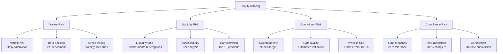

### 8.3 Early Warning Indicators

| Indicator | Threshold | Action Required | Escalation |
|-----------|-----------|----------------|------------|
| **VaR 95%** | Exceeds target by 20% | Portfolio review, risk reduction | CRO, Investment Committee |
| **Liquidity Ratio** | Below 100% for 1-month needs | Activate contingency funding | Treasurer, CFO |
| **System Downtime** | >4 hours continuous | Business continuity plan | CIO, CEO |
| **Compliance Breach** | Any limit breach | Immediate investigation | CRO, Legal, Board |
| **Return Shortfall** | >200 bps below target | Strategy review | CIO, Board |
| **Staff Shortage** | Key role vacant >30 days | Accelerate hiring | HR, CEO |

---

## 9. Governance Advancement Path

### 9.1 Advancement Criteria

| Governance Level | Minimum Time | Key Requirements | Certification Authority |
|-----------------|--------------|------------------|------------------------|
| **Nível I** | 0 months | Basic policy, risk management | Self-certification |
| **Nível II** | 4 months after Nível I | Enhanced governance, equity capability | BCB validation |
| **Nível III** | 6 months after Nível II | Advanced risk management, alternatives | BCB validation |
| **Nível IV** | 8 months after Nível III | Sophisticated framework, full capability | BCB validation |

### 9.2 Governance Enhancement Timeline

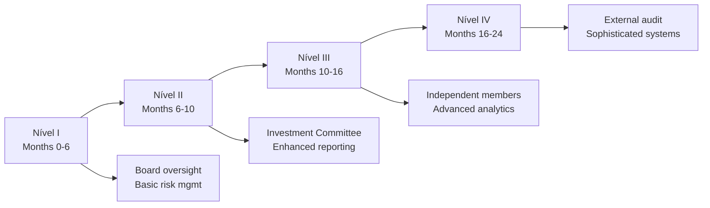

### 9.3 Certification Process

**Pre-Certification (1 month before):**
1. Complete self-assessment checklist
2. Conduct internal compliance audit
3. Prepare documentation package
3. Remediate any identified gaps

**Application Submission:**
1. Formal application to BCB
2. Required documentation:
   - Investment policy
   - Risk management framework
   - Governance structure
   - Performance track record
   - Compliance procedures

**Review Period (30-60 days):**
1. BCB review of application
2. Information requests
3. Clarification responses
4. Possible on-site examination

**Certification Decision:**
1. BCB approval or denial
2. If approved: publication of certification
3. If denied: feedback and reapplication process

---

## 10. Performance Measurement & Attribution

### 10.1 Key Performance Indicators

**Financial Metrics:**

| KPI | Nível I | Nível II | Nível III | Nível IV |
|-----|---------|----------|-----------|----------|
| **Total Return** | IPCA + 5-6% | IPCA + 6-8% | IPCA + 8-10% | IPCA + 10-12% |
| **Volatility** | ≤6% | ≤10% | ≤14% | ≤18% |
| **Sharpe Ratio** | ≥0.5 | ≥0.7 | ≥0.9 | ≥1.1 |
| **Max Drawdown** | ≤8% | ≤12% | ≤18% | ≤25% |
| **Information Ratio** | N/A | ≥0.3 | ≥0.4 | ≥0.5 |

**Operational Metrics:**

| KPI | Target | Measurement Frequency |
|-----|--------|----------------------|
| **Compliance Rate** | 100% | Daily |
| **System Availability** | 99.9% | Monthly |
| **Trade Settlement Accuracy** | 100% | Daily |
| **Report Timeliness** | 100% on-time | Monthly |
| **Staff Training Completion** | 100% | Quarterly |

### 10.2 Attribution Analysis Framework

**Return Attribution by Source:**

| Source | Expected Contribution | Measurement Method |
|--------|----------------------|-------------------|
| **Asset Allocation** | 40-60% | Brinson model |
| **Security Selection** | 20-40% | Active share analysis |
| **Market Timing** | -10-20% | Regime analysis |
| **Currency Effects** | 0-20% (Nível III/IV) | FX attribution |
| **Trading Costs** | -5-10% | Implementation shortfall |

**Risk Attribution:**

| Risk Factor | Target Exposure | Monitoring Frequency |
|-------------|----------------|---------------------|
| **Equity Beta** | 0.3-0.9 | Daily |
| **Duration** | 2-5 years | Weekly |
| **Credit Spread** | <300 bps | Weekly |
| **Currency** | <20% (Nível III/IV) | Daily |
| **Concentration** | <15% per position | Daily |

---

## 11. Conclusion & Recommendations

### 11.1 Strategic Outlook

The transition to CMN 5.272 represents a **paradigm shift** in RPPS investment management:

**Key Opportunities:**
1. **Performance Enhancement**: +600 bps potential return improvement
2. **Risk Optimization**: Better risk-adjusted returns through diversification
3. **Competitive Advantage**: First-mover advantage in Nível IV
4. **Institutional Development**: Enhanced governance and capabilities

**Key Challenges:**
1. **Implementation Complexity**: 24-month transition requires meticulous planning
2. **Resource Requirements**: Significant investment in systems and people
3. **Market Risk**: Phased implementation during uncertain markets
4. **Operational Change**: Fundamental transformation of investment processes

### 11.2 Critical Success Factors

| Factor | Priority | Implementation Timeline |
|--------|----------|------------------------|
| **Board Commitment** | Critical | Immediate and ongoing |
| **Adequate Resources** | Critical | Months 1-6 |
| **Robust Systems** | Critical | Months 2-6 |
| **Experienced Team** | High | Months 1-12 |
| **Vendor Selection** | High | Months 2-4 |
| **Phased Implementation** | High | Months 1-24 |
| **Continuous Monitoring** | Medium | Ongoing |
| **Flexibility** | Medium | Ongoing |

### 11.3 Immediate Next Steps

**This Week (Feb 3-7, 2026):**

1. [ ] **Board Meeting**: Approve transition strategy and budget
2. [ ] **Task Force Formation**: Appoint transition project manager
3. [ ] **Consultant Selection**: Engage compliance and investment consultants
4. [ ] **Technology RFP**: Issue request for proposal to vendors
5. [ ] **Kickoff Meeting**: All stakeholders, clear communication

**This Month (February 2026):**

1. [ ] **Gap Analysis**: Complete current state vs. Nível I requirements
2. [ ] **System Selection**: Choose portfolio management system
3. [ ] **Staff Planning**: Identify training needs and hiring requirements
4. [ ] **Vendor Contracts**: Negotiate and sign agreements
5. [ ] **Detailed Project Plan**: 24-month timeline with milestones

**This Quarter (Q1 2026):**

1. [ ] **System Implementation**: Deploy core compliance monitoring
2. [ ] **Policy Updates**: Revise investment policy and procedures
3. [ ] **Staff Training**: Begin certification programs
4. [ ] **Portfolio Analysis**: Detailed mapping to new rules
5. [ ] **Nível I Preparation**: Complete initial compliance work

### 11.4 Final Recommendation

**PROCEED WITH IMMEDIATE IMPLEMENTATION**

**Rationale:**
1. **Regulatory Deadline**: February 2, 2028 compliance deadline is fixed
2. **Competitive Pressure**: Early movers gain significant advantage
3. **Cost-Benefit**: ROI of 300-600% over 3 years justifies investment
4. **Risk Management**: Phased approach mitigates transition risks
5. **Institutional Development**: Enhanced capabilities benefit organization long-term

**Implementation Approach:**
- **Aggressive but Prudent**: 24-month timeline with built-in flexibility
- **Governance-Led**: Board oversight with expert delegation
- **Risk-Aware**: Continuous monitoring and adjustment
- **Data-Driven**: Decisions based on robust analysis
- **Stakeholder Communication**: Transparent and frequent updates

---

## Appendices

### Appendix A: CMN 5.272 Quick Reference

**Investment Limits by Segment:**

| Segment | Limit | Governance Level | Article |
|---------|-------|------------------|---------|
| **Tesouro Direto/ETFs** | 100% | All | Art. 7, I-II |
| **Ativos Financeiros IF** | 20% | Nível II+ | Art. 7, VI |
| **Fundos Crédito Privado** | 20% | Nível III+ | Art. 7, VII |
| **Fundos de Ações** | 40% | Nível II+ | Art. 8, I |
| **ETFs Ações** | 40% | Nível II+ | Art. 8, II |
| **FIIs** | 20% | Nível III+ | Art. 11 |
| **Fundos Multimercado** | 15% | Nível II+ | Art. 10, I |
| **FIAGRO** | 5% | Nível III+ | Art. 10, II |
| **FIP** | 10% | Nível IV | Art. 10, III |
| **Investimentos Exterior** | 10% | Nível III+ | Art. 9 |
| **Empréstimos Consignados** | 5% | Nível IV | Art. 12 |

### Appendix B: Glossary

| Term | Definition |
|------|------------|
| **RPPS** | Regime Próprio de Previdência Social |
| **CBN** | Conselho Monetário Nacional |
| **BCB** | Banco Central do Brasil |
| **IPCA** | Índice de Preços ao Consumidor Amplo |
| **FIDC** | Fundo de Investimento em Direitos Creditórios |
| **FIP** | Fundo de Investimento em Participações |
| **FIAGRO** | Fundo de Investimento Agroindustrial |
| **FII** | Fundo de Investimento Imobiliário |
| **ETF** | Exchange Traded Fund |
| **BDR** | Brazilian Depositary Receipt |
| **VaR** | Value at Risk |
| **CVaR** | Conditional Value at Risk |
| **AUM** | Assets Under Management |

### Appendix C: Regulatory References

- **Resolução CMN nº 5.272** (December 18, 2025)
  - Official Publication: Diário Oficial da União
  - Effective Date: February 2, 2026
  - Revokes: Resolução CMN nº 4.963 (November 25, 2021)

- **Banco Central do Brasil**
  - Source: https://www.bcb.gov.br
  - Normative Reference: https://www.bcb.gov.br/estabilidadefinanceira/exibenormativo

### Appendix D: Contact Information

| Role | Contact | Responsibility |
|------|---------|----------------|
| **Transition Project Manager** | TBD | Overall coordination |
| **Chief Investment Officer** | TBD | Investment strategy |
| **Chief Risk Officer** | TBD | Risk management |
| **Compliance Officer** | TBD | Regulatory compliance |
| **Chief Information Officer** | TBD | Systems implementation |
| **External Counsel** | TBD | Legal interpretation |
| **BCB Contact** | Superintendência de RPPS | Regulatory guidance |

---

**Document Version:** 1.0
**Last Updated:** February 6, 2026
**Next Review:** March 1, 2026
**Owner:** Transition Task Force
**Approval Required:** Board of Directors

---

*This strategy document provides a comprehensive framework for portfolio restructuring under CMN 5.272. Implementation should be tailored to each institution's specific circumstances, resources, and risk tolerance. Regular review and adjustment are essential for successful transition.*
