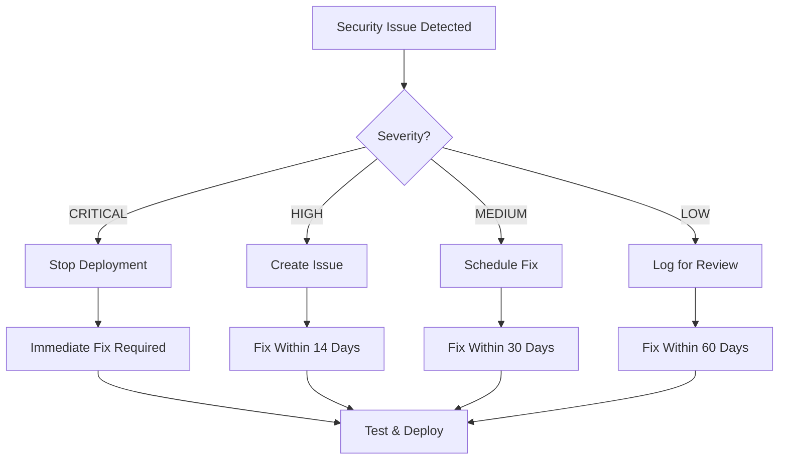

# Security Vulnerability Remediation Guide

## 🎯 Purpose

This guide provides step-by-step procedures for remediating security vulnerabilities discovered by our scanning tools.

---

## 📋 Table of Contents

1. [Immediate Response](#immediate-response)
2. [Vulnerability Types](#vulnerability-types)
3. [Remediation Workflows](#remediation-workflows)
4. [Testing Procedures](#testing-procedures)
5. [Deployment Guidelines](#deployment-guidelines)

---

## 🚨 Immediate Response

### When a Security Issue is Detected



### Critical Response (CVSS 9.0-10.0)

**Timeline: Immediate (0-24 hours)**

1. **Assess Impact**
   ```bash
   # Get vulnerability details
   ./scripts/security-check.sh | grep CRITICAL

   # Check affected versions
   npm ls vulnerable-package
   ```

2. **Isolate if Necessary**
   ```bash
   # If deployed, consider rollback
   # Contact DevOps team

   # Block further deployments
   # CI/CD will automatically block
   ```

3. **Apply Fix**
   ```bash
   # Update to patched version
   npm update vulnerable-package

   # Or replace with alternative
   npm uninstall vulnerable-package
   npm install alternative-package
   ```

4. **Verify Fix**
   ```bash
   # Re-scan
   ./scripts/security-check.sh

   # Run tests
   npm test

   # Build verification
   npm run build
   ```

5. **Document**
   ```markdown
   ## Critical Security Fix - CVE-2024-XXXXX

   **Vulnerability:** Remote Code Execution in package-name
   **Severity:** CRITICAL (CVSS 9.8)
   **Status:** FIXED

   ### Actions Taken
   - Updated package-name from 1.2.3 to 1.2.4
   - Verified fix with security scan
   - All tests passing
   - Deployed to production: 2025-10-28 14:30 UTC

   ### Verification
   - Security scan: PASSED
   - Integration tests: PASSED
   - Manual testing: PASSED
   ```

---

## 🔍 Vulnerability Types

### 1. Dependency Vulnerabilities

**Detection:**
```bash
npm audit
```

**Common Issues:**
- Outdated packages with known CVEs
- Transitive dependency vulnerabilities
- Unmaintained packages

**Resolution Steps:**

#### A. Direct Dependency

```bash
# Check current version
npm ls package-name

# Check available versions
npm view package-name versions

# Update to latest
npm update package-name

# Or specify version
npm install package-name@1.2.4

# Verify
npm audit
```

#### B. Transitive Dependency

```bash
# Find which package depends on it
npm ls vulnerable-package

# Update parent package
npm update parent-package

# If parent not updated, use npm overrides
# In package.json:
{
  "overrides": {
    "vulnerable-package": "^1.2.4"
  }
}

# Then
npm install
```

#### C. No Fix Available

```bash
# Option 1: Find alternative package
npm uninstall vulnerable-package
npm install alternative-package

# Option 2: Temporarily accept risk with audit exceptions
npm audit --audit-level=high  # Skip vulnerabilities below high

# Document decision in SECURITY.md
```

### 2. Container Vulnerabilities

**Detection:**
```bash
docker run --rm -v /var/run/docker.sock:/var/run/docker.sock \
  aquasec/trivy:latest image your-image:tag
```

**Common Issues:**
- Base image vulnerabilities
- System package vulnerabilities
- Application dependencies

**Resolution Steps:**

#### A. Base Image Updates

```dockerfile
# Before
FROM node:20.10.0-alpine

# After - use latest patch version
FROM node:20.11.0-alpine

# Or use specific digest
FROM node:20-alpine@sha256:abc123...
```

#### B. System Packages

```dockerfile
# Update system packages
RUN apk update && \
    apk upgrade && \
    rm -rf /var/cache/apk/*

# Remove unnecessary packages
RUN apk del build-dependencies
```

#### C. Multi-Stage Builds

```dockerfile
# Build stage
FROM node:20-alpine AS builder
WORKDIR /app
COPY package*.json ./
RUN npm ci --only=production

# Production stage - minimal image
FROM node:20-alpine
RUN addgroup -g 1001 -S nodejs && \
    adduser -S nodejs -u 1001
USER nodejs
COPY --from=builder --chown=nodejs:nodejs /app/node_modules ./node_modules
COPY --chown=nodejs:nodejs . .
CMD ["node", "server.js"]
```

### 3. Secrets in Code

**Detection:**
```bash
trufflehog git file://. --since-commit HEAD --only-verified
```

**Common Issues:**
- API keys in source code
- Database credentials
- SSH private keys
- OAuth tokens

**Resolution Steps:**

#### A. Remove from Current Commit

```bash
# If not yet pushed
git reset --soft HEAD~1
git restore --staged .
git checkout -- filename

# Add to .env (not committed)
echo "API_KEY=your-secret" >> .env
```

#### B. Remove from Git History

```bash
# Using BFG Repo-Cleaner
bfg --delete-files secret-file.txt
git reflog expire --expire=now --all
git gc --prune=now --aggressive

# Or using git-filter-repo
git filter-repo --path secret-file.txt --invert-paths
```

#### C. Revoke and Rotate

```bash
# 1. Revoke the exposed secret immediately
# 2. Generate new secret
# 3. Update all systems using the secret
# 4. Document the incident

# Example for GitHub token
# 1. Go to GitHub Settings > Developer settings > Personal access tokens
# 2. Revoke the exposed token
# 3. Generate new token
# 4. Update in GitHub Secrets, local .env, etc.
```

### 4. Configuration Issues

**Detection:**
```bash
docker run --rm -v $(pwd):/src aquasec/trivy:latest config /src
```

**Common Issues:**
- Weak security settings
- Exposed ports
- Running as root
- Missing security options

**Resolution Steps:**

#### A. Docker Compose Security

```yaml
# Before
services:
  app:
    image: myapp:latest
    ports:
      - "3000:3000"

# After
services:
  app:
    image: myapp:latest
    ports:
      - "127.0.0.1:3000:3000"  # Bind to localhost only
    security_opt:
      - no-new-privileges:true
    read_only: true
    tmpfs:
      - /tmp
    user: "1001:1001"  # Non-root user
    cap_drop:
      - ALL
    cap_add:
      - NET_BIND_SERVICE
```

#### B. Kubernetes Security

```yaml
# Before
apiVersion: v1
kind: Pod
metadata:
  name: app
spec:
  containers:
  - name: app
    image: myapp:latest

# After
apiVersion: v1
kind: Pod
metadata:
  name: app
spec:
  securityContext:
    runAsNonRoot: true
    runAsUser: 1001
    fsGroup: 1001
  containers:
  - name: app
    image: myapp:latest
    securityContext:
      allowPrivilegeEscalation: false
      readOnlyRootFilesystem: true
      capabilities:
        drop:
        - ALL
    resources:
      limits:
        cpu: "1"
        memory: "512Mi"
      requests:
        cpu: "100m"
        memory: "128Mi"
```

---

## 🔄 Remediation Workflows

### Workflow 1: Dependency Vulnerability

```bash
#!/bin/bash
# remediate-dependency.sh

PACKAGE=$1
VERSION=$2

echo "🔍 Analyzing vulnerability in ${PACKAGE}"

# 1. Check current usage
echo "Current version:"
npm ls ${PACKAGE}

# 2. Check for updates
echo -e "\nAvailable versions:"
npm view ${PACKAGE} versions --json | jq -r '.[-5:][]'

# 3. Update package
echo -e "\n📦 Updating ${PACKAGE} to ${VERSION}"
npm install ${PACKAGE}@${VERSION}

# 4. Run tests
echo -e "\n🧪 Running tests"
npm test

# 5. Verify fix
echo -e "\n✅ Verifying fix"
npm audit | grep ${PACKAGE}

# 6. Create commit
git add package.json package-lock.json
git commit -m "fix(security): update ${PACKAGE} to ${VERSION} - CVE remediation"

echo -e "\n✨ Done! Review changes and push."
```

### Workflow 2: Docker Image Hardening

```bash
#!/bin/bash
# harden-docker-image.sh

IMAGE_NAME=$1
DOCKERFILE=$2

echo "🔒 Hardening Docker image: ${IMAGE_NAME}"

# 1. Scan current image
echo "Current vulnerabilities:"
docker run --rm -v /var/run/docker.sock:/var/run/docker.sock \
  aquasec/trivy:latest image ${IMAGE_NAME} \
  --severity CRITICAL,HIGH

# 2. Update Dockerfile
echo -e "\n📝 Applying security improvements..."

# Add non-root user
sed -i '/^FROM/a \
RUN addgroup -g 1001 -S appuser && \\\
    adduser -S appuser -u 1001' ${DOCKERFILE}

# Add USER directive before CMD
sed -i '/^CMD/i USER appuser' ${DOCKERFILE}

# 3. Rebuild
echo -e "\n🔨 Rebuilding image..."
docker build -t ${IMAGE_NAME}:secure -f ${DOCKERFILE} .

# 4. Re-scan
echo -e "\n✅ Scanning improved image..."
docker run --rm -v /var/run/docker.sock:/var/run/docker.sock \
  aquasec/trivy:latest image ${IMAGE_NAME}:secure \
  --severity CRITICAL,HIGH

echo -e "\n✨ Review improvements and commit Dockerfile changes"
```

### Workflow 3: Secret Rotation

```bash
#!/bin/bash
# rotate-secret.sh

SECRET_NAME=$1

echo "🔄 Rotating secret: ${SECRET_NAME}"

# 1. Generate new secret
NEW_SECRET=$(openssl rand -base64 32)

# 2. Update .env.example (without actual value)
echo "${SECRET_NAME}=your-secret-here  # Generated: $(date)" >> .env.example

# 3. Update local .env
echo "${SECRET_NAME}=${NEW_SECRET}" >> .env

# 4. Update GitHub Secrets (manual step)
echo -e "\n📝 Manual step required:"
echo "   1. Go to GitHub Settings > Secrets"
echo "   2. Update ${SECRET_NAME}"
echo "   3. New value: ${NEW_SECRET}"

# 5. Update Kubernetes secrets (if applicable)
if command -v kubectl &> /dev/null; then
    echo -e "\n🔧 Updating Kubernetes secret..."
    kubectl create secret generic app-secrets \
        --from-literal=${SECRET_NAME}=${NEW_SECRET} \
        --dry-run=client -o yaml | kubectl apply -f -
fi

echo -e "\n✅ Local secret updated. Complete manual steps above."
```

---

## 🧪 Testing Procedures

### 1. Automated Testing

```bash
#!/bin/bash
# test-security-fix.sh

echo "🧪 Running security fix validation"

# 1. Security scan
echo "Step 1: Security scan"
./scripts/security-check.sh || exit 1

# 2. Unit tests
echo "Step 2: Unit tests"
npm test || exit 1

# 3. Integration tests
echo "Step 3: Integration tests"
npm run test:integration || exit 1

# 4. Build verification
echo "Step 4: Build verification"
npm run build || exit 1

# 5. Docker image test (if applicable)
if [ -f Dockerfile ]; then
    echo "Step 5: Docker image test"
    docker build -t test-image:latest . || exit 1
    docker run --rm test-image:latest npm test || exit 1
fi

echo "✅ All tests passed!"
```

### 2. Manual Verification

**Checklist:**

- [ ] Security scan shows no CRITICAL vulnerabilities
- [ ] All unit tests pass
- [ ] Integration tests pass
- [ ] Application starts successfully
- [ ] Key features work as expected
- [ ] No new vulnerabilities introduced
- [ ] Performance not significantly impacted
- [ ] Documentation updated

### 3. Rollback Plan

```bash
#!/bin/bash
# rollback-if-needed.sh

PREVIOUS_VERSION=$1

echo "🔙 Rollback plan ready"
echo "If deployment fails, run:"
echo ""
echo "  git revert HEAD"
echo "  npm install"
echo "  npm test"
echo "  git push"
echo ""
echo "Or restore previous image:"
echo "  docker tag myapp:${PREVIOUS_VERSION} myapp:latest"
echo "  docker push myapp:latest"
```

---

## 🚀 Deployment Guidelines

### Pre-Deployment Checklist

```markdown
## Security Fix Deployment Checklist

- [ ] Vulnerability confirmed and reproduced
- [ ] Fix tested locally
- [ ] All automated tests passing
- [ ] Security scan shows improvement
- [ ] No new vulnerabilities introduced
- [ ] Change reviewed by team member
- [ ] Rollback plan prepared
- [ ] Monitoring alerts configured
- [ ] Documentation updated
- [ ] Stakeholders notified (if critical)

**Deployment Time:** [Scheduled Time]
**Expected Duration:** [X minutes]
**Rollback Time:** [X minutes]
```

### Deployment Process

#### 1. Staging Deployment

```bash
# Deploy to staging first
git checkout staging
git merge security-fix-branch
git push

# Monitor
watch kubectl get pods -n staging

# Test
curl https://staging.example.com/health
npm run test:smoke -- --env=staging
```

#### 2. Production Deployment

```bash
# Create release
git checkout main
git merge staging
git tag -a v1.2.4 -m "Security fix: CVE-2024-XXXXX"
git push --tags

# Deploy
kubectl set image deployment/app app=myapp:v1.2.4

# Monitor rollout
kubectl rollout status deployment/app

# Verify
curl https://example.com/health
npm run test:smoke -- --env=production
```

#### 3. Post-Deployment Validation

```bash
# Run final security scan against production
docker run --rm aquasec/trivy:latest \
  image registry.example.com/myapp:v1.2.4

# Check metrics
kubectl top pods
kubectl logs deployment/app --tail=100

# Update documentation
echo "## v1.2.4 - Security Fix" >> CHANGELOG.md
echo "- Fixed CVE-2024-XXXXX in package-name" >> CHANGELOG.md
```

---

## 📚 Resources

### Internal

- **Security Policy:** `SECURITY.md`
- **Security Scanner:** `scripts/security-check.sh`
- **Pre-commit Hooks:** `.pre-commit-config.yaml`

### External

- **CVE Database:** https://cve.mitre.org/
- **NVD:** https://nvd.nist.gov/
- **npm Advisory:** https://www.npmjs.com/advisories
- **Docker Security:** https://docs.docker.com/engine/security/

### Tools

- **Trivy:** https://github.com/aquasecurity/trivy
- **Snyk:** https://snyk.io/
- **Dependabot:** https://github.com/dependabot
- **TruffleHog:** https://github.com/trufflesecurity/trufflehog

---

**Last Updated:** 2025-10-28
**Version:** 1.0.0
**Maintained By:** Security Team
