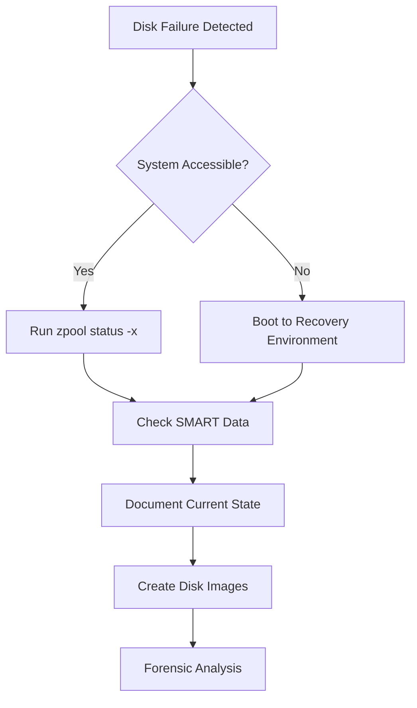

# ZFS Forensic Analysis and Recovery Research Report
## Comprehensive Guide for Proxmox/ZFS Systems

**Research Date**: 2025-10-04
**Prepared by**: Research Analyst Agent
**Objective**: Comprehensive disk forensic analysis and recovery techniques for Proxmox/ZFS systems

---

## Table of Contents
1. [Executive Summary](#executive-summary)
2. [Recommended Diagnostic Workflow](#recommended-diagnostic-workflow)
3. [Essential Tools and Use Cases](#essential-tools-and-use-cases)
4. [ZFS-Specific Considerations](#zfs-specific-considerations)
5. [Safety Precautions for Forensic Analysis](#safety-precautions-for-forensic-analysis)
6. [Command Reference](#command-reference)
7. [Recovery Procedures](#recovery-procedures)
8. [Advanced Forensic Techniques](#advanced-forensic-techniques)

---

## Executive Summary

ZFS forensic analysis and recovery on Proxmox systems requires specialized knowledge due to ZFS's unique architecture. Key findings:

**Critical Success Factors**:
- ✅ **Prevention over Recovery**: ZFS recovery from single disks is extremely difficult; redundancy (mirrors/RAIDZ) is essential
- ✅ **Non-Destructive Analysis**: Always create disk images before attempting recovery
- ✅ **Read-Only Operations**: Use read-only import flags to prevent evidence contamination
- ✅ **Specialized Tools**: Standard file recovery tools don't work with ZFS; use ZFS-specific utilities

**Recovery Feasibility**:
- **High Success**: Redundant pools (mirror/RAIDZ) with single disk failure
- **Moderate Success**: Degraded pools with metadata intact
- **Low Success**: Single disk pools or pools with metadata corruption
- **Professional Required**: Destroyed pools or severe corruption

---

## Recommended Diagnostic Workflow

### Phase 1: Initial Assessment (Non-Destructive)



#### Step 1.1: Quick Health Check
```bash
# Check for pool problems
zpool status -x

# Detailed pool status
zpool status -v

# View pool history
zpool history poolname

# Check system logs
dmesg | grep -i "zfs\|disk\|error"
journalctl -b | grep -i "zfs\|disk\|error"
```

#### Step 1.2: SMART Analysis
```bash
# Display all SMART data
smartctl -x /dev/sdX

# Run short self-test
smartctl -t short /dev/sdX

# Run long self-test (takes hours)
smartctl -t long /dev/sdX

# Check test results
smartctl -l selftest /dev/sdX
smartctl -a /dev/sdX
```

**Critical SMART Attributes**:
- **Reallocated Sectors Count (ID 5)**: Should be 0; increasing = failing drive
- **Current Pending Sector Count (ID 197)**: Sectors waiting reallocation; >0 = immediate concern
- **Offline Uncorrectable Sectors (ID 198)**: Unrecoverable sectors; >0 = data loss
- **UDMA CRC Error Count (ID 199)**: Cable/connection issues
- **Temperature**: Operating temperature (normal: 25-45°C)

#### Step 1.3: Error Analysis
```bash
# High-level pool health
zpool status poolname

# Detailed error counts and device specifics
iostat -en

# Specific fault events
fmadm faulty

# Detailed fault logs (last 7 days)
fmdump -et 7days

# ZFS-specific kernel messages
dmesg | grep -E "ZFS|zpool|zfs"
```

### Phase 2: Risk Assessment

**Decision Matrix**:

| Pool State | Redundancy | Risk Level | Action |
|-----------|-----------|-----------|--------|
| ONLINE | Any | ✅ Low | Monitor, preventive maintenance |
| DEGRADED | Mirror/RAIDZ | ⚠️ Medium | Replace failed disk, resilver |
| DEGRADED | Single disk | 🔴 High | IMMEDIATE backup, image disk |
| FAULTED | Mirror/RAIDZ | 🔴 High | Professional assessment |
| UNAVAILABLE | Any | 🔴 Critical | Professional recovery only |

### Phase 3: Data Preservation (Critical)

**NEVER skip this step for production data**

```bash
# 1. Create forensic disk image using ddrescue (recommended)
# Install ddrescue
apt-get install gddrescue

# Create disk image with error logging
ddrescue -f -n /dev/sdX /backup/disk_image.dd /backup/disk_image.log

# On second pass, attempt to recover bad sectors
ddrescue -d -r 3 /dev/sdX /backup/disk_image.dd /backup/disk_image.log

# 2. Verify image integrity
md5sum /dev/sdX > /backup/original_disk.md5
md5sum /backup/disk_image.dd > /backup/disk_image.md5

# 3. Create write-protected loop device
losetup -r -f /backup/disk_image.dd
losetup -l  # Note the loop device number
```

**ddrescue Best Practices**:
- `-f`: Force operation even if output exists
- `-n`: Quick first pass (skip scraping)
- `-d`: Direct disk access
- `-r 3`: Retry bad sectors 3 times
- Always use log file to resume interrupted operations
- Work on copies, never original media

### Phase 4: Forensic Analysis

```bash
# Examine ZFS labels and uberblocks
zdb -l /dev/loopX
zdb -uuuu -l /dev/loopX

# Attempt read-only pool import
zpool import -o readonly=on -d /dev/lofi poolname
zpool import -N -o readonly=on -f -R /mnt poolname

# For severely damaged pools, attempt recovery
zpool import -F poolname  # Roll back last transaction
zpool import -FX poolname  # Extreme rewind (data loss)
```

---

## Essential Tools and Use Cases

### Tier 1: Primary Diagnostic Tools

#### 1. **zpool status** - Pool Health Overview
**Use Case**: First-line diagnostic for pool health assessment

```bash
# Quick problem check
zpool status -x

# Detailed status with error counts
zpool status -v poolname

# Include scrub/resilver performance stats
zpool status -D poolname
```

**Output Interpretation**:
- `ONLINE`: All devices healthy
- `DEGRADED`: Pool functional but with reduced redundancy
- `FAULTED`: Pool has critical errors
- `UNAVAILABLE`: Pool cannot be imported
- `REMOVED`: Device physically removed

#### 2. **smartctl** - Hardware Health Analysis
**Use Case**: Predict and identify physical disk failures

```bash
# Complete SMART analysis
smartctl -a /dev/sdX

# Health summary
smartctl -H /dev/sdX

# Error logs
smartctl -l error /dev/sdX

# Self-test logs
smartctl -l selftest /dev/sdX
```

**Warning Signs**:
- Pending Sectors > 0: Write to sectors to force reallocation
- Reallocated Sectors increasing: Drive failing, replace ASAP
- Temperature > 50°C: Cooling issue, potential failure
- Offline Uncorrectable > 0: Data already lost

#### 3. **zpool scrub** - Data Integrity Verification
**Use Case**: Detect silent data corruption, verify checksums

```bash
# Start scrub operation
zpool scrub poolname

# Monitor progress
zpool status poolname

# Stop scrub if needed
zpool scrub -s poolname

# Pause scrub
zpool scrub -p poolname
```

**Scrub Characteristics**:
- Reads all data blocks and verifies checksums
- Automatically repairs errors if redundancy available
- I/O intensive (runs at low priority)
- Interruptible and resumable
- Recommended monthly for critical pools

#### 4. **iostat** - I/O Error Monitoring
**Use Case**: Detailed device-level error tracking

```bash
# ZFS-aware I/O statistics with errors
iostat -en

# Extended device statistics
iostat -xz 5  # Update every 5 seconds

# Specific pool statistics
zpool iostat poolname 5
zpool iostat -v poolname  # Verbose with device details
```

#### 5. **fmadm / fmdump** - Fault Management (Solaris/illumos)
**Use Case**: Detailed fault event analysis

```bash
# Show current faults
fmadm faulty

# Fault event log (last 7 days)
fmdump -et 7days

# Specific fault details
fmdump -v -u <fault-uuid>

# Clear acknowledged faults
fmadm repair <fault-uuid>
```

### Tier 2: Recovery and Forensic Tools

#### 6. **zdb** - ZFS Debugger (Advanced)
**Use Case**: Low-level pool structure analysis, offline forensics

⚠️ **WARNING**: Powerful tool requiring deep ZFS knowledge. Can damage pools if misused.

```bash
# Display dataset information
zdb -d poolname

# Display pool configuration
zdb -C poolname

# Examine block checksums
zdb -c poolname

# Read device labels
zdb -l /dev/sdX

# Display uberblocks (transaction log)
zdb -uuuu -l /dev/sdX

# Verify all metadata checksums
zdb -c -e poolname

# Generate backup stream (recovery)
zdb -B -e poolname/dataset objset_id > backup.stream

# Attempt to make unreadable pool readable
zdb -F poolname

# Extreme recovery (tries older transactions)
zdb -X poolname
```

**Forensic Use Cases**:
- Offline pool examination without import
- Metadata corruption analysis
- Recovery from destroyed pools
- Block-level data extraction

#### 7. **ddrescue** - Disk Imaging and Recovery
**Use Case**: Create forensic images from failing disks

```bash
# Basic rescue operation
ddrescue -f /dev/sdX /backup/image.dd /backup/rescue.log

# Fast first pass, then careful recovery
ddrescue -n /dev/sdX /backup/image.dd /backup/rescue.log
ddrescue -d -r 3 /dev/sdX /backup/image.dd /backup/rescue.log

# Reverse direction for damaged areas
ddrescue -R /dev/sdX /backup/image.dd /backup/rescue.log
```

**Key Features**:
- Non-sequential reading (skips bad areas initially)
- Resumable operations via log file
- Multiple pass strategy
- Direct disk access for speed
- Industry-standard for forensic imaging

#### 8. **zfs send/recv** - Dataset Backup/Restore
**Use Case**: Backup and migration of datasets

```bash
# Send full snapshot
zfs send poolname/dataset@snapshot > backup.zfs

# Incremental send
zfs send -i @old @new poolname/dataset > incremental.zfs

# Receive snapshot
zfs receive poolname/newdataset < backup.zfs

# Send with properties
zfs send -p poolname/dataset@snapshot > backup.zfs

# Encrypted send (raw, no decryption needed)
zfs send -w poolname/encrypted@snapshot > backup.zfs
```

### Tier 3: Analysis and Monitoring Tools

#### 9. **zpool events** - Real-time Event Monitoring
**Use Case**: Track pool events and I/O errors in real-time

```bash
# Show recent events
zpool events -v

# Follow events in real-time
zpool events -f

# Clear event log
zpool events -c
```

#### 10. **zpool history** - Configuration Change Tracking
**Use Case**: Audit trail of pool modifications

```bash
# Show all pool changes
zpool history poolname

# Include internal events
zpool history -i poolname

# Long format with timestamps
zpool history -l poolname
```

### Tier 4: Specialized Forensic Tools

#### 11. **testdisk / photorec** - File Recovery (Limited ZFS Support)
**Use Case**: File-level recovery from damaged filesystems

⚠️ **Note**: Limited ZFS support. Best used on disk images, not live pools.

```bash
# Launch testdisk on disk image
testdisk /backup/disk_image.dd

# Launch photorec for file recovery
photorec /backup/disk_image.dd
```

#### 12. **lofiadm** - Loop Device Management (Solaris/illumos)
**Use Case**: Mount disk images for forensic analysis

```bash
# Create loop device from image
lofiadm -a /backup/disk_image.dd

# List loop devices
lofiadm

# Import ZFS pool from loop device
zpool import -o readonly=on -d /dev/lofi poolname
```

---

## ZFS-Specific Considerations

### ZFS Architecture Impact on Recovery

#### 1. **Copy-on-Write (COW) Architecture**
- **Impact**: Data never overwritten in place; new blocks allocated for changes
- **Recovery Benefit**: Old data may still exist on disk even after deletion
- **Challenge**: Fragmented data, complex metadata structure
- **Implication**: Standard file recovery tools ineffective

#### 2. **Block Pointer Hierarchy**
- **Structure**: Files stored across multiple indirect block levels
- **Impact**: Must trace through complex pointer chains
- **Recovery**: Requires understanding of ZFS on-disk format
- **Tool**: Use `zdb` to navigate block pointers

#### 3. **Checksumming and Self-Healing**
- **Feature**: Every block has checksum (fletcher4, SHA-256)
- **Benefit**: Detects silent corruption automatically
- **Limitation**: Cannot repair without redundancy (mirrors/RAIDZ)
- **Recovery**: Checksum mismatches indicate corruption location

#### 4. **Transaction Groups (TXG)**
- **Concept**: Atomic updates grouped in transactions
- **Recovery**: Can roll back to previous consistent state
- **Command**: `zpool import -F` or `zpool import -FX`
- **Trade-off**: Lose recent transactions but gain consistency

#### 5. **Compression and Deduplication**
- **Compression**: LZ4, GZIP, ZStandard
- **Impact**: Data stored compressed; must decompress for recovery
- **Tool**: `zuncompress` or zdb decompression
- **Dedup**: Shared blocks complicate recovery; avoid unless necessary

#### 6. **Encryption (ZFS Native)**
- **Challenge**: Encrypted datasets require keys
- **Recovery**: Must have encryption key/passphrase
- **Command**: `zdb -K encryption_key poolname`
- **Limitation**: No key = no data recovery possible

### Pool Configurations and Recovery Feasibility

| Configuration | Disk Failures Tolerated | Recovery Complexity | Success Rate |
|--------------|------------------------|-------------------|-------------|
| Single Disk | 0 | Very High | Low (10-30%) |
| Mirror (2-way) | 1 | Low | Very High (95%+) |
| Mirror (3-way) | 2 | Low | Very High (95%+) |
| RAIDZ1 (3-5 disks) | 1 | Medium | High (80-90%) |
| RAIDZ2 (4-8 disks) | 2 | Medium | Very High (90-95%) |
| RAIDZ3 (5+ disks) | 3 | Medium | Very High (95%+) |

**Key Insights**:
- **Redundancy is Critical**: Single disk ZFS pools are extremely difficult to recover
- **Mirror Advantage**: Fastest rebuild times, simplest recovery
- **RAIDZ Trade-off**: Better space efficiency but slower resilver
- **RAIDZ2/3**: Production-grade redundancy for critical data

### ZFS vs Traditional Filesystems

| Aspect | ZFS | Ext4/XFS | Recovery Impact |
|--------|-----|----------|----------------|
| Metadata | Self-healing with redundancy | Fixed locations | ZFS: Better if redundant |
| Data Location | COW, dynamic allocation | Fixed inodes | ZFS: More fragmented |
| Corruption Detection | Built-in checksums | External tools | ZFS: Automatic detection |
| Recovery Tools | Limited, specialized | Many generic tools | Traditional: More options |
| Snapshot Support | Native, efficient | Limited/add-on | ZFS: Built-in recovery path |

### Critical ZFS Limitations for Recovery

1. **Single Disk Pools**:
   - No self-healing capability
   - Metadata corruption often catastrophic
   - File recovery requires block-level forensics
   - Success rate: 10-30%

2. **Destroyed Pools**:
   - `zpool destroy` overwrites labels
   - Pool import impossible via normal means
   - Requires `zdb` forensic analysis
   - Success rate: 5-20%

3. **Metadata Corruption**:
   - ZFS relies heavily on metadata integrity
   - Corrupted uberblock = pool import failure
   - May require transaction rollback (`-F` flag)
   - Data loss probable even if recovered

4. **Deduplication Enabled**:
   - Shared blocks create complex dependencies
   - DDT (Dedup Table) corruption affects multiple files
   - Recovery complexity increases exponentially
   - Recommendation: Avoid dedup unless absolutely necessary

---

## Safety Precautions for Forensic Analysis

### Critical Safety Principles

#### 1. **NEVER Work on Original Media**
```bash
# ✅ CORRECT: Work on disk image
ddrescue -f /dev/sdX /backup/disk.img /backup/rescue.log
zpool import -d /backup/disk.img -o readonly=on poolname

# ❌ WRONG: Direct analysis on failing disk
zpool import -f poolname  # May accelerate failure
```

#### 2. **Always Use Read-Only Operations**
```bash
# ✅ CORRECT: Read-only import
zpool import -o readonly=on poolname
zpool import -N -o readonly=on -R /mnt poolname

# ✅ CORRECT: Read-only loop device
losetup -r /dev/loop0 /backup/disk.img

# ❌ WRONG: Read-write access during forensics
zpool import poolname  # May modify evidence
```

#### 3. **Document Everything**
```bash
# Create forensic log directory
mkdir -p /forensics/logs/$(date +%Y%m%d_%H%M%S)
LOG_DIR="/forensics/logs/$(date +%Y%m%d_%H%M%S)"

# Log all commands and outputs
script -a $LOG_DIR/session.log

# Save system state
zpool status -v > $LOG_DIR/zpool_status.txt
smartctl -a /dev/sdX > $LOG_DIR/smart_data.txt
dmesg > $LOG_DIR/dmesg.txt
lsblk -f > $LOG_DIR/block_devices.txt
```

#### 4. **Verify Data Integrity**
```bash
# Hash original disk
md5sum /dev/sdX > /forensics/original.md5
sha256sum /dev/sdX > /forensics/original.sha256

# Hash image
md5sum /backup/disk.img > /forensics/image.md5
sha256sum /backup/disk.img > /forensics/image.sha256

# Compare
diff /forensics/original.md5 /forensics/image.md5
```

#### 5. **Isolate Forensic Environment**
```bash
# Disconnect from network
ip link set eth0 down

# Disable auto-mounting
systemctl stop zfs-mount.service
systemctl stop zfs-share.service

# Boot to single-user mode if needed
systemctl rescue
```

### Pre-Analysis Checklist

**Before ANY forensic operation**:

- [ ] **Backup Assessment**
  - [ ] Recent backup verified and tested
  - [ ] Backup accessible from alternate system
  - [ ] Backup restoration procedure documented

- [ ] **Disk Imaging**
  - [ ] Sufficient storage for full disk image (1.5x disk size)
  - [ ] Forensic image created with ddrescue
  - [ ] Image integrity verified with hash
  - [ ] Original disk secured (write-protected or removed)

- [ ] **Environment Preparation**
  - [ ] Forensic workstation prepared (separate from production)
  - [ ] All tools installed and tested
  - [ ] Logging enabled for all operations
  - [ ] Network isolated if required

- [ ] **Risk Assessment**
  - [ ] Failure impact analyzed
  - [ ] Recovery time objective (RTO) defined
  - [ ] Recovery point objective (RPO) defined
  - [ ] Rollback plan documented

- [ ] **Documentation**
  - [ ] Initial state captured (zpool status, SMART data)
  - [ ] Chain of custody documented
  - [ ] Forensic log directory created
  - [ ] Session recording enabled (script command)

### Common Mistakes to Avoid

❌ **Mistake 1**: Running `zpool scrub` on a degraded pool with failing disk
- **Risk**: May accelerate disk failure
- **Correct**: Image disk first, then scrub the image

❌ **Mistake 2**: Using `zpool import -F` without understanding data loss
- **Risk**: Permanently loses recent transactions
- **Correct**: Try read-only import first, document what will be lost

❌ **Mistake 3**: Attempting write operations on damaged pools
- **Risk**: Further corruption, evidence tampering
- **Correct**: Always use `-o readonly=on` flag

❌ **Mistake 4**: Filling ZFS pools beyond 80%
- **Risk**: Severe performance degradation, increased fragmentation
- **Correct**: Maintain 20% free space for optimal performance

❌ **Mistake 5**: Ignoring SMART warnings
- **Risk**: Catastrophic failure without warning
- **Correct**: Replace drives immediately when SMART errors appear

❌ **Mistake 6**: No redundancy for critical data
- **Risk**: Single point of failure, low recovery probability
- **Correct**: Always use mirrors or RAIDZ for important data

❌ **Mistake 7**: Enabling deduplication without understanding impact
- **Risk**: Massive memory usage, complex recovery scenarios
- **Correct**: Use compression instead; dedup only if proven beneficial

### Safety Commands Reference

```bash
# Safe pool import (read-only)
zpool import -o readonly=on poolname

# Safe pool import (no auto-mount)
zpool import -N poolname

# Safe pool import (alternate root)
zpool import -R /mnt poolname

# Safe pool import (force, but read-only)
zpool import -f -o readonly=on poolname

# Clear pool errors (after fixing issue)
zpool clear poolname

# Check pool without importing
zdb -C poolname
zdb -l /dev/sdX

# Export pool safely
zpool export poolname

# Offline disk for replacement
zpool offline poolname /dev/sdX
```

---

## Command Reference

### Quick Reference Card

#### Pool Status and Health
```bash
# Check for problems
zpool status -x

# Detailed pool status
zpool status -v poolname

# I/O statistics
zpool iostat poolname 5

# Event log
zpool events -v

# Configuration history
zpool history poolname
```

#### Disk Health
```bash
# SMART summary
smartctl -H /dev/sdX

# Full SMART data
smartctl -a /dev/sdX

# Run self-test
smartctl -t short /dev/sdX
smartctl -t long /dev/sdX

# Check test results
smartctl -l selftest /dev/sdX
```

#### Data Integrity
```bash
# Start scrub
zpool scrub poolname

# Monitor scrub
watch -n 30 'zpool status poolname'

# Stop scrub
zpool scrub -s poolname

# Pause/resume scrub
zpool scrub -p poolname
zpool scrub poolname  # Resume
```

#### Pool Import/Export
```bash
# List importable pools
zpool import

# Import pool
zpool import poolname

# Read-only import
zpool import -o readonly=on poolname

# Force import
zpool import -f poolname

# Recovery import
zpool import -F poolname

# Export pool
zpool export poolname
```

#### Disk Replacement
```bash
# Offline disk
zpool offline poolname /dev/sdX

# Replace disk
zpool replace poolname /dev/sdX /dev/sdY

# Online disk
zpool online poolname /dev/sdY

# Monitor resilver
watch -n 30 'zpool status poolname'
```

#### Forensic Analysis
```bash
# Create disk image
ddrescue -f /dev/sdX /backup/disk.img /backup/rescue.log

# Examine ZFS labels
zdb -l /dev/sdX

# Examine uberblocks
zdb -uuuu -l /dev/sdX

# Pool configuration
zdb -C poolname

# Dataset information
zdb -d poolname/dataset

# Verify checksums
zdb -c poolname
```

#### Recovery Operations
```bash
# Clear pool errors
zpool clear poolname

# Roll back transaction
zpool import -F poolname

# Extreme rollback
zpool import -FX poolname

# Read-only recovery import
zpool import -N -o readonly=on -f -R /mnt poolname

# Generate backup stream
zdb -B poolname/dataset objset_id > backup.stream
```

### Complete Command Catalog

#### zpool Commands

| Command | Purpose | Risk Level | Notes |
|---------|---------|-----------|-------|
| `zpool status -x` | Check pool problems | ✅ Safe | First diagnostic step |
| `zpool status -v` | Detailed status | ✅ Safe | Shows error counts |
| `zpool scrub` | Verify data integrity | ⚠️ Medium | I/O intensive |
| `zpool resilver` | Rebuild redundancy | ⚠️ Medium | Automatic on replace |
| `zpool clear` | Clear error counters | ✅ Safe | After fixing issues |
| `zpool import -F` | Recovery import | 🔴 High | Loses recent data |
| `zpool import -FX` | Extreme recovery | 🔴 Critical | Significant data loss |
| `zpool replace` | Replace disk | ⚠️ Medium | Triggers resilver |
| `zpool offline` | Take disk offline | ⚠️ Medium | Reduces redundancy |
| `zpool online` | Bring disk online | ✅ Safe | After replacement |
| `zpool export` | Export pool | ✅ Safe | Clean shutdown |
| `zpool destroy` | Delete pool | 🔴 Critical | PERMANENT deletion |

#### zfs Commands

| Command | Purpose | Risk Level | Notes |
|---------|---------|-----------|-------|
| `zfs list` | List datasets | ✅ Safe | Read-only |
| `zfs get all` | Show properties | ✅ Safe | Read-only |
| `zfs snapshot` | Create snapshot | ✅ Safe | Instant, COW |
| `zfs rollback` | Restore snapshot | ⚠️ Medium | Loses recent data |
| `zfs send` | Backup dataset | ✅ Safe | Read-only stream |
| `zfs receive` | Restore dataset | ⚠️ Medium | Overwrites target |
| `zfs destroy` | Delete dataset | 🔴 High | Permanent deletion |
| `zfs mount` | Mount filesystem | ✅ Safe | Read-only with flag |
| `zfs unmount` | Unmount filesystem | ✅ Safe | Clean unmount |

#### zdb Commands (Advanced)

| Command | Purpose | Risk Level | Notes |
|---------|---------|-----------|-------|
| `zdb -l /dev/sdX` | Read device labels | ✅ Safe | Offline analysis |
| `zdb -C poolname` | Show configuration | ✅ Safe | Pool metadata |
| `zdb -d poolname` | Dataset info | ✅ Safe | Read-only |
| `zdb -c poolname` | Verify checksums | ✅ Safe | I/O intensive |
| `zdb -F poolname` | Attempt recovery | 🔴 High | May modify pool |
| `zdb -X poolname` | Extreme recovery | 🔴 Critical | Last resort |
| `zdb -B poolname/ds objid` | Backup stream | ⚠️ Medium | Recovery tool |
| `zdb -R poolname vdev:offset` | Read block | ✅ Safe | Forensic analysis |

#### smartctl Commands

| Command | Purpose | Risk Level | Notes |
|---------|---------|-----------|-------|
| `smartctl -H /dev/sdX` | Health summary | ✅ Safe | Quick check |
| `smartctl -a /dev/sdX` | All SMART data | ✅ Safe | Complete info |
| `smartctl -t short /dev/sdX` | Short self-test | ✅ Safe | ~2 minutes |
| `smartctl -t long /dev/sdX` | Long self-test | ✅ Safe | Hours |
| `smartctl -l error /dev/sdX` | Error log | ✅ Safe | Past errors |
| `smartctl -l selftest /dev/sdX` | Test results | ✅ Safe | Test history |
| `smartctl -x /dev/sdX` | Extended info | ✅ Safe | All details |

#### ddrescue Commands

| Command | Purpose | Risk Level | Notes |
|---------|---------|-----------|-------|
| `ddrescue -n /dev/sdX image.dd log` | Fast first pass | ✅ Safe | Skip bad sectors |
| `ddrescue -d -r3 /dev/sdX image.dd log` | Recovery pass | ✅ Safe | Retry bad sectors |
| `ddrescue -R /dev/sdX image.dd log` | Reverse read | ✅ Safe | Alternative access |
| `ddrescue -f /dev/sdX image.dd log` | Force overwrite | ⚠️ Medium | Overwrites output |

---

## Recovery Procedures

### Scenario 1: Single Disk Failure in Redundant Pool

**Situation**: One disk failed in mirror or RAIDZ pool
**Pool State**: DEGRADED
**Risk Level**: ⚠️ Medium
**Success Rate**: 95%+

#### Step-by-Step Recovery

```bash
# 1. Verify pool status
zpool status -v poolname

# Output analysis:
# - Pool state: DEGRADED
# - Failed device: /dev/sdX (FAULTED or UNAVAILABLE)
# - Data state: No errors expected

# 2. Check SMART data of failed disk (if accessible)
smartctl -a /dev/sdX

# 3. Prepare replacement disk
# - Must be equal or larger size
# - Same or better performance characteristics

# 4. Offline the failed disk (if not automatic)
zpool offline poolname /dev/sdX

# 5. Physical replacement
# - Shutdown system (or hot-swap if supported)
# - Replace physical disk
# - Boot system or rescan SCSI bus

# For hot-swap systems:
echo "- - -" > /sys/class/scsi_host/host0/scan
lsblk  # Verify new disk detected

# 6. Replace disk in pool
zpool replace poolname /dev/sdX /dev/sdY

# Alternative: If using disk IDs (recommended)
zpool replace poolname \
  /dev/disk/by-id/old-disk-id \
  /dev/disk/by-id/new-disk-id

# 7. Monitor resilver progress
watch -n 30 'zpool status poolname'

# Output shows:
# - Resilver progress percentage
# - Estimated completion time
# - I/O rate

# 8. Verify completion
zpool status poolname
# Pool state should be: ONLINE
# Scan: resilvered XXX in XXh XXm with 0 errors

# 9. Run scrub to verify integrity
zpool scrub poolname

# 10. Clear error counters
zpool clear poolname

# 11. Document completion
zpool history poolname > /var/log/recovery_$(date +%Y%m%d).log
```

**Resilver Time Estimates**:
- 1TB disk @ 80% full: 1-2 hours
- 4TB disk @ 80% full: 4-8 hours
- 8TB disk @ 80% full: 8-16 hours

*Actual time depends on I/O load, disk speed, and pool configuration*

### Scenario 2: Pool Cannot Import (Metadata Corruption)

**Situation**: Pool won't import with normal commands
**Pool State**: UNAVAILABLE or FAULTED
**Risk Level**: 🔴 High
**Success Rate**: 40-70%

#### Recovery Procedure

```bash
# 1. Attempt read-only import
zpool import -o readonly=on poolname

# If fails, try with force flag
zpool import -f -o readonly=on poolname

# 2. If still fails, list all importable pools
zpool import

# Note: Pool may be listed with different name or state

# 3. Examine ZFS labels directly
zdb -l /dev/sdX
zdb -l /dev/sdY
# Verify pool GUID, vdev configuration

# 4. Check uberblocks (transaction records)
zdb -uuuu -l /dev/sdX

# Look for:
# - Valid uberblocks
# - Transaction group (TXG) numbers
# - Checksum status

# 5. Attempt recovery import (rolls back transactions)
zpool import -F poolname

# WARNING: This WILL lose recent data (last few transactions)

# 6. If step 5 fails, try extreme recovery
zpool import -FX poolname

# WARNING: May lose significant data, tries much older transactions

# 7. If import succeeds (even with errors), export immediately
zpool export poolname

# 8. Re-import read-only for data extraction
zpool import -o readonly=on -N -R /recovery poolname

# 9. Mount datasets manually
zfs mount poolname/dataset

# 10. Copy critical data to safe location
rsync -avP /recovery/poolname/ /backup/recovered_data/

# 11. After data extraction, attempt repair
zpool export poolname
zpool import poolname

# Run scrub to identify and fix errors
zpool scrub poolname

# 12. Monitor for additional errors
zpool status -v poolname
```

**Data Loss Expectations**:
- `zpool import -F`: Last 5-30 seconds of data
- `zpool import -FX`: Last 1-5 minutes of data
- Depends on TXG timeout (default 5 seconds)

### Scenario 3: Destroyed Pool Recovery (Forensic)

**Situation**: Pool was destroyed with `zpool destroy`
**Pool State**: Does not appear in `zpool import`
**Risk Level**: 🔴 Critical
**Success Rate**: 5-20%

#### Advanced Forensic Recovery

```bash
# 1. IMMEDIATELY create disk images
ddrescue -f -n /dev/sdX /forensics/disk1.img /forensics/disk1.log
ddrescue -f -n /dev/sdY /forensics/disk2.img /forensics/disk2.log

# 2. Create loop devices from images
losetup -r /dev/loop0 /forensics/disk1.img
losetup -r /dev/loop1 /forensics/disk2.img

# 3. Examine labels with zdb
zdb -l /dev/loop0

# 4. Check if pool GUID is visible
zdb -C -e poolname

# 5. Attempt import by pool GUID (if visible)
POOL_GUID=$(zdb -l /dev/loop0 | grep -i "pool_guid" | awk '{print $2}')
zpool import -o readonly=on $POOL_GUID

# 6. If labels corrupted, use zdb to examine uberblocks
zdb -uuuu -l /dev/loop0

# Look for most recent valid uberblock
# Note the TXG (transaction group) number

# 7. Attempt to generate backup stream using zdb
# First, find object set ID
zdb -d poolname 2>/dev/null | grep "Dataset" | head -1

# Generate backup stream
zdb -B poolname/dataset OBJSET_ID > /forensics/recovered.stream

# 8. Restore stream to new pool (if successful)
zpool create -f recovery_pool /dev/sdZ
zfs receive recovery_pool/restored < /forensics/recovered.stream

# 9. If zdb recovery fails, attempt block-level analysis
# This requires deep ZFS knowledge and custom tools
# Consider professional data recovery at this point

# 10. Alternative: Search for file signatures
photorec /forensics/disk1.img
# Limited success with ZFS due to COW and compression
```

**Professional Recovery Indicators**:
- Multiple disks in destroyed pool
- Encryption enabled without key
- Deduplication enabled
- Custom recordsize or other tunables
- Metadata corruption across multiple vdevs

### Scenario 4: Silent Data Corruption Detection

**Situation**: Scrub reports checksum errors
**Pool State**: ONLINE but with errors
**Risk Level**: ⚠️ Medium
**Success Rate**: 90%+ (with redundancy)

#### Corruption Analysis and Repair

```bash
# 1. Review scrub results
zpool status -v poolname

# Look for:
# - Checksum errors on specific files
# - Affected vdevs
# - Error counts

# 2. Identify corrupted files
zpool status -v poolname | grep -A 5 "errors:"

# Output example:
# errors: Permanent errors have been detected:
#         /poolname/dataset/file.txt

# 3. If pool has redundancy, ZFS auto-repairs
# Verify repair with another scrub
zpool scrub poolname

# 4. If single disk (no redundancy), data is permanently lost
# Restore from backup
zfs receive poolname/dataset < /backup/dataset.zfs

# 5. Check for hardware issues
smartctl -a /dev/sdX
smartctl -t long /dev/sdX

# 6. Review system logs for disk errors
dmesg | grep -i "error\|fail"
journalctl -b | grep -i "zfs\|disk"

# 7. If persistent errors on specific disk, replace
zpool replace poolname /dev/sdX /dev/sdY

# 8. Verify no errors after replacement
zpool scrub poolname
zpool status -v poolname

# 9. For corrupted but irreplaceable files
# Try to recover from snapshots
zfs list -t snapshot | grep poolname/dataset

# Access snapshot data
ls /poolname/dataset/.zfs/snapshot/
cp /poolname/dataset/.zfs/snapshot/snap1/file.txt /recovery/

# 10. Update monitoring
# Set up automatic scrub scheduling
# Create systemd timer or cron job:
cat > /etc/cron.d/zfs-scrub << 'EOF'
# Scrub all pools monthly
0 2 1 * * root /sbin/zpool scrub -a
EOF
```

**Checksum Error Interpretation**:
- Errors in data: File corruption, restore from backup/snapshot
- Errors in metadata: Pool corruption, may need professional help
- Errors during resilver: Possible disk failure, monitor closely

### Scenario 5: Degraded Pool with No Spare

**Situation**: Disk failed but no hot spare available
**Pool State**: DEGRADED
**Risk Level**: 🔴 High
**Success Rate**: 80-90%

#### Emergency Recovery

```bash
# 1. IMMEDIATE: Stop all non-essential I/O
# Pause VMs, stop services using pool
systemctl stop proxmox.service  # Or equivalent

# 2. Verify pool status
zpool status -v poolname

# 3. Create emergency backup of critical data
# Use fastest method available
zfs snapshot -r poolname@emergency
zfs send -R poolname@emergency | pv > /external/emergency_backup.zfs

# 4. Check if disk is truly dead
smartctl -a /dev/sdX
# Attempt to online if temporary failure
zpool online poolname /dev/sdX

# 5. If disk recoverable temporarily
# - Get replacement disk ASAP
# - Keep I/O minimal
# - Monitor constantly

# 6. When replacement arrives
# Follow Scenario 1 procedure

# 7. If no replacement available and pool critical
# Option A: Remove failed disk, convert to single disk (dangerous)
zpool detach poolname /dev/sdX
# WARNING: No redundancy now, one error = data loss

# Option B: Keep running degraded (risky)
# - Minimal I/O only
# - Continuous monitoring
# - Replacement within 24 hours

# 8. Emergency extraction if pool failing
zpool export poolname
zpool import -o readonly=on -N poolname
rsync -avP --progress /poolname/ /external/extracted_data/
```

**Critical Warnings**:
- DEGRADED pool with I/O = high failure risk
- Each operation may be the last successful one
- Prioritize data extraction over repair attempts
- Single disk failure in RAIDZ = vulnerable to second failure

### Scenario 6: Full Disk with Performance Degradation

**Situation**: Pool >80% full, severe slowdown
**Pool State**: ONLINE but slow
**Risk Level**: ⚠️ Medium
**Success Rate**: 99%

#### Performance Recovery

```bash
# 1. Check pool capacity
zpool list poolname
zfs list -o space poolname

# 2. Identify space hogs
zfs list -r -o name,used,available poolname | sort -k2 -h

# 3. Check snapshot usage
zfs list -t snapshot -o name,used | sort -k2 -h

# 4. Emergency space recovery options

# Option A: Delete old snapshots
zfs list -t snapshot | grep old_pattern
zfs destroy poolname/dataset@old_snapshot

# Option B: Enable compression (if not enabled)
zfs set compression=lz4 poolname
# Existing data won't compress, only new writes

# Option C: Delete temporary/cache data
rm -rf /poolname/dataset/tmp/*
rm -rf /poolname/dataset/cache/*

# Option D: Move data to external storage
rsync -av --remove-source-files /poolname/large_dataset/ /external/

# 5. Monitor space during cleanup
watch -n 5 'zpool list poolname'

# 6. Once <80%, defragment (via copy)
# ZFS doesn't defrag, but copying to new dataset helps
zfs snapshot poolname/dataset@beforecopy
zfs send poolname/dataset@beforecopy | zfs receive poolname/dataset_new
# Verify integrity, then rename

# 7. Adjust quotas to prevent recurrence
zfs set quota=800G poolname/dataset
zfs set reservation=50G poolname/critical_dataset

# 8. Set up monitoring
cat > /usr/local/bin/zfs-space-alert.sh << 'EOF'
#!/bin/bash
THRESHOLD=80
USAGE=$(zpool list -H -o capacity poolname | tr -d '%')
if [ $USAGE -gt $THRESHOLD ]; then
    echo "WARNING: Pool $poolname at ${USAGE}%" | \
    mail -s "ZFS Pool Alert" admin@example.com
fi
EOF

chmod +x /usr/local/bin/zfs-space-alert.sh

# Add to cron
echo "0 */4 * * * /usr/local/bin/zfs-space-alert.sh" | crontab -
```

**Performance Impact by Capacity**:
- 0-80%: Normal performance
- 80-90%: Noticeable slowdown (20-30% degradation)
- 90-95%: Severe slowdown (50-70% degradation)
- 95-100%: Extreme slowdown (90%+ degradation)

---

## Advanced Forensic Techniques

### Low-Level ZFS Structure Analysis

#### Understanding ZFS On-Disk Format

**Key Components**:
1. **Labels** (4 per vdev): Pool configuration, device info
2. **Uberblocks** (128 per label): Transaction pointers
3. **MOS (MetaObject Set)**: Pool-wide metadata
4. **Datasets**: User-visible filesystems
5. **Block Pointers**: Multi-level indirection tree

#### Forensic Workflow for Destroyed Pools

```bash
# 1. Examine all vdev labels
for dev in /dev/sd{x,y,z}; do
    echo "=== Device: $dev ==="
    zdb -l $dev
done > /forensics/labels_dump.txt

# 2. Extract pool GUID and configuration
POOL_GUID=$(grep -i "pool_guid" /forensics/labels_dump.txt | \
           head -1 | awk '{print $2}')

# 3. Examine uberblocks for transaction history
zdb -uuuu -l /dev/sdX > /forensics/uberblocks.txt

# 4. Find most recent valid uberblock
grep -A 10 "Uberblock\[" /forensics/uberblocks.txt | \
grep -B 10 "ub_txg"

# 5. Attempt import with specific TXG (if supported)
# Standard import attempts most recent valid TXG
zpool import -F $POOL_GUID

# 6. If import fails, try zdb recovery
# List all object sets
zdb -C -e poolname

# 7. Generate backup stream for specific dataset
# Find object set ID
OBJSET_ID=$(zdb -d poolname/dataset 2>&1 | \
           grep "Object" | awk '{print $2}')

# Create backup stream
zdb -B poolname/dataset $OBJSET_ID > /forensics/dataset_backup.stream

# 8. Restore to new pool
zpool create -f forensic_recovery /dev/sdZ
zfs receive forensic_recovery/dataset < /forensics/dataset_backup.stream
```

### Block-Level Data Extraction

**When standard recovery fails**:

```bash
# 1. Identify block addresses of interest
# Use zdb to explore block pointer tree
zdb -dddddd poolname/dataset

# Output shows block addresses and types

# 2. Read specific blocks
zdb -R poolname vdev:offset:size[:flags]

# Example: Read 4K block at offset 1048576 on vdev 0
zdb -R poolname 0:1048576:4096

# 3. Dump block to file
zdb -R poolname 0:1048576:4096 > /forensics/block_data.bin

# 4. Decompress if compressed (LZ4 example)
# Requires custom decompression tool or zuncompress
zuncompress /forensics/block_data.bin > /forensics/block_decompressed.bin

# 5. Analyze block content
file /forensics/block_decompressed.bin
strings /forensics/block_decompressed.bin | head -50
hexdump -C /forensics/block_decompressed.bin | less
```

### Snapshot and Clone Forensics

**Recovering from snapshots when pool damaged**:

```bash
# 1. List all snapshots (even if pool won't fully import)
zfs list -t snapshot -o name,creation,used

# 2. Access snapshot directory
ls -la /poolname/dataset/.zfs/snapshot/

# 3. If dataset won't mount, try snapshot clone
zfs clone poolname/dataset@snapshot poolname/dataset_recovery

# 4. If clone fails, use send/receive
zfs send poolname/dataset@snapshot | \
zfs receive recovery_pool/dataset

# 5. Examine snapshot differences
zfs diff poolname/dataset@old poolname/dataset@new

# 6. Recover specific files from snapshot
cp /poolname/dataset/.zfs/snapshot/snap_name/path/to/file /recovery/

# 7. Rollback to known-good snapshot (destructive)
zfs rollback -r poolname/dataset@good_snapshot
```

### Encryption Key Recovery

**Dealing with encrypted datasets**:

```bash
# 1. Check if dataset is encrypted
zfs get encryption poolname/dataset

# 2. If key is lost but pool accessible
# Key must be recovered from backup or keystore

# 3. Try to unlock with passphrase
zfs load-key poolname/dataset
# Enter passphrase when prompted

# 4. If using key file
zfs load-key -L file:///path/to/keyfile poolname/dataset

# 5. For forensic analysis with key
zdb -K /path/to/keyfile poolname/dataset

# 6. Generate raw (encrypted) backup
zfs send -w poolname/dataset@snapshot > encrypted_backup.zfs

# This can be restored without decryption:
zfs receive poolname/new_dataset < encrypted_backup.zfs

# 7. Change encryption key (if accessible)
zfs change-key poolname/dataset

# 8. If key permanently lost
# Data is UNRECOVERABLE - encryption working as designed
# No backdoor or recovery method exists
```

### Memory Dump Analysis (Solaris/illumos)

**Extracting ZFS state from crash dumps**:

```bash
# 1. Configure crash dump
dumpadm -d /dev/zvol/dsk/rpool/dump -m kernel

# 2. Force crash dump (emergency only)
echo "::msgbuf" | mdb -k
# Or: reboot -d

# 3. Analyze dump with mdb (Modular Debugger)
mdb unix.X vmcore.X

# 4. Within mdb, examine ZFS structures
# List all pools
::spa

# Examine specific pool
<pool_address>::spa -v

# List vdevs
::walk spa | ::print spa_t spa_root_vdev

# Examine transactions
::walk spa | ::print spa_t spa_uberblock

# 5. Extract pool configuration from memory
::walk spa | ::print -a spa_t

# 6. For data recovery, locate cached blocks
::walk spa | ::walk spa_cache | ::print -a
```

### Custom Recovery Tools

**Building specialized recovery utilities**:

```bash
# 1. Python script to parse ZFS labels
cat > /forensics/parse_zfs_label.py << 'PYTHON'
#!/usr/bin/env python3
import struct
import sys

def parse_zfs_label(device):
    with open(device, 'rb') as f:
        # Read label 0 (first 256KB)
        f.seek(0)
        label = f.read(256 * 1024)

        # Parse nvlist (simplified)
        magic = struct.unpack('>I', label[8:12])[0]
        if magic == 0x6e766c74:  # 'nvlt'
            print(f"Valid ZFS label found on {device}")
            # Further parsing requires nvlist decoder
        else:
            print(f"No ZFS label on {device}")

if __name__ == "__main__":
    parse_zfs_label(sys.argv[1])
PYTHON

chmod +x /forensics/parse_zfs_label.py
./forensics/parse_zfs_label.py /dev/sdX

# 2. Bash script for automated forensic collection
cat > /forensics/zfs_forensic_collect.sh << 'BASH'
#!/bin/bash
FORENSICS_DIR="/forensics/$(date +%Y%m%d_%H%M%S)"
mkdir -p "$FORENSICS_DIR"

# Collect pool information
zpool status -v > "$FORENSICS_DIR/zpool_status.txt"
zpool history > "$FORENSICS_DIR/zpool_history.txt"
zpool events -v > "$FORENSICS_DIR/zpool_events.txt"

# Collect dataset information
zfs list -r -t all > "$FORENSICS_DIR/zfs_list.txt"
zfs get all > "$FORENSICS_DIR/zfs_properties.txt"

# Collect disk information
for disk in /dev/sd?; do
    smartctl -a "$disk" > "$FORENSICS_DIR/smart_$(basename $disk).txt"
    zdb -l "$disk" > "$FORENSICS_DIR/zdb_label_$(basename $disk).txt"
done

# Collect system logs
dmesg > "$FORENSICS_DIR/dmesg.txt"
journalctl -b > "$FORENSICS_DIR/journal.txt"

# Create archive
tar czf "$FORENSICS_DIR.tar.gz" "$FORENSICS_DIR"
echo "Forensic data collected: $FORENSICS_DIR.tar.gz"
BASH

chmod +x /forensics/zfs_forensic_collect.sh
```

### Professional Data Recovery Integration

**When to escalate to professionals**:

1. **Immediate Escalation Scenarios**:
   - Multiple disk failures in RAIDZ beyond tolerance
   - Encrypted pool with lost keys (if critical)
   - Physical disk damage (clicking, burning smell)
   - Corrupted metadata across all vdevs
   - Destroyed pool with critical business data

2. **Professional Recovery Capabilities**:
   - Clean room disk repair
   - Firmware-level recovery
   - Proprietary ZFS forensic tools
   - Custom metadata reconstruction
   - Advanced block-level analysis

3. **Data Preservation for Professional Recovery**:
```bash
# 1. Stop all operations immediately
zpool export poolname  # If possible

# 2. Create bit-for-bit images of all disks
for disk in /dev/sd{x,y,z}; do
    ddrescue -d -r3 "$disk" \
    "/secure_storage/$(basename $disk).img" \
    "/secure_storage/$(basename $disk).log"
done

# 3. Document everything
zpool status -v > /recovery_docs/pool_state.txt
zdb -C poolname > /recovery_docs/pool_config.txt
cat /etc/zfs/zpool.cache > /recovery_docs/zpool.cache.backup

# 4. Secure original media
# - Label and store safely
# - Document chain of custody
# - Do not attempt further operations

# 5. Provide recovery service with:
# - Disk images
# - Configuration files
# - Error logs
# - Timeline of failure
# - ZFS version and OS details
```

4. **Recommended Professional Services** (as of 2025):
   - **Kroll Ontrack**: ZFS recovery specialists
   - **DriveSavers**: Advanced ZFS forensics
   - **Stellar Data Recovery**: Enterprise ZFS support
   - **ACE Data Recovery**: Clean room + ZFS expertise

---

## Appendix: Troubleshooting Decision Tree

### Quick Decision Flowchart

```
Disk/Pool Issue Detected
         |
         v
[Check zpool status -x]
         |
         +---> ONLINE: No action needed
         |
         +---> DEGRADED
         |        |
         |        +---> Single disk failed?
         |        |        |
         |        |        +---> YES: Follow Scenario 1 (Replace disk)
         |        |        +---> NO: Multiple failures → Scenario 5
         |        |
         |        +---> Checksum errors?
         |                 |
         |                 +---> YES: Follow Scenario 4 (Corruption)
         |
         +---> FAULTED / UNAVAILABLE
         |        |
         |        +---> Can import read-only?
         |        |        |
         |        |        +---> YES: Extract data → Rebuild
         |        |        +---> NO: Try import -F → Scenario 2
         |        |
         |        +---> Pool not listed?
         |                 |
         |                 +---> Destroyed: Scenario 3 (Forensic)
         |
         +---> SLOW PERFORMANCE
                  |
                  +---> Check capacity
                           |
                           +---> >80% full: Scenario 6
                           +---> High I/O: Check scrub/resilver
```

### Diagnostic Quick Reference

| Symptom | Most Likely Cause | First Action | Reference |
|---------|------------------|--------------|-----------|
| Pool DEGRADED | Disk failure | `zpool status -v` | Scenario 1 |
| Cannot import | Metadata corruption | `zpool import -F` | Scenario 2 |
| Pool disappeared | Destroyed or unplugged | `zdb -l /dev/sdX` | Scenario 3 |
| Checksum errors | Silent corruption | `zpool scrub` | Scenario 4 |
| Performance degraded | >80% capacity | `zpool list` | Scenario 6 |
| I/O errors | Failing disk | `smartctl -a /dev/sdX` | Section 2.2 |
| Resilver stuck | Bad disk or heavy I/O | Check `zpool status` | Section 2.3 |
| Snapshot issues | Space exhaustion | `zfs list -t snap` | Section 6.6 |

---

## Additional Resources

### Official Documentation
- [OpenZFS Documentation](https://openzfs.github.io/openzfs-docs/)
- [Oracle ZFS Administration Guide](https://docs.oracle.com/cd/E26505_01/html/E37384/)
- [Proxmox ZFS Documentation](https://pve.proxmox.com/wiki/ZFS_on_Linux)
- [FreeBSD ZFS Handbook](https://docs.freebsd.org/en/books/handbook/zfs/)

### Community Resources
- [Proxmox Forum - ZFS Section](https://forum.proxmox.com/forums/zfs-on-linux.29/)
- [Reddit: r/zfs](https://www.reddit.com/r/zfs/)
- [OpenZFS Mailing Lists](https://github.com/openzfs/zfs/wiki/Mailing-Lists)

### Advanced Topics
- [Aaron Toponce's ZFS Administration Series](https://pthree.org/2012/04/17/install-zfs-on-debian-gnulinux/)
- [ZFS Forensics (Triton DataCenter)](https://www.tritondatacenter.com/blog/zfs-forensics-recovering-files-from-a-destroyed-zpool)
- [Understanding ZFS Performance](https://www.delphix.com/blog/delphix-engineering/zfs-raidz-stripe-width-or-how-i-learned-stop-worrying-and-love-raidz)

### Tools and Utilities
- **ddrescue**: [GNU ddrescue](https://www.gnu.org/software/ddrescue/)
- **smartmontools**: [Smartmontools Project](https://www.smartmontools.org/)
- **testdisk/photorec**: [CGSecurity](https://www.cgsecurity.org/wiki/TestDisk)
- **ZFS Debugger (zdb)**: Part of OpenZFS package

---

## Conclusion

**Key Takeaways**:

1. **Prevention is Critical**:
   - Use redundancy (mirrors or RAIDZ) for all important data
   - Monitor SMART data and replace drives proactively
   - Keep pools below 80% capacity
   - Run monthly scrubs
   - Maintain regular backups (3-2-1 rule)

2. **Recovery Success Depends On**:
   - Pool configuration (redundancy level)
   - Extent of damage (single disk vs. metadata)
   - Speed of response (immediate imaging)
   - Availability of backups/snapshots

3. **Forensic Analysis Requires**:
   - Specialized ZFS knowledge
   - Non-destructive approach (disk imaging)
   - Read-only operations
   - Proper documentation

4. **When to Seek Professional Help**:
   - Physical disk damage
   - Multiple disk failures beyond pool tolerance
   - Encrypted pools with lost keys
   - Destroyed pools with critical data
   - Metadata corruption across all vdevs

**Final Recommendation**:
The best recovery strategy is prevention. Invest in proper ZFS configuration with redundancy, regular monitoring, and reliable backups. When disaster strikes, prioritize data preservation over repair attempts, and don't hesitate to engage professional recovery services for critical data.

---

**Document Version**: 1.0
**Last Updated**: 2025-10-04
**Next Review**: Quarterly or upon major ZFS version updates

**Feedback and Contributions**:
This document is based on extensive research of authoritative sources including OpenZFS documentation, Proxmox forums, ZFS administration guides, and forensic recovery specialists. For corrections or additions, please contribute via the project repository.
