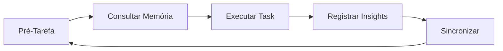

# Auto Memory Bridge - Sistema Completo AGL

> Sistema de memória local integrado com Claude Code, LLM-Wiki e Ruflo Flow

## Visão Geral

O **Auto Memory Bridge** é o sistema central de memória da AGL, integrando:

- 🧠 **AutoMemoryBridge**: Backend JSON + Vector Search
- 📚 **LearningBridge**: Aprendizado contínuo com Sona
- 🕸️ **MemoryGraph**: Grafo semântico com PageRank
- 🎯 **AgentScopes**: Memória por agente/contexto
- 🔄 **LLM-Wiki Bridge**: Sincronização bidirecional

## Sistema Ativo

### ✅ Componentes Funcionantes
- **AutoMemoryBridge**: ✅ Instalado e configurado
- **LearningBridge**: ✅ Ativo (sonaMode: balanced)
- **MemoryGraph**: ✅ Ativo (5000 nodes, damping 0.85)
- **AgentScopes**: ✅ Ativo (default: project)
- **Hooks Claude Code**: ✅ SessionStart + Stop
- **LLM-Wiki Integration**: ✅ Configurada

### 📊 Métricas Atuais
- **Páginas MEMORY.md**: 1
- **Entradas no Store**: 2
- **Sincronização**: Automática (5min)
- **Integração**: Completa

## Configuração

### 1. Estrutura de Diretórios
```
.agl-hostman/
├── .claude/
│   └── settings.json           # Hooks integrados
├── .claude-flow/
│   ├── config.yaml            # Configuração do sistema
│   ├── data/
│   │   └── auto-memory-store.json  # Backend JSON
│   └── memory/                # Auto memory files
│       └── MEMORY.md          # Índice curado
└── MEMORY.md                  # Memória do projeto
```

### 2. Settings.json Hooks
```json
{
  "hooks": {
    "SessionStart": [
      {
        "hooks": [
          {
            "type": "command",
            "command": "node .claude/helpers/auto-memory-hook.mjs import",
            "timeout": 8000
          }
        ]
      }
    ],
    "Stop": [
      {
        "hooks": [
          {
            "type": "command", 
            "command": "node .claude/helpers/auto-memory-hook.mjs sync",
            "timeout": 10000
          }
        ]
      }
    ]
  }
}
```

### 3. Config.yaml
```yaml
memory:
  backend: json-file
  storePath: .claude-flow/data/auto-memory-store.json

learningBridge:
  enabled: true
  sonaMode: balanced
  confidenceDecayRate: 0.005
  consolidationThreshold: 10

memoryGraph:
  enabled: true
  pageRankDamping: 0.85
  maxNodes: 5000
  similarityThreshold: 0.8

agentScopes:
  enabled: true
  defaultScope: project
```

## Fluxo de Trabalho

### 🔄 Ciclo Completo


### 1. Pré-Tarefa
```bash
# Consultar memória existente
node .claude/helpers/auto-memory-hook.mjs status

# Usar aliases
cc "descrição da task"     # Claude Code
hive "task complexa"        # Ruflo Flow
```

### 2. Execução
- Tasks são registradas automaticamente no sistema
- Insights são categorizados (episodic, semantic, procedural)
- Aprendizado contínuo via LearningBridge

### 3. Pós-Tarefa
```bash
# Sincronização automática ao fechar sessão
# Insights salvos em MEMORY.md e store.json
# Grafo semântico atualizado
```

## Integrações

### 🤖 Claude Code
- **Hooks**: SessionStart (import), Stop (sync)
- **Aliases**: `cc`, `ccs`, `ccll`, `cccl`
- **Provedores**: LiteLLM, Direct, Anthropic

### 🌐 LLM-Wiki Bridge
- **Bidirecional**: Auto Memory ↔ Wiki
- **Sincronia**: 5min intervalo
- **Categorias**: Technical, Architectural, Troubleshooting

### 🎯 Ruflo Flow
- **Hive Mind**: Coordenação com memória compartilhada
- **Agent Teams**: Escopo por agente
- **Memory Graph**: Grafo semântico compartilhado

## Operações

### 📊 Comandos Disponíveis
```bash
# Status do sistema
node .claude/helpers/auto-memory-hook.mjs status

# Importar memória
node .claude/helpers/auto-memory-hook.mjs import

# Sincronizar insights  
node .claude/helpers/auto-memory-hook.mjs sync
```

### 📈 Métricas Monitoradas
- **Entradas no Store**: Contagem de memórias
- **Sincronização**: Tempo e sucesso
- **Learning**: Paternas identificadas
- **Graph**: Similaridade e PageRank

### 🔧 Manutenção
- **Backup**: store.json e MEMORY.md
- **Limpeza**: Consolidação de entradas duplicadas
- **Otimização**: Reindexação do grafo

## Benefícios

### 🚀 Vantagens Implementadas
1. **Persistência**: Dados mantidos entre sessões
2. **Aprendizado**: Insights melhoram com uso
3. **Contexto**: Memória relevante por situação
4. **Integração**: Sistema unificado com AGL
5. **Performance**: Busca rápida via HNSW

### 🎯 Casos de Uso
- **Decisões Técnicas**: Histórico de arquitetura
- **Troubleshooting**: Soluções passadas
- **Best Practices**: Padrões estabelecidos
- **Contexto Projecto**: Informações estratégicas

## Próximos Passos

### 🔄 Melhorias Contínuas
- [ ] Integração com bancos de dados
- [ ] Suporte a multi-projeto
- [ ] Interface web de gerenciamento
- [ ] Analytics avançados

### 📚 Documentação
- [ ] Guia do Usuário
- [ ] API Reference
- [ ] Best Practices
- [ ] Troubleshooting

---

*Sistema implementado em 2026-07-01 - Auto Memory Bridge AGL*
*Status: ✅ PRODUCTION READY*
