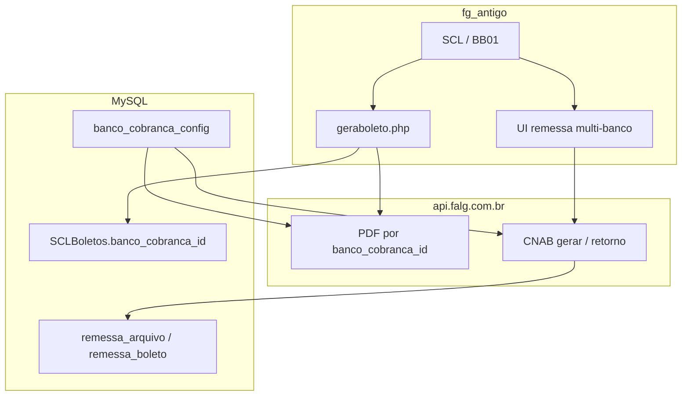

# Plano multi-banco — fg_antigo + api.falg.com.br

**Status:** planeamento (sem alterações em `public_html/` nem BD de produção).  
**Atualizado:** 2026-06-30  

## Decisões

- **Itaú continua** — sem cutover único.
- **Escolha por boleto** — cada boleto pode usar Itaú, Bradesco ou (futuro) outro banco.
- **PDF e remessa** via **api.falg.com.br** (Laravel, mesmo MySQL).
- **Remessa operacional multi-banco** contínua.
- **Schema novo:** `banco_cobranca_config` + tabelas de remessa.

---

## Arquitetura

**Regra:** banco persistido em `SCLBoletos.banco_cobranca_id`. Datas em `opcoes_contrato.php` ficam só como fallback para boletos antigos.

---

## Modelo de dados (proposta)

### `banco_cobranca_config`

| Coluna | Notas |
|--------|-------|
| `id`, `codigo_banco` (237/341) | |
| `razao_social`, `cnpj` | cedente |
| `agencia`, `agencia_dv`, `conta`, `conta_dv` | |
| `convenio`, `carteira` | |
| `layout_remessa` | cnab400 |
| `ativo`, `padrao` | UI |
| `api_pdf_route` | boletopdf / boletopdfitau |
| `config_json` | multa, protesto, espécie |

### `SCLBoletos`

- `banco_cobranca_id` INT FK (NULL em legado)
- `enviado_remessa_id` INT FK (evolui `enviadoRemessa`)

### `remessa_arquivo` + `remessa_boleto` + `remessa_sequencial`

- Sequencial MX por banco, transaccional
- Nome arquivo ≤ 21 chars, `.rem`

---

## API Laravel

| Rota | Função |
|------|--------|
| PDF por `banco_cobranca_id` | unificar boletopdf / boletopdfitau |
| `POST /api/remessa/gerar` | `banco_cobranca_id` + `boleto_ids[]` |
| `POST /api/remessa/retorno` | processar CNAB400 |
| `GET /api/bancos-cobranca` | dropdown SCL |

---

## Fases

### Fase 0 — Homologação offline (agora)

- [x] `BRAD/gerar_homologacao.php`
- [ ] Enviar `.rem` + PDF ao Bradesco
- [ ] Ajustar `config.homolog.php` se banco pedir correções

### Fase 1 — Schema (autorização)

- Migrations na API Laravel
- Seed Itaú + Bradesco
- `ALTER SCLBoletos` (colunas NULL)

### Fase 2 — API multi-banco

- `BancoCobrancaService`, remessa, retorno, sequencial MX

### Fase 3 — UI escolha por boleto (fg_antigo)

- Dropdown em gerar boleto
- `geraboleto.php` grava FK
- Router PDF (sem datas)

### Fase 4 — Remessa multi-banco

- UI por banco, BB01 alinhado, retorno

### Fase 5 — E-mail, consultas, limpeza

- `enviar_email.php`, `cons_boletos.php`
- Remover fallback por data

### Fase 6 — Novos bancos

- Novo registo em `banco_cobranca_config`

---

## Não fazer sem autorização

- Alterar fluxos de produção em `public_html/`
- `ALTER TABLE` em produção
- Desactivar Itaú
