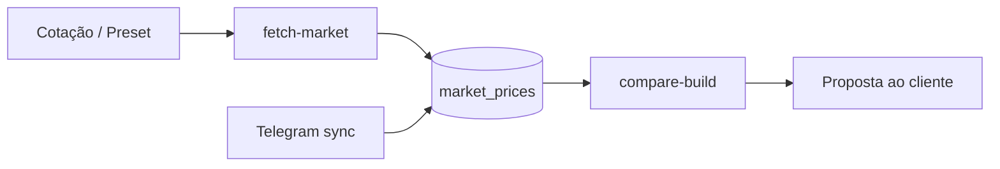

# Automação de cotações — Mercado Livre, AliExpress, 4Gamers

## Providers

| Provider | Slug | Método | Requisitos |
|----------|------|--------|------------|
| Mercado Livre | `mercadolivre` | API `sites/MLB/search` + fallback HTML | Funciona sem token em IP residencial; datacenter pode receber 403 |
| AliExpress | `aliexpress` | API afiliados IOP + fallback wholesale | `ALIEXPRESS_APP_KEY` + `ALIEXPRESS_APP_SECRET` recomendado |
| 4Gamers | `4gamers` | API Nuvemshop + HTML categorias | WAF Azion pode bloquear IPs de servidor |

## Configuração (`.env`)

```env
MARKET_FETCH_PROVIDERS=mercadolivre,aliexpress,4gamers

# Opcional ML
MERCADOLIVRE_ACCESS_TOKEN=

# AliExpress Affiliate — https://portals.aliexpress.com/
ALIEXPRESS_APP_KEY=
ALIEXPRESS_APP_SECRET=
ALIEXPRESS_TRACKING_ID=
```

## Comandos

```bash
# Buscar preços para uma cotação existente (cada slot usa o label como query)
python scripts/cli.py fetch-market --build 1

# Uma categoria
python scripts/cli.py fetch-market --category placa_video --query "RTX 5070 12GB"

# Todas as categorias padrão (automação completa)
python scripts/cli.py fetch-market --all-categories

# Simular sem gravar
python scripts/cli.py fetch-market --category nvme --dry-run

# Comparar depois de fetch
python scripts/cli.py compare-build 1
```

## Cron (atualização diária)

```bash
# crontab -e
0 8 * * * cd /path/pc-gamer-cotacoes && .venv/bin/python scripts/fetch_market_cron.py >> data/fetch-market.log 2>&1
```

## Fluxo recomendado



## Limitações

- **Mercado Livre:** API pública pode bloquear datacenters; usar máquina local ou token OAuth de app ML.
- **AliExpress:** fallback HTML frequentemente exige captcha; API afiliados é o caminho estável.
- **4Gamers:** se bloqueado, o provider devolve link manual para [monte-seu-computador](https://www.4gamers.com.br/monte-seu-computador).
- Preços AliExpress **não incluem** frete internacional, ICMS ou tempo de entrega — marcar na cotação ao cliente.

## AliExpress Affiliate API

Método: `aliexpress.affiliate.product.query`  
Endpoint: `https://api-sg.aliexpress.com/sync`  
Parâmetros úteis: `keywords`, `target_currency=BRL`, `target_language=PT`, `tracking_id`

Cadastro: [AliExpress Portals](https://portals.aliexpress.com/)

## Mercado Livre API

Documentação: [developers.mercadolivre.com.br](https://developers.mercadolivre.com.br/pt_br/itens-e-buscas)

```
GET https://api.mercadolibre.com/sites/MLB/search?q=RTX+4060&sort=price_asc&limit=10
```

## 4Gamers

- Configurador: [4gamers.com.br/monte-seu-computador](https://www.4gamers.com.br/monte-seu-computador)
- Linhas: Starter (R$1.9–4k), Action, Power, Colosseum (R$9.7k+)
- Slots: processador, placa-mãe, RAM, GPU, armazenamento, gabinete, fonte, coolers
