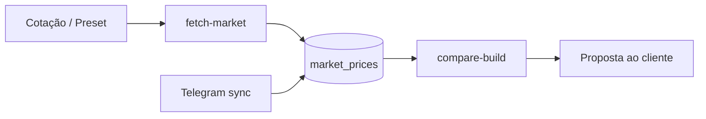

# Automação de cotações — Mercado Livre, Pichau, AliExpress, 4Gamers

## Providers

| Provider      | Slug           | Método                                 | Vendedores BR                                      | Requisitos                                                 |
| ------------- | -------------- | -------------------------------------- | -------------------------------------------------- | ---------------------------------------------------------- |
| Mercado Livre | `mercadolivre` | API `sites/MLB/search` + fallback HTML | MLB já é só Brasil; nota com vendedor/loja oficial | Sem token em IP residencial; datacenter pode receber 403   |
| Pichau        | `pichau`       | GraphQL Magento 2 + fallback HTML      | Loja BR nativa                                     | WAF pode bloquear IP de servidor                           |
| AliExpress    | `aliexpress`   | API afiliados IOP + fallback wholesale | `ship_from=BR` (armazém Brasil)                    | `ALIEXPRESS_APP_KEY` + `ALIEXPRESS_APP_SECRET` recomendado |
| 4Gamers       | `4gamers`      | API Nuvemshop + HTML categorias        | Loja BR nativa                                     | WAF Azion pode bloquear IPs de servidor                    |

## Configuração (`.env`)

```env
MARKET_FETCH_PROVIDERS=mercadolivre,pichau,aliexpress,4gamers

# Mercado Livre (MLB = só vendedores Brasil)
MERCADOLIVRE_ACCESS_TOKEN=
MERCADOLIVRE_ONLY_OFFICIAL=false   # true = apenas lojas oficiais

# AliExpress Affiliate — https://portals.aliexpress.com/
ALIEXPRESS_APP_KEY=
ALIEXPRESS_APP_SECRET=
ALIEXPRESS_TRACKING_ID=
ALIEXPRESS_SHIP_FROM=BR             # prioriza armazém Brasil
```

## Vendedores do Brasil

- **Mercado Livre:** o site `MLB` já lista apenas anúncios do Brasil. O provider força `condition=new`, descarta qualquer vendedor com `country != BR` e regista na nota `ship:BR`, vendedor (`vendedor:<nick>`), loja oficial (`loja_oficial:<id>`) e `full` (Mercado Envios Full). Com `MERCADOLIVRE_ONLY_OFFICIAL=true` limita a lojas oficiais.
- **Pichau:** loja brasileira; preços em BRL via GraphQL Magento 2.
- **AliExpress:** `ALIEXPRESS_SHIP_FROM=BR` aplica `ship_to_country=BR` na API e o filtro "Enviar de: Brasil" (`shipFromCountry=BR`) no fallback HTML — prioriza armazéns nacionais (entrega rápida, sem importação).
- **4Gamers:** loja brasileira nativa.

## Comandos

```bash
# Buscar preços para uma cotação existente (cada slot usa o label como query)
python scripts/cli.py fetch-market --build 1

# Uma categoria
python scripts/cli.py fetch-market --category placa_video --query "RTX 5070 12GB"

# Todas as categorias padrão (automação completa)
python scripts/cli.py fetch-market --all-categories

# Simular sem gravar
python scripts/cli.py fetch-market --category nvme --dry-run

# Comparar depois de fetch
python scripts/cli.py compare-build 1
```

## Cron (atualização diária)

```bash
# crontab -e
0 8 * * * cd /path/pc-gamer-cotacoes && .venv/bin/python scripts/fetch_market_cron.py >> data/fetch-market.log 2>&1
```

## Fluxo recomendado



## Casos de uso (pesquisa)

Padrões comuns de quem monta/compara PC no Brasil, que este projeto cobre:

1. **Comparador multi-loja por peça** (estilo MEUPC/Buscapé): para cada slot da cotação, buscar o menor preço entre ML, Pichau, AliExpress e 4Gamers → `compare-build` mostra o Δ por slot.
2. **Price tracking / histórico**: cada `fetch-market` grava em `market_prices` com timestamp; permite acompanhar tendência e validar "menor preço recente" antes de fechar com o cliente.
3. **Vendedor nacional vs importação**: marketplaces (ML/AliExpress BR) costumam ganhar GPU/perifs por preço; lojas (Pichau/4Gamers) dão nota fiscal e garantia local. As notas (`vendedor:`, `full`, `ship_from:BR`) ajudam a decidir.
4. **Promo relâmpago via Telegram** + baseline de mercado: o sync Telegram alimenta a mesma tabela, então `compare-build` cruza oferta de grupo com preço de loja.
5. **Cotação recorrente (cron)**: atualização diária do baseline para responder rápido a pedidos de orçamento.

## Limitações

- **Mercado Livre:** API pública pode bloquear datacenters; usar máquina local ou token OAuth de app ML.
- **Pichau:** Magento 2 atrás de WAF; em IP de servidor pode dar 403 — usar IP residencial/CT dedicado. Sem bloqueio, GraphQL devolve preço final em BRL.
- **AliExpress:** fallback HTML frequentemente exige captcha; API afiliados é o caminho estável.
- **4Gamers:** se bloqueado, o provider devolve link manual para [monte-seu-computador](https://www.4gamers.com.br/monte-seu-computador).
- Preços AliExpress **não incluem** frete internacional, ICMS ou tempo de entrega — usar `ship_from=BR` para itens nacionais e marcar na cotação ao cliente.

## AliExpress Affiliate API

Método: `aliexpress.affiliate.product.query`  
Endpoint: `https://api-sg.aliexpress.com/sync`  
Parâmetros úteis: `keywords`, `target_currency=BRL`, `target_language=PT`, `tracking_id`

Cadastro: [AliExpress Portals](https://portals.aliexpress.com/)

## Mercado Livre API

Documentação: [developers.mercadolivre.com.br](https://developers.mercadolivre.com.br/pt_br/itens-e-buscas)

```
GET https://api.mercadolibre.com/sites/MLB/search?q=RTX+4060&sort=price_asc&limit=10
```

## Pichau API (Magento 2)

GraphQL: `POST https://www.pichau.com.br/graphql`

```graphql
{
  products(search: "RTX 4060", pageSize: 3, sort: { relevance: DESC }) {
    items {
      name
      sku
      url_key
      price_range {
        minimum_price {
          final_price {
            value
            currency
          }
        }
      }
    }
  }
}
```

Fallback: scan de `https://www.pichau.com.br/search?q=<termo>` (JSON-LD / preços `R$`).

## 4Gamers

- Configurador: [4gamers.com.br/monte-seu-computador](https://www.4gamers.com.br/monte-seu-computador)
- Linhas: Starter (R$1.9–4k), Action, Power, Colosseum (R$9.7k+)
- Slots: processador, placa-mãe, RAM, GPU, armazenamento, gabinete, fonte, coolers
